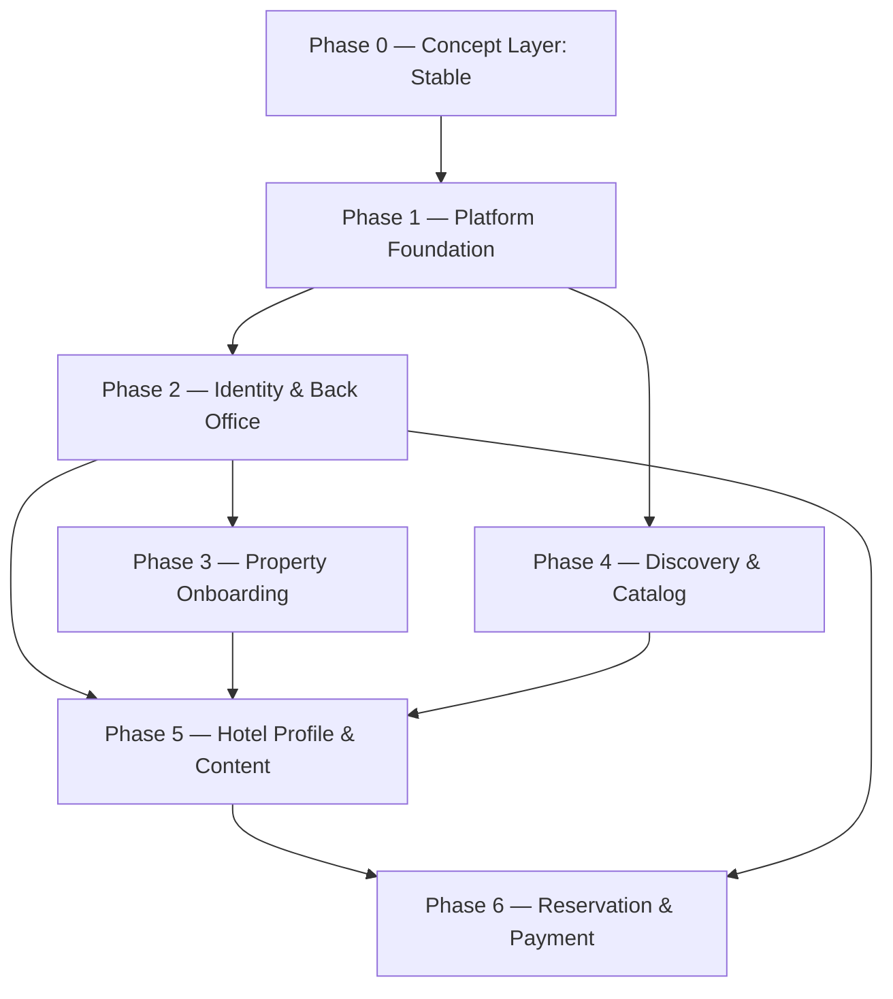

# Implementation Plan

**Version:** 1.3.0
**Generated:** 2026-07-30
**Based on:** .design/main/INDEX.md v1.0.0
**Status:** Superseded — awaiting regeneration

> [!IMPORTANT]
> This plan was generated against `INDEX.md` v1.0.0, whose nine specifications
> described a hotel booking marketplace. The specification set was restructured to
> twenty specifications on 2026-08-05 against the client technical specification
> (`INDEX.md` v2.0.0). Phases 1–6 below are a truthful record of completed work, but
> they no longer describe the product being built — see
> [l1-platform-foundation.md](specifications/l1-platform-foundation.md) §5.3 for the
> scope delta.
>
> Spec links below were rewritten to the renamed files so they resolve; the phase
> content itself is unrevised. Run `/magic.task` to regenerate against the current
> registry once the RFC specifications are reviewed.

## Overview

Delivery plan for the Booking marketplace — a single Next.js application serving
guests (browse and reserve), property owners (submit listings), and admins
(moderate submitted content).

Phase 0 records the concept layer, which is complete: all seven L1 specifications
are `Stable`. Phases 1–6 sequence the implementation, ordered by hard dependency
rather than by product surface — identity and the shared data model precede every
feature that reads or writes them.

All nine registered specifications are `Stable` and the backlog is empty. Phases 1,
2, 3, 4, and 5 are complete and archived; Phase 6 is decomposed and active (see
`tasks/phase-6.md`).

### Phase Dependency Graph

## Phase 0 — Requirements (Layer 1: Concept)

*Abstract specifications — technology-agnostic contracts.*
*Must reach Stable before Phase 1 can begin.*

- [x] **Platform Foundation** ([l1-platform-foundation.md](specifications/l1-platform-foundation.md)) [L1]
- [x] **Platform Shell** ([l1-platform-shell.md](specifications/l1-platform-shell.md)) [L1]
- [x] **Object Catalog** ([l1-object-catalog.md](specifications/l1-object-catalog.md)) [L1]
- [x] **Object Profile** ([l1-object-profile.md](specifications/l1-object-profile.md)) [L1]
- [x] **Room Reservation** ([l1-room-reservation.md](specifications/l1-room-reservation.md)) [L1]
- [x] **Object Onboarding** ([l1-object-onboarding.md](specifications/l1-object-onboarding.md)) [L1]
- [x] **Content Publishing** ([l1-content-publishing.md](specifications/l1-content-publishing.md)) [L1]

## Phase 1 — Platform Foundation — ✅ Done (2026-07-30)

*Project scaffold, the complete entity model, and the shell every route inherits.*

- [x] **Platform Foundation** ([l1-platform-foundation.md](specifications/l1-platform-foundation.md)) [L1]
- [x] **Platform Shell** ([l1-platform-shell.md](specifications/l1-platform-shell.md)) [L1]
- [x] **Technology Stack** ([l2-tech-stack.md](specifications/l2-tech-stack.md)) [L2]

The entity model authored here is the shared write surface for all later phases.
It must cover the full relationship graph in `l1-platform-foundation.md` §5.2 in
one pass — including the moderation `status` field on externally-originated
content, the account/role shape Better Auth's Drizzle adapter expects, and the
reservation's paid state — so Phases 2–6 extend the schema instead of
restructuring it.

## Phase 2 — Identity & Back Office — ✅ Done (2026-07-31)

*Authentication for three actor roles, and the moderation queue that gates
externally-submitted content.*

- [x] **Third-Party Integrations** §5.1 — authentication ([l2-third-party-integrations.md](specifications/l2-third-party-integrations.md)) [L2]
- [x] **Third-Party Integrations** §5.3 — moderation back office ([l2-third-party-integrations.md](specifications/l2-third-party-integrations.md)) [L2]

Sequenced immediately after the foundation because every subsequent phase either
gates on an authenticated actor (onboarding, reviews, reservation) or renders only
content that cleared moderation (discovery, profile).

Both halves are dispatchable. §5.3's back-office blocker — AdminJS cannot mount
in a Next.js App Router application — was resolved by amending that spec to
v0.2.0 (react-admin via shadcn-admin-kit, which supports the App Router
first-party and renders in this project's own design system). The cascade it
threatened into Phase 3 (approving owner submissions) and Phase 5 (admin-authored
articles) is therefore cleared.

One structural consequence reaches back into Phase 1's delivered work: the admin
surface must not inherit the marketing header and footer, which the Phase 1 root
layout applies to every route. `T-2B01` splits the marketing chrome into a route
group before the back office mounts.

## Phase 3 — Property Onboarding — ✅ Done (2026-07-31)

*The owner-gated intake flow that puts hotels and rooms into the marketplace.*

- [x] **Object Onboarding** ([l1-object-onboarding.md](specifications/l1-object-onboarding.md)) [L1]

Produces the data every guest-facing surface reads. The amenity taxonomy defined
here is shared verbatim with the room detail popup in Phase 6.

No schema migration is required — Phase 1's entity model already carries the
`hotel`/`room`/`amenity`/`hotelMedia`/`roomMedia` tables and the moderation
`status` column this phase writes into; Phase 3 is pure application logic (Server
Actions, routes, and UI) over an already-complete data layer.

## Phase 4 — Discovery & Catalog — ✅ Done (2026-07-31)

*Hero search, catalog with filters/sort/pagination, and the map view.*

- [x] **Object Catalog** ([l1-object-catalog.md](specifications/l1-object-catalog.md)) [L1]

Depends on the Phase 1 schema (hotels must carry resolvable coordinates), not on
the Phase 3 intake UI — seed data is sufficient to build and verify it. Kept
parallel-eligible with Phase 3 rather than serialized behind it.

## Phase 5 — Hotel Profile & Content Publishing — ✅ Done (2026-07-31)

*The conversion surface and the editorial content it embeds.*

- [x] **Object Profile** ([l1-object-profile.md](specifications/l1-object-profile.md)) [L1]
- [x] **Content Publishing** ([l1-content-publishing.md](specifications/l1-content-publishing.md)) [L1]

Paired in one phase because the hotel news feed is articles filtered by hotel
association — one content pipeline, one article component, rendered in two places.

## Phase 6 — Reservation & Payment — ✅ Done (2026-08-05)

*Room inventory detail, date/guest selection, and the paid booking flow.*

- [x] **Room Reservation** ([l1-room-reservation.md](specifications/l1-room-reservation.md)) [L1]
- [x] **Third-Party Integrations** §5.2 ([l2-third-party-integrations.md](specifications/l2-third-party-integrations.md)) [L2]

Last by design: payment integration must not precede a reservation model with a
concrete paid state to transition into.

## Backlog

<!-- Registered specifications waiting for prioritization (Draft or non-critical Stable) -->

Empty — every registered specification is `Stable` and scheduled into a phase.

## Open Questions Carried by Stable Specs

These are recorded product decisions still outstanding. None blocks its phase —
each has a documented default — but each should be settled before the phase that
consumes it ships.

| Question | Spec | Phase |
| --- | --- | --- |
| Is the Home result list the catalog query or an independent featured feed? | l1-object-catalog §2 | 4 |
| Must a reviewer have a completed reservation at that object, or is any authenticated visitor sufficient? | l1-object-profile §2 | 5 |
| Full prepayment or partial deposit at reservation time? | l1-room-reservation §2 | 6 |
| Is the operating legal entity Ukraine-domiciled? Changes payment provider viability. | l2-third-party-integrations §2 | 6 |
| Automated marketplace split payouts at launch, or manual reconciliation? | l2-third-party-integrations §2 | 6 |
