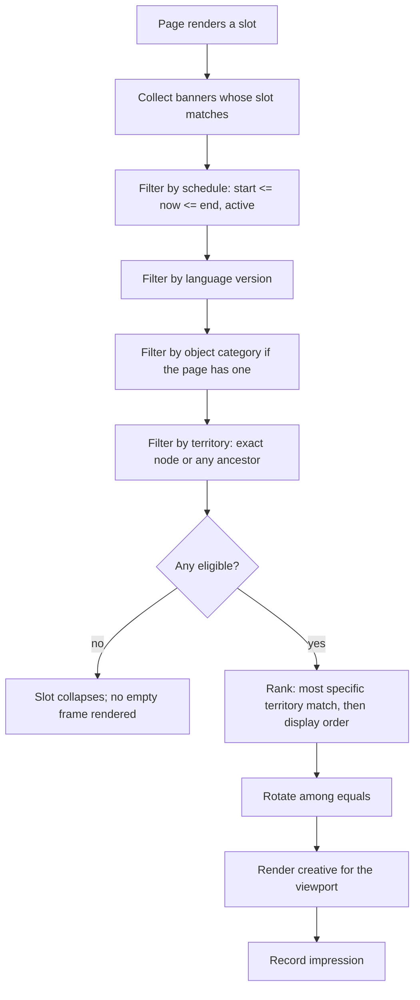

# Advertising

**Version:** 0.2.1
**Status:** RFC
**Layer:** concept

## Overview

The portal's second revenue stream: graphical banners targeted by geography,
language, and object category, placed into named slots across the portal on a
schedule, with impression and click measurement — plus the promotional badges and
card decorations an administrator may grant an object independently of its placement
package. Derived from `[TZ]` §24.2, §57–§59, §83, §113, §115.

## Related Specifications

- [l1-platform-foundation.md](l1-platform-foundation.md) - Geographic-scoping and configuration-over-code invariants.
- [l1-geography.md](l1-geography.md) - Supplies the territory nodes banners target.
- [l1-localization.md](l1-localization.md) - Supplies the language versions banners target.
- [l1-object-catalog.md](l1-object-catalog.md) - Hosts between-results banner slots and renders card decorations.
- [l1-object-profile.md](l1-object-profile.md) - Hosts an on-page banner slot.
- [l1-placement-monetization.md](l1-placement-monetization.md) - Sibling revenue stream; owns the tier badges this spec's promotions sit beside.
- [l1-analytics.md](l1-analytics.md) - Records impressions and clicks.
- [l1-back-office.md](l1-back-office.md) - Hosts banner and badge administration.
- [l1-content-publishing.md](l1-content-publishing.md) - Advertorial articles are a listed advertising format.

## 1. Motivation

`[TZ]` §24.2 gives the requirement its clearest form with a single example: a banner
intended for Bukovel appears on the Bukovel page and its related sections, and
nowhere else. That one sentence implies the whole design — banners are inventory
attached to territory nodes, not decorations attached to page templates.

Advertising is specified separately from placement packages even though both are
revenue, because they are structurally different products. A placement package
changes where an *object* sits in a list; a banner is *independent creative* sold to
an advertiser who may not own any object at all. Modelling them together would
force one of the two into the wrong shape.

The promotional badges in §5.4 are the exception that connects them: an administrator
can grant an object a temporary "New" or "Tourist's Choice" label without changing
its package (`[TZ]` §58). They live here because they are advertising decoration,
not entitlement.

## 2. Constraints & Assumptions

- Banners are portal-operated inventory **in this release**: an administrator creates
  and schedules every banner (`[TZ]` §115). [MODIFIED — v0.2.0] This is a scoping
  decision, not a rejection — `[TZ]` §23's "Additional Proposals" recommends "an
  extended advertising cabinet with the ability to purchase VIP placement and
  banners", i.e. a self-service advertiser cabinet. It is a client recommendation
  rather than a numbered requirement, and it is deferred as a candidate module
  ([l1-feature-modules.md](l1-feature-modules.md) §5.8) rather than excluded. The
  earlier flat statement that "no self-service purchase flow exists" understated the
  client's own position and is corrected here.
- One banner may target several territory nodes at once (`[TZ]` §83).
- Desktop and mobile creatives are separate assets for the same banner
  (`[TZ]` §24.2, §83).
- Impression and click counts are advertiser-facing figures and must be defensible;
  their collection rules live in [l1-analytics.md](l1-analytics.md).
- <!-- TBD: whether an advertiser ever receives direct access to their own campaign
     statistics (rather than an administrator-produced report) is not stated in [TZ].
     Modeled as administrator-reported only, since no advertiser account type exists
     in [TZ] §121's role list. Note this resolves together with the deferred
     self-service advertiser cabinet above — an advertiser who can buy placement will
     expect to see its performance. -->
- <!-- TBD: [TZ] §115 lets a banner target an object category, and §57 lets it target
     a language version, but neither states precedence when a broad-territory banner
     and a narrow-category banner both qualify for one slot. §5.2 ranks by territory
     specificity only; category and language specificity are treated as filters, not
     as ranking terms. Confirm this matches commercial intent before selling
     category-targeted inventory. -->

## 3. Core Invariants (Layer 1 only)

### 3.1 Targeting

- A banner targets any combination of: country, region, district, city, resort,
  object category, and language version (`[TZ]` §57, §83). An untargeted dimension
  means "all".
- Territory targeting is **transitive downward**: a banner targeting a region is
  eligible on that region's districts and cities unless a narrower banner outbids it
  for the slot. This is what makes `[TZ]` §24.2's "and in related sections" true.
- Language targeting is a **visibility filter**, not a translation obligation: a
  banner shown in one language version needs no counterpart in the others.

### 3.2 Placement

- Slots are named, enumerable positions, not free-form insertions. The observed set
  is: top of page after the territory description, between catalog results, page
  side rail, before the news block, and bottom of page (`[TZ]` §24.2), across the
  home page, country/region/city/resort pages, category pages, object pages, news,
  and articles (`[TZ]` §57).
- A slot may hold several eligible banners; display order is administrator-set, with
  rotation among equals (`[TZ]` §24.2 "set the display order").
- **Banners never displace content.** Injection between catalog results happens after
  pagination, so a banner never pushes a result off the page
  ([l1-object-catalog.md](l1-object-catalog.md) §5.2).

### 3.3 Scheduling & Measurement

- Every banner has a start date, an end date, and an independent active flag; all
  three must pass for it to show (`[TZ]` §24.2, §115).
- Impressions and clicks are counted per banner, and the administrator sees both plus
  the derived click-through rate (`[TZ]` §115).
- An expired or deactivated banner stops showing immediately and retains its
  accumulated statistics.

### 3.4 Card Decoration

- Promotional labels are administrator-defined records: text per language, border
  colour, label colour, background colour, icon, position on the card, start and end
  dates, and active flag (`[TZ]` §113).
- A label may be granted to an object **independently of its placement package**
  (`[TZ]` §58), and does not change its rank
  ([l1-placement-monetization.md](l1-placement-monetization.md) §3.1).
- Decoration is bounded by the readability rules in §5.5. These are product
  requirements, not styling preferences (`[TZ]` §25.5).

## 5. Detailed Design

### 5.1 Banner Model

```plaintext
Banner
├── name (internal)
├── advertiser
├── desktop creative · mobile creative
├── destination link · link text
├── targeting: countries[] · territories[] · categories[] · languages[]
├── slot            -> BannerSlot
├── start · end
├── display order
├── active flag
└── measured: impressions · clicks

BannerSlot
├── key             (top, between-results, side, before-news, bottom, …)
├── surfaces[]      (home, country, region, city, resort, category, object, news, article)
├── active flag
└── translations    -> administrator-facing name
```

Slots are a registry rather than an enum so that adding an inventory position is a
data operation, consistent with `[TZ]` §59's "all advertising slots must be
configurable through the admin panel".

### 5.2 Selection



Specificity ranking is what resolves the common case where a national banner and a
Bukovel banner both qualify on the Bukovel page: the local one wins, which is what
the advertiser paid for. A collapsing slot (step H) is deliberate — an empty banner
frame is worse than no frame.

### 5.3 Formats

Per `[TZ]` §59 the portal supports: graphical banners, promotional cards,
promotional blocks, informational banners, advertorial articles
([l1-content-publishing.md](l1-content-publishing.md)), and object promotion at the
head of a list ([l1-placement-monetization.md](l1-placement-monetization.md)). All
share the targeting, scheduling, and measurement contract above; they differ only in
creative shape and slot eligibility.

### 5.4 Promotional Labels

```plaintext
PromotionLabel
├── border colour · text colour · background colour · icon
├── position on card
├── active flag
└── translations -> text ("VIP", "Recommended", "Popular",
                          "Verified", "Tourist's Choice", "New", "Promotion")

ObjectPromotion
├── object    -> Object
├── label     -> PromotionLabel
├── start · end
├── granted by -> Account
└── weight        (feeds the catalog ordering's promotion term)
```

The label set is open — `[TZ]` §58 states the number of variants is unlimited and
configured through the back office. A preview of the decorated card must be available
before saving (`[TZ]` §113).

### 5.5 Decoration Rules

Permitted (`[TZ]` §25.5): coloured border, coloured stripe at the card's top, a small
caption over the photo, an icon beside the name, a coloured header background.

Forbidden (`[TZ]` §25.5): blinking elements, automatic animation, large captions
covering photographs, treatments that impair reading, and any size change that breaks
the catalog grid.

Mobile and desktop must apply the same tier and decoration logic (`[TZ]` §25.5).
Decoration must also coexist legibly with the availability badge
([l1-availability-status.md](l1-availability-status.md) §5.2) — the card carries at
most one tier badge, one promotion label, and one availability badge, and their
placement is a shared layout constraint rather than three independent decisions.

### 5.6 Administration

Per `[TZ]` §115 an administrator may create and edit banners, set the display period
and slot, preview the creative, and read impressions, clicks, click-through rate,
remaining term, and targeting. Per `[TZ]` §113 they may create labels, set every
colour and icon, and preview a decorated card. Per `[TZ]` §24.2 they may upload a
separate mobile image, order simultaneous banners, and enable or disable a banner
without deleting it.

## 6. Implementation Notes

1. Banner selection runs on nearly every page render. Keep the eligible set cached
   per (slot, territory, language, category) and invalidate on any banner edit — a
   per-request query across targeting joins is the wrong cost for data that changes
   daily at most.
2. Record impressions asynchronously. A synchronous write on every banner render puts
   an advertising counter on the critical path of the portal's most-visited pages
   ([l1-analytics.md](l1-analytics.md) §6).
3. Serve the mobile creative by viewport, not by user-agent sniffing, and ship both
   as responsive assets — `[TZ]` §24.2 asks for a separate image, not a separate page.
4. Treat §5.5's forbidden list as testable acceptance criteria. "No animation" and
   "grid must not break" are checkable; leaving them as prose guarantees they erode.

## 7. Drawbacks & Alternatives

**A third-party ad server (Google Ad Manager, Revive).** Mature, free of build cost,
and wrong for this requirement: `[TZ]` §24.2 needs targeting by the portal's *own*
territory hierarchy and object categories, which no external ad server knows. Direct
sales to regional advertisers also make external inventory irrelevant. Rejected on
targeting alone.

**Slots as template constants rather than a registry.** Simpler and violates
`[TZ]` §59's requirement that advertising positions be configurable through the back
office. The registry costs one table.

**Merging promotional labels into placement tiers.** Tempting, since both decorate a
card, and rejected because `[TZ]` §58 lets an administrator grant a label
*temporarily and independently* of what the owner bought. Folding them together would
make every editorial "New" label a package change with billing consequences.

**Client-side impression counting only.** Cheapest and least defensible: ad blockers
and script failures systematically undercount, and advertiser-facing numbers must
survive scrutiny. See [l1-analytics.md](l1-analytics.md) for the collection contract.

## Canonical References

| Alias | Path | Purpose |
| --- | --- | --- |
| `[TZ]` | `.drafts/booking.md` | §24.2, §57–§59, §83, §113, §115 — source requirements. |
| `[L1]` | `.design/main/specifications/l1-platform-foundation.md` | Geographic-scoping and configuration-over-code invariants. |

## Document History

| Version | Date | Change |
| --- | --- | --- |
| 0.1.0 | 2026-08-05 | Initial draft derived from the client technical specification. |
| 0.2.0 | 2026-08-05 | Minor: corrected §2's flat exclusion of a self-service advertiser purchase flow — `[TZ]` §23 recommends one, so it is now recorded as a deferred candidate module rather than silently excluded. Added a TBD on banner-selection precedence between territory, category, and language targeting. |
| 0.2.1 | 2026-08-05 | Patch: translated quoted `[TZ]` excerpts and label examples from Russian to English per the project's language policy; no meaning or structure changed. |
