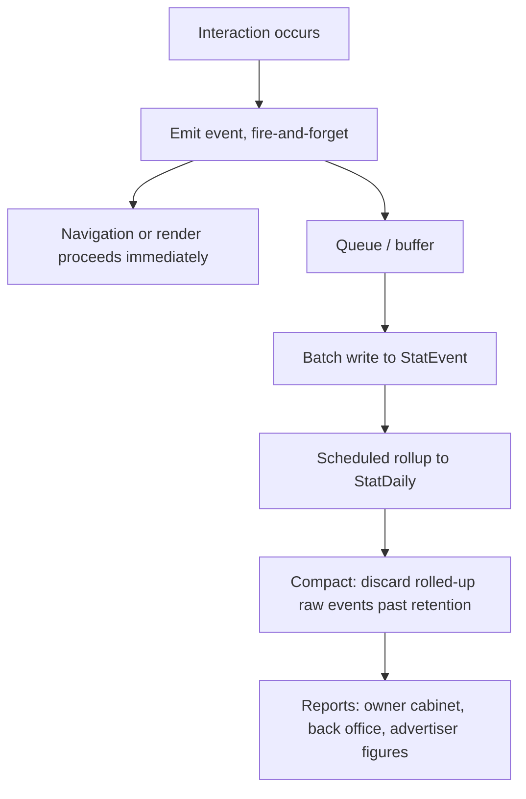

# Analytics

**Version:** 0.1.0
**Status:** RFC
**Layer:** concept

## Overview

What the portal measures and how: the event set (object views, contact
click-throughs, banner impressions and clicks), the aggregation model, what an owner
sees versus what an administrator sees, and the privacy constraint that bounds all of
it. Derived from `[TZ]` §40, §89, §125.

## Related Specifications

- [l1-platform-foundation.md](l1-platform-foundation.md) - Privacy-minimal-measurement invariant this spec implements.
- [l1-object-profile.md](l1-object-profile.md) - Emits the view and contact-click events.
- [l1-object-catalog.md](l1-object-catalog.md) - Emits card impression and view-count data.
- [l1-advertising.md](l1-advertising.md) - Consumer of banner impression and click figures.
- [l1-object-onboarding.md](l1-object-onboarding.md) - Renders the owner's statistics view.
- [l1-back-office.md](l1-back-office.md) - Renders the portal-wide dashboard and reports.
- [l1-geography.md](l1-geography.md) - Supplies the territory dimension for aggregation.
- [l1-placement-monetization.md](l1-placement-monetization.md) - Statistics are the evidence a package delivered visibility.

## 1. Motivation

Statistics carry more commercial weight here than on a typical content site, for a
structural reason: the portal deliberately has no visibility past the contact
hand-off ([l1-object-profile.md](l1-object-profile.md) §5.3). There is no booking, no
funnel, no completed transaction to attribute. **The contact click is the only
conversion signal the portal will ever have**, which makes it the sole evidence an
owner has that their placement package was worth buying.

That single fact drives the design. If contact-click instrumentation is unreliable,
missing, or trivially blocked, the portal cannot demonstrate its own value to the
people paying for it — and unlike most analytics gaps, this one cannot be backfilled
from logs after the fact.

`[TZ]` §89's closing sentence sets the counterweight: collect what the metric needs
and nothing more about the visitor.

## 2. Constraints & Assumptions

- `[TZ]` §40 restricts the owner's view to all-time totals in the first release, while
  `[TZ]` §31 shows today / week / month / all-time on the cabinet dashboard. The
  event model below supports both; §5.4 records which surface shows what.
- Portal-wide reporting is period-scoped and exportable to XLSX or CSV
  (`[TZ]` §125).
- Aggregation dimensions required by `[TZ]` §89: day, month, object, city, country.
- Advertiser-facing impression and click figures must be defensible under scrutiny
  ([l1-advertising.md](l1-advertising.md) §7).
- <!-- TBD: whether the portal integrates an external analytics product (Google
     Analytics, Matomo, Plausible) alongside its own measurement is left open;
     [TZ] §130 lists "подключение аналитики" as a setting. First-party events remain
     mandatory regardless — an external product cannot serve per-object owner
     statistics or advertiser billing figures. -->

## 3. Core Invariants (Layer 1 only)

### 3.1 Coverage

- **Every measured interaction is a first-party event.** Owner statistics and
  advertiser figures may not depend on a third-party script that an ad blocker
  removes.
- The measured set is: object card view, object page view, photo view, phone click,
  Viber click, Telegram click, WhatsApp click, Messenger click, website click, social
  network click, banner impression, banner click (`[TZ]` §40, §89).
- Every event carries the dimensions needed for `[TZ]` §89's aggregations: object,
  territory, country, language, date, and — for contact events — the channel.

### 3.2 Fidelity

- **Measurement never delays or blocks the interaction it measures.** A contact click
  navigates immediately; the event is recorded out of band
  ([l1-object-profile.md](l1-object-profile.md) §5.3).
- **A measurement failure is never a user-visible failure.** Analytics writes cannot
  fail a page render or a navigation.
- Obvious non-human traffic is excluded from advertiser-facing figures, and the
  exclusion rule is documented rather than implicit — an unexplained figure is not
  defensible.

### 3.3 Privacy

- **Aggregate by default.** Raw events are retained only as long as aggregation
  requires, then compacted (`[TZ]` §89).
- **No visitor profile is built.** The portal does not store identifiers linking a
  visitor's activity across objects or sessions beyond what deduplication requires
  (`[TZ]` §89).
- Statistics storage is separated from operational data (`[TZ]` §94 "отдельное
  хранение статистики").

### 3.4 Access

- An owner sees statistics for their own objects only
  ([l1-object-onboarding.md](l1-object-onboarding.md) §3).
- Portal-wide statistics and their export are permission-gated
  ([l1-back-office.md](l1-back-office.md) §3.1).

## 5. Detailed Design

### 5.1 Event Model

```plaintext
StatEvent (raw, short-retention)
├── kind            object_card_view | object_page_view | photo_view |
│                   contact_click | banner_impression | banner_click
├── subject         -> Object | Banner
├── channel         -> ContactChannelType   (contact_click only)
├── territory · country
├── language
├── occurred at
└── dedup token     (coarse, rotating; never a durable visitor identifier)

StatDaily (aggregate, long-retention)
├── date · subject · kind · channel
├── territory · country · language
└── count

Uniqueness: (date, subject, kind, channel, territory, language)
```

The two-tier shape is what satisfies §3.3 and `[TZ]` §94 at once: raw events give
accurate deduplication and short-window debugging, daily aggregates give unbounded
history at bounded cost, and compaction discards the raw rows once rolled up.

`dedup token` is deliberately coarse and rotating — enough to avoid counting one
visitor's double-click as two conversions, not enough to reconstruct a browsing
history. Choosing a durable identifier here would be the easy way to better numbers
and a direct breach of §3.3.

### 5.2 Collection Flow



Batching matters at portal scale: an object page view, several card views, and a
banner impression can occur in one page load, and a synchronous write per event puts
a counter on the critical path of every request.

### 5.3 Aggregation Dimensions

Per `[TZ]` §89 and §125, reports roll up by day and month across object, city,
country, category, language, and banner. Derived figures: most viewed objects, most
popular categories, banner click-through rate, new owner count, new object count,
bump count, published promotion count, and pending moderation count.

### 5.4 Surfaces

| Surface | Content | Source |
| --- | --- | --- |
| Owner cabinet — statistics | Page views, photo views, and per-channel contact clicks for the owner's object. All-time in release one. | `[TZ]` §40 |
| Owner cabinet — dashboard | Views today / week / month / all-time, messenger clicks, website clicks. | `[TZ]` §31 |
| Back office — dashboard | Portal counts and, with the finance permission, financial figures. | `[TZ]` §101 |
| Back office — statistics | Period-scoped portal-wide reporting across every dimension in §5.3, exportable. | `[TZ]` §125 |
| Advertising | Banner impressions, clicks, click-through rate, by campaign. | `[TZ]` §115 |

`[TZ]` §40's all-time-only restriction applies to the owner's dedicated statistics
page. The dashboard's period figures (`[TZ]` §31) are a separate, smaller surface;
the aggregate model serves both, so the restriction is a product decision that can be
relaxed later without a data-model change.

## 6. Implementation Notes

1. Build contact-click instrumentation in the same task as the contact rail itself
   ([l1-object-profile.md](l1-object-profile.md) §6.1). Shipping the link first and
   the event later loses exactly the data the portal's commercial case rests on.
2. `StatEvent` is the highest-volume table in the system. Partition it by date from
   the outset and schedule compaction as a job; retrofitting partitioning onto a hot,
   large table is materially harder than starting with it.
3. Rollups are idempotent and re-runnable. A failed nightly job must be safe to
   repeat without double-counting.
4. Count banner impressions server-side at render, and banner clicks at the redirect.
   Client-only counting undercounts systematically and produces figures an advertiser
   can dispute ([l1-advertising.md](l1-advertising.md) §7).
5. Keep the aggregate table's grain fixed. Adding a dimension later means either
   backfilling from discarded raw events or accepting a discontinuity in every
   historical report.

## 7. Drawbacks & Alternatives

**Third-party analytics only (Google Analytics or similar).** Free, immediate, and
unusable for this requirement: it cannot serve per-object statistics into an owner's
cabinet, it cannot produce billing-grade advertiser figures, ad blockers remove it
precisely where contact clicks happen, and it exports visitor data to a third party
against `[TZ]` §89. It remains viable as a *supplementary* product-analytics tool
(§2 TBD), never as the source for §5.4.

**Storing raw events indefinitely.** Simplest to reason about and unbounded in cost,
while retaining visitor-level detail the portal has no reason to hold. The two-tier
model in §5.1 exists to avoid choosing between accuracy and restraint.

**Aggregating in real time with no raw tier.** Cheapest storage and it makes
deduplication, late-arriving events, and rollup correction impossible. The short raw
window buys all three.

**Skipping deduplication entirely.** Would inflate contact-click counts — the exact
figure owners judge their package by. Inflating the portal's own success metric is
not a neutral simplification.

## Canonical References

| Alias | Path | Purpose |
| --- | --- | --- |
| `[TZ]` | `.drafts/booking.md` | §40, §89, §94, §125 — source requirements. |
| `[L1]` | `.design/main/specifications/l1-platform-foundation.md` | Privacy-minimal-measurement invariant. |

## Document History

| Version | Date | Change |
| --- | --- | --- |
| 0.1.0 | 2026-08-05 | Initial draft derived from the client technical specification. |
