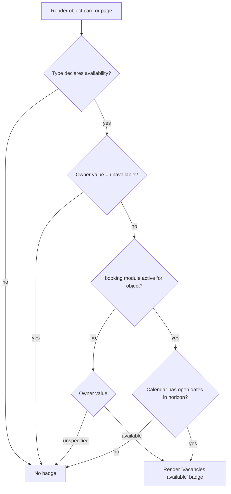
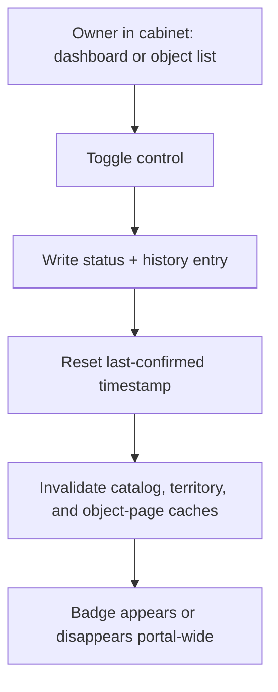

# Availability Status

**Version:** 0.2.0
**Status:** Stable
**Layer:** concept

## Overview

The owner-asserted "Vacancies available" flag that replaces online booking: its three
internal values, its single public rendering, where it appears, how an owner toggles
it in one tap, how the portal keeps it from going stale, and what the back office
sees. Derived from `[TZ]` §26, §27, §28, §82, §114.

## Related Specifications

- [l1-platform-foundation.md](l1-platform-foundation.md) - No-online-booking invariant this spec implements.
- [l1-object-onboarding.md](l1-object-onboarding.md) - Hosts the owner's one-tap toggle.
- [l1-object-catalog.md](l1-object-catalog.md) - Renders the badge on result cards.
- [l1-object-profile.md](l1-object-profile.md) - Renders the badge on the object page.
- [l1-back-office.md](l1-back-office.md) - Hosts the administrator's status view, override, and bulk filters.
- [l1-moderation-governance.md](l1-moderation-governance.md) - Records every status change in the audit journal.
- [l1-notifications.md](l1-notifications.md) - Delivers the "confirm your availability" reminder.
- [l1-feature-modules.md](l1-feature-modules.md) - [ADDED] Governs the booking module whose activation changes this status's source.
- [l1-room-reservation.md](l1-room-reservation.md) - [ADDED] When active for an object, supplies calendar-derived availability that this status renders instead of the owner's assertion.

## 1. Motivation

The portal deliberately does not know whether an object has room — it has no
inventory, no calendar, and no booking (`[TZ]` §27). Yet the single most useful
thing a visitor wants to know before calling is whether it is worth calling. This
flag is the entire answer: a one-bit, owner-maintained signal that costs the owner
one tap and costs the portal no integration.

Its design problem is trust decay. An owner who forgets to switch it off leaves a
false positive on the catalog, and false positives are worse than no signal at all —
they burn the visitor's call and the portal's credibility together. Almost every
requirement below (staleness periods, reminders, last-changed dates, bulk reset,
administrator override) exists to manage that decay rather than to render a badge.

## 2. Constraints & Assumptions

- The portal does not verify occupancy. Accuracy is the owner's responsibility
  (`[TZ]` §27).
- The status applies to accommodation types — hotels, guest houses, holiday bases,
  sanatoria, apartments, cottages (`[TZ]` §27). Whether a type carries the status is
  part of the type's declaration ([l1-object-catalog.md](l1-object-catalog.md) §5.5).
- `[TZ]` §27 states the first release must not display a negative badge. Only the
  positive state is ever rendered.

## 3. Core Invariants (Layer 1 only)

- **Three internal values, one public rendering.** Internally the status is
  `available`, `unavailable`, or `unspecified` (`[TZ]` §82, §114). Publicly, only
  `available` renders a badge; the other two render nothing at all. No "no vacancies"
  badge is shown to visitors in this release (`[TZ]` §27, §26).
- **Default is available.** A newly activated object starts as `available`
  (`[TZ]` §27.1).
- **The status changes nothing else.** Switching to `unavailable` must not alter the
  object's catalog position, hide its card, disable its contact channels, change its
  placement tier, or block its page (`[TZ]` §26, §27.1). It removes a badge and
  nothing more.
- **One tap, no form.** The owner changes the status without opening the object's
  edit form, and the change takes effect immediately or within the portal's minimal
  cache window (`[TZ]` §27.3).
- **It bypasses moderation.** The status is never queued for review — a moderated
  toggle would defeat the immediacy the flag exists for.
- **Every change is recorded.** Each transition stores the new value, previous value,
  timestamp, and the account that made it (`[TZ]` §82, §28). The history is
  queryable.
- **Staleness is a first-class concept.** The portal tracks when the status was last
  confirmed, reminds the owner on a configured cadence, exposes "not updated
  recently" as a back-office filter, and may optionally reset stale statuses
  (`[TZ]` §27.3, §28, §114).
- **An administrator may override.** Any object's status may be set or corrected by
  an administrator, and the override is recorded like any other change
  (`[TZ]` §27.3, §114).
- **The booking module changes the source, never the rendering** [ADDED — v0.2.0].
  Where the `booking` module is active for an object
  ([l1-room-reservation.md](l1-room-reservation.md)), the status becomes
  calendar-derived rather than owner-asserted. The public contract is unchanged: one
  badge, shown only for the positive state, in the same places. What changes is who
  answers the question — the calendar instead of the owner's last tap.
- **The owner's manual `unavailable` always wins** [ADDED — v0.2.0]. Even under a
  calendar, an explicit `unavailable` suppresses the badge regardless of open dates.
  The one-tap kill switch is never taken away from the owner; a closed-for-renovation
  object must be expressible without editing a calendar.

## 5. Detailed Design

### 5.1 State Model

```plaintext
AvailabilityStatus (current, on the object)
├── value              available | unavailable | unspecified
├── changed at
├── changed by         -> Account
├── previous value
├── last confirmed at
└── comment            (optional)

AvailabilityHistory (append-only)
├── object             -> Object
├── from value
├── to value
├── changed at
├── changed by         -> Account
└── source             owner | administrator | automatic
```

`last confirmed at` is distinct from `changed at` on purpose. An owner who re-affirms
"still available" without changing the value must reset the staleness clock; if the
only timestamp were `changed at`, confirming the current state would be a no-op and
the reminder would never stop.

### 5.2 Public Rendering



[MODIFIED — v0.2.0] The `unavailable` check is evaluated **first**, before the module
branch, which is what makes the owner's kill switch absolute in both configurations.
Everything below this diagram — badge placement, staleness, history, administrator
override — applies identically in both branches.

Per `[TZ]` §27.2 the badge appears on: the catalog card, the city or resort page,
search results, the recommended-objects block, the full object page, and optionally
on map pins.

Per `[TZ]` §27.2 the badge must be noticeable without covering the object's primary
image or its name — and per
[l1-advertising.md](l1-advertising.md) §5.4 it must coexist with the placement badge
on the same card without either becoming unreadable. Badge placement is therefore a
shared layout constraint of the card, not an independent decision of this spec.

### 5.3 Owner Toggle



The toggle is reachable from the cabinet dashboard and from the owner's object list,
not only from inside the edit form (`[TZ]` §27.3).

### 5.4 Staleness Management

| Mechanism | Behaviour | Source |
| --- | --- | --- |
| Confirmation cadence | Administrator sets a period (e.g. 7 / 14 / 30 days) after which a status is considered unconfirmed. | `[TZ]` §114 |
| Owner reminder | A notification asks the owner to confirm the status is current. | `[TZ]` §27.3 |
| Last-updated display | The owner sees when the status was last confirmed. | `[TZ]` §27.3 |
| Back-office filter | "Status not updated recently" is a quick filter in the object list. | `[TZ]` §28 |
| Optional auto-reset | The status may automatically return to `available` — or be reset in bulk — after a configured period. | `[TZ]` §27.3, §114 |

Auto-reset is marked optional in `[TZ]` and is genuinely double-edged: resetting a
stale `unavailable` back to `available` manufactures exactly the false positive §1
warns about. It is therefore specified as **off by default**, administrator-enabled
per portal, with its own recorded history entries (`source: automatic`) so the
resulting badge is never mistaken for an owner's assertion.

### 5.5 Back-Office View

Per `[TZ]` §28, an administrator sees for every object: current status, when it
changed, who changed it, when it was last verified, and the full toggle history. The
object list offers quick filters for: vacancies available, status unspecified, status
not updated recently, active objects, and objects with an expired package.

Per `[TZ]` §114, an administrator may change any status, view its history, revert to
the previous value, bulk-reset stale statuses, and configure the confirmation cadence.

## 6. Implementation Notes

1. Give this its own narrow write path. Routing it through the general object-edit
   path would drag in moderation, validation, and full-object cache invalidation —
   all three of which this operation must avoid.
2. Cache invalidation is the hard part, not the write. The badge appears on catalog
   pages, territory pages, search results, and the object page; `[TZ]` §27.3's
   "immediately or within minimal cache time" is the budget those invalidations must
   meet. Design the cache keys with this in mind
   ([l1-object-catalog.md](l1-object-catalog.md) §6.3).
3. Write the history entry in the same transaction as the status update. A status
   whose history has a gap cannot answer §5.5's "who changed it and when", which is
   the whole point of recording it.

## 7. Drawbacks & Alternatives

**Showing a "No vacancies" badge.** More informative and explicitly rejected by
`[TZ]` §27 for the first release. The asymmetry is deliberate: a false "available" is
recoverable by a phone call, while a false "no vacancies" silently costs the owner a
guest and gives them a reason to distrust the portal. Absence of a badge is the safe
default when the signal is unverified.

**Deriving availability from a real occupancy calendar.** The obvious "correct"
answer, and [MODIFIED — v0.2.0] not rejected but *deferred behind a switch*: it is
exactly what happens when the booking module is activated
([l1-room-reservation.md](l1-room-reservation.md) §5.7). The manual flag is the
launch answer because it costs the owner one tap and the portal no integration; the
calendar is the better answer for any owner willing to maintain one. Supporting both,
with the manual override retained on top, is the design in §5.2 — and it is why this
spec survives the booking module's activation rather than being replaced by it.

**No availability signal at all.** Zero decay risk and zero value; the visitor learns
nothing before calling. `[TZ]` chose the middle path knowingly, and §5.4 is the price
of that choice.

## Canonical References

| Alias | Path | Purpose |
| --- | --- | --- |
| `[TZ]` | `.drafts/booking.md` | §26, §27, §28, §82, §114 — source requirements. |
| `[L1]` | `.design/main/specifications/l1-platform-foundation.md` | No-online-booking invariant. |

## Document History

| Version | Date | Change |
| --- | --- | --- |
| 0.1.0 | 2026-08-05 | Initial draft derived from the client technical specification. |
| 0.2.0 | 2026-08-05 | Minor: defined the interaction with the optional booking module — status becomes calendar-derived where that module is active, with the owner's manual `unavailable` retained as an absolute override evaluated before the module branch. |
