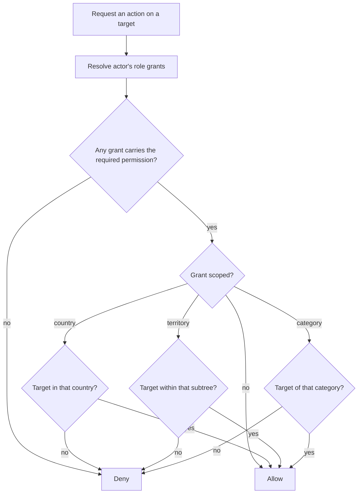

# Back Office

**Version:** 0.1.0
**Status:** RFC
**Layer:** concept

## Overview

The portal's central administration surface: its section structure, the scoped
role-based permission system behind it, the dashboard, object and owner management,
bulk operations, import and export, system settings, backups, and the delivery
priority that separates the first release from everything after. Derived from
`[TZ]` §9, §73, §99–§134.

## Related Specifications

- [l1-platform-foundation.md](l1-platform-foundation.md) - Actor-role and configuration-over-code invariants this spec implements.
- [l1-moderation-governance.md](l1-moderation-governance.md) - Supplies the queue, journal, archive, and confirmation gates this panel hosts.
- [l1-geography.md](l1-geography.md) - Territory management lives here.
- [l1-localization.md](l1-localization.md) - Language and translation management lives here.
- [l1-placement-monetization.md](l1-placement-monetization.md) - Package, position, and finance management lives here.
- [l1-advertising.md](l1-advertising.md) - Banner and label management lives here.
- [l1-feature-modules.md](l1-feature-modules.md) - Module management lives here.
- [l1-analytics.md](l1-analytics.md) - Supplies the dashboard and reports.
- [l1-notifications.md](l1-notifications.md) - Composed and dispatched from here.
- [l1-object-catalog.md](l1-object-catalog.md) - Object type, amenity, and category registries are edited here.
- [l1-seo.md](l1-seo.md) - SEO management lives here.
- [l2-third-party-integrations.md](l2-third-party-integrations.md) - Selects the admin framework this surface is built on.

## 1. Motivation

`[TZ]` devotes thirty-six sections to this panel — roughly a third of the entire
specification — and §63 states the governing requirement: every monetization,
presentation, and structural parameter must be changeable "без участия программиста".
The back office is not an internal tool bolted onto the product. It *is* how the
product is configured, and its coverage determines whether the portal can be operated
at all after handover.

Two consequences follow. First, the panel's scope is large by requirement, not by
scope creep, and §5.8's priority list is what makes it deliverable in stages. Second,
the build-versus-integrate question is settled decisively here rather than in the
stack spec: twenty-four resource sections with filtering, sorting, pagination, bulk
actions, and saved filters is not a hand-built surface
([l2-third-party-integrations.md](l2-third-party-integrations.md) §5.3).

## 2. Constraints & Assumptions

- The panel is reachable at a separate, protected address, with brute-force
  protection and optional second-factor authentication for the chief administrator
  (`[TZ]` §100).
- It must work on desktop and tablet, with a responsive mobile view sufficient for
  urgent actions only. Bulk table work is assumed to happen on a computer
  (`[TZ]` §132).
- An administrator sees only the sections their permissions grant (`[TZ]` §102).
- Permissions may be restricted to a specific country, region, or object category
  (`[TZ]` §121) — this is the requirement that makes the model non-trivial.
- <!-- TBD: whether region-scoped permissions must follow the territory hierarchy
     transitively (a region manager implicitly governing every city beneath it) is
     not stated. Modeled transitively below, which matches the geography spec's
     scoping semantics; flagged because the alternative — explicit per-node grants —
     changes the permission table's shape. -->

## 3. Core Invariants (Layer 1 only)

### 3.1 Authorization

- **Every action is permission-checked server-side.** Hiding a control is a usability
  affordance and never an access control (`[TZ]` §73 "каждое действие должно
  проверяться системой прав доступа").
- **Permissions are scopable.** A grant may be unrestricted or bounded to a country,
  a territory subtree, or an object category (`[TZ]` §121). A country administrator
  for Georgia cannot edit a Moldovan object, by enforcement rather than by
  convention.
- **Roles are data.** Roles, permissions, their pairings, user-role assignments, and
  per-object user rights are all editable records, not code constants
  (`[TZ]` §73).
- **Privileged reads are permissions too.** Financial figures, personal data export,
  and the action journal each require their own grant (`[TZ]` §128, §129).

### 3.2 Operation

- **Bulk operations are first-class**, and each is preceded by a confirmation naming
  its blast radius ([l1-moderation-governance.md](l1-moderation-governance.md) §5.6).
- **Filters persist.** A returning administrator finds the list as they left it
  (`[TZ]` §132).
- **Unsaved changes are protected** — the panel warns before navigation discards them
  (`[TZ]` §132).
- **Preview before publication** is available wherever the panel produces
  visitor-facing output (`[TZ]` §132).
- **Every mutation is journalled** ([l1-moderation-governance.md](l1-moderation-governance.md) §5.4).

### 3.3 Configuration Coverage

- Everything `[TZ]` §130 enumerates is editable at runtime: portal name, logo,
  contacts, languages, countries, currencies, date formats, time zones, image sizes,
  upload limits, moderation rules, notification schedules, package expiry behaviour,
  availability-status validity period, object ordering, email templates, analytics
  connections, maps, CAPTCHA, and security parameters.
- Critical settings are restricted to the chief administrator (`[TZ]` §130).

## 5. Detailed Design

### 5.1 Section Structure

Per `[TZ]` §102, filtered by permission:

```plaintext
Dashboard              -> §5.3
Objects                -> §5.4
Owners                 -> §5.5
Geography              -> l1-geography §5.5
Object categories      -> l1-object-catalog §3.1
Services & amenities   -> l1-object-onboarding §5.6
Rooms & prices         -> l1-object-profile §3.3
Placement packages     -> l1-placement-monetization §5.1
Positions & bumps      -> l1-placement-monetization §5.3
Banners                -> l1-advertising §5.6
News · Promotions · Articles -> l1-content-publishing
Reviews                -> l1-object-profile §3.4
Moderation             -> l1-moderation-governance §5.2
Users & roles          -> §5.2
Finance                -> l1-placement-monetization §5.5
Statistics             -> l1-analytics
SEO                    -> l1-seo
Notifications          -> l1-notifications
Import & export        -> §5.7
Action journal         -> l1-moderation-governance §5.4
Modules                -> l1-feature-modules §5.6
Settings               -> §5.6
Backups                -> §5.6
```

### 5.2 Roles & Permissions

```plaintext
Role                        Permission
├── key                     ├── key    (resource + verb: object.publish, finance.read, …)
├── system flag             └── translations -> display name
├── active flag
└── translations -> name    RolePermission
                            ├── role · permission
Grant (user ↔ role)         └── scope constraint   country | territory | category | none
├── account -> Account
├── role    -> Role
├── scope kind   none | country | territory | category
├── scope reference
└── granted by · granted at

ObjectGrant (per-object rights, per [TZ] §72)
├── account -> Account
├── object  -> Object
└── permissions[]
```

Roles observed across `[TZ]` §73 and §121: chief administrator, country
administrator, region administrator/manager, moderator, content manager, SEO
specialist, advertising manager, finance manager, technical support, object owner,
object staff member. The list is illustrative — §3.1 makes roles data, so the set
ships as seed records rather than as an enumeration in code.

Permission verbs per `[TZ]` §121: view, create, edit, publish, delete, export,
financial access, user management, settings management.



### 5.3 Dashboard

Per `[TZ]` §101: object counts by state (total, active, hidden, archived), owner
count, country count, city and resort count, published news, active promotions,
active banners, pending moderation requests, placements nearing expiry, and objects
reporting vacancies. Financial figures — payments for the period, active packages,
overdue placements, free placements, paid bumps, active campaigns — render only with
the finance permission.

Quick actions: add object, add owner, add territory, assign package, add banner,
create news, create promotion, open moderation queue, export data.

### 5.4 Object Management

Per `[TZ]` §103 the list shows: cover photo, name, type, country, region, city or
resort, owner, active package, card caption, border colour, current position, last
bump date, availability status, placement expiry, publication status, and moderation
status. It filters by every one of those dimensions and searches by name, phone,
email, and object identifier.

Per `[TZ]` §104 the object form is tabbed: core information, geography, description,
contacts, photographs, rooms, prices, services, package and position, news,
promotions, SEO, owner and staff, statistics, and change history. An administrator
may edit any field, save as draft, publish, hide, return for revision, archive,
restore, duplicate, and transfer ownership.

Per `[TZ]` §105 bulk operations cover: publish, hide, archive, change package, change
status, assign a promotional caption, change border colour, move to another
territory, assign a manager, notify owners, and export the selection.

### 5.5 Owner Management

Per `[TZ]` §106 the list shows name, company, phone, email, country, object count,
registration date, last sign-in, account status, and overdue placements. An
administrator may create accounts, edit contacts, attach and detach objects, block
and restore access, send a password-reset link, and enter the owner's cabinet in
support mode.

**Impersonation is journalled without exception** (`[TZ]` §106,
[l1-moderation-governance.md](l1-moderation-governance.md) §3.2). It is the single
most sensitive capability in the panel: it grants an administrator the full authority
of another account, which is exactly why the record of it must be unconditional.

### 5.6 Settings, Modules & Backups

Settings cover the full `[TZ]` §130 list (§3.3). Module management is
[l1-feature-modules.md](l1-feature-modules.md) §5.6.

Per `[TZ]` §131 the backup section shows the last backup date, allows a manual
backup, exposes the backup log, raises failure notifications, offers a technical
report, and permits restoration subject to re-authentication. `[TZ]` §97 requires
daily automated database backups, separate media backups, several retained
generations, integrity verification, and a documented restore procedure; storage is
recommended off the primary server.

### 5.7 Import & Export

Per `[TZ]` §127 the import pipeline is: upload file → choose data type → map columns
→ validate → show errors → preview → confirm → produce a report. Duplicate detection
runs on name, phone, website, address, and coordinates, and **duplicates are never
merged automatically** — every merge is confirmed by an administrator.

Per `[TZ]` §96 and §128 formats are XLSX, CSV, and JSON, covering objects, owners,
contacts, prices, services, geographic reference data, packages, payments, banners,
news, promotions, statistics, and the action journal. Export respects active filters,
and financial and personal-data export require their own permissions.

### 5.8 Delivery Priority

`[TZ]` §134 fixes the first-release scope, which is the most useful sentence in the
section for planning purposes:

```plaintext
Release 1 (mandatory)
├── Sign-in and permissions          ├── Availability status
├── Object management                ├── Moderation
├── Owner management                 ├── Banners
├── Geography                        ├── News and promotions
├── Categories and services          ├── Placement term control
├── Placement packages               ├── Basic statistics
├── Positions, borders, captions     ├── SEO
                                     ├── Import and export
                                     └── Action journal

Later
├── Extended financial analytics
├── Automated messenger integrations
└── Additional reporting
```

## 6. Implementation Notes

1. Implement scoped authorization as a single server-side check applied uniformly.
   Per-screen checks will diverge, and the divergence surfaces as a country
   administrator editing another country's data — a failure with no visible symptom
   until it matters.
2. Build the resource surface generically. Twenty-four sections sharing one
   list/filter/sort/paginate/bulk contract is the difference between a deliverable
   panel and an eighteen-month one
   ([l2-third-party-integrations.md](l2-third-party-integrations.md) §5.3).
3. Import runs long and must not block a request. Treat it as a background job with a
   progress report ([l2-third-party-integrations.md](l2-third-party-integrations.md)
   §5.5).
4. Seed roles and permissions as data in the first migration, and make the chief
   administrator's grant unrevocable-by-others — otherwise a permission edit can lock
   every administrator out of the panel that manages permissions.
5. Journal the panel's own access, not only its mutations. `[TZ]` §100 asks for
   sign-in records including IP, device, failures, sign-outs, and lockouts.

## 7. Drawbacks & Alternatives

**Hand-building the panel.** Maximum control and the wrong economics at this scope.
The moderation queue alone would be justifiable by hand; twenty-four sections with
filters, bulk actions, saved queries, and export are not. The integrate-over-build
criterion is applied in
[l2-third-party-integrations.md](l2-third-party-integrations.md) §5.3.

**An off-the-shelf CMS or database administration tool.** Would deliver CRUD
immediately and cannot express `[TZ]` §121's scoped permissions, §47's before/after
moderation diff, or §112's position management — the three things this panel exists
to do. It would become the substrate for a second, custom panel.

**Flat roles without scoping.** Dramatically simpler and directly contradicts
`[TZ]` §121. It also fails the portal's operating model: three countries administered
by different regional teams is the reason scoped permissions are required at all.

**Deferring the action journal to a later release.** Tempting, since it is invisible
to visitors, and rejected: `[TZ]` §134 lists it as mandatory for release one, and a
journal cannot be backfilled — the events it needs will already have happened.

## Canonical References

| Alias | Path | Purpose |
| --- | --- | --- |
| `[TZ]` | `.drafts/booking.md` | §9, §73, §99–§134 — source requirements. |
| `[L1]` | `.design/main/specifications/l1-platform-foundation.md` | Actor-role and configuration-over-code invariants. |

## Document History

| Version | Date | Change |
| --- | --- | --- |
| 0.1.0 | 2026-08-05 | Initial draft derived from the client technical specification. |
