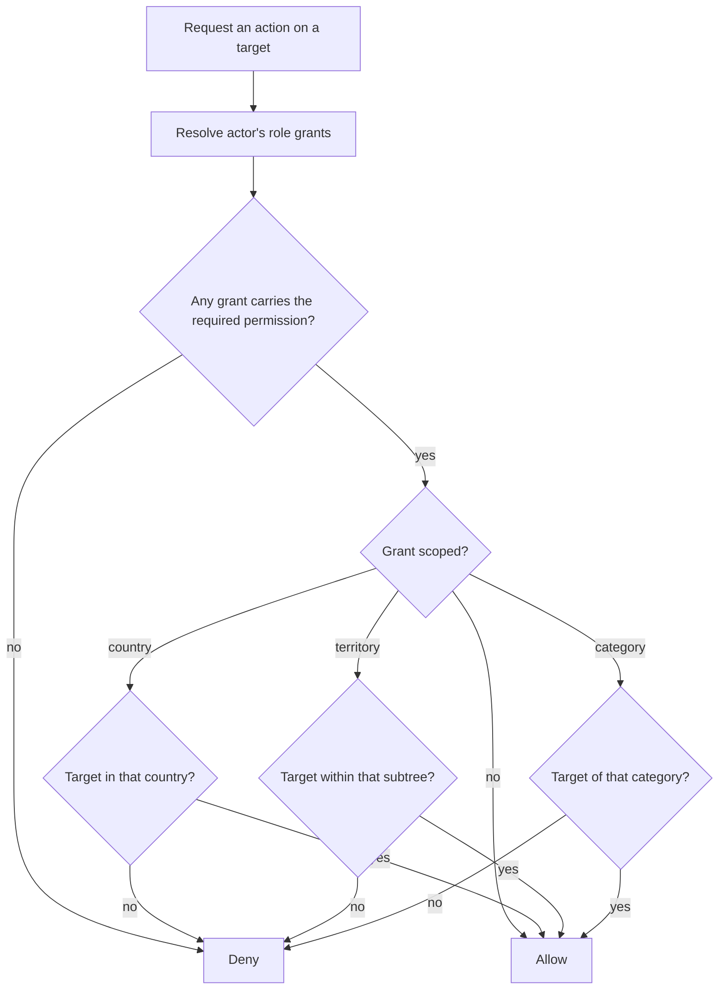

# Back Office

**Version:** 0.3.0
**Status:** RFC
**Layer:** concept

## Overview

The portal's central administration surface: its section structure, the scoped
role-based permission system behind it, the surface through which staff accounts and
their grants are administered, the dashboard, object and owner management, bulk
operations, import and export, system settings, backups, and the delivery priority
that separates the first release from everything after. Derived from
`[TZ]` §9, §73, §99–§134.

## Related Specifications

- [l1-platform-foundation.md](l1-platform-foundation.md) - Actor-role and configuration-over-code invariants this spec implements.
- [l1-moderation-governance.md](l1-moderation-governance.md) - Supplies the queue, journal, archive, and confirmation gates this panel hosts.
- [l1-geography.md](l1-geography.md) - Territory management lives here.
- [l1-localization.md](l1-localization.md) - Language and translation management lives here.
- [l1-placement-monetization.md](l1-placement-monetization.md) - [MODIFIED] Package, position, and finance management lives here; its §5.6 defines the granting act these surfaces perform.
- [l1-advertising.md](l1-advertising.md) - Banner and label management lives here.
- [l1-feature-modules.md](l1-feature-modules.md) - Module management lives here.
- [l1-analytics.md](l1-analytics.md) - Supplies the dashboard and reports.
- [l1-notifications.md](l1-notifications.md) - Composed and dispatched from here.
- [l1-object-catalog.md](l1-object-catalog.md) - Object type, amenity, and category registries are edited here.
- [l1-seo.md](l1-seo.md) - SEO management lives here.
- [l2-third-party-integrations.md](l2-third-party-integrations.md) - Selects the admin framework this surface is built on.

## 1. Motivation

`[TZ]` devotes thirty-six sections to this panel — roughly a third of the entire
specification — and §63 states the governing requirement: every monetization,
presentation, and structural parameter must be changeable "without a programmer".
The back office is not an internal tool bolted onto the product. It *is* how the
product is configured, and its coverage determines whether the portal can be operated
at all after handover.

Two consequences follow. First, the panel's scope is large by requirement, not by
scope creep, and §5.8's priority list is what makes it deliverable in stages. Second,
the build-versus-integrate question is settled decisively here rather than in the
stack spec: twenty-four resource sections with filtering, sorting, pagination, bulk
actions, and saved filters is not a hand-built surface
([l2-third-party-integrations.md](l2-third-party-integrations.md) §5.3).

## 2. Constraints & Assumptions

- The panel is reachable at a separate, protected address, with brute-force
  protection and optional second-factor authentication for the chief administrator
  (`[TZ]` §100).
- It must work on desktop and tablet, with a responsive mobile view sufficient for
  urgent actions only. Bulk table work is assumed to happen on a computer
  (`[TZ]` §132).
- An administrator sees only the sections their permissions grant (`[TZ]` §102).
- Permissions may be restricted to a specific country, region, or object category
  (`[TZ]` §121) — this is the requirement that makes the model non-trivial.
- <!-- TBD: whether region-scoped permissions must follow the territory hierarchy
     transitively (a region manager implicitly governing every city beneath it) is
     not stated. Modeled transitively below, which matches the geography spec's
     scoping semantics; flagged because the alternative — explicit per-node grants —
     changes the permission table's shape. [MODIFIED — v0.2.0] This question became
     load-bearing when §5.2 gained an administration surface: it decides whether the
     scope picker selects one node or a whole subtree, so it is now a question about
     an interface and not only about a table. -->
- <!-- TBD: whether a country or region administrator may create staff or grant roles
     inside their own scope, or whether both remain chief-administrator-only.
     `[TZ]` §121 gives staff creation to the chief administrator and is silent on
     delegating it downward. Left open rather than decided here, because either
     answer would exceed the client's text; §5.2 is written so that narrowing it
     later costs a permission check rather than a redesign. -->
- <!-- TBD: what becomes of a deactivated staff member's pending moderation
     decisions and queue claims. `[TZ]` §99.1 requires the account be manageable and
     §129 requires their journal entries survive, but the fate of work in flight is
     not stated. Deferred to l1-moderation-governance, which owns the queue. -->

## 3. Core Invariants (Layer 1 only)

### 3.1 Authorization

- **Every action is permission-checked server-side.** Hiding a control is a usability
  affordance and never an access control (`[TZ]` §73 "every action must be checked
  by the access-control system").
- **Permissions are scopable.** A grant may be unrestricted or bounded to a country,
  a territory subtree, or an object category (`[TZ]` §121). A country administrator
  for Georgia cannot edit a Moldovan object, by enforcement rather than by
  convention.
- **Roles are data.** Roles, permissions, their pairings, user-role assignments, and
  per-object user rights are all editable records, not code constants
  (`[TZ]` §73).
- **Privileged reads are permissions too.** Financial figures, personal data export,
  and the action journal each require their own grant (`[TZ]` §128, §129).
- **Staff accounts are created from the panel.** [ADDED — v0.2.0] An administrative
  account comes into existence through an interface, never by a developer writing it
  into stored data as part of a deployment (`[TZ]` §99.1, §121). "Roles are data"
  above says the records are editable; this says a person can actually edit them.
  Without it the portal cannot hire anyone after it ships, which §5.8 places in the
  mandatory first release.
- **A role's permissions are paired through the interface.** [ADDED — v0.2.0] The
  nine verbs §5.2 enumerates are attached to and detached from roles as data, with no
  code change and no developer (`[TZ]` §121, §99.1 «все действия должны выполняться
  через интерфейс»).
- **What a role can do is readable before it is granted.** [ADDED — v0.2.0] An
  administrator can see a role's effective permissions, and what a given account's
  grants add up to across their scopes, without reading the seed data
  (`[TZ]` §121). A permission system whose only readable form is code is one nobody
  audits until something has already gone wrong.
- **A grant is revocable and re-boundable.** [ADDED — v0.2.0] Withdrawing a role or
  narrowing its scope is an ordinary administrative act, recorded with actor and time
  (`[TZ]` §99.1, §129). §5.2's Grant record carries `granted by · granted at` and no
  counterpart; a grant that can only ever be created is a permission that can only
  ever accumulate.
- **The chief administrator's grant survives every permission edit.** [ADDED — v0.2.0]
  The guard belongs wherever grants are written, not in the screen that writes them —
  §6 note 4 has always required this, and a surface that can edit permissions is what
  makes the distinction matter. A panel cannot be recovered from the state where
  nobody can administer it, which is why the guard holds against the last remaining
  holder specifically rather than against the role in general.

### 3.2 Operation

- **Bulk operations are first-class**, and each is preceded by a confirmation naming
  its blast radius ([l1-moderation-governance.md](l1-moderation-governance.md) §5.6).
- **Filters persist.** A returning administrator finds the list as they left it
  (`[TZ]` §132).
- **Unsaved changes are protected** — the panel warns before navigation discards them
  (`[TZ]` §132).
- **Preview before publication** is available wherever the panel produces
  visitor-facing output (`[TZ]` §132).
- **Every mutation is journalled** ([l1-moderation-governance.md](l1-moderation-governance.md) §5.4).

### 3.3 Configuration Coverage

- Everything `[TZ]` §130 enumerates is editable at runtime: portal name, logo,
  contacts, languages, countries, currencies, date formats, time zones, image sizes,
  upload limits, moderation rules, notification schedules, package expiry behaviour,
  availability-status validity period, object ordering, email templates, analytics
  connections, maps, CAPTCHA, and security parameters.
- Critical settings are restricted to the chief administrator (`[TZ]` §130).
- **[ADDED — v0.3.0] Both panel base paths — the back office and the owner cabinet —
  are deployment configuration, never a literal route baked into the application.**
  The back office's own address is deliberately non-guessable rather than the
  conventional choice a staff panel would otherwise sit at: a predictable staff
  address invites the credential-stuffing traffic its sign-in throttle then has to
  absorb, and configuration is what lets an operator change it without a code
  change. This is the mechanism [l1-platform-foundation.md](l1-platform-foundation.md)
  §5.1 delegates to when its site map names these two roots.

## 5. Detailed Design

### 5.1 Section Structure

Per `[TZ]` §102, filtered by permission:

```plaintext
Dashboard              -> §5.3
Objects                -> §5.4
Owners                 -> §5.5
Geography              -> l1-geography §5.5
Object categories      -> l1-object-catalog §3.1
Services & amenities   -> l1-object-onboarding §5.6
Rooms & prices         -> l1-object-profile §3.3
Placement packages     -> l1-placement-monetization §5.1
Positions & bumps      -> l1-placement-monetization §5.3
Banners                -> l1-advertising §5.6
News · Promotions · Articles -> l1-content-publishing
Reviews                -> l1-object-profile §3.4
Moderation             -> l1-moderation-governance §5.2
Users & roles          -> §5.2
Finance                -> l1-placement-monetization §5.5
Statistics             -> l1-analytics
SEO                    -> l1-seo
Notifications          -> l1-notifications
Import & export        -> §5.7
Action journal         -> l1-moderation-governance §5.4
Modules                -> l1-feature-modules §5.6
Settings               -> §5.6
Backups                -> §5.6
```

### 5.2 Roles & Permissions

```plaintext
Role                        Permission
├── key                     ├── key    (resource + verb: object.publish, finance.read, …)
├── system flag             └── translations -> display name
├── active flag
└── translations -> name    RolePermission
                            ├── role · permission
Grant (user ↔ role)         └── scope constraint   country | territory | category | none
├── account -> Account
├── role    -> Role
├── scope kind   none | country | territory | category
├── scope reference
└── granted by · granted at

ObjectGrant (per-object rights, per [TZ] §72)
├── account -> Account
├── object  -> Object
└── permissions[]
```

Roles observed across `[TZ]` §73 and §121: chief administrator, country
administrator, region administrator/manager, moderator, content manager, SEO
specialist, advertising manager, finance manager, technical support, object owner,
object staff member. The list is illustrative — §3.1 makes roles data, so the set
ships as seed records rather than as an enumeration in code.

[ADDED — v0.2.0] Those eleven divide into two groups administered on different
screens, and running them together in one sentence has already caused the set to be
miscounted. The nine panel roles `[TZ]` §121 enumerates — chief administrator through
technical support — are administered here. `object owner` is conferred through owner
management (§5.5) and `object staff member` through the object form's owner-and-staff
tab (§5.4), because both are facts about an object's people rather than about the
portal's staff (`[TZ]` §3, §72, §104). A screen mixing the two would match neither
`[TZ]` §102's menu, which keeps «Владельцы» and «Пользователи и роли» as separate
entries, nor §106's and §121's different field lists.

Permission verbs per `[TZ]` §121: view, create, edit, publish, delete, export,
financial access, user management, settings management.



**The administration surface** [ADDED — v0.2.0]. Everything above describes how a
permission is *stored* and *enforced*; this describes how it comes to exist. The
distinction is the one this section previously left out, and it is not a small one:
the model and the flowchart are both satisfied by a system whose grants are written
only at installation, which is exactly the arrangement `[TZ]` §99.1 rules out and §134
places in the mandatory first release.

The staff list shows account name, email, roles held, the scope bounding each, account
status, and last sign-in. From it an administrator may create a staff account, edit its
contacts, grant and revoke roles, bound or re-bound each grant's scope, and deactivate
and restore access. Deactivation rather than deletion is the terminal state: `[TZ]`
§129 requires an account's journal entries to outlive the account, and a deleted row
takes its own history with it.

```plaintext
Staff account
├── identity        name · email · status · last sign-in
├── grants[]        role + scope kind + scope reference     -> Grant, above
│   └── each grant  granted by · granted at · revoked by · revoked at
└── second factor   enrolment state                          (see below)

Scope picker        none | country | territory | category
└── selected from the live registries, never typed
```

A scope is chosen from the live country, territory, and object-category registries
rather than entered by hand (`[TZ]` §121), which makes the picker's behaviour depend
on the open question in §2 about transitive territory scoping. Because those registries change, the
spec must also say what a grant does when its scope target later moves or disappears:
a renamed or re-parented territory leaves the grant pointing at the same node, and so
at whatever that node now contains, while a deleted target suspends the grant. A
suspended grant confers nothing and is not silently removed: it stays visible on the
account, marked, until an administrator re-points it at a live target or revokes it.
The failure mode worth designing against is the one where deleting a region quietly
widens its administrator's grant to unrestricted, and a grant that vanishes on its
target's deletion has the same defect in the opposite direction — the access is gone
but so is any record that it was ever held.

Two obligations follow the surface rather than sitting inside it. A permission change
is confirmed before it takes effect, alongside the other irreversible administrative
acts `[TZ]` §133 names. And account creation, role grant, role revocation, and scope
change are journalled like every other administrative operation, with an ordinary
administrator unable to erase the record of their own (`[TZ]` §129,
[l1-moderation-governance.md](l1-moderation-governance.md) §5.4).

Second-factor enrolment belongs on this screen as well. §2 states the capability from
`[TZ]` §100 and no section gives it a home — an optional second factor with no way to
enrol, reset, or require it is a setting that exists only in prose. This originates as
a consequence of `[TZ]` §100 rather than as a stated requirement, and is recorded here
so the gap is deliberate rather than forgotten.

### 5.3 Dashboard

Per `[TZ]` §101: object counts by state (total, active, hidden, archived), owner
count, country count, city and resort count, published news, active promotions,
active banners, pending moderation requests, placements nearing expiry, and objects
reporting vacancies. Financial figures — payments for the period, active packages,
overdue placements, free placements, paid bumps, active campaigns — render only with
the finance permission.

Quick actions: add object, add owner, add territory, assign package, add banner,
create news, create promotion, open moderation queue, export data.

### 5.4 Object Management

Per `[TZ]` §103 the list shows: cover photo, name, type, country, region, city or
resort, owner, active package, card caption, border colour, current position, last
bump date, availability status, placement expiry, publication status, and moderation
status. It filters by every one of those dimensions and searches by name, phone,
email, and object identifier.

Per `[TZ]` §104 the object form is tabbed: core information, geography, description,
contacts, photographs, rooms, prices, services, package and position, news,
promotions, SEO, owner and staff, statistics, and change history. An administrator
may edit any field, save as draft, publish, hide, return for revision, archive,
restore, duplicate, and transfer ownership.

Per `[TZ]` §105 bulk operations cover: publish, hide, archive, change package, change
status, assign a promotional caption, change border colour, move to another
territory, assign a manager, notify owners, and export the selection.

### 5.5 Owner Management

Per `[TZ]` §106 the list shows name, company, phone, email, country, object count,
registration date, last sign-in, account status, and overdue placements. An
administrator may create accounts, edit contacts, attach and detach objects, block
and restore access, send a password-reset link, and enter the owner's cabinet in
support mode.

**Impersonation is journalled without exception** (`[TZ]` §106,
[l1-moderation-governance.md](l1-moderation-governance.md) §3.2). It is the single
most sensitive capability in the panel: it grants an administrator the full authority
of another account, which is exactly why the record of it must be unconditional.

### 5.6 Settings, Modules & Backups

Settings cover the full `[TZ]` §130 list (§3.3). Module management is
[l1-feature-modules.md](l1-feature-modules.md) §5.6.

Per `[TZ]` §131 the backup section shows the last backup date, allows a manual
backup, exposes the backup log, raises failure notifications, offers a technical
report, and permits restoration subject to re-authentication. `[TZ]` §97 requires
daily automated database backups, separate media backups, several retained
generations, integrity verification, and a documented restore procedure; storage is
recommended off the primary server.

### 5.7 Import & Export

Per `[TZ]` §127 the import pipeline is: upload file → choose data type → map columns
→ validate → show errors → preview → confirm → produce a report. Duplicate detection
runs on name, phone, website, address, and coordinates, and **duplicates are never
merged automatically** — every merge is confirmed by an administrator.

Per `[TZ]` §96 and §128 formats are XLSX, CSV, and JSON, covering objects, owners,
contacts, prices, services, geographic reference data, packages, payments, banners,
news, promotions, statistics, and the action journal. Export respects active filters,
and financial and personal-data export require their own permissions.

### 5.8 Delivery Priority

`[TZ]` §134 fixes the first-release scope, which is the most useful sentence in the
section for planning purposes:

```plaintext
Release 1 (mandatory)
├── Sign-in and permissions          ├── Availability status
├── Object management                ├── Moderation
├── Owner management                 ├── Banners
├── Geography                        ├── News and promotions
├── Categories and services          ├── Placement term control
├── Placement packages               ├── Basic statistics
├── Positions, borders, captions     ├── SEO
                                     ├── Import and export
                                     └── Action journal

Later
├── Extended financial analytics
├── Automated messenger integrations
└── Additional reporting
```

[ADDED — v0.2.0] "Sign-in and permissions" renders `[TZ]` §134's «вход и
распределение прав» — permission *distribution*, the administrative act of §5.2's
surface, not merely the enforcement of permissions already granted. The line reads
either way in English, and its neighbours in the same block do not: "Placement
packages", "Positions, borders, captions", and "Placement term control" each name a
thing an administrator operates. The first release therefore includes the staff
administration screen, not only the sign-in form and the permission checks behind it.

## 6. Implementation Notes

1. Implement scoped authorization as a single server-side check applied uniformly.
   Per-screen checks will diverge, and the divergence surfaces as a country
   administrator editing another country's data — a failure with no visible symptom
   until it matters.
2. Build the resource surface generically. Twenty-four sections sharing one
   list/filter/sort/paginate/bulk contract is the difference between a deliverable
   panel and an eighteen-month one
   ([l2-third-party-integrations.md](l2-third-party-integrations.md) §5.3).
3. Import runs long and must not block a request. Treat it as a background job with a
   progress report ([l2-third-party-integrations.md](l2-third-party-integrations.md)
   §5.5).
4. Seed roles and permissions as data in the first migration, and make the chief
   administrator's grant unrevocable-by-others — otherwise a permission edit can lock
   every administrator out of the panel that manages permissions.
5. Journal the panel's own access, not only its mutations. `[TZ]` §100 asks for
   sign-in records including IP, device, failures, sign-outs, and lockouts.
6. [ADDED — v0.2.0] Route every role grant and revocation through one path, and let
   the account-creation surfaces call it rather than assigning a role directly. Two
   ways to confer a role means the scope constraint, the chief-administrator guard,
   and the journal entry are each enforced in one of them and forgotten in the other,
   and the one that forgets is always the one written in a hurry.
7. [ADDED — v0.2.0] Scope the staff list by excluding the object-side roles rather
   than by enumerating the nine panel ones. §3.1 makes roles data: a list that names
   its members cannot show a role an administrator adds later, which is the whole
   capability the section exists to deliver.

## 7. Drawbacks & Alternatives

**Hand-building the panel.** Maximum control and the wrong economics at this scope.
The moderation queue alone would be justifiable by hand; twenty-four sections with
filters, bulk actions, saved queries, and export are not. The integrate-over-build
criterion is applied in
[l2-third-party-integrations.md](l2-third-party-integrations.md) §5.3.

**An off-the-shelf CMS or database administration tool.** Would deliver CRUD
immediately and cannot express `[TZ]` §121's scoped permissions, §47's before/after
moderation diff, or §112's position management — the three things this panel exists
to do. It would become the substrate for a second, custom panel.

**Flat roles without scoping.** Dramatically simpler and directly contradicts
`[TZ]` §121. It also fails the portal's operating model: three countries administered
by different regional teams is the reason scoped permissions are required at all.

**Deferring the action journal to a later release.** Tempting, since it is invisible
to visitors, and rejected: `[TZ]` §134 lists it as mandatory for release one, and a
journal cannot be backfilled — the events it needs will already have happened.

## Canonical References

| Alias | Path | Purpose |
| --- | --- | --- |
| `[TZ]` | `.drafts/booking.md` | §3, §9, §72–§73, §99–§134 — source requirements. |
| `[L1]` | `.design/main/specifications/l1-platform-foundation.md` | Actor-role and configuration-over-code invariants. |

## Document History

| Version | Date | Change |
| --- | --- | --- |
| 0.1.0 | 2026-08-05 | Initial draft derived from the client technical specification. |
| 0.1.1 | 2026-08-05 | Patch: translated quoted `[TZ]` excerpts from Russian to English per the project's language policy; no meaning changed. |
| 0.2.0 | 2026-08-26 | Minor: gave §5.2 the administration surface it never had. The section defined how a permission is stored and enforced, and a system whose grants are written only at installation satisfied every word of it — which is what `[TZ]` §99.1 rules out and §134 puts in the mandatory first release. Added five §3.1 invariants (staff accounts created from the panel, permissions paired through the interface, effective permissions readable, grants revocable and re-boundable, the chief-administrator guard promoted from §6 note 4), the staff list and scope-picker surface in §5.2 with grant-target-moved and grant-target-deleted behaviour, §6 notes 6–7, and a §5.8 reading of `[TZ]` §134's «распределение прав» as the administrative act rather than enforcement alone. Separated §5.2's eleven-role sentence into `[TZ]` §121's nine panel roles administered here and the two object-side roles conferred through §5.4 and §5.5, which the undivided sentence had caused to be miscounted. Two new §2 open questions recorded — scoped delegation of staff creation, and a deactivated staff member's work in flight — and the existing transitive-scoping question annotated as now load-bearing. §5.2's model, permission verbs, and enforcement flowchart are unchanged; §5.5's owner management is untouched; no invariant removed. |
| 0.3.0 | 2026-08-27 | Minor: closed the 2026-08-22 design debt — both panel base paths are runtime configuration, and no specification said so, though the code has enforced it since the back office's own default was chosen to be non-guessable. Added the invariant to §3.3 rather than to [l1-platform-foundation.md](l1-platform-foundation.md) §5.1, which merely names the two roots in its site map: siting it here cost no cascade, since this spec was already `RFC`, where writing it into the `Stable` site-map spec would have forced a minor bump and quarantined [l2-tech-stack.md](l2-tech-stack.md) under it. §5.1 now delegates to this bullet instead of stating the requirement itself. No existing invariant changed or removed. |
