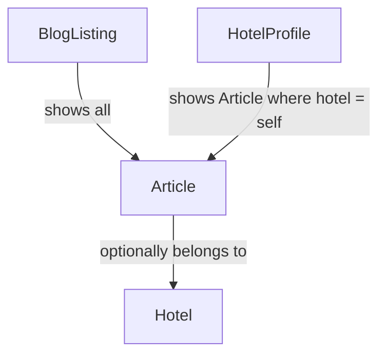

# Content Publishing

**Version:** 0.2.0
**Status:** Stable
**Layer:** concept

## Overview

Editorial content: the blog listing and article pages, and the hotel-scoped news
items that appear embedded on a hotel's profile page. Evidenced by frames `блог`,
`блог-новость` (desktop + mobile), and the "hotel news" section within
`страница отеля`.

## Related Specifications

- [l1-platform-foundation.md](l1-platform-foundation.md) - Discoverability and moderation-checkpoint invariants.
- [l1-hotel-profile.md](l1-hotel-profile.md) - Embeds this spec's content as hotel-scoped news.
- [l2-third-party-integrations.md](l2-third-party-integrations.md) - Resolves article/news authorship (§2) via the admin panel.

## 1. Motivation

The design shows two content surfaces that could be the same underlying entity
viewed two ways (global blog vs. hotel-filtered feed) or two distinct content
types. Specifying it once, with the ambiguity named explicitly, avoids either
building two redundant systems or silently assuming one without evidence.

## 2. Constraints & Assumptions

- [MODIFIED] **Resolved**: a single "article" entity, optionally associated
  with a hotel; a hotel's "news" section is articles filtered by that
  association. Authorship is resolved too: platform admins author and publish
  all articles (including hotel-scoped news) through the admin panel (see
  [l2-third-party-integrations.md](l2-third-party-integrations.md) §5.3) —
  hotel owners do not get a separate authoring path. This keeps one content
  pipeline instead of two and reuses the moderation actor already established
  for hotel/room/review approval.

## 3. Core Invariants (Layer 1 only)

- A blog listing page shows multiple articles with, at minimum, a cover image,
  title, and summary/date; an article detail page renders the full article.
- An article may optionally be associated with exactly one hotel; when
  associated, it is eligible to render within that hotel's profile page news
  section.
- Article pages are independently crawlable and shareable, per the
  discoverability invariant in
  [l1-platform-foundation.md](l1-platform-foundation.md).
- [MODIFIED] **Resolved**: since articles are admin-authored (not submitted by
  an external actor), they do not pass through the moderation checkpoint that
  gates hotel/room/review content — an admin publishing an article is already
  the trusted-actor act. The moderation checkpoint invariant in
  [l1-platform-foundation.md](l1-platform-foundation.md) §3 remains scoped to
  externally-originated content only.

## 5. Detailed Design

### 5.1 Content Relationship

## 6. Implementation Notes

1. Model articles as a single entity with an optional hotel association first;
   only split into two content types if the authorship question in §2 resolves
   to genuinely distinct actors and workflows.

## 7. Drawbacks & Alternatives

Modeling blog and hotel-news as fully separate content types from the start was
considered; rejected as premature structure given no authoring-interface
evidence distinguishes them yet (see clean-code guidance against speculative
abstraction).

## Canonical References

| Alias | Path | Purpose |
| --- | --- | --- |
| `[FIGMA-BLOG]` | `https://www.figma.com/design/N2cVVIS5wvjHIviP27peuX/Booking?node-id=224-446` | Blog listing frame. |
| `[FIGMA-ARTICLE]` | `https://www.figma.com/design/N2cVVIS5wvjHIviP27peuX/Booking?node-id=227-5386` | Article detail frame. |

## Document History

| Version | Date | Change |
| --- | --- | --- |
| 0.1.0 | 2026-07-30 | Initial draft derived from blog/article frames and the hotel-profile news section. |
| 0.2.0 | 2026-07-30 | Resolved: single admin-authored article entity; no separate moderation checkpoint needed. |
