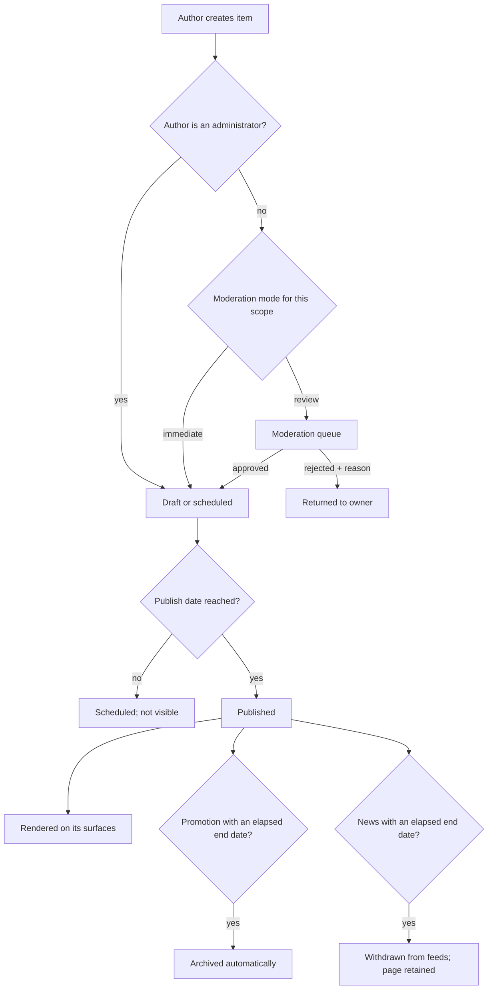

# Content Publishing

**Version:** 1.0.0
**Status:** RFC
**Layer:** concept

## Overview

Three related content types and the one pipeline they share: **articles** (the
editorial blog, admin-authored, with categories, tags, and related material),
**news** (portal-wide or object-scoped, authorable by owners), and **promotions**
(object-scoped, time-bounded, auto-archiving). Derived from `[TZ]` §11–§12, §30,
§37–§38, §84–§86, §116–§118.

[MODIFIED — v1.0.0] The previous revision modelled a single admin-authored article
entity and explicitly ruled out an owner authoring path. The technical specification
reverses both points: `[TZ]` §12 and §37 give owners their own news publishing,
`[TZ]` §38 adds owner-authored promotions with automatic archival, and `[TZ]` §11
expands the blog into a full CMS with categories, tags, authors, and related
articles.

## Related Specifications

- [l1-platform-foundation.md](l1-platform-foundation.md) - Discoverability, moderation, and localization-completeness invariants.
- [l1-object-profile.md](l1-object-profile.md) - Embeds an object's news and promotion feeds.
- [l1-object-onboarding.md](l1-object-onboarding.md) - The owner's authoring surface.
- [l1-moderation-governance.md](l1-moderation-governance.md) - Governs whether owner-authored content publishes immediately or on review.
- [l1-geography.md](l1-geography.md) - Territory association; territory pages carry their own news and promotion feeds.
- [l1-localization.md](l1-localization.md) - Every content body is a per-language record.
- [l1-seo.md](l1-seo.md) - All three types are indexable surfaces.
- [l1-back-office.md](l1-back-office.md) - Hosts editorial administration.
- [l1-advertising.md](l1-advertising.md) - Advertorial articles are a listed advertising format.

## 1. Motivation

Content serves two distinct purposes here, and conflating them would get the design
wrong.

Articles are an **acquisition** instrument: editorial material about destinations
that ranks in search and brings visitors who were not looking for a specific object
([l1-seo.md](l1-seo.md)). They are written by the portal's own content managers.

News and promotions are a **retention and monetization** instrument: they give owners
a reason to return to their cabinet, keep object pages fresh (which
[l1-object-onboarding.md](l1-object-onboarding.md) §5.10 makes a quality metric), and
give the portal recurring material for its home page and territory pages at no
editorial cost. They are written by owners.

The two share a publication pipeline — scheduling, translation, SEO, moderation,
archival — so that pipeline is specified once rather than three times.

## 2. Constraints & Assumptions

- Owners author news and promotions for their own objects only; articles are
  administrator-authored (`[TZ]` §37, §38, §118).
- Whether owner-authored content publishes immediately or enters a queue is the
  configurable moderation mode, not a property of this spec (`[TZ]` §12, §37).
- Every content body is stored per language (`[TZ]` §84).
- Promotions archive automatically when their end date passes (`[TZ]` §38, §117).
- `[TZ]` §10 lists comments on news. No comment moderation, threading, or abuse
  policy is specified anywhere in the document.
  <!-- TBD: comments are listed once in [TZ] §10 and never elaborated — no author
       model, no moderation flow, no spam handling. Recorded as out of scope for the
       first release rather than designed from a single mention; raising it is
       cheaper than shipping an unmoderated comment surface across three countries. -->

## 3. Core Invariants (Layer 1 only)

### 3.1 Common Pipeline

- Every content item carries: author, publication date, status, per-language body,
  and SEO fields (`[TZ]` §84, §85, §86).
- **Scheduled publication is supported** — an item may be created now and become
  visible later (`[TZ]` §10, §118).
- **Externally-authored content passes the moderation checkpoint**; administrator-
  authored content does not, since an administrator publishing is already the trusted
  act ([l1-moderation-governance.md](l1-moderation-governance.md) §5.1).
- Every item is independently addressable and crawlable
  ([l1-seo.md](l1-seo.md) §5.3).
- Soft deletion and archival apply ([l1-moderation-governance.md](l1-moderation-governance.md) §3.3).

### 3.2 Articles

- An article carries: author, category, country, region, title, summary, body, image,
  tags, related objects, publication date, status, and SEO fields (`[TZ]` §86).
- An article may relate to **several** resorts, objects, or attractions
  (`[TZ]` §86) — a many-to-many association, unlike news and promotions.
- Article categories and tags are administrator-managed registries (`[TZ]` §11).
- Drafts are supported and are never publicly visible (`[TZ]` §118).

### 3.3 News

- A news item carries: author, object (optional), country, region, category, title,
  summary, body, cover image, publication date, publication end date, status,
  moderation status, view count, and SEO fields (`[TZ]` §84).
- **A news item may be object-scoped or portal-wide.** An object-scoped item renders
  on that object's page and, once published, may also appear in the portal news feed
  (`[TZ]` §37).
- News may be pinned, related to objects and territories, and archived
  (`[TZ]` §116).

### 3.4 Promotions

- A promotion carries: object, title, description, image, start date, end date,
  status, moderation status, country, city or resort, and SEO fields (`[TZ]` §85).
- **A promotion is time-bounded and archives automatically** when its end date passes
  (`[TZ]` §38, §117). Archival is a scheduled job, not a render-time check.
- Promotions surface in three places: the home page, the object's page, and the
  dedicated promotions section (`[TZ]` §13 of the preamble), plus territory pages
  ([l1-geography.md](l1-geography.md) §5.3).

## 5. Detailed Design

### 5.1 Content Model

```plaintext
Article                      NewsItem                     Promotion
├── author   -> Account      ├── author   -> Account       ├── object    -> Object
├── category -> Category     ├── object   -> Object?       ├── territory -> Territory
├── tags[]                   ├── territory -> Territory?   ├── start · end
├── related objects[]        ├── category -> Category?     ├── status
├── related territories[]    ├── publish at · end at       ├── moderation status
├── publish at               ├── pinned flag               ├── image
├── status                   ├── status                    └── translations
├── cover image              ├── moderation status
└── translations             ├── view count
                             ├── cover image · gallery
                             └── translations

Translations (all three) -> title, summary, body, SEO title,
                            SEO description, slug
```

Articles carry many-to-many associations; news and promotions carry a single optional
owner association. This asymmetry is `[TZ]`'s, and it is coherent: an editorial piece
about the Carpathians legitimately references a dozen objects, while a promotion
belongs to exactly one.

### 5.2 Publication Flow



### 5.3 Surfaces

| Content | Where it renders |
| --- | --- |
| Article | Blog listing, article page, territory pages (where related), object pages (where related) |
| News (portal) | Home page, portal news feed, territory pages (where scoped) |
| News (object) | Object page, portal news feed after moderation, territory pages |
| Promotion | Home page, object page, promotions section, territory pages |

### 5.4 Administration

Per `[TZ]` §116 an administrator may create, edit, publish, schedule, pin, associate
with objects and territories, translate, archive, and delete news. Per `[TZ]` §117
they may create promotions for any object with full targeting and SEO. Per
`[TZ]` §118 they manage article categories, media, object and territory associations,
publication dates, authorship, translations, SEO, drafts, and scheduling.

### 5.5 Owner Authoring

Per `[TZ]` §37 an owner supplies a news item's title, summary, body, image, and
publication date. Per `[TZ]` §38 a promotion takes title, description, image, start
date, and end date. Both are created in the cabinet
([l1-object-onboarding.md](l1-object-onboarding.md) §5.1) and follow §5.2.

The owner-facing form is deliberately minimal — five fields, no rich editor, no
layout control. `[TZ]` §29.1 requires the cabinet to be usable without technical
knowledge, and an owner given layout control produces inconsistent object pages that
the portal then has to moderate for presentation rather than for substance.

## 6. Implementation Notes

1. Promotion archival and scheduled publication are jobs, not render-time checks
   ([l1-notifications.md](l1-notifications.md) §5.4). A render-time check leaves an
   expired promotion live in every cache that has not yet turned over.
2. Reuse one presentation component across all three types
   ([l1-object-profile.md](l1-object-profile.md) §6.4). They differ in fields, not in
   how a card or a detail page looks.
3. Publishing anything invalidates the home page, the relevant territory pages, the
   relevant object page, and the type's own feed. Enumerate those keys once rather
   than per content type.
4. Owner-authored content needs the same rate limiting and media validation as any
   external submission; the moderation queue is a review mechanism, not a defence
   against volume.

## 7. Drawbacks & Alternatives

**One entity for all three types, distinguished by a discriminator.** The previous
revision's direction, and now wrong: articles need many-to-many associations,
categories, and tags; promotions need a validity window and automatic archival; news
needs pinning and an optional object scope. A single table would carry three
disjoint field sets and a discriminator guarding each — the shared pipeline in §5.2
captures the genuine commonality without forcing the storage together.

**Admin-only authoring, as previously specified.** Simpler and directly contradicted
by `[TZ]` §12, §37, and §38. It also forfeits the retention benefit that makes owner
publishing worth its moderation cost.

**A rich-text editor for owners.** Better expressiveness, worse outcomes: it produces
inconsistent object pages, invites layout and font abuse, expands the sanitization
surface, and multiplies translation cost. Rejected on `[TZ]` §29.1.

**Shipping comments because `[TZ]` §10 mentions them.** An unmoderated comment
surface across three countries and five languages is a moderation liability that a
single unelaborated line does not justify. Raised as a question (§2) rather than
designed from an inference.

## Canonical References

| Alias | Path | Purpose |
| --- | --- | --- |
| `[TZ]` | `.drafts/booking.md` | §10–§12, §37–§38, §84–§86, §116–§118 — source requirements. |
| `[FIGMA-BLOG]` | `https://www.figma.com/design/N2cVVIS5wvjHIviP27peuX/Booking?node-id=224-446` | Blog listing layout. |
| `[FIGMA-ARTICLE]` | `https://www.figma.com/design/N2cVVIS5wvjHIviP27peuX/Booking?node-id=227-5386` | Article detail layout. |

## Document History

| Version | Date | Change |
| --- | --- | --- |
| 0.1.0 | 2026-07-30 | Initial draft derived from blog/article frames and the hotel-profile news section. |
| 0.2.0 | 2026-07-30 | Resolved: single admin-authored article entity; no separate moderation checkpoint needed. |
| 1.0.0 | 2026-08-05 | Major: split into three content types per the client specification — articles (admin-authored, categories/tags/many-to-many relations), news (owner- or admin-authored, optionally object-scoped), and promotions (owner-authored, time-bounded, auto-archiving). Added the shared publication pipeline, scheduling, per-language bodies, and the owner authoring surface; reversed the previous admin-only authorship decision. |
