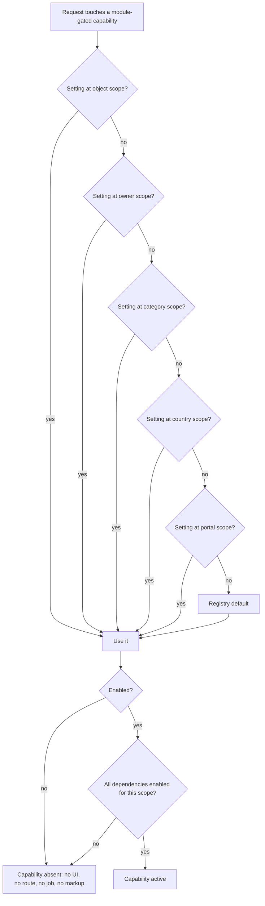

# Feature Modules

**Version:** 0.2.1
**Status:** RFC
**Layer:** concept

## Overview

The mechanism by which whole capability sets — online booking, online payment,
guest accounts, reviews — are switched on and off by an administrator at runtime,
scoped from the whole portal down to a single object, without a code change or a
deployment. Derived from `[TZ]` §63, §64, §87, §130, and from the explicit product
direction that work already built against the earlier booking concept must remain
activatable rather than discarded.

## Related Specifications

- [l1-platform-foundation.md](l1-platform-foundation.md) - Configuration-over-code and additive-extensibility invariants this spec implements.
- [l1-room-reservation.md](l1-room-reservation.md) - The first and largest module governed by this registry.
- [l1-back-office.md](l1-back-office.md) - Hosts the module management surface (§5.6).
- [l1-object-profile.md](l1-object-profile.md) - Composition varies by which modules are active for the object.
- [l1-object-catalog.md](l1-object-catalog.md) - Filter facets vary by which modules are active for the scope.
- [l1-object-onboarding.md](l1-object-onboarding.md) - Cabinet sections appear and disappear with module state.
- [l1-availability-status.md](l1-availability-status.md) - Its semantics change when the booking module is active.
- [l1-moderation-governance.md](l1-moderation-governance.md) - Supplies the scoping ladder reused here and journals every toggle.
- [l2-third-party-integrations.md](l2-third-party-integrations.md) - Payment and other integrations are provisioned per module state.

## 1. Motivation

Two pressures meet here.

The first is the client's own requirement. `[TZ]` §63 demands that an administrator
be able to "enable and disable individual services" without a programmer, and §64
names seven capabilities — guest accounts, online payment, online booking, a partner
API, external-registry integration, CRM integration, a mobile client — that must be
reachable "without changing the architecture". `[TZ]` §87 already exercises this pattern by
making the review module conditional. A registry is what turns those scattered
statements into one mechanism instead of seven ad-hoc flags.

The second is concrete and immediate. A working reservation capability — schema,
persistence, checkout, payment integration, tests — was built against the earlier
product concept before the technical specification arrived. That concept changed;
the code did not stop working. Deleting it would discard real, tested value that
`[TZ]` §64 explicitly says the portal should be able to grow into. Gating it is
strictly better than deleting it, provided the gate is honest: disabled must mean
genuinely inert, not merely hidden.

That proviso is the reason this spec exists as design rather than as a boolean. A
feature flag that only hides a button leaves the endpoint reachable, the schema
half-populated, and the SEO markup lying. §3 is mostly a list of the ways that
failure happens.

## 2. Constraints & Assumptions

- Module state is data, read at request time. It is not a build-time constant, an
  environment variable, or a deployment target (`[TZ]` §63).
- The scoping ladder is the one `[TZ]` §44 already established for moderation modes:
  portal → country → object category → owner → object. Reusing it means an
  administrator learns one scoping model, not two.
- Disabling a module never destroys data (`[TZ]` §95's soft-delete philosophy applied
  to capabilities rather than records).
- <!-- TBD: whether module state should additionally be scopeable per territory
     below country level (e.g. booking enabled only for Bukovel) is not required by
     [TZ]. The ladder below is deliberately not extended to arbitrary territory
     depth, since the resolution cost grows with the tree and no requirement asks
     for it. Revisit if a market need appears. -->

## 3. Core Invariants (Layer 1 only)

- **A module is a registry record, not a code branch.** Its identity, display name,
  description, default state, and dependencies are data. Adding a module to the
  registry is a data operation; implementing one is not.
- **Resolution is most-specific-wins.** A module's effective state for a given object
  is resolved down the ladder: object → owner → category → country → portal, taking
  the first explicit setting found. Absence at every level means the module's
  registry default applies.
- **Disabled means inert, not hidden.** When a module is off for a scope, every one of
  its surfaces is absent from that scope: its UI controls, its API routes, its
  server actions, its background jobs, its structured data, its sitemap entries, and
  its cabinet and back-office sections. Rejecting a request server-side is required;
  omitting the button is not sufficient.
- **Disabling preserves data.** Records created while a module was active remain
  stored, remain visible to their owner and to administrators as history, and become
  valid again unchanged if the module is re-enabled. No migration, export, or
  re-entry is required to switch a module back on.
- **Modules declare dependencies.** A module that cannot function without another
  declares it. Enabling a module whose dependency is off must either enable the
  dependency explicitly, with the administrator informed, or be refused — never
  silently half-enabled.
- **Toggling is a journalled, confirmed action.** Every state change records the
  module, the scope, the previous and new state, the actor, and the timestamp
  ([l1-moderation-governance.md](l1-moderation-governance.md) §5.4). Enabling or
  disabling at portal or country scope requires an explicit confirmation step
  (`[TZ]` §133).
- **The core proposition is not a module.** Direct owner contact, the object catalog,
  territory pages, placement ordering, and moderation are the portal itself. They
  have no off switch, and no module may remove or intermediate them
  ([l1-object-profile.md](l1-object-profile.md) §3.1).

## 5. Detailed Design

### 5.1 Module Registry

```plaintext
Module
├── key                  (stable identifier: booking, payment, guest_accounts, reviews, …)
├── default state        enabled | disabled
├── dependencies         -> Module[]
├── conflicts            -> Module[]   (reserved; none at launch)
├── scopable levels      which ladder rungs may override it
├── active flag          (registry-level kill switch)
└── translations         -> display name, administrator-facing description

ModuleSetting
├── module               -> Module
├── scope level          portal | country | category | owner | object
├── scope reference      (null for portal)
├── state                enabled | disabled
├── set by               -> Account
└── set at

Uniqueness: (module, scope level, scope reference)
```

### 5.2 Launch Registry

| Module | Default | Depends on | Scope levels | Governed by |
| --- | --- | --- | --- | --- |
| `reviews` | enabled | — | portal, country, category, object | [l1-object-profile.md](l1-object-profile.md) §3.4 |
| `guest_accounts` | disabled | — | portal | [l1-room-reservation.md](l1-room-reservation.md) §5.2 |
| `booking` | **disabled** | `guest_accounts` | portal, country, category, owner, object | [l1-room-reservation.md](l1-room-reservation.md) |
| `payment` | **disabled** | `booking` | portal, country | [l2-third-party-integrations.md](l2-third-party-integrations.md) §5.4 |

`booking` and `payment` are separate rows rather than one, because they are
genuinely independent axes and the intermediate state is useful on its own — see
§5.4.

The registry is open. `[TZ]` §64's partner API, external-registry import, CRM
integration, and mobile-client support are expected to join it as they are specified;
none is scoped here.

### 5.3 Resolution



Dependency checking happens **after** resolution, at the resolved scope. A booking
module enabled for one object while `guest_accounts` is off portal-wide resolves to
inactive — the object does not get a broken half-capability.

Resolution runs on every request that touches a gated surface, so it must be cheap:
settings are few, change rarely, and are cacheable in their entirety, invalidated on
any toggle.

### 5.4 The Booking / Payment Matrix

The two flags produce three meaningful states, and specifying all three is what lets
the portal grow into booking gradually instead of in one jump.

| `booking` | `payment` | Behaviour |
| --- | --- | --- |
| off | off | **Launch default.** Pure information portal. Conversion is direct contact. Availability is the owner-asserted flag ([l1-availability-status.md](l1-availability-status.md)). No dates, no calendar, no guest accounts. |
| on | off | **Request to book.** The object page gains a dated enquiry alongside its contact channels: the guest picks room, dates, and party size; the owner confirms or declines in the cabinet. No money moves through the portal. Availability becomes calendar-derived. |
| on | on | **Prepaid booking.** As above, plus a checkout step; a reservation is confirmed by successful payment ([l2-third-party-integrations.md](l2-third-party-integrations.md) §5.4). |

`payment` on with `booking` off is not a state — the dependency in §5.2 forbids it.

The middle row is the important one. It is a real product the portal can run without
a payment provider, without merchant onboarding, and without per-country payment
licensing — which matters given that the launch countries are Moldova, Ukraine, and
Georgia and no single provider serves all three well
([l2-third-party-integrations.md](l2-third-party-integrations.md) §5.4).

### 5.5 Effect Surface

What "inert" concretely means, per §3, for the booking module:

| Surface | Module off | Module on |
| --- | --- | --- |
| Object page | Contact rail only | Contact rail **plus** booking panel |
| Catalog filters | No date or party-size facets | Date range and party size offered |
| Availability badge | Owner-asserted flag | Calendar-derived, owner override retained |
| Owner cabinet | No Calendar or Bookings sections | Calendar, rates, and booking-request sections |
| Back office | Reservations hidden from the menu | Reservations resource visible |
| Guest-facing routes | Checkout and reservation routes reject the request | Routes active |
| Background jobs | Reservation expiry and reminder jobs not scheduled | Scheduled |
| Structured data | `Hotel` without `Offer` availability | `Offer` with availability emitted |
| Sitemap | Booking routes absent | Present |

The contact rail is present in both columns, in every row. That is the invariant in
§3's last bullet made concrete: booking is additive to the portal's proposition and
never a replacement for it.

### 5.6 Administration

Per `[TZ]` §63 and §130, the back office exposes a module management screen listing
every registry entry with its effective state at each scope, a toggle per scope, its
dependency graph, and the journal of past changes. Portal-scope and country-scope
changes require confirmation and name their blast radius — "enabling booking for
Ukraine affects 412 objects" — before proceeding (`[TZ]` §133).

### 5.7 Re-Enablement Guarantee

Because disabling preserves data (§3), re-enabling a module restores its records to
service unchanged. Concretely, for the booking module: existing reservations keep
their identifiers, statuses, and guest attribution; the room, rate, and calendar data
remain intact; and the owner's cabinet history is continuous across the off period.

This guarantee is what makes gating the already-built reservation capability the
right call rather than a euphemism for shelving it: the work stays live, tested, and
one administrator toggle away from production use.

### 5.8 Candidate Modules [ADDED — v0.2.0]

`[TZ]` §23's "Additional Proposals" recommends seven capabilities the client
believes would make the portal materially stronger than competitors, and `[TZ]` §64
names seven more as future scope. Neither list is a numbered requirement, so neither
is in this release — but recording them as **candidates** rather than dropping them
keeps the distinction between "decided against" and "not yet scoped" honest, and it
gives each a home when it is scoped.

| Candidate | Source | Status | Note |
| --- | --- | --- | --- |
| Owner page builder | `[TZ]` §23 | Candidate | Conflicts with the package-parity invariant ([l1-object-onboarding.md](l1-object-onboarding.md) §3) unless every package receives it; also with the minimal-authoring position in [l1-content-publishing.md](l1-content-publishing.md) §5.5 |
| Tourist route catalog with maps and GPS tracks | `[TZ]` §23 | Candidate | A new content type with its own geometry storage, map rendering, and SEO surface — a domain spec of its own, not a module toggle |
| Traffic-source analytics | `[TZ]` §23 | **Partially adopted** | See [l1-analytics.md](l1-analytics.md) §5.6 |
| Reviews with moderation and owner replies | `[TZ]` §23 | **Adopted** | [l1-object-profile.md](l1-object-profile.md) §3.4 |
| Self-service advertiser cabinet | `[TZ]` §23 | Candidate | Depends on `payment`; would introduce an advertiser account type absent from `[TZ]` §121's role list ([l1-advertising.md](l1-advertising.md) §2) |
| Bulk import/export | `[TZ]` §23 | **Adopted** | [l1-back-office.md](l1-back-office.md) §5.7 |
| Staleness reminders to owners | `[TZ]` §23 | **Adopted** | [l1-notifications.md](l1-notifications.md) §5.4 |
| Guest accounts · online payment · online booking | `[TZ]` §64 | **Registered** | §5.2 — implemented and dormant |
| Partner API | `[TZ]` §64 | **Registered** | [l1-public-api.md](l1-public-api.md) — contract specified, module disabled |
| Native mobile client | `[TZ]` §64 | Candidate | Would consume [l1-public-api.md](l1-public-api.md); the API's read contract is shaped to permit it |
| External tourism-registry integration · object import from external sources · CRM integration | `[TZ]` §64 | Candidate | Import infrastructure ([l1-back-office.md](l1-back-office.md) §5.7) is the shared foundation |

Four of `[TZ]` §23's seven recommendations are already adopted into this release, one
partially. That ratio is worth stating: the recommendations were not deferred
wholesale, and the three that remain are each a domain of their own rather than a
setting.

## 6. Implementation Notes

1. Resolve module state once per request, at the boundary, and pass the result down.
   Re-resolving inside components produces inconsistent pages where one section
   believes a module is on and another does not.
2. Gate on the server. A hidden control with a live route handler is the exact
   failure §3 names; every gated route, action, and job must check state itself.
3. Keep gated code paths under test with the module both on and off. A capability
   that is never exercised in its enabled state decays into a capability that no
   longer works when someone finally enables it — which would defeat this spec's
   whole purpose.
4. Module state belongs in the cache key of any page whose composition it changes,
   or a toggle will serve stale composition until natural expiry.
5. Seed the registry with §5.2 in the same migration that introduces it, so the
   launch defaults are explicit data rather than implicit absence.

## 7. Drawbacks & Alternatives

**Deleting the reservation work outright.** The simplest response to a changed
product definition, and the one this spec exists to reject. `[TZ]` §64 names online
booking as a capability the architecture must be able to grow into; discarding a
tested implementation of it and rebuilding later is pure waste. The counter-argument
— that dormant code rots — is real and is answered by §6.3 rather than by deletion.

**A single `BOOKING_ENABLED` environment variable.** Cheapest possible gate and
wrong on `[TZ]` §63: it needs a redeploy, it cannot vary by country or object, and it
is invisible to the administrator who is supposed to control it.

**Branching the codebase into portal and booking editions.** Keeps each build lean
and doubles maintenance forever, guarantees divergence, and makes "enable booking for
this one object" impossible. Rejected without reservation.

**Folding module state into the existing settings table as loose keys.** Would work
and loses the dependency graph, the scoping ladder, and the ability to enumerate
modules for §5.6's management screen. The registry shape costs one table and buys
all three.

## Canonical References

| Alias | Path | Purpose |
| --- | --- | --- |
| `[TZ]` | `.drafts/booking.md` | §63, §64, §87, §130, §133 — source requirements. |
| `[L1]` | `.design/main/specifications/l1-platform-foundation.md` | Configuration-over-code and extensibility invariants. |

## Document History

| Version | Date | Change |
| --- | --- | --- |
| 0.1.0 | 2026-08-05 | Initial draft. Introduces the module registry so the pre-existing reservation capability is preserved as an administrator-activatable module rather than deprecated. |
| 0.2.0 | 2026-08-05 | Minor: added §5.8 Candidate Modules, cataloguing `[TZ]` §23's seven recommendations and §64's seven future capabilities with their adoption status — so deferred items are distinguishable from rejected ones. |
| 0.2.1 | 2026-08-05 | Patch: translated quoted `[TZ]` excerpts from Russian to English per the project's language policy; no meaning changed. |
