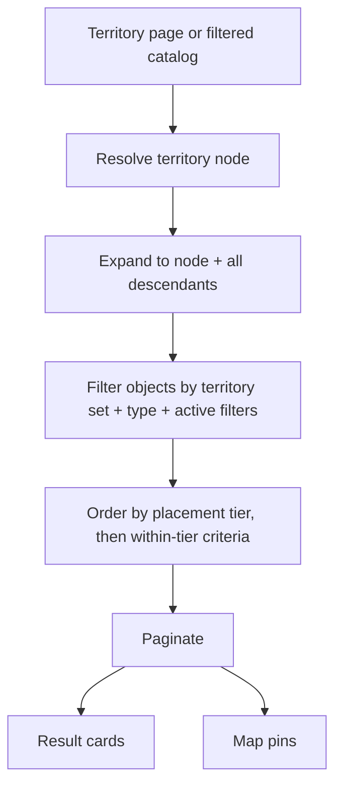

# Geography

**Version:** 0.1.1
**Status:** RFC
**Layer:** concept

## Overview

The territory hierarchy every object, banner, article, and catalog view is scoped
by: countries subdivided to arbitrary depth, with level names that differ per
country, and a landing page for every node. Derived from `[TZ]` §24, §68, §93, §107.

## Related Specifications

- [l1-platform-foundation.md](l1-platform-foundation.md) - Geographic-scoping invariant this spec implements.
- [l1-localization.md](l1-localization.md) - Every territory name and description is a translated entity.
- [l1-object-catalog.md](l1-object-catalog.md) - Filters and orders objects within a territory scope.
- [l1-advertising.md](l1-advertising.md) - Targets banners at territory nodes.
- [l1-seo.md](l1-seo.md) - Territory landing pages are the portal's primary organic-search surface.
- [l1-back-office.md](l1-back-office.md) - Hosts territory management (§5.5).

## 1. Motivation

`[TZ]` §68 states the problem directly: the administrative division of Ukraine,
Moldova, and Georgia differ, so a fixed `country → region → city` model cannot
represent all three. Ukraine has oblasts and rayons; Georgia has regions and
municipalities plus autonomous territories; Moldova has districts and municipalities.
Hard-coding any one shape forces the other two into wrong labels.

Territory pages are also the commercial core of the portal, not a navigation
convenience: `[TZ]` §24 makes each one a landing page with its own description,
banner slots, catalogs, news, and SEO text, and `[TZ]` §25.2 requires the paid
placement ordering to be recomputed *per territory* — VIP objects in Bukovel rank
above recommended objects in Bukovel, independently of every other territory.

## 2. Constraints & Assumptions

- One self-referencing hierarchy of unbounded depth, not a fixed ladder of tables
  (`[TZ]` §68 "a parent relation will allow a hierarchy of any depth").
- Level vocabularies are per country and administrator-editable (`[TZ]` §24.1).
  The union observed in `[TZ]` §68 and §107 is: country, region/oblast, autonomous
  territory, district, municipality, city, resort, town, village, microdistrict.
- A resort is a first-class node, not an attribute. Bukovel is addressable, has its
  own page and its own banner inventory, and may sit under a village
  (`[TZ]` §68: Ukraine → Ivano-Frankivsk oblast → Nadvirna district → Polianytsia →
  Bukovel).
- <!-- TBD: whether an object may belong to more than one territory node (e.g. a
     hotel marketed under both a city and an adjacent resort) is not stated in
     [TZ]. Modeled below as a single primary territory plus optional secondary
     associations, which satisfies both readings without a schema change. -->

## 3. Core Invariants (Layer 1 only)

- **One recursive hierarchy.** Every territory has at most one parent and belongs to
  exactly one country. Depth is unbounded; no level is structurally required except
  the country root.
- **Level names are data.** A territory's level is a reference to a per-country level
  vocabulary, editable through the back office. The application must never branch on
  a hard-coded level name (`[TZ]` §24.1).
- **Every node is a page.** Each active territory has its own public landing page,
  addressable in every active language, carrying the composition in §5.3
  (`[TZ]` §24.1).
- **Scoping is transitive.** A query scoped to a territory includes objects in all
  of its descendants. A region page lists objects of every city within it; a country
  page lists everything below it.
- **Ordering is per scope.** Placement-tier ordering
  ([l1-placement-monetization.md](l1-placement-monetization.md)) is evaluated within
  the territory scope being viewed, not globally (`[TZ]` §25.2).
- **Reparenting is guarded.** Moving a node that has attached objects or descendants
  must warn the administrator and record the change in the audit journal
  (`[TZ]` §107, §133).
- **Coordinates are mandatory for placement.** A territory carries coordinates so it
  can centre a map view; an object carries its own coordinates so it can be pinned
  ([l1-object-catalog.md](l1-object-catalog.md) §5.4).

## 5. Detailed Design

### 5.1 Territory Model

```plaintext
Territory
├── id
├── parent            -> Territory (null only for a country root)
├── country           -> Country            (denormalized for scope queries)
├── level             -> TerritoryLevel
├── coordinates (lat, lon)
├── hero image
├── active flag
├── display order
└── translations      -> name, short description, full description,
                         SEO title, SEO description, slug
```

`country` is stored on every node even though it is derivable by walking to the
root. This is deliberate: the scope queries in §5.4 and the banner-targeting queries
in [l1-advertising.md](l1-advertising.md) both filter by country on every request,
and a recursive walk per query is the wrong cost for an immutable-in-practice field.

### 5.2 Per-Country Level Vocabularies

```plaintext
TerritoryLevel
├── country           -> Country
├── depth rank        (ordering hint, not a structural constraint)
├── active flag
└── translations      -> singular name, plural name

Example (Ukraine)   : область → район → місто / курорт → село
                      (oblast → raion → city / resort → village)
Example (Moldova)   : raion → municipiu → oraș → sat
                      (district → municipality → town → village)
Example (Georgia)   : რეგიონი → მუნიციპალიტეტი → ქალაქი → კურორტი
                      (region → municipality → city → resort)
```

The level names above are stored **data**, shown in each country's own language to
make the point concrete: the vocabularies genuinely differ, which is why they are a
per-country registry rather than a fixed ladder. English glosses are for this
document's readers only and are not part of the model.

`depth rank` orders the vocabulary for the administrator's convenience and drives
breadcrumb labelling. It does **not** constrain the tree: a resort at rank 4 may
legitimately sit under a village at rank 4 if the real geography says so. The tree's
shape is the parent links; the ranks are labels.

### 5.3 Landing Page Composition

Per `[TZ]` §24.1, every territory page renders:

```plaintext
Breadcrumb trail (country → … → this node)
Territory name + hero image or banner slot     -> l1-advertising
Short tourist description
Banner slot (top)                              -> l1-advertising
Accommodation catalog (tier-ordered)           -> l1-object-catalog
Dining catalog                                 -> l1-object-catalog
Other object catalogs (per active type)        -> l1-object-catalog
Attractions
Banner slot (mid / between listings)           -> l1-advertising
Territory news                                 -> l1-content-publishing
Promotions                                     -> l1-content-publishing
Map centred on the territory                   -> l1-object-catalog §5.4
SEO text block
Child territories (navigation into the level below)
Banner slot (bottom)                           -> l1-advertising
```

Each catalog block degrades independently: a territory with no restaurants renders
without the dining block rather than with an empty one.

### 5.4 Scope Resolution



Descendant expansion is the hot path of the entire portal — every catalog view, every
territory page, and every banner lookup depends on it. It must be answerable without
a per-request recursive walk; the concrete mechanism (materialized path, closure
table, or recursive CTE against an indexed parent column) is an L2 decision recorded
in [l2-tech-stack.md](l2-tech-stack.md).

### 5.5 Administration

Per `[TZ]` §107, an administrator may create and edit territories at any level,
setting: names in all languages, parent, level, descriptions, hero image, banner,
coordinates, SEO fields, display order, and active flag. Reparenting is permitted
but must surface a warning naming the count of attached objects and descendant
nodes before it proceeds ([l1-moderation-governance.md](l1-moderation-governance.md)
§5.5 confirmation gate).

Deactivating a territory removes it from navigation and from the switcher but does
not orphan its objects — they remain attached and become reachable only through
their own URLs and through ancestor scopes, until an administrator reassigns them.

## 6. Implementation Notes

1. Seed the three launch countries' hierarchies as data, not as a migration.
   Import capability ([l1-back-office.md](l1-back-office.md) §5.7) is the intended
   loading mechanism for the several thousand nodes involved.
2. A territory's full slug path is derived from its ancestors' per-language slugs;
   cache it denormalized and invalidate on reparent or slug edit, or every URL
   resolution becomes a recursive walk.
3. Object counts per territory are display data on landing pages and filter
   sidebars. Compute them as maintained aggregates, not as live `COUNT(*)` per
   render.

## 7. Drawbacks & Alternatives

**Fixed-depth tables (`country`, `region`, `city`).** Simplest to query and
impossible to reconcile with three different administrative systems — the exact
problem `[TZ]` §68 raises. Rejected outright.

**A flat territory list with a country column and no hierarchy.** Would work for
filtering but destroys the breadcrumb, the region-level landing page, and transitive
scoping, all of which `[TZ]` §24 requires explicitly.

**Third-party gazetteer (GeoNames, OSM administrative boundaries) as the source of
truth.** Attractive for initial data and rejected as the *model*: `[TZ]` §68 needs
resort nodes such as Bukovel that no administrative gazetteer contains, plus
editorial descriptions and SEO text per node. A gazetteer remains the right *import
source* for the administrative levels — see §6.1.

## Canonical References

| Alias | Path | Purpose |
| --- | --- | --- |
| `[TZ]` | `.drafts/booking.md` | §24, §68, §93, §107 — source requirements. |
| `[L1]` | `.design/main/specifications/l1-platform-foundation.md` | Geographic-scoping invariant. |

## Document History

| Version | Date | Change |
| --- | --- | --- |
| 0.1.0 | 2026-08-05 | Initial draft derived from the client technical specification. |
| 0.1.1 | 2026-08-05 | Patch: translated the quoted `[TZ]` excerpt to English per the project's language policy. §5.2's per-country level names are retained in their own languages — they are stored data, not prose — and now carry English glosses. |
