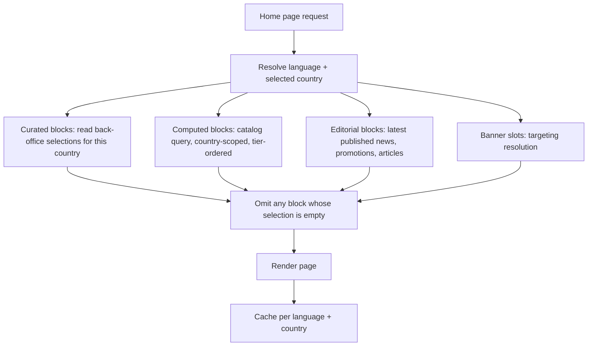

# Home Page

**Version:** 0.1.1
**Status:** Stable
**Layer:** concept

## Overview

The composition of the portal's home page: which blocks it carries, what data each
block draws on, how each behaves across four viewport classes, and which are
editorially controlled versus computed. Derived from `[TZ]` §4 (preamble) and §5
(part two).

## Related Specifications

- [l1-platform-foundation.md](l1-platform-foundation.md) - Responsive-parity and discoverability invariants.
- [l1-platform-shell.md](l1-platform-shell.md) - Supplies the header, navigation, switchers, and footer this page sits inside.
- [l1-object-catalog.md](l1-object-catalog.md) - Source of every object listing block and the search entry.
- [l1-geography.md](l1-geography.md) - Source of the destination and city blocks; target of their links.
- [l1-content-publishing.md](l1-content-publishing.md) - Source of the news, promotions, and articles blocks.
- [l1-advertising.md](l1-advertising.md) - Owns the banner slots and the partners block.
- [l1-object-profile.md](l1-object-profile.md) - Source of the reviews block; destination of every object card.
- [l1-availability-status.md](l1-availability-status.md) - Badge rendering within object cards.
- [l1-seo.md](l1-seo.md) - The home page is the portal's highest-authority indexable page.
- [l1-back-office.md](l1-back-office.md) - Hosts the editorial controls for curated blocks.

## 1. Motivation

`[TZ]` names the home page twice and, in §5, asks explicitly for "a full description
of every block" with appearance, behaviour, responsiveness, and mobile treatment
specified per block. It is the only page the specification treats that way, which is
a fair reflection of its role: it is the portal's front door, its highest-authority
SEO surface, and the page where every other domain's content competes for attention.

It needs its own specification precisely because it owns almost no data. Nearly every
block is a view onto something another spec governs, and without one document stating
which blocks exist and where each draws from, the page becomes whatever the last
person to touch it decided — with duplicated queries, inconsistent card rendering,
and editorial controls scattered across the back office.

## 2. Constraints & Assumptions

- The visual design comes from the Figma source; this spec governs composition, data
  sources, and behaviour, not layout aesthetics
  ([l1-platform-foundation.md](l1-platform-foundation.md) §2).
- `[TZ]` §4 and §5 enumerate overlapping but not identical block lists. §5.1 below is
  their union, which is the safe reading — §5 prefixes its list with "For example",
  marking it as illustrative rather than exhaustive.
- Every object listing block renders the **same card component** as the catalog
  ([l1-object-catalog.md](l1-object-catalog.md) §3.4). The home page introduces no
  second card.
- The home page is country-aware: a visitor with a selected country sees that
  country's destinations, cities, objects, news, and promotions
  ([l1-platform-shell.md](l1-platform-shell.md) §5.3).

## 3. Core Invariants (Layer 1 only)

- **The home page owns no domain data.** Every block is a view onto data owned by
  another spec. A block must never introduce its own storage, its own card, or its own
  ordering rule.
- **Object listing blocks honour placement ordering.** "Recommended", "best", and
  "newest" blocks are still tier-ordered
  ([l1-placement-monetization.md](l1-placement-monetization.md) §3.1) — the home page
  is the portal's most valuable placement surface, and exempting it would let a
  standard-tier object outrank a VIP one on the most-viewed page.
- **Every block degrades independently.** A block with no content is omitted
  entirely — never rendered as an empty frame or a placeholder.
- **Editorial blocks are administrator-curated data, not code.** Which destinations,
  cities, categories, and partners appear, and in what order, is configured through
  the back office (`[TZ]` §63).
- **Every block is specified across all four viewport classes** — phone, tablet,
  laptop, desktop (`[TZ]` §5, §20).
- **The page is fully server-rendered and crawlable**; no primary block may require
  client-side interaction to become visible to a crawler
  ([l1-seo.md](l1-seo.md) §3).

## 5. Detailed Design

### 5.1 Block Inventory

Union of `[TZ]` §4 and §5, with each block's owning spec and control mode.

| # | Block | Data source | Control |
| --- | --- | --- | --- |
| 1 | Header, logo, menu, language and country switchers | [l1-platform-shell.md](l1-platform-shell.md) §5.1 | Registry-driven |
| 2 | Hero search | [l1-object-catalog.md](l1-object-catalog.md) §5.1 | — |
| 3 | Popular destinations | [l1-geography.md](l1-geography.md) | Curated |
| 4 | Object categories | [l1-object-catalog.md](l1-object-catalog.md) §3.1 | Curated order |
| 5 | Recommended / best objects | [l1-object-catalog.md](l1-object-catalog.md) | Computed, tier-ordered |
| 6 | Newly added objects | [l1-object-catalog.md](l1-object-catalog.md) | Computed, tier-ordered |
| 7 | Promotions | [l1-content-publishing.md](l1-content-publishing.md) §3.4 | Computed + pinning |
| 8 | News | [l1-content-publishing.md](l1-content-publishing.md) §3.3 | Computed + pinning |
| 9 | Articles | [l1-content-publishing.md](l1-content-publishing.md) §3.2 | Computed + pinning |
| 10 | Popular cities | [l1-geography.md](l1-geography.md) | Curated |
| 11 | Map | [l1-object-catalog.md](l1-object-catalog.md) §5.4 | Computed |
| 12 | Reviews | [l1-object-profile.md](l1-object-profile.md) §3.4 | Computed, moderated only |
| 13 | Partners | [l1-advertising.md](l1-advertising.md) | Curated |
| 14 | Informational block | Static editorial copy | Curated, translated |
| 15 | Banner slots | [l1-advertising.md](l1-advertising.md) §3.2 | Targeted, scheduled |
| 16 | Footer | [l1-platform-shell.md](l1-platform-shell.md) §5.1 | Registry-driven |

**Partners** (`[TZ]` §5) is modelled as an advertising format rather than a new
entity — it is a curated set of logos with links and an optional display period,
which [l1-advertising.md](l1-advertising.md) §5.3's promotional-block format already
describes. Introducing a separate "partner" entity for it would duplicate targeting
and scheduling that already exist.

**Informational block** (`[TZ]` §4) is the only block carrying content of its own: a
translated editorial passage about the portal, editable in the back office. It is
static content, not a content-publishing entity.

### 5.2 Composition

```plaintext
Header + navigation + switchers                        -> l1-platform-shell
Hero: search over destination / type / filters         -> l1-object-catalog
Banner slot (top)                                      -> l1-advertising
Popular destinations (curated territory tiles)         -> l1-geography
Object categories (type tiles with counts)             -> l1-object-catalog
Recommended objects (tier-ordered card rail)           -> l1-object-catalog
Banner slot (mid)                                      -> l1-advertising
Promotions (card rail)                                 -> l1-content-publishing
Newly added objects (tier-ordered card rail)           -> l1-object-catalog
Popular cities (curated territory tiles)               -> l1-geography
Map (clustered, country-scoped)                        -> l1-object-catalog
News + articles (mixed editorial rail)                 -> l1-content-publishing
Reviews (recent moderated reviews across objects)      -> l1-object-profile
Informational block (translated editorial copy)        -> §5.1
Partners (curated logo strip)                          -> l1-advertising
Banner slot (bottom)                                   -> l1-advertising
Footer                                                 -> l1-platform-shell
```

### 5.3 Data Resolution



Every block resolves against the **selected country**. A visitor browsing Georgia must
not see Moldovan cities in "popular destinations" — which is why the cache key carries
both language and country ([l1-localization.md](l1-localization.md) §6.3).

### 5.4 Responsive Behaviour

Per `[TZ]` §5 and §20, each block's treatment across the four viewport classes:

| Block | Phone | Tablet | Laptop / Desktop |
| --- | --- | --- | --- |
| Hero search | Stacked fields, full-width submit | Two-column fields | Single-row inline |
| Popular destinations | Horizontal scroll, 1.5 tiles visible | Grid, 2 columns | Grid, 4–6 columns |
| Object categories | Horizontal scroll | Grid, 3 columns | Grid, 6+ columns |
| Object rails (recommended, newest) | Horizontal scroll, 1.2 cards visible | 2 columns | 3–4 columns |
| Promotions | Horizontal scroll | 2 columns | 3–4 columns |
| Popular cities | 2-column compact list | 3 columns | 4–6 columns |
| Map | Collapsed, expands on tap; reduced height | Full-width, medium height | Full-width, full height |
| News / articles | Stacked | 2 columns | 3 columns |
| Reviews | Single carousel | 2 columns | 3 columns |
| Partners | Horizontal scroll | Wrapped rows | Single strip |
| Banner slots | Mobile creative | Mobile or desktop creative by width | Desktop creative |

Horizontal scroll is the phone default for every rail: it preserves each block's
identity where vertical stacking would turn the page into an unnavigable column and
push the lower blocks past any realistic scroll depth.

### 5.5 Administration

Per `[TZ]` §63's configuration principle, an administrator controls, per country:
which destinations and cities appear and in what order, which categories are featured,
the informational block's translated copy, the partner set, whether each block is
shown at all, and the block order itself where the design permits reordering.

## 6. Implementation Notes

1. Compose this page from the same components the catalog and content specs already
   provide. Any home-page-only card, rail, or query is a defect — it will diverge from
   the catalog's rendering and from its ordering rules.
2. The page is cache-heavy and invalidation-sensitive: a bump, package change,
   moderation approval, availability toggle, or content publication can all change it.
   Reuse the catalog's invalidation keys
   ([l1-object-catalog.md](l1-object-catalog.md) §6.3) rather than inventing a second
   scheme.
3. Curated selections are per country. Model them that way from the start, or the
   first country launch will need a schema change.
4. Resolve every block in one server pass. Sixteen blocks each issuing their own
   round trip is the failure mode this page invites.

## 7. Drawbacks & Alternatives

**Folding the home page into [l1-platform-shell.md](l1-platform-shell.md).** Tempting
since both concern shared chrome, and wrong: the shell is what wraps every page,
while this is one specific page's content. Merging them would put sixteen home-page
blocks inside a spec that seven other specs reference for header and footer alone.

**Treating the home page as a catalog view with decoration.** Closer to reality for
blocks 5 and 6, and it fails for the ten blocks that are curated, editorial, or
advertising — none of which the catalog contract expresses.

**Fully hard-coded blocks.** Faster to build, and it contradicts `[TZ]` §63 and makes
per-country curation impossible — the portal cannot show Georgian destinations to
Georgian visitors without the curation model in §5.5.

**A fully drag-and-drop configurable home page.** Maximum flexibility, and far beyond
what `[TZ]` asks. It would also make the page's SEO and performance characteristics
unpredictable, which is a poor trade for the portal's highest-authority page.

## Canonical References

| Alias | Path | Purpose |
| --- | --- | --- |
| `[TZ]` | `.drafts/booking.md` | §4 (preamble), §5 (part two), §20 — source requirements. |
| `[FIGMA-HOME]` | `https://www.figma.com/design/N2cVVIS5wvjHIviP27peuX/Booking?node-id=225-3619` | Home page layout and visual language. |

## Document History

| Version | Date | Change |
| --- | --- | --- |
| 0.1.0 | 2026-08-05 | Initial draft. Closes the `[TZ]` §4/§5 home-page composition gap found during the second requirements pass. |
| 0.1.1 | 2026-08-05 | Patch: translated quoted `[TZ]` excerpts from Russian to English per the project's language policy; no meaning changed. |
