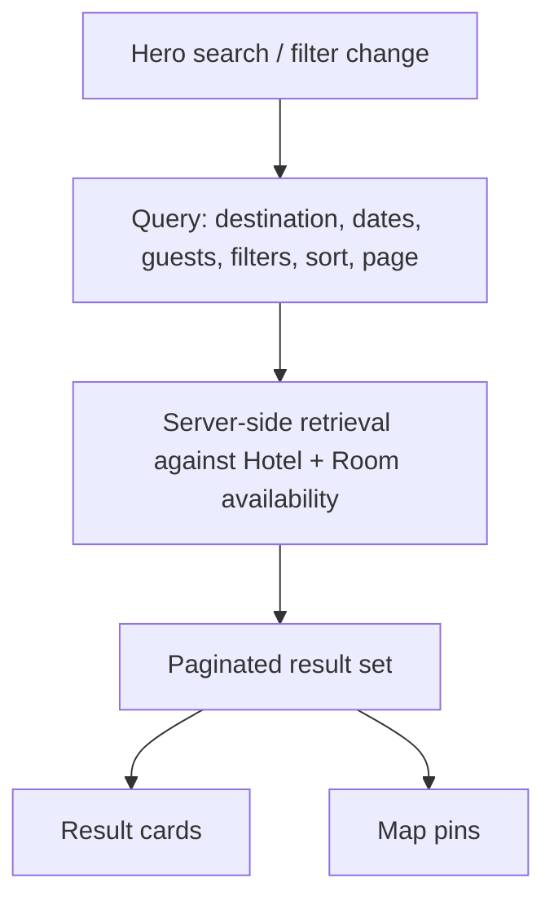

# Hotel Discovery

**Version:** 0.1.0
**Status:** Draft
**Layer:** concept

## Overview

The search-and-browse experience that lets a guest find a hotel: the home hero
search, the catalog listing with filters/sort/pagination, and the map view.
Evidenced by Figma frames `Главная`/`главная моб` (home) and `Каталог`/`каталог моб`
(catalog), plus the standalone `кнопка сортировки`/`сортировка` sort control.

## Related Specifications

- [l1-platform-foundation.md](l1-platform-foundation.md) - Catalog structure, discoverability, and responsive-parity invariants this spec must honor.
- [l1-hotel-profile.md](l1-hotel-profile.md) - Destination of every result card's "details" action.
- [l1-platform-shell.md](l1-platform-shell.md) - Hosting header/nav and footer around this experience.

## 1. Motivation

Discovery is the acquisition surface for the whole marketplace: it is the first
thing an unauthenticated visitor sees, and per the foundation spec it must be
independently crawlable. Its filter/sort/map/pagination mechanics are shared
verbatim between the home page and the dedicated catalog route, so they are
specified once here rather than twice.

## 2. Constraints & Assumptions

- Home and Catalog render the same result-card component and the same filter
  sidebar; Catalog additionally renders a map with pins, Home does not.
  <!-- TBD: whether Home's result list is the same query as Catalog (e.g. a
       "featured" subset) or an independent feed was not distinguishable from
       static frames alone. -->
- Assume search parameters (destination, dates, guest count) round-trip into the
  catalog's URL/query state so a hero search is shareable and back-navigable.

## 3. Core Invariants (Layer 1 only)

- The hero search accepts, at minimum, a destination, a date range, and a guest
  count, and submitting it lands on the catalog pre-filtered accordingly.
- The catalog sidebar supports filtering by: location, accommodation type,
  star rating, price range, room/hotel amenities, and family/wellness-oriented
  tags (evidenced by "Для детей" / "Лечение" filter groups).
- Results are sortable by at least price and popularity; sort state is visible
  and changeable without losing active filters.
- Results are paginated; the page number is part of navigable state, not
  infinite-scroll-only.
- Each result card surfaces: cover photo, name, location, aggregate rating with
  review count, a starting price, key amenity badges, and a details action.
- The Catalog route additionally renders hotel positions on a map, synchronized
  with the filtered result set (a filter change updates visible pins).
- Curated category shortcuts (e.g. "sea vacation", "mountains", "eco tourism")
  are available as one-click entry points into a pre-filtered catalog view.

## 5. Detailed Design

### 5.1 Result Retrieval Flow



### 5.2 Filter Facets (as evidenced)

```plaintext
Location
Accommodation type
Star rating
Price range
Amenities (hotel-level)
Room facilities
Family / children
Wellness / treatment
```

## 6. Implementation Notes

1. Filter/sort/paginate contract should be designed once and shared by Home and
   Catalog, not duplicated per route.
2. Map integration depends on hotels carrying resolvable coordinates —
   coordinate on this with [l1-property-onboarding.md](l1-property-onboarding.md).

## 7. Drawbacks & Alternatives

An alternative would model Home's list as fully independent editorial content
(a curated "featured hotels" feed unrelated to the catalog query). Kept as a TBD
rather than decided, since the static frames don't distinguish the two.

## Canonical References

| Alias | Path | Purpose |
| --- | --- | --- |
| `[FIGMA-HOME]` | `https://www.figma.com/design/N2cVVIS5wvjHIviP27peuX/Booking?node-id=225-3619` | Home frame. |
| `[FIGMA-CATALOG]` | `https://www.figma.com/design/N2cVVIS5wvjHIviP27peuX/Booking?node-id=225-1862` | Catalog frame. |

## Document History

| Version | Date | Change |
| --- | --- | --- |
| 0.1.0 | 2026-07-30 | Initial draft derived from Figma Home/Catalog frames. |
