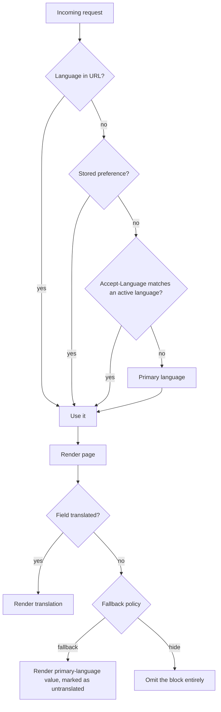
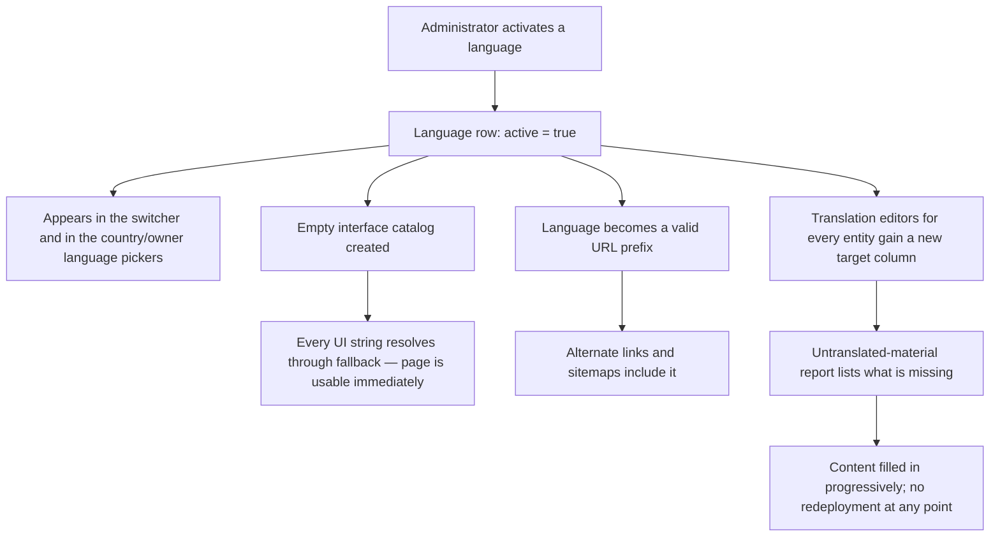

# Localization

**Version:** 0.3.0
**Status:** Stable
**Layer:** concept

## Overview

The country and language model of the portal: which countries and languages are
active, how a visitor's language is chosen and switched, how every content-bearing
entity carries per-language text, and what happens when a translation is missing.
Derived from `[TZ]` §1.3–1.4, §16, §66–67, §71, §108.

Localization is specified as its own domain rather than as a property of each
feature because `[TZ]` §16 requires translations for *every* entity class —
countries, cities, categories, articles, news, objects, menus, SEO data, and system
messages. A per-feature treatment would restate the same contract twelve times.

## Related Specifications

- [l1-platform-foundation.md](l1-platform-foundation.md) - Localization-completeness and additive-extensibility invariants this spec implements.
- [l1-geography.md](l1-geography.md) - Its territory names and descriptions are the largest translated entity set.
- [l1-seo.md](l1-seo.md) - Consumes the per-language URL and alternate-link contract defined here.
- [l1-back-office.md](l1-back-office.md) - Hosts the translation management surface (§5.5).
- [l1-platform-shell.md](l1-platform-shell.md) - Renders the language and country switchers.
- [l1-content-publishing.md](l1-content-publishing.md) - Consumes the translation contract for articles, news, and promotions.

## 1. Motivation

The portal launches across three countries with five interface languages, and
`[TZ]` §1.5 and §64 both require that adding a fourth country or a sixth language be
a data operation. That requirement is only meetable if language is a first-class
dimension from the first migration onward — retrofitting translations onto a
single-language schema means touching every table, every query, every URL, and
every cached page. The cost of getting this right is front-loaded and modest; the
cost of getting it wrong is a rewrite.

Country and language are deliberately modeled as **independent** dimensions. A
Georgian-language visitor may browse Moldovan objects; a Ukrainian object's page
must be readable in English. Coupling them (a "site per country" model) would make
the common cross-border browsing case impossible.

## 2. Constraints & Assumptions

- **Eventual** language set: English, Russian, Romanian, Ukrainian, Georgian
  (`[TZ]` §1.4, §67). All five are left-to-right; the language record still carries a
  text direction field so a future RTL language is a data change (`[TZ]` §67).
- **Launch** language set [ADDED — v0.2.0]: **English and Russian only**. Romanian,
  Ukrainian, and Georgian are activated after the project is complete, through the
  back office — see §5.6. This is a content-cost decision by explicit product
  direction, not a capability reduction: nothing in this spec's model, schema, or URL
  grammar changes with the count of active languages.
- Launch countries: Moldova, Ukraine, Georgia (`[TZ]` §1.3). Each carries its own
  currency, phone code, flag, and primary language (`[TZ]` §66).
- `[TZ]` §66 enumerates country name columns per language ("name in Ukrainian",
  "name in Russian", …). This spec deliberately **rejects that
  column-per-language shape** in favour of translation rows — see §7.
- Machine translation is out of scope. Translations are authored or imported by
  people through the back office (`[TZ]` §108).

## 3. Core Invariants (Layer 1 only)

- **Language is data, not code.** The set of active languages, their display order,
  their labels, and which one is primary are administrator-editable at runtime
  (`[TZ]` §67, §108). No language code may be hard-coded in a template, route, or
  query.
- **Every content-bearing entity is translatable.** An entity that renders text to a
  visitor carries a per-language record for that text. At minimum: countries,
  territories, object types, amenities, objects, rooms, articles, news items,
  promotions, banners, placement badges, and every SEO field (`[TZ]` §16, §71, §92).
- **Translatable text lives apart from invariant data.** Language-independent fields
  (coordinates, prices, dates, foreign keys, status flags) are stored once. Language-
  dependent fields are stored per language. A record must never duplicate its
  invariant fields once per language.
- **Missing translations degrade, never break.** When a translation is absent the
  system either falls back to a defined language or hides the untranslated block —
  the choice is a configured behavior, not an error state (`[TZ]` §71). A missing
  translation must never produce an empty page, a broken layout, or a raw key.
- **Language is part of the address.** Each language has its own canonical URL for
  the same content, and every page declares its alternates in the other active
  languages ([l1-seo.md](l1-seo.md)).
- **Country selection is independent of language selection.** Choosing a browsing
  country must not force a language, and choosing a language must not force a
  country.
- **Language-scoped content is permitted.** A banner, article, or news item may
  target a subset of languages and appear only in those versions (`[TZ]` §83, §108).
  Language targeting is a filter on visibility, not a translation obligation.

## 5. Detailed Design

### 5.1 Country & Language Registries

```plaintext
Country
├── code (ISO 3166-1 alpha-2)
├── flag asset
├── currency
├── phone code
├── primary language      -> Language
├── territory level naming -> l1-geography §5.2
├── active flag
└── display order
    └── translations: name

Language
├── code (BCP 47)
├── short label ("EN", "RU")
├── icon / flag asset
├── text direction
├── active flag
├── primary flag (exactly one)
└── display order
```

Both registries are administrator-managed (`[TZ]` §66, §67, §107). Deactivating a
language hides it from the switcher and from alternate links; it does not delete its
translation rows, so reactivation is lossless.

### 5.2 Translation Contract

Every translatable entity conforms to one shape:

```plaintext
{Entity}                          {Entity}Translation
├── id                            ├── entity id      -> {Entity}
├── (invariant fields)            ├── language       -> Language
└── …                             ├── (text fields for this entity)
                                  └── slug (per-language URL segment)

Uniqueness: (entity id, language)
```

The text-field set differs per entity. For an object it is the set named in
`[TZ]` §71: name, short description, full description, location description, house
rules, catering information, additional information, SEO title, SEO description,
keywords, and page address. For a territory it is name, short description, full
description, and SEO fields (`[TZ]` §68).

**Slug uniqueness** is scoped to `(language, entity kind, parent scope)` — two
territories in different countries may share a slug; two objects in the same city
may not.

### 5.3 Resolution & Fallback



The fallback policy is a portal setting with a per-entity-class override, because
the right answer differs by content: an object's *name* should fall back (a name in
any language beats no name), while a *long editorial description* is better hidden
than shown in a language the visitor cannot read (`[TZ]` §71).

UI strings resolve through the same fallback chain but never hide — an untranslated
interface label always falls back, since hiding a button is worse than showing it in
the primary language.

### 5.4 Interface Strings

UI copy is externalized into per-language message catalogs, addressed by stable
keys. Catalog entries are editable through the back office without a deployment
(`[TZ]` §108 "edit interface translations"). Adding a language creates an
empty catalog that resolves entirely through fallback until filled — the language is
usable from the moment it is activated, not only once fully translated.

### 5.5 Translation Management

The back office ([l1-back-office.md](l1-back-office.md)) exposes, per `[TZ]` §108:

- toggle a language on or off, set the primary language, reorder languages;
- edit interface catalog entries;
- list untranslated material across all entity classes;
- filter objects lacking a translation in a given language;
- copy the primary-language value into a target language as an editing starting
  point;
- publish a single language version of an entity independently of the others.

Translation completeness per entity and per language is a reportable metric, since
`[TZ]` §126 requires a "translation missing" SEO warning.

### 5.6 Phased Language Activation [ADDED — v0.2.0]

The launch set is English and Russian; the remaining three are activated later from
the back office. This section states what makes that a data operation rather than a
project, so the deferral is safe to rely on.

**What activating a language does**, end to end:



**Why no code change is required** — each guarantee traces to an existing rule:

| Concern | Why it holds | Source |
| --- | --- | --- |
| No language code in templates or routes | Language is data; hard-coding is forbidden | §3 |
| Schema needs no migration | Translations are rows keyed on `(entity, language)`, not columns | §5.2, §7 |
| Pages render before translation exists | Interface strings always fall back, never hide | §5.3 |
| URLs work immediately | Language is a URL segment resolved from the registry | §3, [l1-seo.md](l1-seo.md) §5.1 |
| Partial content is not a broken page | Per-entity fallback or hide policy | §3, §5.3 |
| Progress is measurable | Untranslated-material report and SEO warnings | §5.5, [l1-seo.md](l1-seo.md) §5.6 |

**Two consequences worth stating plainly**, since they are visible at launch:

1. **No launch country's own primary language is active.** The launch markets are
   Moldova, Ukraine, and Georgia, whose primary languages are Romanian, Ukrainian, and
   Georgian respectively. `[TZ]` §66 requires each country record to name a primary
   language, so at launch those records reference **inactive** languages. The system
   must treat that as a normal, resolvable state — falling back to the visitor's
   chosen active language — not as a validation error. Practically, Moldovan and
   Ukrainian visitors are served in Russian or English, and Georgian visitors in
   English.
2. **Translation infrastructure ships regardless.** Translation tables, per-language
   slugs, alternate links, and the fallback policy are built in the first migration
   with two languages active, exactly as they would be with five. Building them "when
   the other languages arrive" is the failure mode §1 exists to prevent, and the
   deferral must not be read as permission to defer them.

**Definition of done for the deferral**: activating Romanian on a running portal, with
no deployment, produces a working Romanian version of every page — untranslated
content resolving through fallback — and lists exactly what remains to be translated.
If that is not true, the deferral was not implemented as specified.

## 6. Implementation Notes

1. Model the translation tables in the same migration pass as the entities they
   localize, **with two languages active exactly as with five** (§5.6). Retrofitting is
   the failure mode this spec exists to prevent, and a reduced launch set is the
   circumstance most likely to invite it.
2. Index every translation table on `(language, slug)` and on `(entity id,
   language)` — both are hot paths (URL resolution and page render respectively).
3. Cache keys for any rendered page must include the language and the browsing
   country, or a cache hit will serve the wrong language.
4. Do not couple the language of the *back office* to the language of the *portal*.
   `[TZ]` §42 gives an owner a cabinet-language setting distinct from the site
   language they browse.

## 7. Drawbacks & Alternatives [MODIFIED — v0.3.0]

**Column-per-language, as literally written in `[TZ]` §66.** The client's own draft
shows `name_uk`, `name_ru`, `name_ro`, `name_ka` columns on the country table.
Rejected: it contradicts `[TZ]` §1.5 and §64, which require adding a language
without reworking the schema — the column shape requires a migration per language,
per table, and forces every query to know the language set at compile time. The
translation-row shape delivers the same reads at the cost of one join, which is
cheap against the indexes in §6.2. This is a deliberate, recorded deviation from the
letter of the `[TZ]` in service of its own stated requirement.

**JSONB translation blobs on the parent row.** Simpler to write and needs no join,
but loses per-language uniqueness constraints on slugs, makes "list all untranslated
objects" (`[TZ]` §108) a full scan, and cannot be foreign-keyed to the language
registry. Rejected on the reporting requirement alone.

**Country-per-domain (`.md`, `.ua`, `.ge`).** Strong for local SEO, and rejected
because it multiplies deployment, certificate, and back-office complexity by three
before the portal has proven any of the three markets.

Until 2026-08-15 this section kept the option alive as "a documented later
migration". The project owner closed it on that date: the portal serves all three
countries from **one origin**, with the language as the leading path segment and no
per-country domains or subdomains — the grammar already recorded in
[l1-seo.md](l1-seo.md) §5.1. The option is recorded here as **retired**, not
deferred.

The distinction matters beyond bookkeeping. A deferred migration is a standing
constraint: every addressing, canonical, and alternate-link rule downstream has to
stay portable to a layout nobody has committed to building. Retiring it removes that
obligation, and it is the reason the rules in [l1-seo.md](l1-seo.md) §3.1 and §3.3
may now assume a single origin outright rather than merely happening to have one.

## Canonical References

| Alias | Path | Purpose |
| --- | --- | --- |
| `[TZ]` | `.drafts/booking.md` | §1.3–1.4, §16, §66–67, §71, §108 — source requirements. |
| `[L1]` | `.design/main/specifications/l1-platform-foundation.md` | Localization-completeness invariant. |

## Document History

| Version | Date | Change |
| --- | --- | --- |
| 0.1.0 | 2026-08-05 | Initial draft derived from the client technical specification. |
| 0.2.0 | 2026-08-05 | Minor: split the language set into launch (English, Russian) and eventual (plus Romanian, Ukrainian, Georgian) per explicit product direction; added §5.6 Phased Language Activation with the no-code-change trace, the inactive-primary-language consequence, and a definition of done for the deferral. |
| 0.2.1 | 2026-08-05 | Patch: translated quoted `[TZ]` excerpts from Russian to English per the project's language policy; no meaning changed. |
| 0.3.0 | 2026-08-22 | Minor: §7 records country-per-domain as retired rather than deferred, following the project owner's 2026-08-15 decision to serve all three countries from one origin with the language as the leading path segment. Adds the consequence — downstream addressing rules are no longer obliged to stay portable to a multi-origin layout. No rule in §5 changed; the grammar was already single-origin. |
