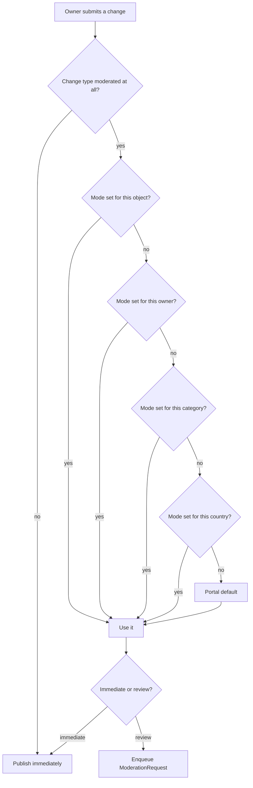
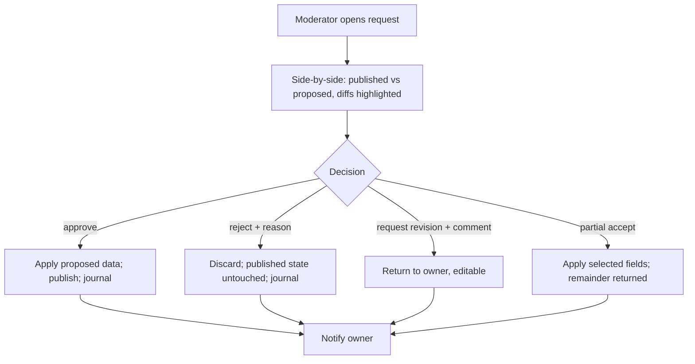
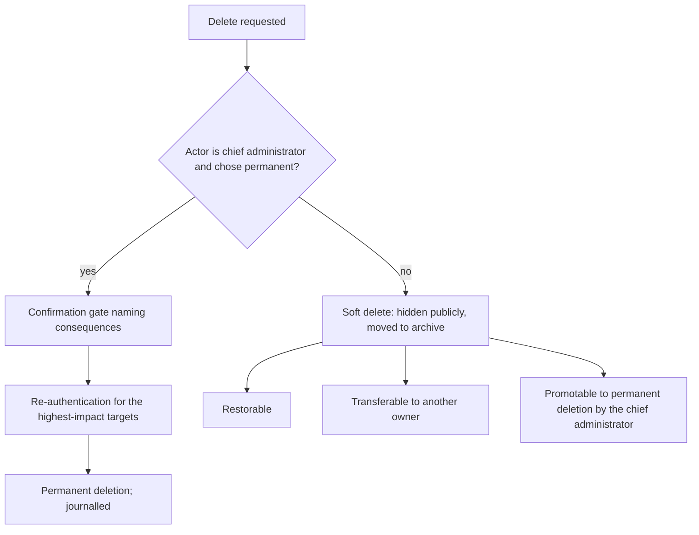

# Moderation & Governance

**Version:** 0.1.0
**Status:** RFC
**Layer:** concept

## Overview

How the portal keeps control of what appears on it: configurable moderation modes,
the change-review queue with before/after comparison, the immutable action journal,
soft deletion with an archive, staleness policing, and the confirmation gates that
protect administrators from their own bulk operations. Derived from `[TZ]` §44–§53,
§88, §91, §95, §119, §129, §133.

## Related Specifications

- [l1-platform-foundation.md](l1-platform-foundation.md) - Configurable-moderation, soft-deletion, and accountability invariants this spec implements.
- [l1-object-onboarding.md](l1-object-onboarding.md) - Source of most moderated changes.
- [l1-content-publishing.md](l1-content-publishing.md) - Owner-authored news and promotions pass this checkpoint.
- [l1-object-profile.md](l1-object-profile.md) - Reviews pass this checkpoint.
- [l1-back-office.md](l1-back-office.md) - Hosts the queue, the journal, and the archive.
- [l1-notifications.md](l1-notifications.md) - Delivers moderation outcomes to owners.
- [l1-feature-modules.md](l1-feature-modules.md) - Shares this spec's scoping ladder; its toggles are journalled here.
- [l1-availability-status.md](l1-availability-status.md) - The one owner action that bypasses moderation by design.

## 1. Motivation

The portal's catalog is written almost entirely by people the operator does not
employ. Its value therefore rests on a claim it must be able to enforce — that the
information is accurate and the presentation is consistent. `[TZ]` §44 opens with
exactly this framing ("для обеспечения высокого качества информации").

But `[TZ]` immediately refuses to fix the strictness: §44.1 requires two modes,
selectable per portal, per country, per object category, per owner, and per object.
That refusal is correct and is the design's central constraint. A new market with
unknown owners needs review; an established country with vetted partners does not,
and forcing either policy everywhere would make the portal unusable in one market or
untrustworthy in the other.

Governance here also covers the two things that make moderation meaningful rather
than theatrical: an audit journal ordinary administrators cannot alter (`[TZ]` §91),
and deletion that does not actually delete (`[TZ]` §95). Without those, an approval
decision has no history and a mistake has no undo.

## 2. Constraints & Assumptions

- Moderation strictness is configuration, never a code branch (`[TZ]` §44.1).
- The scoping ladder is shared with
  [l1-feature-modules.md](l1-feature-modules.md): portal → country → category →
  owner → object, most-specific-wins.
- The journal is append-only. `[TZ]` §129 states an ordinary administrator must not
  be able to delete the record of their own actions.
- Physical deletion is a chief-administrator action only (`[TZ]` §95).
- <!-- TBD: [TZ] §47 lists partial acceptance of a change set as optional
     ("частично принять изменения (опционально)"). Modeled below as field-level
     selection, which is materially more complex than whole-request approval;
     recorded as an explicit scope decision rather than assumed into the first
     release. -->

## 3. Core Invariants (Layer 1 only)

### 3.1 Moderation

- **Two modes exist**: immediate publication, and publication after review
  (`[TZ]` §44.1). The active mode for a given change is resolved down the scoping
  ladder.
- **Moderation acts on changes, not on records.** A pending edit never overwrites the
  published version; both exist until a decision is made (`[TZ]` §47). A rejected
  edit leaves the live page exactly as it was.
- **Decisions are: approve, reject, or request revision** (`[TZ]` §46). Reject and
  request-revision require a reason, which reaches the owner (`[TZ]` §49).
- **What may be moderated** is enumerable and configurable: name, description,
  photographs, prices, contacts, website and messenger links, news, promotions,
  category change, location change, service changes, and object status
  (`[TZ]` §45).
- **The availability toggle is exempt.** It bypasses moderation unconditionally,
  because `[TZ]` §27.3 requires it to take effect immediately
  ([l1-availability-status.md](l1-availability-status.md) §3).
- **Approval publishes automatically** — no second manual publication step
  (`[TZ]` §47).

### 3.2 Accountability

- **Every privileged mutation is journalled** with actor, action, target, previous
  value, new value, timestamp, IP address, device, and outcome (`[TZ]` §91, §53).
- **The journal is append-only and access-controlled.** It cannot be edited or
  purged by ordinary administrators, and reading it is a distinct permission
  (`[TZ]` §91, §129).
- **Impersonation is always recorded.** An administrator entering an owner's cabinet
  in support mode is journalled without exception (`[TZ]` §106).
- The journal supports search, filtering, before/after inspection, and export
  (`[TZ]` §53, §129).

### 3.3 Data Retention

- **Soft deletion is the default.** Objects, users, news, promotions, and banners
  disappear from the public site, move to an archive, remain visible to the chief
  administrator, and are restorable (`[TZ]` §95, §51).
- **Media survives its parent.** An archived object's photographs are retained until
  final deletion (`[TZ]` §75).
- **Permanent deletion is restricted** to the chief administrator and is itself
  journalled (`[TZ]` §95).
- An archived object may be restored, permanently deleted, or transferred to another
  owner (`[TZ]` §51).

### 3.4 Safety

- **Destructive and bulk actions require confirmation** naming their blast radius:
  object deletion, owner blocking, bulk package changes, bulk hiding, geographic
  hierarchy changes, permanent deletion, backup restoration, and permission changes
  (`[TZ]` §133, §105).
- **Restoration of a backup requires re-authentication**, not merely confirmation
  (`[TZ]` §131).

### 3.5 Freshness

- Objects not updated within a configured period (90 / 180 / 365 days) raise a
  reminder to the owner and a flag in the back office (`[TZ]` §52).
- Stale objects may be **temporarily hidden by an administrator** pending owner
  confirmation — never hidden automatically (`[TZ]` §52).

## 5. Detailed Design

### 5.1 Mode Resolution



### 5.2 Request Model

```plaintext
ModerationRequest
├── target             -> Object | NewsItem | Promotion | Review | Media
├── section            (which part of the target changed)
├── previous data      (snapshot of the published state)
├── proposed data      (the submitted change)
├── submitted by       -> Account
├── submitted at
├── assigned moderator -> Account (optional)
├── decision           pending | approved | rejected | revision_requested
├── decided at · decided by
├── rejection reason
└── comment
```

Per `[TZ]` §46 the queue shows, per entry: change date, owner, object, section, a
short description of the change, and status. Per `[TZ]` §119 it filters by country,
object, owner, change type, and date, and a moderator may reassign an entry to a
colleague.

### 5.3 Review Interface

Per `[TZ]` §47 a moderator opening a request sees: the currently published
information, the proposed revision, changed values highlighted, and before/after
photographs where media changed. They may approve, reject, comment to the owner, or —
where enabled — accept part of the change set.



The published state being untouched on rejection (step E) is the practical reason
§3.1 models moderation over *changes* rather than over records: a rejected edit
cannot damage a live page it never reached.

### 5.4 Action Journal

```plaintext
AuditEntry
├── actor          -> Account
├── action         (verb: created, updated, approved, bumped, toggled, exported, …)
├── target type · target id
├── previous value · new value
├── occurred at
├── IP address · device
└── outcome        success | failure
```

`[TZ]` §48 states the same record from the moderation side — date, time, user, IP
address, changed section, old value, new value, and moderation outcome, readable only
by portal administration. It is the same journal, not a second one: a moderation
decision is one kind of journalled mutation, and splitting them would leave two
partial histories where the requirement asks for one.

Per `[TZ]` §53 and §129 the journal records at minimum: sign-ins, object creation and
edits, owner changes, package changes, position changes, bumps, border and badge
changes, availability toggles, content publication, moderation decisions, data
exports, settings changes, module toggles, and deletions and restorations.

Retention and archiving of old journal entries are administrator-configured
(`[TZ]` §94 "архивирование старых журналов") — the journal grows without bound
otherwise, and it is the highest-volume table in the system after statistics.

### 5.5 Archive



### 5.6 Confirmation Gates

Per `[TZ]` §133 and §105 every action in §3.4 presents a confirmation that names what
will be affected and how many records — "hide 87 objects in Odesa region" rather than
"are you sure?". Bulk operations show the confirmation before execution, and where
feasible offer an undo or an archive-restore path afterwards.

## 6. Implementation Notes

1. Store the previous-state snapshot on the request itself, not as a reference to
   the live record. If the live record changes between submission and review, a
   reference-based diff shows the moderator a comparison that never existed.
2. Write journal entries in the same transaction as the mutation they describe. A
   journal written afterwards is a journal with gaps precisely where failures
   occurred — the cases it most needs to record.
3. Enforce append-only at the data layer, not only in the UI. `[TZ]` §129's
   requirement is about what an administrator *can* do, not about what the interface
   offers them.
4. Soft-delete filtering belongs in the shared query layer. A single forgotten filter
   in one query republishes archived content, and that failure is silent.
5. Journal and statistics are the two unbounded tables; plan their partitioning and
   archival with the schema, not after the first slow query
   ([l1-analytics.md](l1-analytics.md) §6).

## 7. Drawbacks & Alternatives

**Always-on moderation.** Safest for content quality and rejected by `[TZ]` §44.1,
which requires both modes. It also does not scale: a queue that must clear every
price edit across three countries becomes the portal's bottleneck and, in practice,
gets bypassed.

**Never moderate; police reactively via reports.** Cheapest to build and unacceptable
for a new market where the portal's whole pitch is curated quality. `[TZ]` chose
configurability precisely to avoid committing to either extreme.

**Moderating records instead of changes** (edit in place, flag the record as pending).
Much simpler, and it makes §5.3's before/after comparison impossible and lets a
pending edit take down a live page. Rejected on both counts.

**Hard deletion with database backups as the safety net.** Adequate for disaster
recovery and useless for the actual requirement: `[TZ]` §51 wants an administrator to
restore one object from an archive in the interface, not a database engineer to
restore a snapshot.

## Canonical References

| Alias | Path | Purpose |
| --- | --- | --- |
| `[TZ]` | `.drafts/booking.md` | §44–§48, §49–§53, §88, §91, §95, §119, §129, §133 — source requirements. |
| `[L1]` | `.design/main/specifications/l1-platform-foundation.md` | Governance invariants. |

## Document History

| Version | Date | Change |
| --- | --- | --- |
| 0.1.0 | 2026-08-05 | Initial draft derived from the client technical specification. |
