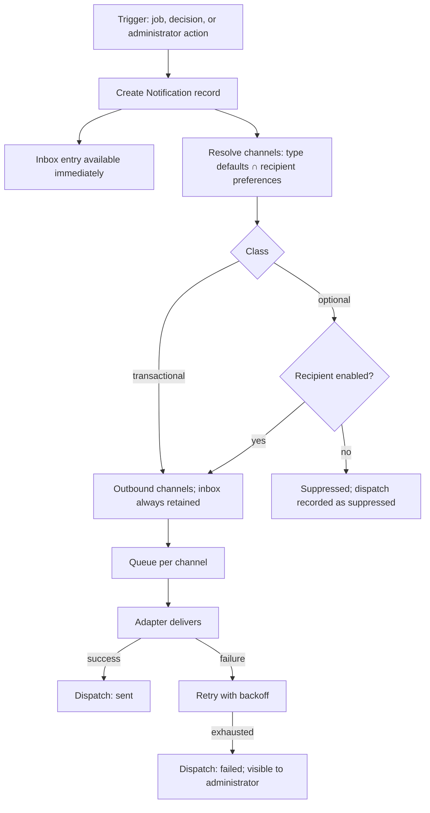

# Notifications

**Version:** 0.1.0
**Status:** RFC
**Layer:** concept

## Overview

How the portal reaches its owners and staff: the notification record, the channel
abstraction, the automated schedules (placement expiry, moderation outcomes,
information staleness, availability confirmation), administrator broadcasts, and the
delivery history. Derived from `[TZ]` §43, §49, §62, §90, §124.

## Related Specifications

- [l1-platform-foundation.md](l1-platform-foundation.md) - Actor-role and additive-extensibility invariants this spec implements.
- [l1-object-onboarding.md](l1-object-onboarding.md) - Primary recipient surface; hosts the in-cabinet inbox.
- [l1-placement-monetization.md](l1-placement-monetization.md) - Source of the expiry warning schedule.
- [l1-moderation-governance.md](l1-moderation-governance.md) - Source of moderation-outcome messages; journals dispatches.
- [l1-availability-status.md](l1-availability-status.md) - Source of the status-confirmation reminder.
- [l1-back-office.md](l1-back-office.md) - Hosts composition, targeting, and delivery reporting.
- [l1-localization.md](l1-localization.md) - Messages are delivered in the recipient's cabinet language.

## 1. Motivation

Two of the portal's core mechanisms are unenforceable without notifications, and both
are revenue-relevant.

Placement packages expire. `[TZ]` §62 specifies a six-point warning schedule — 30,
14, 7, and 3 days before, on the day, and after — because a lapsed package that the
owner did not see coming is a renewal the portal loses and a customer relationship it
damages. The notification schedule *is* the renewal process.

Catalog information decays. `[TZ]` §52 makes stale objects a defect the portal must
police, and §114 asks the system to periodically prompt owners to confirm their
availability status. Neither works without a reliable outbound channel.

Everything else here — moderation outcomes, administration messages, broadcasts —
rides the same mechanism.

## 2. Constraints & Assumptions

- Launch channels are the in-cabinet inbox and email (`[TZ]` §62, §124).
- Telegram, Viber, and further channels must be addable without reworking the model
  (`[TZ]` §62, §124).
- Every notification persists in a history (`[TZ]` §43).
- Owners may disable notifications and configure receipt of administration messages
  (`[TZ]` §42).
- Email templates are administrator-editable (`[TZ]` §130 "шаблоны писем").
- <!-- TBD: which notification classes, if any, are non-disableable is not stated.
     Modeled below with a transactional/optional distinction — placement expiry and
     moderation outcomes are consequential enough that suppressing them harms the
     owner — but the classification is a product decision, not a derived one. -->

## 3. Core Invariants (Layer 1 only)

- **The notification is a record, not a send.** A notification exists as stored data
  with a read state, independently of whether any channel delivered it
  (`[TZ]` §90). The in-cabinet inbox reads that record; email is one delivery of it.
- **Channels are pluggable.** Adding a channel is a registry entry plus an adapter,
  never a change to the notification model or to the code that raises notifications
  (`[TZ]` §62, §124).
- **Delivery failure is visible.** Each dispatch records its status; a bounced email
  must be discoverable rather than silently lost (`[TZ]` §124).
- **Recipients control optional classes only.** Owner preferences suppress optional
  notifications; consequential ones — placement expiry, moderation decisions —
  are always recorded in the inbox even where an outbound channel is disabled.
- **Language follows the recipient.** Messages render in the recipient's cabinet
  language ([l1-localization.md](l1-localization.md) §6.4), not the portal's primary
  language.
- **Automated schedules are configurable.** Warning offsets, staleness periods, and
  availability-confirmation cadence are settings, not constants
  (`[TZ]` §130, §52, §114).
- **Broadcasts are targetable and journalled.** An administrator may address owners by
  country, resort, or placement package, and every dispatch is recorded
  (`[TZ]` §124).

## 5. Detailed Design

### 5.1 Model

```plaintext
Notification                         NotificationDispatch
├── recipient   -> Account           ├── notification -> Notification
├── type        -> NotificationType  ├── channel      -> NotificationChannel
├── related     -> Object | Request  ├── status       queued | sent | failed | suppressed
│                  | Placement …     ├── attempted at
├── title · body (rendered)          ├── failure reason
├── language                         └── provider reference
├── read state · read at
├── created at                       NotificationChannel
└── created by  -> Account | system  ├── key      inbox | email | telegram | viber | …
                                     ├── active flag
NotificationType                     └── translations -> display name
├── key
├── class       transactional | optional
├── default channels[]
└── templates   -> per language, per channel
```

Separating `Notification` from `NotificationDispatch` is what makes §3 true: the
inbox never depends on an email provider succeeding, a channel can be retried without
duplicating the notification, and adding Telegram later adds dispatch rows rather
than changing anything that already exists.

### 5.2 Notification Types

Per `[TZ]` §43, §49, §62, §90:

| Type | Class | Trigger |
| --- | --- | --- |
| Placement expiring | transactional | 30 / 14 / 7 / 3 days before, day of, after |
| Package expired | transactional | Expiry job ([l1-placement-monetization.md](l1-placement-monetization.md) §5.4) |
| Moderation approved | transactional | Decision recorded |
| Moderation rejected | transactional | Decision recorded, with reason |
| Revision requested | transactional | Decision recorded, with comment |
| Information out of date | optional | Staleness job (`[TZ]` §52) |
| Confirm availability status | optional | Cadence job (`[TZ]` §114) |
| Administration message | optional | Administrator, individual or broadcast |
| Object status changed | transactional | Administrator changed publication state |
| System message | transactional | System event affecting the account |

`[TZ]` §49 gives the rejection messages their intended register — "Изменения
опубликованы", "Изменения требуют доработки", "Фотография не соответствует
требованиям", "Проверьте контактную информацию". Templates are editable
(`[TZ]` §130), so this wording is seed content, not fixed strings.

### 5.3 Dispatch Flow



Recording a suppression (step H) rather than skipping silently is what lets an
administrator answer "why didn't this owner know" — the most common support question
this mechanism will generate.

### 5.4 Scheduled Jobs

| Job | Cadence | Produces |
| --- | --- | --- |
| Placement expiry sweep | Daily | Expiry warnings at each configured offset; expiry action ([l1-placement-monetization.md](l1-placement-monetization.md) §5.4) |
| Staleness sweep | Daily | Out-of-date reminders; back-office flags (`[TZ]` §52) |
| Availability confirmation | Per configured cadence | Confirmation prompts (`[TZ]` §114) |
| Promotion archival | Daily | Archives expired promotions (`[TZ]` §117) |
| Dispatch retry | Continuous | Retries failed dispatches |

These jobs, together with the statistics rollup
([l1-analytics.md](l1-analytics.md) §5.2) and backups (`[TZ]` §97), constitute the
portal's scheduled workload. They are why the platform needs a background execution
capability distinct from request handling
([l2-tech-stack.md](l2-tech-stack.md) §5.6).

### 5.5 Administration

Per `[TZ]` §124 an administrator may create individual and broadcast notifications,
targeting owners by country, resort, or placement package, and by expiry state. Each
message records recipients, body, dispatch date, delivery status, and read status.

## 6. Implementation Notes

1. Make dispatch idempotent per (notification, channel). A retried job that
   re-notifies every owner whose package expires in seven days is a visible, public
   failure.
2. Never send from a request handler. Every notification in §5.2 originates in a job
   or a decision handler and is queued.
3. Render the message body at creation, in the recipient's language, and store it. A
   template edited later must not retroactively change what an owner was told — the
   inbox is a record of communication, not a live view.
4. Rate-limit broadcasts and require the §5.6 confirmation gate
   ([l1-back-office.md](l1-back-office.md)); a mis-targeted broadcast reaches every
   owner in a country and cannot be recalled.

## 7. Drawbacks & Alternatives

**Email only, with no in-cabinet inbox.** Simpler and fails `[TZ]` §43's requirement
that notifications appear in the cabinet with a history — and email deliverability to
mixed consumer domains across three countries is exactly the kind of dependency that
should not be the sole path for a renewal warning.

**In-cabinet only, with no email.** Cheapest and useless for the primary use case: an
owner whose package is expiring is, by definition, someone who has not signed in
recently.

**A third-party notification platform.** Removes the dispatch and retry machinery and
adds a vendor between the portal and its paying customers for messages that are
mostly transactional and low-volume. Reconsider when Telegram and Viber channels
arrive — the adapter boundary in §5.1 is placed so that swap stays cheap.

**Storing a template reference instead of rendered text.** Saves space and breaks the
audit property in §6.3: the record of what an owner was told would change whenever an
administrator edits a template.

## Canonical References

| Alias | Path | Purpose |
| --- | --- | --- |
| `[TZ]` | `.drafts/booking.md` | §42–§43, §49, §52, §62, §90, §114, §124 — source requirements. |
| `[L1]` | `.design/main/specifications/l1-platform-foundation.md` | Actor-role and extensibility invariants. |

## Document History

| Version | Date | Change |
| --- | --- | --- |
| 0.1.0 | 2026-08-05 | Initial draft derived from the client technical specification. |
