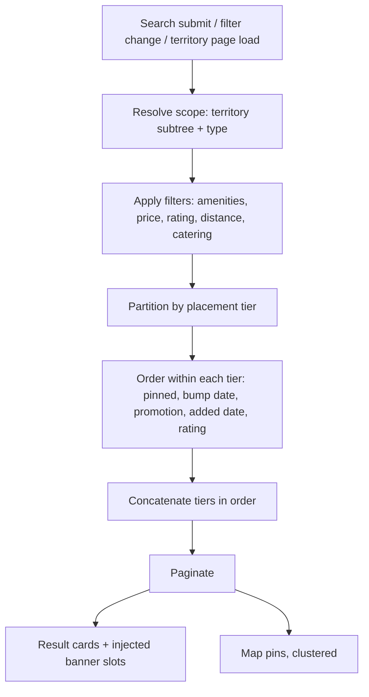
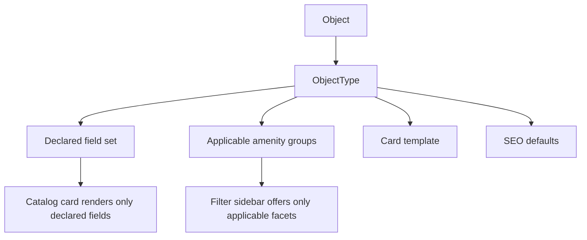

# Object Catalog

**Version:** 1.1.1
**Status:** RFC
**Layer:** concept

## Overview

How a visitor finds a tourism object: the object type registry, the search surface,
the filter/sort/pagination contract, the tier-governed result ordering, the result
card, and the map. Derived from `[TZ]` §5–6, §10, §14–15, §25.2, §69, §109.

[MODIFIED — v1.0.0] Renamed from `l1-hotel-discovery.md`. The domain is no longer
hotels: `[TZ]` §69 lists seventeen object types spanning accommodation, dining,
entertainment, and attractions, and requires that an administrator be able to add
more without a developer. Ordering also changed fundamentally — it is now governed
by purchased placement tier before any relevance or quality signal.

## Related Specifications

- [l1-platform-foundation.md](l1-platform-foundation.md) - Object-as-central-entity, type-varying-attributes, and paid-placement-ordering invariants.
- [l1-geography.md](l1-geography.md) - Territory scoping every catalog view is filtered by.
- [l1-object-profile.md](l1-object-profile.md) - Destination of every result card's details action.
- [l1-placement-monetization.md](l1-placement-monetization.md) - Owns the tier ordering and bump semantics this spec renders.
- [l1-availability-status.md](l1-availability-status.md) - Owns the "vacancies available" badge shown on cards.
- [l1-advertising.md](l1-advertising.md) - Injects banner slots between result blocks and owns the promotion badges on cards.
- [l1-localization.md](l1-localization.md) - Type names, amenity names, and card copy are translated entities.
- [l1-seo.md](l1-seo.md) - Governs which filter combinations are indexable.
- [l1-platform-shell.md](l1-platform-shell.md) - Hosts the header search around this experience.
- [l1-feature-modules.md](l1-feature-modules.md) - [ADDED] Determines which optional facets a given scope offers.
- [l1-room-reservation.md](l1-room-reservation.md) - [ADDED] Optional module contributing the date-range and party-size facets.

## 1. Motivation

Catalog listing is the portal's product. Every territory page, every type page, the
home page, and the search results page render the *same* ordered list with different
scopes applied — so the retrieval, ordering, and card contract are specified once
here rather than restated per surface.

The ordering rule deserves its own emphasis because it inverts the usual
expectation: this catalog is not sorted by relevance with paid placement as a
tiebreak. It is sorted by **paid placement first**, and relevance only decides order
*within* a tier (`[TZ]` §25.2). Getting this backwards would break the portal's
entire revenue model, so it is stated as an invariant rather than left to
implementation taste.

## 2. Constraints & Assumptions

- Every catalog surface (home, territory page, type page, search results) is the same
  query with a different scope — never a separate implementation.
- Object types are administrator-managed data with a parent-child relationship, their
  own icon, their own field set, and their own applicable amenity list
  (`[TZ]` §69, §109).
- `[TZ]` §15 offers "Google Maps / OpenStreetMap (either one)" — the choice is an L2
  concern; this spec constrains only behavior (pins, clustering, filtering, routing).
- <!-- TBD: whether the home page's object list is the same query as the catalog
     (a scoped subset) or an independently curated editorial feed is not stated.
     Modeled as the same query with an editorial "featured" flag available as a
     filter, which satisfies both readings. -->

## 3. Core Invariants (Layer 1 only)

### 3.1 Type Registry

- The object type registry is data. Creating a type, nesting it under a parent,
  assigning its icon, choosing its applicable field set and amenity groups, and
  setting its SEO defaults are all administrator actions requiring no code change
  (`[TZ]` §69, §109).
- A type declares which fields its objects expose. An accommodation type exposes
  rooms, prices, and an availability status; a dining type exposes cuisine, average
  cheque, and opening hours (`[TZ]` §109). A catalog view must render only the
  fields its type declares.

### 3.2 Ordering

- **Placement tier is the primary sort key.** Results are emitted tier by tier: all
  tier-1 objects, then all tier-2, then tier-3, then tier-4. A lower-tier object
  never appears above a higher-tier one (`[TZ]` §25.1, §25.2).
- **The only exception is an explicit administrator override**, which is itself
  recorded in the audit journal (`[TZ]` §25.2, §112).
- **Within a tier**, order is decided by, in sequence: pinned manual position, most
  recent bump, special promotion, date added, rating, and optionally a randomized
  rotation (`[TZ]` §25.1 within-category criteria, §112).
- **Ordering is evaluated per scope.** The tier sequence restarts for each country,
  region, district, city, resort, type, and search result set (`[TZ]` §25.2).
- A bump moves an object to the first position **within its own tier**, never above
  it (`[TZ]` §25.3, §26).

### 3.3 Retrieval

- Every catalog view supports filtering, sorting, and pagination. Pagination state is
  addressable — infinite scroll may exist as an enhancement but must not be the only
  way to reach page N.
- Filter and sort state round-trips through the URL so a filtered view is shareable
  and back-navigable, and so [l1-seo.md](l1-seo.md) can decide indexability per
  combination.
- Changing a filter never silently discards the active sort, and vice versa.
- Results are presentable as both a grid and a list (`[TZ]` §6), and the choice
  persists for the visitor.

### 3.4 Card & Map

- A result card surfaces: cover photo, name, settlement, short description, key
  services, rating, view count, a details action, and direct contact actions
  (`[TZ]` §5). It additionally carries its tier's visual treatment
  ([l1-advertising.md](l1-advertising.md) §5.4) and, for accommodation types, the
  availability badge ([l1-availability-status.md](l1-availability-status.md)).
- Contact actions on a card reach the owner directly — the card is a conversion
  surface, not only a navigation surface (`[TZ]` §5).
- The map renders the filtered result set, clusters at low zoom, filters in sync with
  the sidebar, opens an object card from a pin, and can build a route to an object
  (`[TZ]` §11, §15).
- Card geometry is uniform. Tier treatments may change border, badge, and header
  colour but must never change a card's size or break the grid (`[TZ]` §25.5).

## 5. Detailed Design

### 5.1 Search Parameters

Per `[TZ]` §10 and §14, the search surface accepts:

```plaintext
Geography     country · region · district · city · resort · settlement
Identity      object name (free text)
Taxonomy      object type / category
Amenities     services (multi-select, from the type's applicable groups)
Commercial    price range · rating
Proximity     distance to sea · distance to centre
Facilities    parking · pool · SPA · pet-friendly · playground · Wi-Fi
Stay          catering type · holiday type
```

The amenity facets are **not a fixed list** — they are the subset of the amenity
registry flagged as filterable (`[TZ]` §110 "usable as a filter").
Adding a filterable amenity is an administrator action.

[ADDED — v1.1.0] **Module-gated facets.** Where the optional booking module
([l1-room-reservation.md](l1-room-reservation.md)) is active for the scope being
viewed, two further facets appear — check-in/check-out date range and party size —
and results may be constrained to objects with matching calendar availability.
Outside that scope both facets are **absent**, not disabled: offering a date filter
that nothing honours is worse than offering none, because it silently returns a
result set the visitor believes is date-checked.

### 5.2 Retrieval Flow



Banner injection between result blocks (`[TZ]` §24.2 "between catalog objects") is
applied after pagination, so a banner never displaces a result from its page.

### 5.3 Result Ordering Contract

```plaintext
ORDER BY
  tier.rank                     ASC   -- VIP, Recommended, Priority, Standard
  pinned_position               ASC NULLS LAST
  last_bumped_at                DESC NULLS LAST
  active_promotion_weight       DESC
  created_at                    DESC
  rating                        DESC
  rotation_seed                 ASC   -- optional, per [TZ] §25.1
```

Presented as an ordering contract, not as an implementation. `rotation_seed` is
optional per `[TZ]` and, if enabled, must be stable within a visitor's session — a
list that reshuffles between page 1 and page 2 loses and duplicates results.

`pinned_position` and `last_bumped_at` are **scoped values**, not single columns on
the object: `[TZ]` §25.3 requires a bump to act "separately for the city, district,
or resort the object belongs to", and §56 repeats this per country/region/district/
city/resort/category. The ordering therefore reads the object's bump record *for the
scope currently being viewed*.

### 5.4 Map Behaviour

- Pins are drawn for the filtered set, not for all objects.
- Clustering is mandatory, not an enhancement — three countries of objects at country
  zoom is not renderable pin-by-pin (`[TZ]` §15).
- A pin opens a compact card with the same contact actions as a list card.
- Route building hands off to the visitor's map application with the object's
  coordinates as the destination (`[TZ]` §11).
- The map is a view of the result set, never a second source of truth: a filter
  change updates pins in the same round trip that updates cards.

### 5.5 Type-Varying Rendering



A dining catalog must not offer a "distance to sea" filter or a "vacancies
available" badge; an accommodation catalog must not offer "average cheque". The
sidebar and the card are both driven by the type's declaration, so adding a type
does not require touching either.

## 6. Implementation Notes

1. Build the scope resolution, ordering, and pagination once as a single retrieval
   contract; home, territory, type, and search pages are callers of it, not
   reimplementations. This is the single highest-leverage decision in the spec.
2. `[TZ]` §94 requires the indexes this ordering implies: country, region, city,
   resort, type, package, publication status, moderation status, bump date, package
   expiry, name, slug, publication date, language. Create them with the schema, not
   after a slowdown.
3. Catalog pages are cacheable per (scope, filters, sort, page, language, country)
   and must be invalidated by: a bump, a package change, a moderation approval, an
   availability toggle, and an object edit. `[TZ]` §27.3 requires the availability
   change to appear "immediately or within minimal cache time" — that sets the
   invalidation budget.
4. Compute object counts per territory and per type as maintained aggregates
   ([l1-geography.md](l1-geography.md) §6.3); they appear on every sidebar.

## 7. Drawbacks & Alternatives

**Relevance-first ordering with paid boost.** The conventional marketplace design,
and the one most engineers reach for by default. Rejected because it is not what the
client bought: `[TZ]` §25.2 states a lower-category object must not outrank a higher
one, full stop. Documented here explicitly so the rule is not "corrected" later by
someone applying marketplace instinct.

**A separate spec per object type** (hotels, restaurants, attractions). Rejected as
the exact duplication `[TZ]` §69's admin-managed type registry exists to prevent — a
new type would need a new spec, a new schema, and a new catalog implementation.

**Fully generic, attribute-bag objects with no typed fields at all.** The opposite
error: maximum flexibility, no validation, no meaningful filtering, and an
unqueryable data model. §5.5's type-declared field set is the middle position — types
are data, but a type's declaration is structured.

## Canonical References

| Alias | Path | Purpose |
| --- | --- | --- |
| `[TZ]` | `.drafts/booking.md` | §5–6, §10, §14–15, §25, §69, §109 — source requirements. |
| `[FIGMA-CATALOG]` | `https://www.figma.com/design/N2cVVIS5wvjHIviP27peuX/Booking?node-id=225-1862` | Catalog layout and card visual language. |
| `[FIGMA-HOME]` | `https://www.figma.com/design/N2cVVIS5wvjHIviP27peuX/Booking?node-id=225-3619` | Home layout. |

## Document History

| Version | Date | Change |
| --- | --- | --- |
| 0.1.0 | 2026-07-30 | Initial draft derived from Figma Home/Catalog frames (as `l1-hotel-discovery.md`). |
| 1.0.0 | 2026-08-05 | Major: renamed to `l1-object-catalog.md`; generalized from hotels to the admin-managed object type registry; added tier-governed ordering, bump scoping, type-varying rendering, banner injection, and the full `[TZ]` filter set. |
| 1.1.0 | 2026-08-05 | Minor: added module-gated date-range and party-size facets, present only where the optional booking module is active for the viewed scope and absent (not disabled) elsewhere. |
| 1.1.1 | 2026-08-05 | Patch: translated quoted `[TZ]` excerpts from Russian to English per the project's language policy; no meaning changed. |
