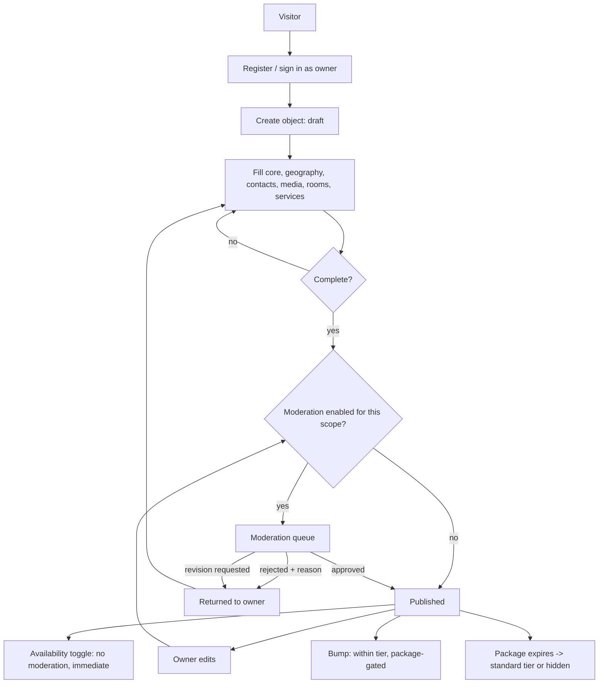

# Object Onboarding & Owner Cabinet

**Version:** 1.2.0
**Status:** RFC
**Layer:** concept

## Overview

Everything an object owner does: registering, submitting an object, and then running
it day to day from a private cabinet — editing information, managing photos, rooms,
prices and services, publishing news and promotions, replying to reviews, toggling
availability, bumping the object, reading statistics, and receiving notifications.
Derived from `[TZ]` §3 (Владелец объекта), §8, §29–§43.

[MODIFIED — v1.0.0] Renamed from `l1-property-onboarding.md` and widened from a
one-shot intake form to the full owner lifecycle. `[TZ]` dedicates fifteen sections
to the cabinet; intake is the first screen of it, not the whole of it.

## Related Specifications

- [l1-platform-foundation.md](l1-platform-foundation.md) - Actor-role, moderation-checkpoint, and configuration-over-code invariants.
- [l1-object-profile.md](l1-object-profile.md) - The public surface this spec's data produces.
- [l1-object-catalog.md](l1-object-catalog.md) - Where a published object appears.
- [l1-availability-status.md](l1-availability-status.md) - The one-tap toggle this cabinet exposes.
- [l1-placement-monetization.md](l1-placement-monetization.md) - Owns the package, position, and bump semantics this cabinet surfaces.
- [l1-moderation-governance.md](l1-moderation-governance.md) - Governs whether an owner edit publishes immediately or enters a queue.
- [l1-content-publishing.md](l1-content-publishing.md) - Owns the news and promotion entities the owner authors.
- [l1-analytics.md](l1-analytics.md) - Supplies the cabinet's statistics.
- [l1-notifications.md](l1-notifications.md) - Delivers expiry, moderation, and staleness messages here.
- [l1-geography.md](l1-geography.md) - Supplies the territory selector in the object form.
- [l1-localization.md](l1-localization.md) - The cabinet has its own language setting, independent of the site language.
- [l1-feature-modules.md](l1-feature-modules.md) - [ADDED] Determines which optional cabinet sections exist.
- [l1-room-reservation.md](l1-room-reservation.md) - [ADDED] Optional module contributing the calendar, rates, and booking-request sections.

## 1. Motivation

Every object in the catalog is maintained by someone who is not a portal employee and
who has no technical training (`[TZ]` §29.1). The cabinet's usability is therefore a
data-quality mechanism, not a convenience: information the owner cannot easily update
becomes stale information, and `[TZ]` §52 treats stale objects as a defect the portal
must actively police.

The cabinet is specified separately from the public profile because it has a
different actor, a different concern (completeness and freshness, not conversion),
and a different failure mode — a confusing cabinet degrades the whole catalog
silently.

## 2. Constraints & Assumptions

- An owner sees only their own objects and never another owner's data (`[TZ]` §29.1).
- One user may own several objects, with fast switching between them (`[TZ]` §30);
  one object may have a primary owner plus staff and limited-permission managers
  (`[TZ]` §72).
- Whether an edit publishes immediately or enters a moderation queue is a
  configured setting, not a property of this flow
  ([l1-moderation-governance.md](l1-moderation-governance.md) §5.1).
- The cabinet must be usable without technical knowledge; it is not a CMS
  (`[TZ]` §29.1).
- <!-- TBD: [TZ] "Дополнительные предложения" proposes a no-code page builder for
     owners. It is listed as a competitive enhancement, not a requirement, and it
     conflicts with §25's "all packages have identical page capability" unless every
     package gets it. Recorded as a candidate for a later spec, not scoped here. -->

## 3. Core Invariants (Layer 1 only)

- **Ownership attribution.** Every object carries the account that owns it, from the
  moment of first save. Attribution is what makes moderation feedback, notifications,
  statistics, and access control possible at all.
- **Isolation.** An owner's read and write access is confined to objects they own or
  staff. This is enforced server-side per request, never by hiding controls.
- **Draft before publication.** An object may be saved incomplete. It becomes
  eligible for publication only when complete, and becomes publicly visible only
  after clearing the moderation checkpoint if one applies to its scope.
- **Rejection is actionable.** A rejected submission or edit returns to the owner with
  a stated reason, editable and resubmittable (`[TZ]` §49).
- **Capability does not vary by package.** Every cabinet function except bumping is
  available to every owner regardless of placement package (`[TZ]` §25, §55). Bumping
  is the single package-gated capability (`[TZ]` §41). [ADDED — v1.1.0] Feature
  modules are a *separate and orthogonal* axis: a module gate is set by the
  administrator for operational reasons, never sold as part of a placement package.
  Conflating the two would reintroduce capability tiering through the back door.
- **Module participation is opt-in for the owner** [ADDED — v1.1.0]. Administrator
  activation of a module makes a capability *available*; it never enrolls an owner's
  object automatically. An owner who does not want to maintain a booking calendar
  keeps the contact-only cabinet unchanged.
- **One-tap availability.** Toggling the availability status requires no form and no
  save step ([l1-availability-status.md](l1-availability-status.md)).
- **Owner-authored content is owner-scoped.** News and promotions an owner publishes
  are attributed to their object and may enter portal-wide feeds only after
  moderation (`[TZ]` §12, §37).
- **Reviews are read-and-reply only.** An owner may reply and may report, never edit
  or delete (`[TZ]` §39).
- **Coordinates are required.** Location data must resolve to coordinates, not free
  text, so the object can be mapped ([l1-object-catalog.md](l1-object-catalog.md)
  §5.4).

## 5. Detailed Design

### 5.1 Cabinet Structure

Per `[TZ]` §30, the cabinet menu is:

```plaintext
Dashboard          -> §5.2
My objects          (switcher when the owner has several)
Edit object        -> §5.3
Photos             -> §5.4
Rooms              -> §5.5   (accommodation types only)
Prices             -> §5.5
Services           -> §5.6
Promotions         -> l1-content-publishing
News               -> l1-content-publishing
Reviews            -> §5.7
Statistics         -> l1-analytics   (includes favorite count, §5.6a)
Bump object        -> l1-placement-monetization
Settings           -> §5.8
Sign out
```

Menu entries are filtered by the object's type declaration, by the owner's
permissions, and [ADDED — v1.1.0] by active feature modules: a restaurant owner sees
no Rooms entry; a staff member with limited rights sees only what they may act on;
and where the optional booking module
([l1-room-reservation.md](l1-room-reservation.md)) is active and the owner has opted
in, four further entries appear — Calendar, Rates, Booking requests, and Booking
settings. Those entries are absent, and their routes rejected, everywhere else
([l1-feature-modules.md](l1-feature-modules.md) §3).

### 5.2 Dashboard

Per `[TZ]` §31, the landing screen shows: object name, active placement package,
placement expiry date, current tier, current catalog position, view counts (today /
week / month / all time), messenger click counts, website click counts, and the
availability status. Quick actions: edit object, bump object, add photos, add news,
add promotion.

The dashboard is where the owner learns their package is expiring, so it is a
notification surface as much as a metrics surface
([l1-notifications.md](l1-notifications.md)).

### 5.3 Object Editing

Per `[TZ]` §32, grouped into:

```plaintext
Core            name · short description · full description · object type
Geography       country · region · district · city · resort · address · coordinates
Contacts        phone · secondary phone · Viber · Telegram · WhatsApp ·
                Messenger · Instagram · Facebook · website · email
Availability    one-tap toggle          -> l1-availability-status
Translations    per-language text fields -> l1-localization
SEO             per-language SEO fields  -> l1-seo
```

The field set rendered is the one declared by the object's type
([l1-object-catalog.md](l1-object-catalog.md) §5.5). The form warns before
discarding unsaved changes (`[TZ]` §132).

### 5.4 Media Management

Per `[TZ]` §33 the owner may upload, delete, reorder, caption, and select a primary
photo. Uploads are optimized automatically for delivery (`[TZ]` §33); the owner is
never asked to resize anything. Upload limits and permitted dimensions are portal
settings (`[TZ]` §130), not constants.

### 5.5 Rooms & Prices

Accommodation types only. Room categories are unbounded in number (`[TZ]` §34); each
carries name, description, photos, capacity, room count, area, bed configuration,
maximum guests, extra-bed option, amenities, price, and currency (`[TZ]` §34, §76).

Prices are period-aware records (`[TZ]` §35, §77): per night, per room, per person,
per service, or "from", with optional seasonal windows. Changes appear publicly as
soon as they are saved and any applicable moderation clears (`[TZ]` §35).

### 5.6 Services

The owner selects from the portal's amenity registry; they do not invent entries.
The registry is administrator-maintained and grouped (general, grounds, catering,
rooms, pool and SPA, family, business, transport, accessibility, pets) per
`[TZ]` §36, §78, §110. Only the groups applicable to the object's type are offered.

### 5.6a Favorites [ADDED — v1.2.0]

`[TZ]` §8 lists "Избранное" among the owner cabinet's capabilities without
elaborating. It is modelled as a **visitor-facing favorite** whose count the owner
sees, not as an owner-side bookmark: an owner already reaches their own objects
through the object switcher (§5.1), so a bookmark would be redundant, while a favorite
count is a genuine demand signal alongside views and contact clicks.

The owner sees the favorite count for each of their objects in the dashboard (§5.2)
and in statistics ([l1-analytics.md](l1-analytics.md) §5.4). They cannot see who
favorited an object — that would be visitor personal data the portal has no reason to
expose ([l1-platform-foundation.md](l1-platform-foundation.md) §3.7).

Because the portal has no visitor accounts in its default configuration, favorites are
browser-scoped and anonymous; they become account-scoped and cross-device only if the
`guest_accounts` module is activated
([l1-feature-modules.md](l1-feature-modules.md) §5.2). Storage shape and the open
question are in [l2-data-model.md](l2-data-model.md) §5.5.

### 5.7 Reviews

The owner sees all reviews of their object, may reply once per review, and may report
a violation to the administration. Deletion and editing are unavailable — the control
is absent *and* the action is refused server-side (`[TZ]` §39).

### 5.8 Settings & Notifications

Per `[TZ]` §42: change password, change cabinet language (independent of the browsing
language), change contact email, enable or disable notifications, configure receipt
of administration messages.

Per `[TZ]` §43, the cabinet displays notifications for: placement expiry, package
expiry, administration messages, information-refresh requests, moderation outcomes,
and system messages. All notifications persist in a history
([l1-notifications.md](l1-notifications.md)).

### 5.9 Object Lifecycle



The availability toggle branches around moderation deliberately: `[TZ]` §27.3
requires the change to take effect immediately, which a review queue would prevent.

### 5.10 Staleness

If an owner does not update an object for a configured period (90 / 180 / 365 days
per `[TZ]` §52), the system raises a reminder to the owner and flags the object in
the back office. An administrator may temporarily hide an object until the owner
confirms its information is current (`[TZ]` §52). The flag is advisory to the owner
and actionable by the administrator — it never hides an object automatically.

## 6. Implementation Notes

1. Ownership scoping is a server-side authorization concern on every read and write,
   including media uploads and statistics queries. Filtering a list client-side is
   not scoping.
2. Build the object form from the type's declared field set from the outset. A form
   hard-coded to accommodation fields would have to be rewritten for the first
   restaurant.
3. The availability toggle needs its own narrow write path that skips moderation and
   invalidates catalog caches immediately — do not route it through the general
   object-edit path.
4. Owner-authored news and promotions reuse the entities in
   [l1-content-publishing.md](l1-content-publishing.md); do not create parallel
   owner-scoped content types.

## 7. Drawbacks & Alternatives

**A single long intake form, as the Figma frame drew it.** Adequate for a one-time
hotel submission and inadequate for a cabinet an owner returns to weekly. Superseded
by `[TZ]` §29–§43, which specify a sectioned, task-oriented cabinet.

**Letting owners define their own amenities as free text.** Faster for the owner and
fatal to the filter facets in [l1-object-catalog.md](l1-object-catalog.md) §5.1 —
free-text services cannot be filtered, translated, or iconified. `[TZ]` §36 settles
it: the registry is administrator-owned.

**Publishing every owner edit immediately, with post-hoc review.** Lower friction and
rejected as the default because `[TZ]` §44 requires the choice to be configurable per
portal, country, category, owner, and object — a fixed answer either way contradicts
the requirement.

## Canonical References

| Alias | Path | Purpose |
| --- | --- | --- |
| `[TZ]` | `.drafts/booking.md` | §3, §8, §29–§43, §52 — source requirements. |
| `[FIGMA-ADD-HOTEL]` | `https://www.figma.com/design/N2cVVIS5wvjHIviP27peuX/Booking?node-id=234-5704` | Intake form visual language. |

## Document History

| Version | Date | Change |
| --- | --- | --- |
| 0.1.0 | 2026-07-30 | Initial draft derived from the add-hotel form frame (as `l1-property-onboarding.md`). |
| 0.2.0 | 2026-07-30 | Resolved owner-account gate + admin moderation queue. |
| 1.0.0 | 2026-08-05 | Major: renamed to `l1-object-onboarding.md`; widened from an intake form to the full owner cabinet (dashboard, media, rooms, prices, services, reviews, settings, notifications, staleness); generalized to type-declared field sets; added multi-object ownership, staff roles, and the package-independent-capability invariant. |
| 1.1.0 | 2026-08-05 | Minor: added module-gated cabinet sections (calendar, rates, booking requests, booking settings), the owner opt-in invariant, and the separation of module gating from placement-package capability. |
| 1.2.0 | 2026-08-05 | Minor: added §5.6a Favorites, closing the `[TZ]` §8 "Избранное" gap found during the second requirements pass — modelled as a visitor-facing favorite whose count the owner sees, not an owner-side bookmark. |
