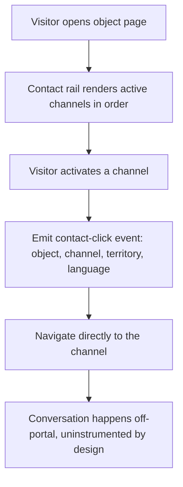
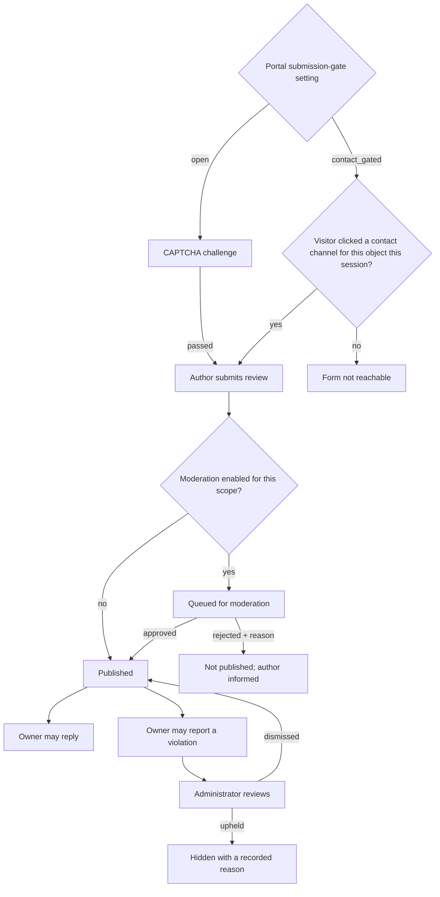

# Object Profile

**Version:** 1.3.0
**Status:** RFC
**Layer:** concept

## Overview

The public page of a single tourism object: media, description, type-specific detail
(rooms and prices for accommodation, cuisine and hours for dining), services,
location, house rules, nearby objects and attractions, the object's own news and
promotions, reviews, and — the page's conversion mechanic — direct contact channels
into the owner's phone and messengers. Derived from `[TZ]` §6–7, §26, §39, §74,
§76–78, §87.

[MODIFIED — v1.0.0] Renamed from `l1-hotel-profile.md` and re-centred. The
conversion action is no longer a paid reservation; it is a direct hand-off to the
owner with no intermediary (`[TZ]` §7, §General Information). Contact channels are
therefore promoted from a footnote to the page's primary contract.

## Related Specifications

- [l1-platform-foundation.md](l1-platform-foundation.md) - Direct-contact, no-booking, media-resilience, and type-varying-attribute invariants.
- [l1-object-catalog.md](l1-object-catalog.md) - Upstream entry point into this page.
- [l1-object-onboarding.md](l1-object-onboarding.md) - Produces and maintains everything this page renders.
- [l1-availability-status.md](l1-availability-status.md) - Owns the "vacancies available" badge shown here.
- [l1-geography.md](l1-geography.md) - Supplies the breadcrumb trail and the nearby-objects scope.
- [l1-content-publishing.md](l1-content-publishing.md) - Supplies the object's news and promotion feeds.
- [l1-analytics.md](l1-analytics.md) - Consumes every view and contact-click event this page emits.
- [l1-advertising.md](l1-advertising.md) - Injects banner slots and renders the object's placement badge.
- [l1-localization.md](l1-localization.md) - All descriptive text on this page is translated content.
- [l1-seo.md](l1-seo.md) - This page is the portal's deepest indexable surface.
- [l1-feature-modules.md](l1-feature-modules.md) - [ADDED] Determines which optional sections this page composes.
- [l1-room-reservation.md](l1-room-reservation.md) - [ADDED] Optional module adding a booking panel alongside the contact rail.
- [l2-third-party-integrations.md](l2-third-party-integrations.md) - [ADDED — v1.3.0] Supplies the CAPTCHA mechanism the review-submission gate invokes in its `open` mode (§5.5).

## 1. Motivation

Everything upstream — catalog, territory pages, search, banners — exists to deliver a
visitor here, and this page has exactly one job: give the visitor enough to decide,
then hand them to the owner. `[TZ]` states the portal's whole value proposition in
one sentence ("give the user the fullest possible information about an object and
provide direct contact with its owner, without intermediaries or commission"), and this page is
where both halves of it happen.

Because there is no booking funnel to measure, **the contact click is the conversion
event**. That makes contact-channel rendering and its instrumentation
([l1-analytics.md](l1-analytics.md)) load-bearing rather than incidental — an
untracked messenger link is a lost conversion metric with no second chance to
capture it.

## 2. Constraints & Assumptions

- The page aggregates data owned by several other specs (rooms, prices, services,
  news, promotions, reviews, availability). Its own scope is aggregation and
  presentation, not the underlying mechanics.
- Section presence is driven by the object's type declaration
  ([l1-object-catalog.md](l1-object-catalog.md) §5.5): a restaurant page has no room
  inventory and no availability badge.
- `[TZ]` §87 makes the review module conditional ("if the review module is
  enabled"). Reviews are specified here as an optional, portal-configurable module.
- **Review authorship is itself a portal setting, not a fixed policy.** `[TZ]` §87
  stores "user or author name", which permits both a registered visitor and a named
  guest with no account; the project owner's decision is that this stays an
  administrator-configurable choice rather than one baked into the spec — a portal
  setting selects whether a review requires a registered visitor or accepts a named
  guest, defaulting to permitting a guest author, matching the reviews table's own
  schema (`author_id` nullable, `author_name` carries the guest-supplied name), which
  needed no migration to support either mode.
- **Submission gating is a second, independent portal setting — resolved
  [ADDED — v1.3.0].** Authorship (above) decides *who may be named* on a review;
  gating decides *what a visitor must have done* to reach the submission form at all,
  and the two do not collapse into one setting because they answer different threats.
  A directory with no transactional record to check against (no completed stay, no
  purchase — [l1-platform-foundation.md](l1-platform-foundation.md) §3.5) cannot gate
  on "verified stay" the way a booking platform does, so the choice is between the two
  mechanisms that remain viable for this shape of product, and the project owner's
  decision is that both ship as selectable modes rather than one being picked for the
  client:
  - `open` — anyone may reach the form; abuse resistance is a CAPTCHA challenge at
    submission ([l2-third-party-integrations.md](l2-third-party-integrations.md)
    §5.5) plus the moderation queue every review already passes through (§3.4). The
    launch default: it costs nothing in friction for a catalog that needs review
    volume more than it needs to filter visitors who never clicked anything.
  - `contact_gated` — the form is reachable only once the current visitor has
    activated at least one contact channel for *that object* in the current session
    (§3.1's contact-click event is the trigger; no new tracking record is added — a
    session-scoped flag, not a stored visitor identifier, keeping `[TZ]` §89's
    minimal-data principle). No CAPTCHA challenge applies in this mode — the click
    gate is the friction, and stacking a second one on top of it is not a stronger
    guarantee, since a click is already the weaker of the two signals to fake.
  - The setting is a single portal-wide value at launch, not scoped per country or
    per category — `[TZ]` §39/§87/§120 describe no such scoping for reviews
    specifically, unlike moderation mode ([l1-moderation-governance.md](l1-moderation-governance.md)
    §3.1), which does. Finer scoping is deferred until a reason to add it appears.
  - The setting's storage key and its enforcement point belong to whichever phase
    builds the review-submission flow — no public submission surface exists in this
    codebase yet; only owner-reply, owner-report, and administrator moderation act on
    an existing review (§3.4, §5.4).
  - **The gate is enforced server-side, always** — the same posture this project
    applies to every other authorization decision. Hiding the submission form from a
    visitor who has not clicked a contact channel is a usability affordance; the
    write endpoint itself refuses a submission that does not carry a genuine
    server-recorded contact-click event for that object and session, not merely one
    whose client-side form happened to be reachable.
  - <!-- TBD: an object with no active contact channel at all makes `contact_gated`
       mode permanently unreachable for that object — no click can ever occur. Left
       open because the right answer depends on how common a channel-less object is
       expected to be in practice: falling back to `open` mode for that one object,
       or accepting the object simply cannot collect reviews until it has a working
       contact, are both defensible and the choice is a product one, not an
       architectural one. -->

## 3. Core Invariants (Layer 1 only)

### 3.1 Contact (the conversion contract)

- Contact channels are **first-class, ordered, per-object records**, not fixed
  columns. The observed set is phone, secondary phone, Viber, Telegram, WhatsApp,
  Messenger, Instagram, Facebook, email, official website, and other social networks;
  the set must be extensible without a schema change (`[TZ]` §74).
- The system constructs the correct deep link for each channel from its raw value —
  the owner enters a phone number, not a `viber://` URI (`[TZ]` §74).
- Activating a contact channel takes the visitor **directly** to that channel. The
  portal does not proxy, relay, mask, or intermediate the conversation, and takes no
  commission on what follows (`[TZ]` §General Information, §7).
- Contact channels remain functional regardless of the object's availability status,
  and regardless of its placement tier (`[TZ]` §26, §27.1).
- **Contact is never displaced** [ADDED — v1.1.0]. If the optional booking module
  ([l1-room-reservation.md](l1-room-reservation.md)) is activated for this object, its
  booking panel is rendered **alongside** the contact rail, not in place of it, and
  the contact rail keeps its above-the-fold position. No module may remove, demote,
  or intermediate the direct-contact path
  ([l1-feature-modules.md](l1-feature-modules.md) §3) — it is the portal's
  proposition, not a fallback for when booking is unavailable.
- Every contact activation is a measured event attributed to the object and the
  channel ([l1-analytics.md](l1-analytics.md)).

### 3.2 Composition

- The page renders, subject to type declaration: cover, gallery, video, description,
  type-specific information, contacts and messengers, map, rooms, prices, services,
  infrastructure, house rules, nearby objects, promotions, news, reviews, and similar
  objects (`[TZ]` §7).
- **Every section degrades independently.** An object with no reviews, no news, no
  video, or a partial gallery still renders a complete, usable page. No section is a
  hard dependency of page render.
- The page carries its territory breadcrumb, and every breadcrumb node links to that
  territory's landing page ([l1-geography.md](l1-geography.md)).
- Page capability does not vary by placement package. Photo count, contact count,
  description length, services, news, and promotions are identical across all
  packages (`[TZ]` §25, §55). The package changes the object's *position and badge*,
  not what its page can hold.

### 3.3 Rooms & Prices (accommodation types only)

- A room belongs to exactly one object. The number of room categories is unbounded
  (`[TZ]` §34).
- A room exposes: name, description, photos, capacity, room count, area, bed
  configuration, maximum guests, extra bed, amenities, and price
  (`[TZ]` §34, §76).
- **No occupancy calendar exists in the default configuration.** The portal does not
  track which dates a room is taken, and offers no date picker on this page
  (`[TZ]` §76). [MODIFIED — v1.1.0] A calendar and a date picker appear only where the
  optional booking module is active for the object
  ([l1-room-reservation.md](l1-room-reservation.md) §5.5); elsewhere this statement
  holds literally.
- Prices are period-aware records, not a single number: each carries a type, amount,
  currency, calculation unit (per room / per person / per night / per service /
  "from"), an optional validity window, and a comment (`[TZ]` §77). A page may render
  "from {amount}".

### 3.4 Reviews (optional module)

- A review carries rating, text, author, date, an optional owner reply with its own
  date, moderation status, and complaint records (`[TZ]` §87).
- **An owner may reply to a review and may report it, but may never delete or edit
  it** (`[TZ]` §39, §87). Removal is an administrator action with a recorded reason
  (`[TZ]` §120).
- Reviews pass the moderation checkpoint before publication
  ([l1-moderation-governance.md](l1-moderation-governance.md)).
- **Reaching the submission form is itself gated by a portal setting** [ADDED —
  v1.3.0], independent of the moderation checkpoint that follows it — see §2's
  submission-gating decision. A submitted review always enters the moderation
  checkpoint regardless of which gate admitted it; the setting controls who may
  submit, never whether what they submit is reviewed.
- The page shows an aggregate score plus itemized reviews; an object with zero
  reviews renders without an empty review block.

## 5. Detailed Design

### 5.1 Page Composition

```plaintext
Breadcrumb: country › region › district › city / resort › object
Cover + placement badge + availability badge
Gallery (photos, video, panoramas)
Name · type · category/stars · rating · settlement
Contact rail (sticky on desktop, pinned on mobile)   -> §5.2
Short description
Full description
Type-specific block:
  accommodation → rooms · prices · catering · house rules
  dining        → cuisine · average cheque · opening hours
  attraction    → visiting information
Services & infrastructure (grouped, icon-tagged)
Location: address · map · directions · nearby attractions
Banner slot                                          -> l1-advertising
Object promotions                                    -> l1-content-publishing
Object news                                          -> l1-content-publishing
Reviews: aggregate + itemized + owner replies        -> §5.4
Nearby objects
Similar objects
```

The contact rail is deliberately placed above the fold and persistent. It is the
page's conversion element; burying it below a long description would be a design
error, not a stylistic choice.

### 5.2 Contact Channel Model

```plaintext
ContactChannel
├── object          -> Object
├── type            -> ContactChannelType   (registry, not an enum in code)
├── raw value       (phone number, handle, URL, address)
├── derived link    (constructed per type — see below)
├── label           (translated)
├── display order
└── active flag

ContactChannelType
├── key             (phone, viber, telegram, whatsapp, messenger,
│                    instagram, facebook, email, website, …)
├── icon
├── link template   (how a raw value becomes an actionable link)
├── active flag
└── translations    -> display name
```

Modelling the *type* as a registry rather than an enum is what makes `[TZ]` §74's
"other social networks" and §64's channel extensibility true without a migration.
The link template lives with the type, so adding a channel is one data row.

### 5.3 Contact Interaction Flow



The event is emitted before navigation and must not delay it — a measurement failure
may never cost the visitor the hand-off it exists to measure.

Step F is stated explicitly because it is a product decision, not an omission: the
portal deliberately has no visibility into what happens after the hand-off. This is
what "without intermediaries or commission" costs, and it is why the click itself is the only
conversion signal the portal will ever have.

### 5.4 Review Lifecycle



The gate (`Z`) and the moderation checkpoint (`B`) are independent controls answered
by two different settings — see §2. A mode change never bypasses moderation, and a
moderation-mode change never bypasses the submission gate.

### 5.5 Media

Per `[TZ]` §75, an object's media set spans photos, a logo, video, panoramic images,
and optionally documents. Each asset carries type, path, thumbnail, title,
per-language caption, author, a primary flag, display order, moderation status, and
upload date. Media is optimized on upload for delivery
(`[TZ]` §33) and is archived with the object rather than destroyed when the object is
deleted (`[TZ]` §75, §95).

## 6. Implementation Notes

1. Build the contact rail and its instrumentation together, in the same task. A
   shipped contact link with no event is a permanently lost metric — unlike most
   analytics gaps, it cannot be backfilled.
2. Render the page from one type-aware composition, not from a branch per type.
   Adding an object type must not require editing this page.
3. This page is the portal's most-linked and most-crawled surface. Its cache key
   includes language, and it must be invalidated by an availability toggle, a
   moderation approval, a price edit, and a news or promotion publication.
4. Reuse the article component from
   [l1-content-publishing.md](l1-content-publishing.md) for the news and promotion
   feeds rather than authoring a bespoke one.

## 7. Drawbacks & Alternatives

**A platform-mediated contact form instead of direct messenger links.** Standard
marketplace practice: it captures the lead, measures the funnel end to end, and
protects the relationship. Rejected because it is precisely the intermediation
`[TZ]` rules out — the portal's stated proposition is direct, commission-free
contact. The cost is accepted knowingly: the portal measures the click and nothing
beyond it.

**Fixed contact columns on the object table.** Simpler, and how `[TZ]` §32 informally
describes the owner's edit form. Rejected on §74's own requirement for a separate
contacts table with ordering and extensibility — a column-per-channel model cannot
express "other social networks" or per-channel ordering.

**Reviews as their own top-level domain with a dedicated queue.** Defensible, and
deferred: `[TZ]` §87 makes the module optional, so folding it into this page keeps
the optionality cheap. Revisit if review volume justifies its own moderation
tooling.

## Canonical References

| Alias | Path | Purpose |
| --- | --- | --- |
| `[TZ]` | `.drafts/booking.md` | §6–7, §26, §39, §74–78, §87 — source requirements. |
| `[FIGMA-HOTEL]` | `https://www.figma.com/design/N2cVVIS5wvjHIviP27peuX/Booking?node-id=85-2` | Object page layout (desktop). |
| `[FIGMA-HOTEL-MOBILE]` | `https://www.figma.com/design/N2cVVIS5wvjHIviP27peuX/Booking?node-id=85-854` | Object page layout (mobile). |

## Document History

| Version | Date | Change |
| --- | --- | --- |
| 0.1.0 | 2026-07-30 | Initial draft derived from Figma hotel-page frames (as `l1-hotel-profile.md`). |
| 0.2.0 | 2026-07-30 | Resolved review-authorship via l2-third-party-integrations.md. |
| 1.0.0 | 2026-08-05 | Major: renamed to `l1-object-profile.md`; replaced the reservation conversion path with the direct-contact contract (§3.1, §5.2, §5.3); generalized to type-varying composition; added period-aware prices, the no-occupancy-calendar constraint, owner review replies, and the media model. |
| 1.1.0 | 2026-08-05 | Minor: scoped the no-occupancy-calendar constraint to the default configuration and added the contact-is-never-displaced invariant, so an activated booking module composes additively rather than replacing the page's conversion path. |
| 1.2.0 | 2026-08-22 | Minor: closed §2's inline TBD on review authorship — the project owner's decision is that it stays an administrator-configurable portal setting (registered visitor vs. named guest), not a fixed policy; the schema already supports either mode with no migration. `Status: RFC → Stable`. |
| 1.1.1 | 2026-08-05 | Patch: translated quoted `[TZ]` excerpts from Russian to English per the project's language policy; no meaning changed. |
| 1.3.0 | 2026-08-23 | Minor: added the submission-gating invariant (§2, §3.4, §5.4) — a second, independent portal setting alongside review authorship, resolving the open question a QA sweep raised (`open` + CAPTCHA vs. `contact_gated`, both shipped as selectable modes rather than one being chosen for the client). Cross-references `l2-third-party-integrations.md` §5.5 for the `open`-mode CAPTCHA mechanism, added to Related Specifications. `Status: Stable → RFC` per the amendment rule — substantive new requirement, not a typo. |
