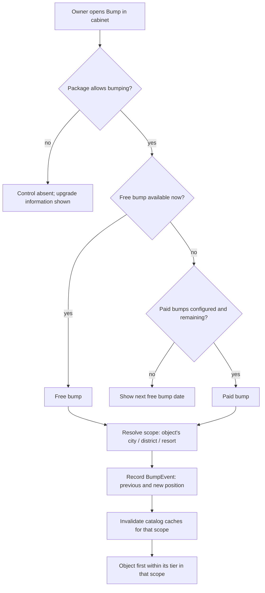
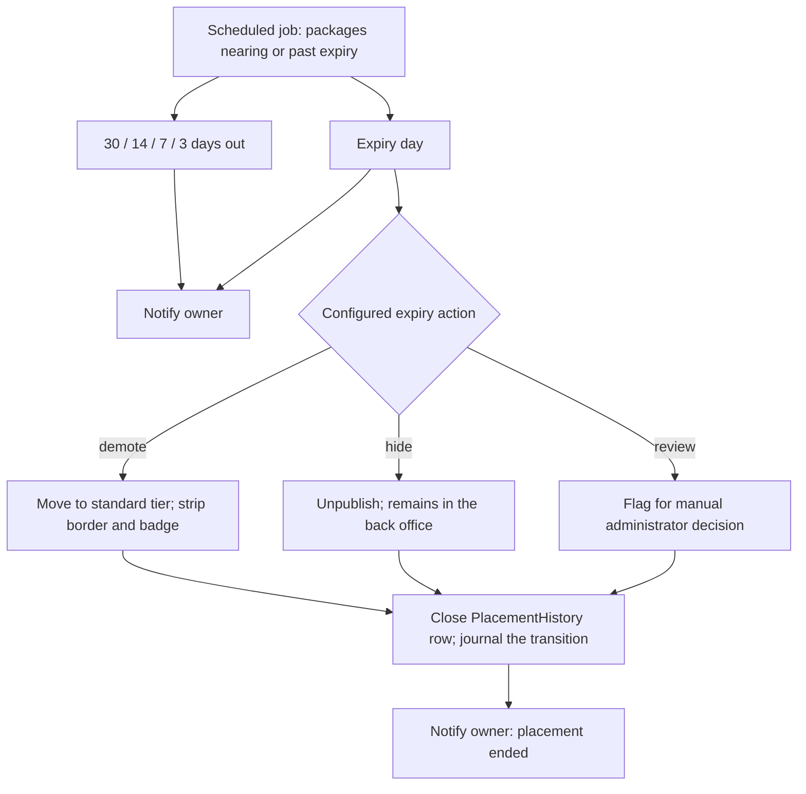

# Placement & Monetization

**Version:** 0.1.1
**Status:** RFC
**Layer:** concept

## Overview

How the portal earns: four placement tiers that determine an object's position in
every catalog, administrator-defined packages that grant a tier for a period, the
bump mechanic that reorders an object within its own tier, package
expiry handling, and the financial ledger that records what was sold. Derived from
`[TZ]` §25, §26, §54–§63, §79–§81, §111–§112, §122–§123.

## Related Specifications

- [l1-platform-foundation.md](l1-platform-foundation.md) - Paid-placement-ordering, package-parity-of-capability, and configuration-over-code invariants.
- [l1-object-catalog.md](l1-object-catalog.md) - Renders the ordering this spec defines.
- [l1-geography.md](l1-geography.md) - Supplies the scopes within which tier ordering and bumps are evaluated.
- [l1-advertising.md](l1-advertising.md) - Sibling revenue stream; owns the badges and border treatments a tier grants.
- [l1-object-onboarding.md](l1-object-onboarding.md) - Surfaces package state and the bump control to the owner.
- [l1-notifications.md](l1-notifications.md) - Delivers the expiry warning schedule.
- [l1-back-office.md](l1-back-office.md) - Hosts package, position, and finance administration.
- [l1-moderation-governance.md](l1-moderation-governance.md) - Journals every package, position, and bump change.
- [l1-analytics.md](l1-analytics.md) - Measures the visibility a package actually delivered.

## 1. Motivation

This is the portal's business model, and it is unusual enough to be worth stating
plainly: the portal sells **position**, not capability. `[TZ]` §25 and §55 are
emphatic — every object gets the same page, the same photo allowance, the same
contacts, the same news and promotions. What money buys is where the object appears
in a list and how its card is decorated.

That constraint is a gift to the architecture. Because packages do not gate features,
there is no permission matrix threading through every surface, no "upgrade to unlock"
logic in the object page, and no risk of a downgrade silently deleting content. The
entire monetization model collapses to three things: a tier on the object, an
ordering rule in the catalog, and a ledger of what was sold.

The one exception — bumping is package-gated (`[TZ]` §41) — is deliberate and
narrow, and is called out as such rather than allowed to grow.

## 2. Constraints & Assumptions

- No guest-facing payment exists. Owners pay the portal operator through channels
  outside the system; the portal records the transaction, it does not process it
  (`[TZ]` §122). A full accounting system is explicitly out of scope
  (`[TZ]` §122).
- `[TZ]` presents the tier scheme twice with different working names (§25 "Premium /
  Priority / Extended / Basic", then §25.1 "VIP / Recommended / Priority Placement /
  Standard"). Both are working names; §25 states they are
  administrator-editable. This spec models **four ranks with editable labels** and
  treats neither naming as canonical.
- Package definitions may differ per object category — hotels, restaurants,
  sanatoria and holiday bases can each have their own package set (`[TZ]` §25.2).
- <!-- TBD: whether an object may hold more than one concurrent paid service (e.g. a
     placement package plus a separately purchased temporary promotion) is implied by
     [TZ] §58's administrator-applied promotions but never stated. Modeled below as
     one active package plus zero-or-more independent promotion grants, which
     satisfies both readings. -->

## 3. Core Invariants (Layer 1 only)

### 3.1 Tiers & Ordering

- **Four ranks exist.** Their labels, badge text, colours, and icons are
  administrator-editable data; their *count and relative order* are structural
  (`[TZ]` §25.1, §60).
- **Rank dominates.** Objects are emitted rank by rank. A lower-ranked object never
  appears above a higher-ranked one (`[TZ]` §25.2).
- **The only override is explicit and journalled.** A chief administrator may pin an
  object to a position; nothing else may violate rank order (`[TZ]` §25.2, §112).
- **Ordering is scope-local.** Rank ordering restarts for every country, region,
  district, city, resort, object category, and search result set (`[TZ]` §25.2).
- **Manual pinning does not change tier.** Pinning an object to a position must not
  silently promote it into another package (`[TZ]` §112).

### 3.2 Package Parity

- A package buys position, card decoration, badge, and bump eligibility — nothing
  else (`[TZ]` §25, §55, §111). Photo count, contact count, description length,
  services, news, and promotions are identical across all packages.
- Bump availability and frequency are the **single** package-varying capability
  (`[TZ]` §41, §79).

### 3.3 Bumping

- A bump moves an object to the first free position **within its own tier**, never
  above it (`[TZ]` §25.3, §26).
- A bump is **scope-specific**: it applies to the city, district, or resort the
  object belongs to, and the system records which scope it acted on
  (`[TZ]` §25.3, §56).
- Bumps are constrained by administrator-set limits: minimum interval between free
  bumps, maximum bump count, price per bump, and bump duration (`[TZ]` §26.2).
- Every bump records object, package, scope, catalog category, timestamp, bump type,
  actor, previous position, new position, price, and comment (`[TZ]` §81, §25.3).
- Bump types are: free, paid, automatic, owner-initiated, administrator-initiated
  (`[TZ]` §81, §26.1).

### 3.4 Lifecycle & Expiry

- A package grant has a start and an end date. Changing a package never deletes the
  previous grant — history is append-only (`[TZ]` §80).
- On expiry the system performs a **configured** action: demote to standard tier,
  strip the border and badge, hide the object, or flag for manual review
  (`[TZ]` §123). The recommended default is demote-and-strip while remaining
  published (`[TZ]` §123).
- Expiry warnings are issued at 30, 14, 7, and 3 days before, on the day, and after
  (`[TZ]` §62). Delivery is owned by
  [l1-notifications.md](l1-notifications.md).
- Every financial record persists: date paid, validity window, package, amount,
  currency, payment method, document number, responsible staff member, status, and
  comment (`[TZ]` §80, §122).

### 3.5 Configurability

- Creating a package, changing its price, renaming it, altering its border colour,
  badge text, validity period, bump frequency, or activating and deactivating it are
  all administrator actions requiring no code change (`[TZ]` §60, §63).
- Package sets may differ per object category (`[TZ]` §25.2).

## 5. Detailed Design

### 5.1 Model

```plaintext
PlacementTier                       PlacementPackage
├── rank            1..4            ├── tier            -> PlacementTier
├── border colour                   ├── object category -> ObjectType (optional)
├── badge colour                    ├── price · currency
├── badge icon                      ├── validity period
├── active flag                     ├── bump allowed
└── translations -> label,          ├── bump interval
                    badge text      ├── free bumps per period
                                    ├── paid bump price
                                    ├── active flag · display order
                                    └── translations -> name

ObjectPlacement (current, on the object)   PlacementHistory (append-only)
├── object       -> Object                 ├── object · package
├── package      -> PlacementPackage       ├── start · end
├── start · end                            ├── amount · currency
├── pinned position (optional)             ├── paid at · payment method
├── internal priority                      ├── document number
└── expiry action override                 ├── status        -> §5.5
                                           ├── granted by    -> Account
                                           └── comment

BumpEvent
├── object · package
├── scope            -> Territory | ObjectType   (which list was bumped)
├── occurred at
├── type             free | paid | automatic | owner | administrator
├── actor            -> Account
├── previous position · new position
├── price
└── comment
```

`BumpEvent.scope` is what makes `[TZ]` §25.3 and §56 true: an object bumped on the
Bukovel page is first among its tier *there*, and unaffected on its region page. The
catalog's ordering reads the most recent bump **for the scope being rendered**
([l1-object-catalog.md](l1-object-catalog.md) §5.3), not a single global timestamp.

### 5.2 Ordering Contract

Restated here as the authoritative source; the catalog spec renders it.

```plaintext
ORDER BY
  tier.rank                              ASC
  placement.pinned_position              ASC NULLS LAST
  bump_for_this_scope.occurred_at        DESC NULLS LAST
  active_promotion_weight                DESC
  placement.internal_priority            DESC
  object.created_at                      DESC
  object.rating                          DESC
  rotation_seed                          ASC   -- optional
```

### 5.3 Bump Flow



Per `[TZ]` §26.2 the cabinet shows the owner: current position, placement tier, last
bump date, next available free bump date, remaining bump count, and a paid-bump
action.

### 5.4 Expiry



The default is `demote` (`[TZ]` §123). `hide` is available and is the harsher
setting — an object that vanishes from the catalog also vanishes from search
engines, so the recommendation exists for a reason.

### 5.5 Financial Ledger

Per `[TZ]` §122, each record carries: object or advertiser, service, package, amount,
currency, payment date, validity period, payment method, document number, comment,
responsible staff member, and status. Statuses are: awaiting payment, paid, partially
paid, overdue, cancelled, granted free of charge.

Per `[TZ]` §61 and §123, the back office reports: active placements, placements
ending in 30 / 14 / 7 / 3 days, expired placements, objects with no term set, free
placements, paid bump counts, and active advertising campaigns. Reports are filterable
by country, period, package, and staff member, and exportable
([l1-back-office.md](l1-back-office.md) §5.7).

This is a **ledger, not a payment system**. It records that money changed hands
elsewhere. Access to it is a distinct permission — `[TZ]` §128 restricts financial
export to specific roles.

## 6. Implementation Notes

1. Model bumps as scoped events from the first migration. A single `last_bumped_at`
   column on the object cannot express `[TZ]` §25.3, and retrofitting scope onto it
   means rewriting the catalog's ordering — the portal's hottest query.
2. Expiry is a scheduled job, not a read-time computation. A read-time check would
   make every catalog query evaluate expiry for every row, and would never fire the
   30/14/7/3-day notifications at all.
3. Package changes, bumps, and pins each invalidate catalog caches for the affected
   scopes. Get the invalidation keys from
   [l1-object-catalog.md](l1-object-catalog.md) §6.3 rather than inventing a second
   scheme.
4. Never let package state influence anything on the object page beyond the badge and
   border. The moment a package gates content, §3.2 is broken and the simplicity that
   makes this model cheap is gone.

## 7. Drawbacks & Alternatives

**Feature-gated packages (more photos, more contacts, video only on premium).** The
industry-standard directory model, and explicitly rejected by `[TZ]` §25 and §55.
Beyond compliance, it is also the more expensive design: it spreads entitlement
checks across every surface and turns every downgrade into a data-retention question.

**A single global bump timestamp.** Much simpler and wrong per `[TZ]` §25.3 — an
object bumped once would jump to the top of its tier on every page in the portal
simultaneously, which is both unsold value and unfair to other advertisers in scopes
the owner did not pay for.

**Integrating a payment gateway for owner self-service purchase.** Genuinely useful
and out of scope: `[TZ]` §122 describes manual, administrator-entered records with
document numbers and responsible staff, and §64 lists online payment as a future
module. When that module arrives
([l1-feature-modules.md](l1-feature-modules.md)), this ledger is the surface it
writes into — the schema here is deliberately shaped to accept it.

**Continuous scoring instead of four discrete tiers.** More flexible for ranking and
far harder to sell: an advertiser buying "VIP" expects a visible, categorical
position, not a coefficient. `[TZ]` §25.1's four ranks are a commercial decision, not
a technical one.

## Canonical References

| Alias | Path | Purpose |
| --- | --- | --- |
| `[TZ]` | `.drafts/booking.md` | §25, §26, §54–§63, §79–§81, §111–§112, §122–§123 — source requirements. |
| `[L1]` | `.design/main/specifications/l1-platform-foundation.md` | Paid-placement-ordering and package-parity invariants. |

## Document History

| Version | Date | Change |
| --- | --- | --- |
| 0.1.0 | 2026-08-05 | Initial draft derived from the client technical specification. |
| 0.1.1 | 2026-08-05 | Patch: translated quoted `[TZ]` tier names and terminology from Russian to English per the project's language policy; no meaning changed. |
