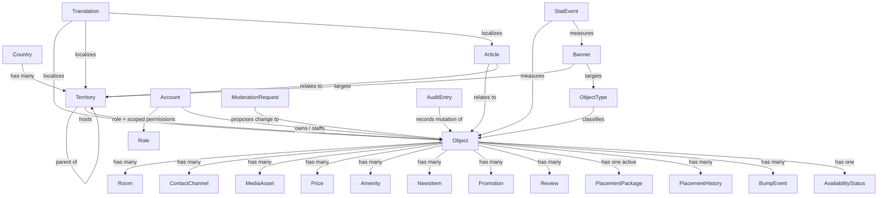

# Platform Foundation

**Version:** 1.4.1
**Status:** RFC
**Layer:** concept

## Overview

Cross-cutting, technology-agnostic requirements that every user-facing surface and
every domain specification in this workspace must satisfy.

[MODIFIED — v1.0.0] This spec was originally derived from a Figma source
(`Booking`, file `N2cVVIS5wvjHIviP27peuX`) that depicted a single-country,
single-language hotel **booking marketplace**. The client subsequently supplied a
formal technical specification (`[TZ]`) describing a materially different product:
a multi-country, multi-language **tourism information portal** that explicitly
does not perform online booking. Where the two sources conflict, `[TZ]` wins; the
Figma file is retained as the source of truth for **visual language and page
composition only**, not for scope, domain model, or business rules.

## Related Specifications

- [l1-localization.md](l1-localization.md) - Country/language model these invariants presuppose.
- [l1-geography.md](l1-geography.md) - Territory hierarchy every object and page is scoped by.
- [l1-object-catalog.md](l1-object-catalog.md) - Consumes discoverability + catalog invariants.
- [l1-object-profile.md](l1-object-profile.md) - Consumes responsive delivery + media + contact invariants.
- [l1-object-onboarding.md](l1-object-onboarding.md) - Consumes moderation + actor-role invariants.
- [l1-availability-status.md](l1-availability-status.md) - Implements the owner-asserted availability invariant.
- [l1-placement-monetization.md](l1-placement-monetization.md) - Consumes the paid-placement ordering invariant.
- [l1-advertising.md](l1-advertising.md) - Consumes the geo/language targeting invariants.
- [l1-moderation-governance.md](l1-moderation-governance.md) - Implements the moderation, audit, and soft-delete invariants.
- [l1-back-office.md](l1-back-office.md) - Implements the actor-role and configurability invariants.
- [l1-analytics.md](l1-analytics.md) - Consumes the privacy-minimal measurement invariant.
- [l1-notifications.md](l1-notifications.md) - Consumes the actor-role invariant.
- [l1-seo.md](l1-seo.md) - Implements the public discoverability invariant.
- [l1-home-page.md](l1-home-page.md) - [ADDED] Composition of the portal's front page.
- [l1-public-api.md](l1-public-api.md) - [ADDED] Outward-facing REST contract, token authorization.
- [l2-data-model.md](l2-data-model.md) - [ADDED] Consolidated table inventory and schema deliverables.
- [l1-content-publishing.md](l1-content-publishing.md) - Consumes discoverability + moderation invariants.
- [l1-platform-shell.md](l1-platform-shell.md) - Consumes localization + responsive delivery invariants.
- [l1-feature-modules.md](l1-feature-modules.md) - [ADDED] Implements the capability-module and configuration-over-code invariants.
- [l1-room-reservation.md](l1-room-reservation.md) - [MODIFIED] Optional, disabled-by-default booking module; the gated exception to the no-booking-at-launch invariant.
- [l2-tech-stack.md](l2-tech-stack.md) - Implements these invariants in a concrete stack.
- [l2-third-party-integrations.md](l2-third-party-integrations.md) - Implements the actor-role, moderation, and infrastructure invariants.

## 1. Motivation

Before any single feature is designed it must be established, once, what every
page owes the platform: how it renders across devices, which of the active languages
it speaks, which of three countries' geography it sits in, whether it must be
discoverable outside the app shell, how a visitor reaches the object's owner, and
how the central entity (the tourism object) relates to everything else.
Duplicating these statements into every domain spec would violate the
no-duplication rule (RULES.md §6).

The v1.0.0 revision exists because the product definition changed, not because the
previous statement of it was wrong for its inputs. Recording the change here — in
one place, with the superseding source named — is what keeps eleven downstream
specs from each carrying their own private theory of what the product is.

## 2. Constraints & Assumptions

- **Source precedence**: `[TZ]` governs scope, domain model, and business rules.
  `[FIGMA]` governs visual language and page composition. Frames belonging to an
  unrelated reference document ("Gift Ideas", node prefix `1306:*`) remain out of
  scope.
- **The portal brokers information, not transactions.** No guest-facing money
  movement exists in this release. Revenue is business-to-business: object owners
  purchase placement (see [l1-placement-monetization.md](l1-placement-monetization.md)).
- Launch geography is Moldova, Ukraine, and Georgia. [MODIFIED — v1.2.0] Launch
  languages are **English and Russian only**; Romanian, Ukrainian, and Georgian are
  activated from the back office after the project is complete
  ([l1-localization.md](l1-localization.md) §5.6). Neither list is closed — see the
  extensibility invariant in §3. No specification, schema, or template may encode
  either count: the reduced launch set is a content decision, and the difference
  between two active languages and five must be visible only in data.
- [MODIFIED — v1.4.0] **Deployment is resolved: self-hosted.** `[TZ]` §22 lists Redis,
  queues, cron, and file storage as server requirements, and §97/§131 require database
  and media backups with an administrator-triggered restore procedure — which wants
  direct control of backup destinations. See
  [l2-tech-stack.md](l2-tech-stack.md) §5.10. This closes the last constraint that
  blocked the storage, queue, and mail selections.

## 3. Core Invariants (Layer 1 only)

### 3.1 Delivery

- **Responsive parity**: every user-facing page has a defined presentation on
  phone, tablet, laptop, and desktop; a feature is not complete until all four are
  specified (`[TZ]` §20). The back office is exempt from phone parity — it must
  work on desktop and tablet, with mobile limited to urgent actions (`[TZ]` §132).
- **Media resilience**: photo/video-heavy pages must remain usable when images
  load slowly or fail; content structure must not depend on every asset resolving.
- **Performance as a requirement, not a goal**: catalog and territory pages must
  remain fast at full data scale — caching, lazy loading, and image derivatives are
  in scope from the first release, not deferred optimizations (`[TZ]` §18, §94).

### 3.2 Reach

- **Localization-completeness**: every user-facing string *and every content-bearing
  entity* is translatable. No template, URL scheme, or data model may assume a
  single language. Mechanism: [l1-localization.md](l1-localization.md).
- **Public discoverability**: catalog, object-profile, territory, article, news,
  and promotion pages are independently addressable, crawlable, and shareable
  without an authenticated session — they are the portal's acquisition surface.
  Mechanism: [l1-seo.md](l1-seo.md).
- **Geographic scoping**: every object, banner, article, and catalog view is
  addressable through a territory hierarchy of arbitrary depth whose level names
  differ per country. Mechanism: [l1-geography.md](l1-geography.md).

### 3.3 Domain

- **Object as the central entity**: the portal catalogs *tourism objects* —
  accommodation, dining, entertainment, attractions, and services alike. "Hotel" is
  one object **type**, not the domain. The type registry is administrator-managed
  data, not code: a new type must be creatable without a developer (`[TZ]` §69).
- **Type-varying attributes**: different object types expose different field sets
  (an accommodation has rooms and an availability status; a restaurant has cuisine,
  average cheque, and opening hours). The data model must express this without a
  schema migration per new type (`[TZ]` §109).
- **Object/room hierarchy**: a room belongs to exactly one object; an accommodation
  object exposes zero or more rooms. No room may exist without a parent object.
- **No online booking at launch** [MODIFIED — v1.1.0]: in its default configuration
  the portal does not hold inventory, maintain an occupancy calendar, or take a
  reservation, and availability is a single owner-asserted flag
  ([l1-availability-status.md](l1-availability-status.md)) rather than a computed
  vacancy. Booking is not absent from the architecture, however — it exists as a
  **disabled-by-default module** ([l1-room-reservation.md](l1-room-reservation.md))
  that an administrator may activate, satisfying `[TZ]` §64's requirement that
  online booking be reachable "as a separate module" without an architectural
  rewrite. While that module is off, every statement in this invariant holds
  literally and is enforced server-side
  ([l1-feature-modules.md](l1-feature-modules.md) §3).
- **Direct contact**: the conversion action on every object is a direct channel to
  its owner — phone, messenger, social profile, website, or email — with no
  intermediary, commission, or platform-mediated conversation
  ([l1-object-profile.md](l1-object-profile.md)).

### 3.4 Governance

- **Actor roles**: the system distinguishes anonymous visitors (who need no
  account), object owners and their staff, and a graduated set of portal
  administrators. Every privileged action is checked against a permission that may
  itself be scoped to a country, region, or object category
  ([l1-back-office.md](l1-back-office.md) §5.2).
- **Configurable moderation checkpoint**: content originating from an external
  actor may pass a moderation checkpoint before becoming publicly visible. Whether
  it does is a **setting**, resolvable per portal, per country, per object
  category, per owner, and per object — not a hard-coded behavior
  ([l1-moderation-governance.md](l1-moderation-governance.md) §5.1).
- **Soft deletion**: primary records (objects, users, news, promotions, banners) are
  never physically removed by an ordinary delete. They move to an archive,
  remain visible to the chief administrator, and are restorable. Only the chief
  administrator may destroy data permanently (`[TZ]` §95).
- **Accountability**: every privileged mutation is recorded with actor, timestamp,
  target, and before/after values, in a journal that ordinary administrators cannot
  edit or erase ([l1-moderation-governance.md](l1-moderation-governance.md) §5.4).

### 3.5 Commerce

- **Paid placement determines order**: catalog ordering is governed first by the
  object's purchased placement tier, and only then by within-tier criteria. A
  lower-tier object never outranks a higher-tier one except by explicit
  administrator override ([l1-placement-monetization.md](l1-placement-monetization.md)).
- **Package parity of capability**: a placement package buys *position and visual
  prominence only*. Page capabilities — photo count, contacts, descriptions,
  services, news, promotions — are identical across all packages unless a separate
  decision says otherwise (`[TZ]` §25, §55).
- **Configuration over code**: prices, package names, tier labels, badge colors,
  display order, notification schedules, and advertising slots are administrator-
  editable at runtime. Changing any of them must not require a code change or a
  deployment (`[TZ]` §63).

### 3.6 Evolution

- **Additive extensibility**: adding a country, a language, an object type, a
  placement package, an advertising slot, or a notification channel is a data
  operation. Each must be possible without restructuring the schema or reworking
  existing functionality (`[TZ]` §64).
- **Capability modules are runtime-toggleable** [ADDED — v1.1.0]: whole capability
  sets are switched on and off by an administrator at runtime, scoped from the whole
  portal down to a single object, with no code change or deployment (`[TZ]` §63).
  Mechanism: [l1-feature-modules.md](l1-feature-modules.md). A disabled module is
  inert — absent from UI, routes, jobs, and markup alike — never merely hidden.
- **Named future modules**: guest accounts, online payment, online booking, a
  partner API, a native mobile client, external-registry integration, and CRM
  integration are out of scope for this release's **default configuration** but must
  remain reachable from this architecture without a rewrite (`[TZ]` §64).
  [MODIFIED — v1.1.0] Booking, payment, and guest accounts are not merely permitted
  extension points: they are implemented and registered as dormant modules
  ([l1-feature-modules.md](l1-feature-modules.md) §5.2), preserving work already
  built and making activation an administrator decision rather than a development
  project.
- **Disabling never destroys** [ADDED — v1.1.0]: turning a module off preserves every
  record it created, restorable unchanged on re-activation. This is the soft-delete
  principle of §3.4 applied to capabilities rather than to rows.

### 3.7 Privacy & Security

- **Privacy-minimal measurement**: statistics are collected in aggregate. Visitor
  data beyond what a metric requires must not be stored (`[TZ]` §89).
- **Defense baseline**: transport encryption, injection and XSS protection,
  brute-force throttling on authentication, optional second-factor for privileged
  accounts, and restorable backups are release requirements, not hardening backlog
  (`[TZ]` §17, §100, §97).

## 5. Detailed Design

### 5.1 Site Map

```plaintext
/                                Home                          -> l1-platform-shell, l1-object-catalog
/{country}                       Country landing               -> l1-geography
/{country}/{region}              Region landing                -> l1-geography
/{country}/{region}/{district}   District landing              -> l1-geography
/{...territory}/{settlement}     City / resort / village       -> l1-geography
/catalog/{type}                  Typed catalog (+ territory)   -> l1-object-catalog
/object/{slug}                   Object profile                -> l1-object-profile
/news, /news/{slug}              Portal + object news          -> l1-content-publishing
/promotions, /promotions/{slug}  Promotions                    -> l1-content-publishing
/blog, /blog/{slug}              Articles                      -> l1-content-publishing
/about, /contacts                Static pages                  -> l1-platform-shell
/privacy-policy, /terms          Legal pages                   -> l1-platform-shell
/404                             Error page                    -> l1-platform-shell
/cabinet/**                      Owner cabinet                 -> l1-object-onboarding
/admin/**                        Portal back office            -> l1-back-office
```

Every public route above is language-prefixed and country-aware; the exact URL
grammar (prefix vs. domain vs. subdomain) is owned by
[l1-localization.md](l1-localization.md) §5.3 and [l1-seo.md](l1-seo.md) §5.1.

### 5.2 Core Entity Relationship



`Translation` is drawn once against three targets to keep the diagram readable; the
actual per-entity translation contract is defined in
[l1-localization.md](l1-localization.md) §5.2 and is not optional for any
content-bearing entity.

### 5.3 Scope Deltas Introduced by `[TZ]`

Recorded explicitly so downstream specs, the plan, and existing code are all
reconciled against one list rather than each rediscovering it.

| Area | Previous (Figma-derived) | Current (`[TZ]`) |
| --- | --- | --- |
| Product class | Hotel booking marketplace | Tourism information portal |
| Conversion | Paid reservation | Direct contact with owner |
| Reservation model | Rooms, dates, availability, payment | [MODIFIED — v1.1.0] **Gated, not removed**: a dormant module ([l1-room-reservation.md](l1-room-reservation.md)); the default path is the owner-asserted "vacancies available" flag |
| Guest payment | Fondy / WayForPay split payments | [MODIFIED — v1.1.0] **Gated, not removed**: a dormant module dependent on booking; no guest-facing payment in the default configuration |
| Revenue | Commission on bookings | Placement packages, bumps, banner advertising |
| Domain entity | Hotel | Object (admin-extensible type registry) |
| Geography | Implicit, single region | Explicit hierarchy, 3 countries, per-country level naming |
| Languages | Russian, switcher stubbed | 5 languages, every entity translatable |
| Roles | guest / owner / admin | Scoped RBAC across ~9 administrative and owner-side roles |
| Content authorship | Admin-only articles | Owners author news and promotions; admins author articles |
| Moderation | Status column + admin queue | Configurable per portal/country/category/owner/object, with diff review |
| Statistics | Not specified | Views, contact click-throughs, banner impressions/clicks, aggregated |
| Deletion | Not specified | Soft delete + archive + restore; hard delete restricted |

**Implementation consequence** [MODIFIED — v1.1.0]: the reservation feature already
built (schema `reservation`, `src/lib/reservation/`, the `/account/reservations`
routes) sits outside the *default* product but inside the *architecture*. The
disposition is now decided rather than open: it is **retained and brought under the
module gate** as the seed of `[TZ]` §64's future booking module, per explicit product
direction. See [l1-feature-modules.md](l1-feature-modules.md) for the gating
mechanism and [l1-room-reservation.md](l1-room-reservation.md) §6.1 for what the
existing code needs in order to serve both the prepaid and the
request-without-payment flows.

Two rows of the table above therefore describe a *default configuration*, not a
capability boundary. Every other row is a genuine, irreversible scope change.

### 5.4 Client-Stated Delivery Stages [ADDED — v1.3.0]

`[TZ]` §23 names the stages the client expects, and §98 and §134 each place a gate
inside them. Recorded here because they are planning input that would otherwise be
lost between the specification layer and `PLAN.md`.

```plaintext
1. Design / specification    ← this layer
2. Visual design             ← Figma source exists
3. Backend
4. Frontend
5. Owner cabinets            -> l1-object-onboarding
6. Back office               -> l1-back-office §5.8 priority list
7. SEO                       -> l1-seo
8. Testing
9. Content population        ← see below
10. Launch
```

Two of these carry consequences that are easy to miss:

- **Stage 3 was gated, and no longer is.** `[TZ]` §98 required the client to approve
  the final database structure before backend development began. The client has
  **waived** that approval, delegating the design to engineering judgment
  ([l2-data-model.md](l2-data-model.md) §5.7); the deployment fork that also stood in
  front of it is closed ([l2-tech-stack.md](l2-tech-stack.md) §5.10). Nothing now sits
  on the critical path ahead of backend work.
- **Stage 9 is a real deliverable, not a formality.** A three-country catalog needs
  its territory hierarchy, object types, amenity registry, placement packages, roles,
  and seed objects loaded before launch. `[TZ]` §127's import pipeline exists for
  exactly this ([l1-back-office.md](l1-back-office.md) §5.7), which is why import is
  in `[TZ]` §134's mandatory first-release list rather than a later convenience.

## 7. Drawbacks & Alternatives

**Amending in place vs. a new workspace.** The alternative was to treat the `[TZ]`
product as a separate workspace and leave the Figma-derived specs untouched as a
historical record. Rejected: the two describe one product at two points in time,
not two products. A parallel workspace would fragment the registry and leave every
future reader asking which of two Stable spec sets is authoritative. The scope
delta is instead recorded once, in §5.3, and the superseded spec is deprecated with
its successor named — which is exactly what the status lifecycle is for.

**One foundation spec vs. distributed invariants.** Consolidating localization,
discoverability, governance, and commerce invariants here (rather than letting each
domain spec restate them) trades a small amount of indirection for eliminating
duplication across thirteen domain specs, per RULES.md §6. At this spec count the
trade is no longer close.

## Canonical References

| Alias | Path | Purpose |
| --- | --- | --- |
| `[TZ]` | `.drafts/booking.md` | Client technical specification — authoritative for scope, domain, and business rules. |
| `[FIGMA]` | `https://www.figma.com/design/N2cVVIS5wvjHIviP27peuX/Booking` | Visual language and page composition only. |

## Document History

| Version | Date | Change |
| --- | --- | --- |
| 0.1.0 | 2026-07-30 | Initial draft derived from Figma sitemap discovery. |
| 0.2.0 | 2026-07-30 | Resolved actor-roles and moderation-checkpoint TBDs via l2-third-party-integrations.md. |
| 1.0.0 | 2026-08-05 | Major: reframed from hotel booking marketplace to multi-country tourism portal per the client technical specification. Replaced §3 with seven invariant groups, added the §5.3 scope-delta ledger, expanded the entity graph, and re-linked to twelve new/renamed domain specs. |
| 1.1.0 | 2026-08-05 | Minor: booking and payment reclassified from removed scope to dormant, administrator-activatable modules per explicit product direction and `[TZ]` §63–64. Added the capability-module and disabling-never-destroys invariants to §3.6, restated the no-booking invariant as configuration-scoped, and settled the §5.3 disposition of the existing reservation implementation. |
| 1.2.0 | 2026-08-05 | Minor: launch language set narrowed to English and Russian per explicit product direction, with the remaining three activated from the back office post-completion; §2 now forbids encoding either language count anywhere outside data. |
| 1.3.0 | 2026-08-05 | Minor: second full requirements pass over `[TZ]`. Added §5.4 client-stated delivery stages with the §98 approval gate and the content-population stage; linked the three specs written to close gaps found in that pass — l1-home-page.md (§4/§5), l1-public-api.md (§19), l2-data-model.md (§21/§98). |
| 1.4.0 | 2026-08-05 | Minor: closed the deployment-target TBD in §2 — resolved to self-hosted following the approved stack change to Laravel 13 + Filament 5. This spec's invariants are otherwise unaffected by that change, being technology-neutral by construction. |
| 1.4.1 | 2026-08-05 | Patch: translated the §5.4 delivery-stage list and quoted `[TZ]` excerpts from Russian to English per the project's language policy, and corrected the stage-3 note — the `[TZ]` §98 approval is waived and the deployment fork closed, so no gate precedes backend work. |
