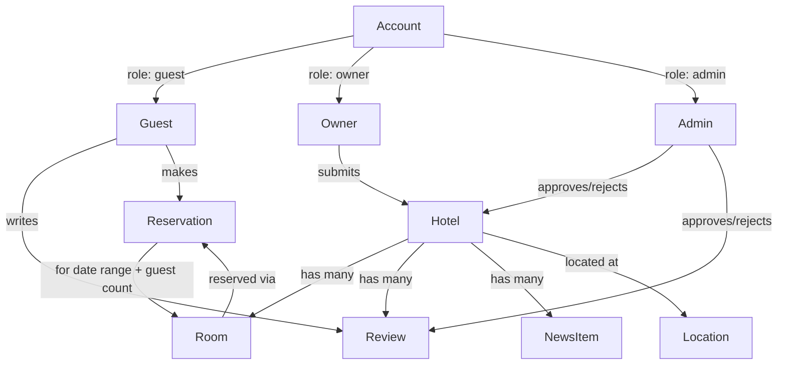

# Platform Foundation

**Version:** 0.2.0
**Status:** Stable
**Layer:** concept

## Overview

Cross-cutting, technology-agnostic requirements that every user-facing surface and
every domain specification in this workspace must satisfy. This spec captures what
the Figma source (`Booking`, file `N2cVVIS5wvjHIviP27peuX`) demonstrates about
delivery surface, localization, discoverability, and the shared data foundation
before any single feature is designed. Domain specs reference this file instead of
repeating these invariants.

## Related Specifications

- [l2-tech-stack.md](l2-tech-stack.md) - Implements these invariants in a concrete stack.
- [l1-hotel-discovery.md](l1-hotel-discovery.md) - Consumes discoverability + catalog invariants.
- [l1-hotel-profile.md](l1-hotel-profile.md) - Consumes responsive delivery + media invariants.
- [l1-room-reservation.md](l1-room-reservation.md) - Consumes the hotel/room data foundation.
- [l1-property-onboarding.md](l1-property-onboarding.md) - Consumes moderation + actor-role invariants.
- [l1-content-publishing.md](l1-content-publishing.md) - Consumes discoverability + moderation invariants.
- [l1-platform-shell.md](l1-platform-shell.md) - Consumes localization + responsive delivery invariants.
- [l2-third-party-integrations.md](l2-third-party-integrations.md) - Implements the actor-role and moderation-checkpoint invariants below.

## 1. Motivation

The Figma source contains a full sitemap (74 top-level frames) with a consistent
desktop/mobile pairing for nearly every screen, a language switcher in the header,
and public marketplace pages (hotel listings, articles) alongside an owner-facing
intake form. Before drafting any single feature it must be established, once, what
every page owes the platform: how it renders across devices, which language it
speaks, whether it must be discoverable outside the app shell, and how the two
central entities (hotel, room) relate to each other. Duplicating these statements
into every domain spec would violate the no-duplication rule (RULES.md §6).

## 2. Constraints & Assumptions

- Source of truth for scope is the Figma file above; frames belonging to an
  unrelated reference document ("Gift Ideas", node prefix `1306:*`, Ukrainian-
  language e-commerce mockups pasted onto the same canvas) are explicitly
  out of scope and must not be treated as Booking requirements.
- MVP targets a single deployable web product; native mobile apps are out of scope
  until a dedicated spec introduces them.
- Assume single-region deployment and a single primary currency/locale for the
  initial release; multi-currency is not evidenced in the inspected frames.

## 3. Core Invariants (Layer 1 only)

- **Responsive parity**: every user-facing page has a defined desktop and mobile
  presentation; a feature is not complete until both are specified.
- **Localization-ready**: the primary interface language is Russian, but all
  user-facing copy must be externalized so additional locales can be added without
  restructuring templates or data models (evidenced by the header language switch).
- **Public discoverability**: catalog, hotel-profile, and article pages must be
  independently addressable (deep-linkable) and crawlable by search engines and
  shareable outside an authenticated session — they are marketplace acquisition
  surfaces, not app-internal views.
- **Catalog structure**: hotels are exposed as a searchable, filterable, sortable,
  paginated collection; no domain spec may bypass this shared retrieval contract.
- **Hotel/room hierarchy**: a room belongs to exactly one hotel; a hotel exposes one
  or more rooms. No room may exist without a parent hotel.
- **Content moderation checkpoint**: any content originating from an external actor
  (a submitted hotel listing, a guest review) must pass an integrity/moderation
  checkpoint before it is publicly visible. [MODIFIED] Mechanism resolved: an
  authenticated admin actor reviews a queue of pending items (hotels, rooms,
  reviews) and approves or rejects them; see
  [l2-third-party-integrations.md](l2-third-party-integrations.md) §5.3 for the
  concrete tool. The invariant itself (a checkpoint must exist) is unchanged —
  only its previously-open mechanism is now decided.
- **Actor roles**: the system distinguishes three actor roles — guests who
  browse/reserve, property owners who submit listings, and admins who moderate
  submitted content. All three are authenticated accounts. [MODIFIED] Resolved:
  see [l2-third-party-integrations.md](l2-third-party-integrations.md) §5.1 for
  the concrete auth solution. A submitted listing remains attributed to its
  owner's account for later management (edits, viewing moderation status).
- **Media resilience**: photo/video-heavy pages (hotel galleries, room galleries)
  must remain usable when images load slowly or fail; content structure must not
  depend on every asset resolving.

## 5. Detailed Design

### 5.1 Site Map (as evidenced by the Figma source)

```plaintext
/                        Home (hero search + catalog preview)   -> l1-hotel-discovery
/catalog                 Catalog with map                        -> l1-hotel-discovery
/hotel/{id}              Hotel profile + room inventory           -> l1-hotel-profile, l1-room-reservation
/add-hotel               Property owner intake form               -> l1-property-onboarding
/blog                    Article listing                          -> l1-content-publishing
/blog/{id}               Article detail                           -> l1-content-publishing
/privacy-policy          Legal page                                -> l1-platform-shell
/404                     Error page                                -> l1-platform-shell
(overlay) feedback       Feedback popup                            -> l1-platform-shell
(overlay) room detail    Room detail + reservation popup           -> l1-room-reservation
```

### 5.2 Core Entity Relationship



## 7. Drawbacks & Alternatives

Treating localization, discoverability, and the entity hierarchy as a single
foundation spec (rather than letting each domain spec restate them) trades a small
amount of indirection (readers must open one extra file) for eliminating
duplication across five-plus domain specs, per RULES.md §6.

## Canonical References

| Alias | Path | Purpose |
| --- | --- | --- |
| `[FIGMA]` | `https://www.figma.com/design/N2cVVIS5wvjHIviP27peuX/Booking` | Source of truth for sitemap, layout, and copy. |

## Document History

| Version | Date | Change |
| --- | --- | --- |
| 0.1.0 | 2026-07-30 | Initial draft derived from Figma sitemap discovery. |
| 0.2.0 | 2026-07-30 | Resolved actor-roles and moderation-checkpoint TBDs via l2-third-party-integrations.md. |
