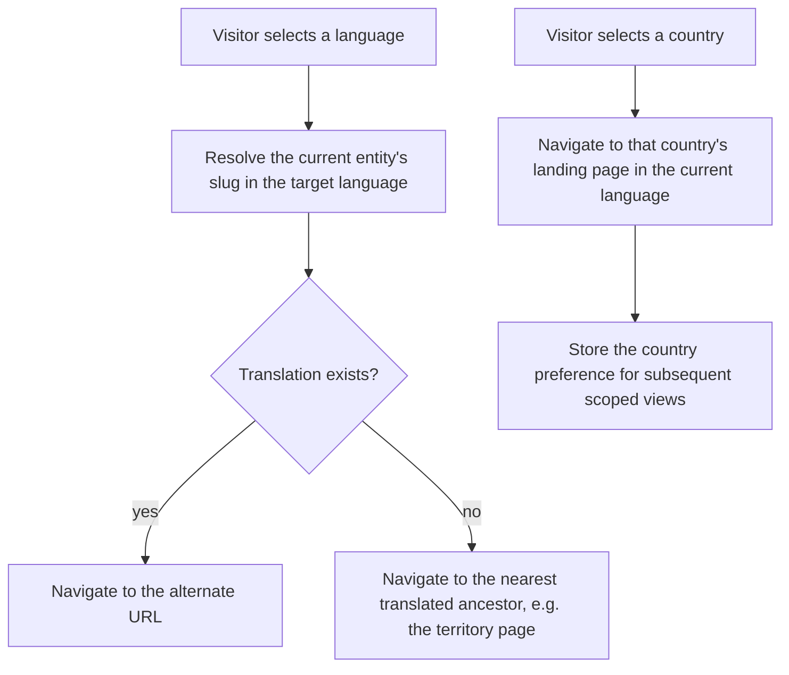
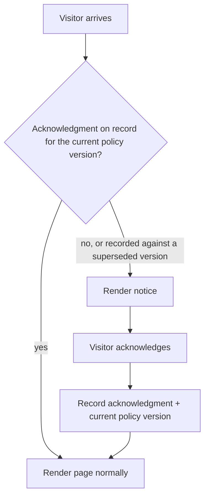

# Platform Shell

**Version:** 0.3.1
**Status:** Stable
**Layer:** concept

## Overview

The chrome shared by every public page: header navigation across the portal's many
sections, the language and country switchers, the global search entry, the mobile
menu, the footer, the feedback overlay, the 404 page, and the static legal pages.
Derived from `[TZ]` §2, §4–§5, §20, and the recurring header/footer in every Figma
frame.

[MODIFIED — v0.2.0] Widened for the portal scope: navigation now spans seventeen-plus
sections rather than three, and the language switcher is joined by a country switcher
— both backed by real registries rather than stubbed.

## Related Specifications

- [l1-platform-foundation.md](l1-platform-foundation.md) - Localization-completeness and responsive-parity invariants.
- [l1-localization.md](l1-localization.md) - Backs both switchers; owns resolution and fallback.
- [l1-geography.md](l1-geography.md) - Country switcher targets and the territory navigation beneath it.
- [l1-object-catalog.md](l1-object-catalog.md) - Destination of the header search and of every category entry.
- [l1-content-publishing.md](l1-content-publishing.md) - Destination of the news, promotions, and blog entries.
- [l1-object-onboarding.md](l1-object-onboarding.md) - Destination of the "add object" call to action.
- [l1-seo.md](l1-seo.md) - Breadcrumbs and alternate-language links live in this shell.
- [l1-advertising.md](l1-advertising.md) - Home page and header-adjacent banner slots.
- [l1-object-profile.md](l1-object-profile.md) - The direct-contact conversion path the cookie notice must never block.
- [l1-analytics.md](l1-analytics.md) - Source of the analytics dedup token the cookie notice discloses; §3.3's privacy-minimal design is why no opt-out is needed.

## 1. Motivation

Header, footer, and error pages appear identically across every other domain spec's
surfaces; specifying them once prevents thirteen specs from each re-describing the
same navigation. The shell also carries two elements with real behaviour rather than
decoration — the language and country switchers — whose correctness determines whether
every other page resolves the content the visitor expects.

## 2. Constraints & Assumptions

- Navigation must accommodate a section list that grows: object types are
  administrator-managed data ([l1-object-catalog.md](l1-object-catalog.md) §3.1), so
  the menu cannot be a fixed list in markup.
- Four viewport classes are in scope — phone, tablet, laptop, desktop
  (`[TZ]` §20).
- The country switcher changes the browsing scope; it does **not** change the
  language ([l1-localization.md](l1-localization.md) §3).
- Selecting a country navigates to that country's landing page rather than
  re-scoping the current page in place — `[TZ]` does not state this directly, but
  in-place re-scoping cannot work for a page that belongs to exactly one country
  (an object page, for instance), so navigation is the only model valid on every
  page the switcher appears on. §5.3 models this behaviour; the shipped switcher
  component implements it unchanged.
- No third-party marketing, advertising, or tracking cookies exist in this
  architecture — analytics is first-party and aggregate
  ([l1-analytics.md](l1-analytics.md) §3.3), and advertising is server-targeted house
  inventory, not third-party ad-tech ([l1-advertising.md](l1-advertising.md) §7).
  §5.5's notice design follows from this: nothing optional exists to gate.
- No Figma node covers the cookie consent notice (confirmed absent from the source
  file outside the out-of-scope `1306:*` subtree). Its visual language derives from
  tokens already extracted for the feedback overlay and footer legal links, not from
  a dedicated frame.

## 3. Core Invariants (Layer 1 only)

- **The shell is present on every public page** in all four viewport classes, with the
  mobile presentation collapsing navigation into a menu (`[TZ]` §5, §20).
- **Both switchers are always reachable.** The language switcher lists every active
  language; the country switcher lists every active country
  ([l1-localization.md](l1-localization.md) §5.1).
- **Switching language preserves position.** Changing language navigates to the same
  content's URL in the target language, never to the home page — this is the same
  alternate link [l1-seo.md](l1-seo.md) §3.3 emits.
- **Navigation is data-driven.** Menu entries derive from the active object-type and
  content registries, so adding an object type adds a navigation entry without a code
  change.
- **Global search is present in the header** on every page and submits into the
  catalog ([l1-object-catalog.md](l1-object-catalog.md) §5.1).
- **Breadcrumbs are present on every page below the home page**, and every crumb is a
  link (`[TZ]` §13).
- **A 404 page renders for any unresolved route**, in all viewport classes, and is
  itself never indexable.
- **Static legal pages exist** — privacy policy and terms of use — linked persistently
  (`[TZ]` §4).
- **The feedback overlay is a shared component** invokable from any page.
- **A cookie notice discloses and confirms, without blocking the page.** It renders
  as a dismissible overlay — never a full-page wall — because nothing it discloses is
  optional (§5.5, §7) and the portal's core conversion path (contact click-through)
  must stay reachable underneath it at all times
  ([l1-object-profile.md](l1-object-profile.md) §5.3). It appears once per policy
  version and persists the visitor's acknowledgment so it does not reappear on every
  page.

## 5. Detailed Design

### 5.1 Shell Composition

```plaintext
Header
├── Logo
├── Country switcher            -> l1-geography
├── Language switcher           -> l1-localization
├── Primary navigation (data-driven)
│   ├── Accommodation (grouped object types)
│   ├── Dining (grouped object types)
│   ├── Entertainment · Attractions
│   ├── News · Promotions · Blog
│   └── About · Contacts
├── Global search               -> l1-object-catalog
└── Owner entry (sign in / cabinet)

Breadcrumbs                     -> l1-seo

Page content (per domain spec)

Footer
├── Brand · about
├── Contact details
├── Social links
├── Popular destinations        -> l1-geography
├── Object categories           -> l1-object-catalog
├── Legal: privacy policy · terms of use
└── "Add your object" call to action  -> l1-object-onboarding

Overlays          Feedback popup (invokable from any page)
                  Cookie consent notice (first visit, until acknowledged)     -> §5.5
Standalone routes 404, privacy policy, terms of use, about, contacts
```

Per `[TZ]` §4 the navigable section list spans country, region, city, and resort
catalogs; hotel, apartment, guest house, cottage, sanatorium, restaurant, café, bar,
entertainment, ski resort, and camping catalogs; plus news, articles, promotions,
blog, contacts, about, privacy policy, and terms of use. That list is too large for a
flat menu bar — §5.2 groups it.

### 5.2 Navigation Grouping

Object types carry a parent association
([l1-object-catalog.md](l1-object-catalog.md) §3.1), and the menu renders that
hierarchy: top-level groups (accommodation, dining, entertainment, attractions)
expand to their child types. Because the grouping comes from the type registry,
adding "glamping" under accommodation is a data operation that appears in the menu
automatically.

### 5.3 Switcher Behaviour



The fallback in step E matters: sending a visitor to the home page because one object
lacks a Georgian translation loses their context entirely, while its city page in
Georgian is still a useful answer.

### 5.4 Responsive Behaviour

| Viewport | Header | Navigation | Footer |
| --- | --- | --- | --- |
| Phone | Logo, search icon, menu button; switchers inside the menu | Full-screen drawer, groups collapsed | Stacked, accordion sections |
| Tablet | Logo, search field, menu button; switchers inline | Drawer with groups expanded | Two columns |
| Laptop | Full header, inline navigation | Menu bar with dropdown groups | Multi-column |
| Desktop | Full header, inline navigation | Menu bar with dropdown groups | Multi-column |

### 5.5 Cookie Consent Notice

An acknowledgment notice, not an Accept/Reject selector — the portal's full
cookie/storage footprint is first-party and essential (§2), so there is no optional
category for a toggle to control:

| Mechanism | Purpose | Category |
| --- | --- | --- |
| Session | Keeps an owner or staff member signed in | Essential |
| CSRF token | Protects form submissions | Essential |
| Active language and country | Backs both shell switchers (§5.3) | Essential |
| Bot-protection challenge | Guards the specific public form it is placed on (registration, contact, reviews) | Essential |
| Analytics dedup token | Coarse, rotating, non-identifying deduplication ([l1-analytics.md](l1-analytics.md) §3.3) | Essential — first-party, aggregate-only, already privacy-bounded |



The notice:

- Names what is stored and why, in one or two sentences, and links to the privacy
  policy's cookie section rather than restating that content, matching this shell's
  existing footer pattern (§5.1).
- Renders in the visitor's active language ([l1-localization.md](l1-localization.md)
  §3), like every other shell string.
- Is present in all four viewport classes (§5.4), collapsing to a bottom sheet on
  phone and a bar or corner card on larger viewports — the same responsive posture as
  the feedback overlay it sits alongside.
- Never blocks the page beneath it or the contact-click conversion path
  ([l1-object-profile.md](l1-object-profile.md) §5.3, §3).
- Re-appears when the recorded acknowledgment's policy version no longer matches the
  current one, so a material change to what the portal stores re-discloses rather
  than relying on a stale acknowledgment.
- Dismisses only on the visitor's explicit action — never on scroll, timeout, or
  navigation — so the acknowledgment is real, not incidental.

## 6. Implementation Notes

1. Build the shell as a layout wrapping every public route, so all domain specs
   inherit it rather than reproducing it.
2. Derive navigation from the type and content registries at render, cached and
   invalidated on registry change — a hard-coded menu will diverge from the catalog
   the first time an administrator adds a type.
3. The switchers appear on every page and must not each trigger a registry query;
   cache the active language and country lists globally.
4. Emit the language alternates once, in the shell, and reuse them for both the
   switcher and [l1-seo.md](l1-seo.md)'s alternate links — two independent
   implementations will disagree.
5. The cookie notice's visual language has no Figma node to pull from (§2) — reuse
   the button, overlay, and link tokens already extracted for the feedback popup and
   the footer's legal links rather than inventing new ones.
6. If a genuinely optional client-side mechanism is introduced later (a third-party
   integration outside today's set), §5.5's acknowledgment-only model must be
   revisited to add a real opt-out — do not pre-build a toggle for a category that
   does not exist yet.

## 7. Drawbacks & Alternatives

**A flat menu bar listing every section.** Matches `[TZ]` §4's enumeration literally
and is unusable at seventeen-plus entries, especially on tablet. The grouped
navigation in §5.2 preserves reachability without the wall.

**Country as a URL segment on every page instead of a switcher preference.** More
explicit and already partly true — territory pages carry the country in their path
([l1-seo.md](l1-seo.md) §5.1). The switcher preference exists for the pages that have
no country of their own, such as the blog.

**Deferring the country switcher until a second country launches.** Would be the
right call if the countries launched sequentially; `[TZ]` §1.3 launches three at once,
so the switcher is release-one functionality.

**An Accept/Reject or multi-category selector**, the pattern on most
consent-management platforms. Every mechanism this portal stores is first-party and
essential (§5.5) — there is no optional processing for a Reject action or a category
toggle to act on. A selector offering a choice the portal cannot honor would be a
dark pattern, not extra compliance.

**A dedicated cookie policy page, separate from the privacy policy.** The disclosed
footprint is five first-party mechanisms, all essential — a paragraph inside the
existing privacy policy page covers it without a second legal route, a second sitemap
entry, and a second translation surface to maintain.

**A blocking cookie wall that gates page content until acknowledged.** Common on
EU-facing sites with real optional processing to gate. This portal has none (§5.5),
and blocking access would tax the one interaction the whole product is built around —
reaching the owner's contact channel ([l1-object-profile.md](l1-object-profile.md)
§5.3) — for no compliance benefit.

## Canonical References

| Alias | Path | Purpose |
| --- | --- | --- |
| `[TZ]` | `.drafts/booking.md` | §2, §4–§5, §20 — source requirements. |
| `[FIGMA-404]` | `https://www.figma.com/design/N2cVVIS5wvjHIviP27peuX/Booking?node-id=85-1278` | 404 page layout. |
| `[FIGMA-PRIVACY]` | `https://www.figma.com/design/N2cVVIS5wvjHIviP27peuX/Booking?node-id=85-1797` | Privacy policy layout. |

## Document History

| Version | Date | Change |
| --- | --- | --- |
| 0.1.0 | 2026-07-30 | Initial draft derived from recurring header/footer/overlay frames. |
| 0.2.0 | 2026-08-05 | Minor: widened navigation to the portal's full section list with data-driven grouping; added the country switcher, global header search, breadcrumbs, terms-of-use page, and the four-viewport responsive matrix. |
| 0.3.0 | 2026-08-20 | Minor: added the cookie consent notice as a shared shell overlay (§5.5) — an acknowledgment-only model, not Accept/Reject, because the portal's full storage footprint is first-party and essential; no dedicated Figma node exists for it, so it reuses existing overlay and footer tokens. |
| 0.3.1 | 2026-08-22 | Patch: closed §2's inline TBD on country-switcher behaviour — confirmed navigation to the country landing page (not in-place re-scoping) as the settled model, matching the already-shipped switcher component; no behavioural change. `Status: RFC → Stable`. |
