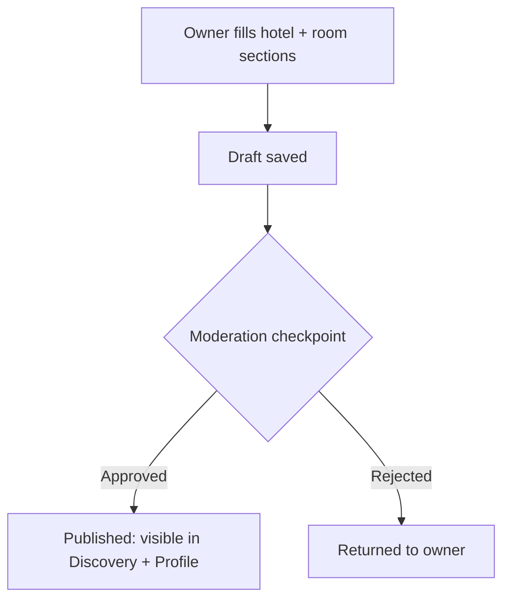

# Property Onboarding

**Version:** 0.1.0
**Status:** Draft
**Layer:** concept

## Overview

The "Add Hotel" intake flow that lets a property owner submit a hotel and its
room inventory into the marketplace. Evidenced by frame `добавить отель`.

## Related Specifications

- [l1-platform-foundation.md](l1-platform-foundation.md) - Actor-role and moderation-checkpoint invariants.
- [l1-hotel-profile.md](l1-hotel-profile.md) - Consumer of the data this flow produces.
- [l1-room-reservation.md](l1-room-reservation.md) - The room amenity taxonomy mirrored by this form.

## 1. Motivation

Every hotel and room shown in discovery and on profile pages must enter the
system somehow; this is that entry point. It is specified independently because
it has a materially different actor (property owner, not guest) and a
materially different concern (data completeness and integrity, not conversion).

## 2. Constraints & Assumptions

- The form is reachable from the public footer ("Добавить отель") without any
  visible sign-in step preceding it.
  <!-- TBD: whether submission requires an authenticated owner account is the
       same open question raised in l1-platform-foundation.md. If it does, this
       form is the first step of an account-creation flow, not a bare form. -->
- The form's room-amenity groupings (room / bathroom / bedroom / general)
  mirror the grouping shown in the room-detail popup
  ([l1-room-reservation.md](l1-room-reservation.md)), confirming both surfaces
  are meant to share one amenity taxonomy.

## 3. Core Invariants (Layer 1 only)

- Submission is split into two sections: hotel-level information (name, status
  category / star rating, location, contact details, hotel-level amenities,
  photo and video upload) and room-level information (per-room pricing, guest
  capacity, grouped room amenities, room photo upload).
- A submission is not required to include a complete media set before it is
  saved as a draft, but must be complete before it is eligible for publication.
- A submitted hotel does not become visible in
  [l1-hotel-discovery.md](l1-hotel-discovery.md) results or reachable at its own
  profile URL until it clears the moderation checkpoint defined in
  [l1-platform-foundation.md](l1-platform-foundation.md).
  <!-- TBD: the concrete moderation workflow (queue, reviewer role, rejection
  feedback to the owner) has no corresponding frame in the inspected source and
  must be designed separately. -->
- Location data captured here must be sufficient to place the hotel on the map
  view in [l1-hotel-discovery.md](l1-hotel-discovery.md) (i.e. resolvable to
  coordinates, not free-text address alone).

## 5. Detailed Design

### 5.1 Submission Sections

```plaintext
Hotel section
├── Name + status/star category
├── Location (address)
├── Contact (phone with country code)
├── Amenities (hotel-level, grouped, icon-tagged)
└── Media (photo upload, video upload)

Room section (repeatable — see Drawbacks)
├── Pricing + guest capacity
├── Amenities: room / bathroom / bedroom / general
└── Media (photo upload)
```

### 5.2 Submission Lifecycle



## 6. Implementation Notes

1. Resolve the authentication question before building persistence for this
   flow — it determines whether submissions are linked to an owner account or
   handled as anonymous leads.
2. Reuse the amenity taxonomy verbatim from
   [l1-room-reservation.md](l1-room-reservation.md) rather than defining it
   twice.

## 7. Drawbacks & Alternatives

The inspected frame shows exactly one room section, not a visibly repeatable
"add another room" control. Whether a hotel with multiple room types requires
multiple separate submissions or one submission with a repeatable room block is
left as an open design choice for L2, since either is consistent with the static
frame alone.

## Canonical References

| Alias | Path | Purpose |
| --- | --- | --- |
| `[FIGMA-ADD-HOTEL]` | `https://www.figma.com/design/N2cVVIS5wvjHIviP27peuX/Booking?node-id=234-5704` | Add-hotel intake form frame. |

## Document History

| Version | Date | Change |
| --- | --- | --- |
| 0.1.0 | 2026-07-30 | Initial draft derived from the add-hotel form frame. |
