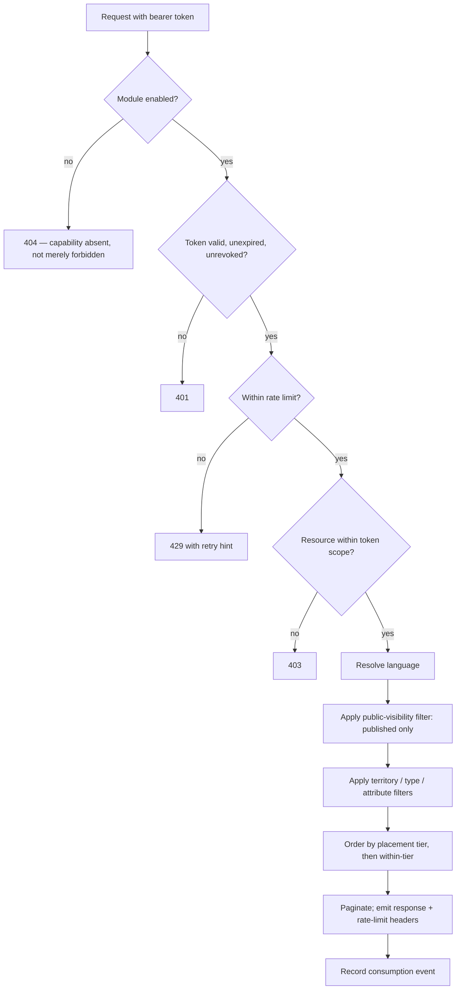

# Public API

**Version:** 0.1.0
**Status:** RFC
**Layer:** concept

## Overview

The portal's outward-facing REST API: what it exposes, how a consumer authenticates
with issued tokens, how it is versioned, rate-limited, and documented. Derived from
`[TZ]` §2 and §19.

## Related Specifications

- [l1-platform-foundation.md](l1-platform-foundation.md) - Actor-role, accountability, and additive-extensibility invariants.
- [l1-object-catalog.md](l1-object-catalog.md) - Its retrieval, ordering, and filter contract is what the API exposes.
- [l1-geography.md](l1-geography.md) - Territory scoping the API must honour.
- [l1-localization.md](l1-localization.md) - Language negotiation for API responses.
- [l1-back-office.md](l1-back-office.md) - Hosts API client and token administration.
- [l1-moderation-governance.md](l1-moderation-governance.md) - Journals token issuance, revocation, and privileged API access.
- [l1-analytics.md](l1-analytics.md) - API consumption is measured like any other surface.
- [l1-feature-modules.md](l1-feature-modules.md) - The API is itself a gateable capability.

## 1. Motivation

`[TZ]` lists an API twice — once in §2 among the architecture deliverables ("API")
and once as its own numbered requirement in §19 ("REST API. Документация.
Авторизация. Токены."). `[TZ]` §64 then names a partner API among the capabilities
the architecture must grow into without a rewrite.

Those three mentions are terse, and it would be easy to read them as the same future
item. They are not: §64 describes a *partner* API as future scope, while §19 sits in
the main requirement body alongside security and performance. The safe reading — and
the one this spec takes — is that the **contract and its infrastructure** (tokens,
versioning, documentation, rate limits) are release-one work, while the breadth of
what is exposed starts deliberately narrow.

This matters architecturally more than it looks. An API added later, over handlers
designed only for the portal's own pages, tends to leak internal shapes and become
impossible to version. Designing the read contract once, and letting the portal's own
pages be one consumer of it, costs little now and avoids that outcome.

## 2. Constraints & Assumptions

- `[TZ]` §19 specifies REST, not GraphQL, and token-based authorization.
- No consumer-facing use case is stated in `[TZ]`. The launch surface is therefore
  **read-only public catalog data**; write access is not exposed until a named
  consumer and a use case exist.
- The internal admin REST surface (`/api/admin`) is **not** this API. It is an
  implementation detail of the back office with a different contract, different
  authorization, and no stability guarantee
  ([l2-third-party-integrations.md](l2-third-party-integrations.md) §5.3).
- <!-- TBD: [TZ] gives no named API consumer, no rate-limit figures, and no data-
     licensing position on whether third parties may republish object content
     supplied by owners. All three are business decisions. The design below is
     deliberately conservative — read-only, tokened, rate-limited, revocable — so
     that opening it further is a policy change rather than a redesign. -->

## 3. Core Invariants (Layer 1 only)

### 3.1 Contract

- **The API is versioned from its first release.** A breaking change ships as a new
  version; existing versions keep working for a stated deprecation window. An
  unversioned API cannot be changed without breaking consumers.
- **The API exposes published, public data only.** Anything invisible to an anonymous
  visitor — pending, rejected, archived, or hidden records, personal data, financial
  records, the audit journal — is out of scope for every token, at every tier.
- **It honours the same domain rules as the portal**: territory scoping, placement
  ordering, moderation state, availability status, and language resolution. An API
  consumer must not be able to obtain an ordering or a visibility the website would
  not give them.
- **Responses are language-negotiated** and fall back exactly as pages do
  ([l1-localization.md](l1-localization.md) §5.3).

### 3.2 Authorization

- **Access requires an issued token.** Tokens are created, scoped, and revoked by an
  administrator ([l1-back-office.md](l1-back-office.md)); there is no self-service
  registration at launch.
- **A token carries a scope** — which resources, which countries, which object
  categories — resolved by the same scoping model as administrative permissions
  ([l1-back-office.md](l1-back-office.md) §5.2). Reusing it avoids a second
  authorization system with its own bugs.
- **Tokens are revocable and expiring.** Revocation takes effect immediately, not at
  the next expiry.
- **Every token issuance, revocation, and scope change is journalled**
  ([l1-moderation-governance.md](l1-moderation-governance.md) §5.4).

### 3.3 Operation

- **Every consumer is rate-limited**, per token, with limits configurable per token
  (`[TZ]` §130's settings principle). The API must never be able to degrade the
  portal's own pages.
- **The API is documented**, and the documentation is generated from the contract
  rather than maintained by hand — hand-written API documentation diverges
  (`[TZ]` §19).
- **API consumption is measured** per token and per endpoint
  ([l1-analytics.md](l1-analytics.md)), so abuse and value are both visible.
- **The API is a gateable module** ([l1-feature-modules.md](l1-feature-modules.md)),
  disabled at portal scope until a consumer exists.

## 5. Detailed Design

### 5.1 Launch Surface

Read-only, mirroring what an anonymous visitor can already see:

```plaintext
GET /api/v1/countries
GET /api/v1/territories                 ?country= &parent= &level=
GET /api/v1/territories/{id}
GET /api/v1/object-types
GET /api/v1/amenities
GET /api/v1/objects                     ?territory= &type= &amenities= &price= &rating=
                                        &availability= &sort= &page= &per_page=
GET /api/v1/objects/{id}                (includes contacts, media, rooms, prices, services)
GET /api/v1/objects/{id}/reviews
GET /api/v1/news                        ?object= &territory=
GET /api/v1/promotions                  ?object= &territory=
GET /api/v1/articles                    ?category= &tag=
```

Collection endpoints return the **same ordering** the catalog renders — placement tier
first, then within-tier criteria ([l1-object-catalog.md](l1-object-catalog.md) §5.3).
This is deliberate: an API that returned a "neutral" ordering would let a consumer
build a competing listing that bypasses the portal's entire revenue model.

Not exposed at launch, and each for a reason: owner and user records (personal data),
financial and placement history (commercial), statistics (commercial), the audit
journal (`[TZ]` §91 restricts it), banners (advertising delivery is measured
server-side), and any write operation.

### 5.2 Token Model

```plaintext
ApiClient                        ApiToken
├── name                         ├── client      -> ApiClient
├── contact                      ├── token hash  (never stored in clear)
├── active flag                  ├── scope       resources[] · countries[] · categories[]
└── created by -> Account        ├── rate limit  (requests per window)
                                 ├── issued at · expires at
                                 ├── revoked at · revoked by
                                 └── last used at
```

`last used at` exists so an administrator can identify dormant tokens — the most
common source of a credential that outlives its purpose.

### 5.3 Request Flow



Step C returns 404 rather than 403 when the module is disabled, consistent with the
inertness rule ([l1-feature-modules.md](l1-feature-modules.md) §3): a disabled
capability is absent, and a 403 would confirm its existence.

### 5.4 Documentation

Per `[TZ]` §19 the API ships with documentation covering every endpoint, its
parameters, its response shape, error codes, rate limits, and the authentication
scheme. It is generated from the same schema definitions that validate requests, so
the two cannot drift, and it is published at a stable, versioned address.

### 5.5 Administration

Per `[TZ]` §130's configuration principle, an administrator may register a client,
issue a token with a scope and a rate limit, view last-use and consumption figures,
revoke a token, and read the issuance journal — all from the back office
([l1-back-office.md](l1-back-office.md) §5.1).

## 6. Implementation Notes

1. Build the read contract as a layer over the existing catalog retrieval
   ([l1-object-catalog.md](l1-object-catalog.md) §6.1), not as a parallel query path.
   Two implementations of "list objects in a territory, tier-ordered" will diverge,
   and the divergence will be a revenue bug.
2. Never reuse the internal `/api/admin` handlers here. They exist to serve a
   specific client, carry no stability guarantee, and are authorized differently.
3. Store token hashes, never tokens. Display the clear value once, at issuance.
4. Apply the public-visibility filter in the shared query layer, not per endpoint —
   the same reasoning as soft-delete filtering
   ([l1-moderation-governance.md](l1-moderation-governance.md) §6.4). One forgotten
   filter exposes unmoderated content.
5. Rate-limit before doing work, not after. A limiter that runs post-query offers no
   protection to the database it is meant to protect.

## 7. Drawbacks & Alternatives

**Deferring the API entirely to `[TZ]` §64's future partner module.** Defensible on
§19's brevity, and rejected because §19 sits in the main requirement body, not in the
future-scope list — and because retrofitting versioning and token authorization onto
handlers built only for the portal's own pages is materially harder than designing
them now. The module gate in §3.3 gives the same deferral benefit without the later
cost: the contract exists, disabled.

**GraphQL instead of REST.** Better for varied consumer needs and explicitly not what
`[TZ]` §19 asks for. It also makes rate limiting and cost control considerably harder
against unknown consumers, which is the wrong trade for a public surface with no
named user yet.

**Public, unauthenticated read access.** Simplest, and it hands the portal's entire
catalog — assembled at real cost from owner submissions — to anyone who wants to
mirror it, with no attribution, no measurement, and no revocation. Tokens are the
minimum needed to keep that a decision rather than an accident.

**Exposing a "neutral" ordering for API consumers.** Sounds fairer and would let a
consumer rebuild the catalog without paid placement, directly undermining
[l1-placement-monetization.md](l1-placement-monetization.md). The API returns the
portal's ordering for the same reason the website does.

## Canonical References

| Alias | Path | Purpose |
| --- | --- | --- |
| `[TZ]` | `.drafts/booking.md` | §2, §19, §64 — source requirements. |
| `[L1]` | `.design/main/specifications/l1-platform-foundation.md` | Actor-role and extensibility invariants. |

## Document History

| Version | Date | Change |
| --- | --- | --- |
| 0.1.0 | 2026-08-05 | Initial draft. Closes the `[TZ]` §19 coverage gap found during the second requirements pass. |
