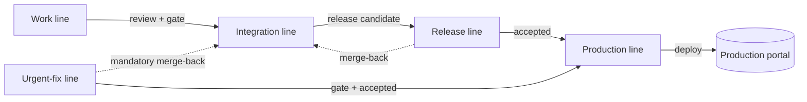

# Release Operations

**Version:** 0.4.0
**Status:** Stable
**Layer:** concept

## Overview

The path a change takes from a developer's working branch to the production portal:
the gates it must clear, the branch topology that carries it, how a release is
reversed when it turns out to be wrong, and the documentation that lets someone other
than its author — a client operator, or an automated agent — walk that path.

Two unrelated senses of the word "delivery" meet in this workspace, so this
specification fixes the one it means: **software delivery**, code reaching a server.
[l1-platform-foundation.md](l1-platform-foundation.md) §3.1 uses the same word for the
portal reaching a visitor — responsive rendering, accessibility, performance — and
nothing here touches that obligation.

Unlike every other specification in this workspace, this one is not derived from
`[TZ]`. The client technical specification constrains the server (§22) and names the
project's development stages (§23), but is silent on how code reaches that server.
The requirement originates with the project owner, who asked for three things: a
configured CI/CD pipeline, a branch model with automated dispatch between branches,
tests, and the production line, and deployment documentation written for a reader who
knows nothing about IT — in both launch languages, and in a form an automated agent
can consume.

## Related Specifications

- [l1-platform-foundation.md](l1-platform-foundation.md) - Client-stated delivery stages (§5.4) this pipeline serves, and the quality obligations its gate enforces.
- [l1-localization.md](l1-localization.md) - Launch language pair the operator documentation set must cover.
- [l1-back-office.md](l1-back-office.md) - Administrator-facing backup and restore surface, beside which this spec's reversal path sits — it does not replace it.
- [l1-moderation-governance.md](l1-moderation-governance.md) - Audit-journal principle that release records follow: every consequential action leaves a record naming its actor.
- [l1-notifications.md](l1-notifications.md) - Carries release outcomes and pipeline failures to the people who must act on them.
- [l2-release-pipeline.md](l2-release-pipeline.md) - Implementation of this specification.
- [l2-tech-stack.md](l2-tech-stack.md) - Owns the quality gate this pipeline invokes and the production runtime topology it deploys into.

## 1. Motivation

Three problems, and only the first is the obvious one.

**Nothing describes how the portal reaches a server.** The repository already carries
half a pipeline: a quality gate runs on every push and pull request, and a commit hook
catches formatting before it ever leaves a developer's machine. Both were built as
part of the implementation work and both do their job. But the pipeline stops at
"accepted" — what happens between an accepted change and a portal serving that change
to visitors is undocumented, unautomated, and has never been performed the same way
twice. A quality gate with no delivery path behind it verifies changes that then sit
still.

**The portal outlives the people who built it.** It is handed to a client whose staff
operate it. `[TZ]` §131 already assumes this: it gives the main administrator a
restore button and demands re-confirmation and additional authorization behind it,
because the person pressing it is an operator, not an engineer. The same assumption
has to hold one level down. A deployment procedure whose reader must understand PHP is
not a procedure; it is a note the author left themselves. Every routine operation this
portal needs — release, roll back, restore, rotate a credential, run a scheduled job by
hand — has to be executable by someone reading instructions for the first time.

**Automation and documentation drift apart by default.** The project owner wants
release dispatch operable by an automated agent: branch to tests, tests to the
production line, production line to a deployed portal. That is a reasonable ask, and it
creates a requirement most projects never face — the same procedure has to exist in two
registers at once, one addressed to a person and one addressed to a machine. Written
independently, they diverge on the first change, and the divergence is invisible until
an agent follows the stale half. They are therefore specified as one procedure with two
renderings, not as two documents.

## 2. Constraints & Assumptions

- **No `[TZ]` mandate.** `[TZ]` §22 lists what the server must provide and §23 names
  the development stages; neither constrains delivery. Requirements here trace to the
  project owner, and to §97/§131's operational obligations where they touch backups and
  restore.
- **One repository, one deployable unit.** The portal is a monolith
  ([l2-tech-stack.md](l2-tech-stack.md) §1). There is no service graph to orchestrate
  and no partial release to coordinate.
- **A single production environment, self-hosted.** No blue/green pair, no multi-region
  fleet, no canary cohort. Reversal is therefore a *redeploy of the previous release*,
  not a traffic switch, and the invariants below are written for that reality.
- **A small team.** A branch model that presumes a release manager, a change advisory
  board, or a scheduled release train is the wrong model at this scale and is rejected
  in §7.
- **The design-time tooling is scaffolding.** The specification and planning
  directories are erected around this project and deleted when it is handed over. No
  build step, no pipeline job, and no operational procedure may depend on them: with
  those directories absent, the project must still build, test, deploy, and roll back
  unchanged. This is a hard boundary, restated as invariant §3.10 because it is the one
  a convenient shortcut breaks first.
- **Production credentials never reach this workspace.** Values are held by whoever
  operates the host. Specifications and documentation name *which* credentials exist and
  what each is for, never their contents.

## 3. Core Invariants (Layer 1 only)

### 3.1 Gate Parity

The checks that decide whether a change is acceptable are the same checks a developer
runs locally, invoked the same way, in the same order. A check that exists only in the
pipeline cannot be reproduced by the person who has to fix it; a check that exists only
locally is a check nobody enforces. Where the two must differ — an environment the
runner provides and a laptop does not — the difference is in provisioning, never in
which assertions run.

### 3.2 Single Path to Production

Every change in production arrived through the pipeline. Editing a file on the
production host, applying a migration by hand, or deploying from a working copy is an
incident to be recorded and reversed, not a faster route. The pipeline being slower than
the shortcut on a bad day is not an argument against this invariant; it is the reason
the invariant is written down.

### 3.3 One Production Line

Exactly one branch is the authoritative statement of what is in production. Nothing is
deployed from anywhere else, and that branch never receives work that has not already
passed through integration — with one named exception, the urgent-fix path, which is
permitted to reach production first and is **obliged** to merge back into integration
before the next ordinary release. An urgent fix that is not merged back is a defect
scheduled to reappear.

### 3.4 Reversibility

Every release can be returned to the immediately preceding released state without
rebuilding it and without the participation of whoever performed it. This has a
consequence that is easy to skip: schema changes are not symmetric with code changes.
A release whose schema change cannot be reversed by redeploying the previous artefact
must be **declared irreversible before it is deployed**, and that declaration is what
routes it to the restore path ([l1-back-office.md](l1-back-office.md)) instead of the
rollback path. Discovering irreversibility during an incident is the failure this
invariant exists to prevent.

### 3.5 Recorded Releases

Every production release leaves a record stating what was deployed, which commit it was
built from, when, and on whose authority — a named person or a named automation
identity. Reversals are releases and are recorded identically. This is the same
principle the action journal applies to administrative work
([l1-moderation-governance.md](l1-moderation-governance.md)): an action whose actor
cannot be named later did not happen accountably.

### 3.6 Secrets Never Travel With Code

No credential, token, or key appears in the repository, in a build artefact, in a
release record, or in pipeline output. Values are supplied to the running system by its
host at the moment they are needed. A build that cannot be produced without a
production secret is a build that has leaked one.

### 3.7 Operable Without Its Author

Every routine operation has a written procedure that assumes its reader knows nothing
about the codebase, has not read the specifications, and is following the steps for the
first time. The test for compliance is not that the document exists — it is that
somebody who did not write it has completed the operation from it. `[TZ]` §97 and §131
already demand this for restore specifically; it generalizes to the rest.

### 3.8 Documentation Parity

Operator procedures exist in every language the portal launches in
([l1-localization.md](l1-localization.md)), and each procedure exists in both a
human-addressed and a machine-addressed rendering. All renderings of one procedure
describe the same steps, the same preconditions, and the same failure handling. A
change to any rendering is incomplete until every other rendering of that procedure
matches — partial updates are how a stale translation misleads an operator during an
incident, and how an agent executes a step that no longer exists.

This does not soften the project's English-first engineering baseline. Developer-facing
material — the repository readme, the technical runbooks, code documentation — stays in
English. The obligation here is *additive* and audience-driven: procedures the client's
own staff execute are also published in the client's language, because an operator who
cannot read the instruction cannot follow it.

### 3.9 Automation Is Accountable

An automated agent that merges, tags, or deploys acts under its own named identity, with
explicitly granted permissions, and leaves the same records a person would. Automation
never inherits a human's credentials, and never holds a permission a human in the same
role would be denied. Removing a review requirement so that automation can proceed is a
change to the review policy and is decided as one — never as a pipeline configuration
detail.

**Interim state, bounded and owner-authorized.** Before the automation identity
[l2-release-pipeline.md](l2-release-pipeline.md) §5.10 describes has been installed,
every action this specification permits an agent to take is still attributed to
whichever credential actually ran it — today, the owner's own authenticated session,
never a separate identity impersonating one. §5.5.2's standing autonomous-operation
grant is made knowingly against this reality, not in ignorance of it: the owner decided
the review-policy change §3.9's own rule above requires being decided explicitly, aware
that until §5.10's identity exists, GitHub attributes the resulting merges, tags, and
records to the owner's account. This clause lapses — and this paragraph is removed —
the moment that identity exists and every action it governs runs under it instead.

### 3.10 The Pipeline Owns No Design Artefacts

No pipeline job, build step, package manifest, or operational procedure may read from,
invoke, or depend on the project's design-time and planning tooling. Delete those
directories and the pipeline must run unchanged. This includes indirect coupling: a
runtime or toolchain added to the project solely to execute design-time tooling is
coupling even where nothing names it. Provenance for a change belongs in commit history
and pull-request descriptions, which travel with the repository, not in build
configuration.

## 5. Detailed Design

### 5.1 The Promotion Path

Four kinds of line, and the rules that move a change between them.

- **Work line** — one per unit of work. Short-lived. Its only exit is review plus a
  passing gate.
- **Integration line** — the accumulated, always-gated state of accepted work. It is
  what the next release will contain, and it is never deployed to production directly.
- **Release line** — an integration state frozen for release. It exists so that
  stabilization work (a translation fix, a configuration correction) can land against a
  candidate without absorbing whatever else was merged meanwhile. It merges back to
  integration so those corrections are not lost.
- **Production line** — invariant §3.3's single authority. Receiving a change here is
  what makes it a release.
- **Urgent-fix line** — the one exception, branched from the production line and
  returning to it, with a mandatory merge-back to integration. It is not a faster
  ordinary path; using it for anything other than a production fault is a violation of
  §3.2's spirit even though the mechanics are permitted.

### 5.2 Gate Obligations by Transition

Each transition carries obligations. They accumulate: nothing later re-checks what an
earlier gate already proved, and nothing later is trusted to have been checked.

| Transition | Must be true |
| --- | --- |
| Local commit → work line | Formatting and lint pass for the changed files. Fast, mechanical, no environment required beyond the developer's own. |
| Work line → integration | The full quality gate passes on the merged result, not on the branch in isolation. The schema applies cleanly from empty. Human review has accepted the change, **unless** §5.5.2's standing grant applies — the change set touches none of its declared sensitive zones and carries no undeclared irreversible migration — in which case the gate passing is what accepts it. |
| Integration → release line | The integration state is green at the moment of the freeze, and the change set is enumerable — the release record's contents are known before, not after. |
| Release line → production line | Acceptance is explicit and attributable (§3.5), **by the same either/or as the row above**: a person's, or the agent's under §5.5.2 when its conditions hold. Irreversible schema changes are declared here (§3.4) or not at all — a change carrying one always exits §5.5.2's grant and waits for a person, since the declaration itself is never the agent's to make. |
| Production line → deployed portal | The artefact deployed is the one that was accepted, not a rebuild of it. **Reaching this line is not deploying it** — nothing here starts a deploy on its own. Deployment begins only when a person triggers it (§5.5.2), then is followed by an automatic health assertion; a failed assertion triggers §5.3's reversal without waiting for a human. |

The asymmetry in the last row is deliberate. Deciding to release is a human judgement.
Deciding that a release is *broken right now* is a measurement, and measurements should
not queue behind somebody's availability.

### 5.3 Release Records and Reversal

A release record is created at the moment of the production-line transition, not after a
successful deploy, so that a failed deploy is also recorded. It states the released
version, the commit, the enumerated change set, the actor, the timestamp, whether the
release was declared irreversible, and the outcome once known.

Reversal has exactly two paths, chosen by the declaration made in §5.2, never
improvised during the incident:

- **Rollback** — redeploy the previous release's artefact. Available whenever the
  release was not declared irreversible. Fast, mechanical, and safe to trigger
  automatically on a failed health assertion.
- **Restore** — the administrator-initiated backup restore that `[TZ]` §97 and §131
  already specify, behind their re-confirmation and elevated-authorization gate
  ([l1-back-office.md](l1-back-office.md)). This is the path for an irreversible release
  and the only path that can lose data written since the backup. It is deliberately
  slower and deliberately gated; §133's confirmation principle applies with full force.

Every reversal notifies the operators responsible ([l1-notifications.md](l1-notifications.md))
and is itself recorded under §3.5.

### 5.4 The Operator Documentation Set

Two audiences, two registers, and every launch language. The matrix is the deliverable —
a procedure missing any cell is incomplete under §3.8.

| Audience | Register | Answers |
| --- | --- | --- |
| Client operator | Human-addressed, no assumed technical background | "The portal is down — what do I press?" Step-by-step, one action per step, with what a successful step looks like and what to do when it does not. |
| Automated agent | Machine-addressed, explicit preconditions and outcomes | The same steps, each with its verifiable precondition, its expected observable result, and the explicit condition under which the agent must stop and hand back to a person. |
| Developer | Human-addressed, technical, English baseline | Why the pipeline is shaped this way, how to change it, and what breaks if a given step is skipped. This is the existing technical runbook set, extended — not duplicated. |

Procedures the set must cover, at minimum: first-time deployment onto a fresh host;
routine release; rollback; restore from backup; credential rotation; running a
scheduled job manually; and reading the pipeline's own failure output well enough to
tell "the change is bad" from "the runner is broken".

The human and agent renderings of a procedure are generated from, or verified against,
one another — never maintained as independent prose. §3.8's parity obligation is
unenforceable by discipline alone at this size, and an unenforceable obligation is a
future incident.

### 5.5 Agent-Assisted Operation

The owner's request is that an agent dispatch changes between lines. The boundary that
makes this safe is not "how capable is the agent" but **which decisions are reversible
by the same automation that made them**.

| Agent may decide | Requires a person |
| --- | --- |
| Advancing an ordinary change whose gate passed into integration, and from there into production, without a separate review grant (§5.5.2) | Granting the review itself, for any change §5.5.2 does not cover |
| Cutting a release candidate from a green integration state, and accepting an ordinary one into production (§5.2, §5.5.2) | Accepting a candidate that touches a declared sensitive zone or carries an irreversible migration |
| Triggering rollback on a failed health assertion (§5.2) | Initiating a restore — `[TZ]` §131's re-confirmation gate is a human gate by construction |
| Reporting, recording, and notifying | Declaring a release irreversible (§3.4) |
| Retrying a transition that failed for an infrastructure reason | Loosening or altering a gate the pipeline has already shipped a release through, or triggering an actual deploy (§5.5.2) |
| Building the gate's scaffolding before it has ever gated a release — branch protection rules, the `production` environment's existence and its reviewer list, the CI/CD workflows themselves — **under the owner's explicit, recorded, one-time authorization (§5.5.1)** | Naming who the human reviewer is, or standing in for that reviewer under any identity |

The pattern: automation is trusted with **execution and with reversal**, and — before a
gate has ever gated anything — with **building it**, and now, under the owner's
explicit and recorded standing grant (§5.5.2), with **advancing an ordinary change all
the way to production** — and is not trusted with **triggering the deploy that reaches
a visitor, declaring irreversibility, or loosening a gate that has already stood between
automation and a live release**. An agent that may both accept a release and declare it
irreversible can produce a state nothing it controls can undo, which is precisely the
state §3.4 exists to make impossible — this is why §5.5.2's grant excludes exactly that
case rather than widening to cover it. Installing a rule that requires a named person's
approval is a different act from holding that approval power: the two stay
distinguishable exactly as long as the reviewer named is a real person the owner chose,
never the automation identity itself (§5.10 `[L2]`) and never the agent approving on its
own behalf.

#### 5.5.1 Development-Phase Exception

Before this project's first production release, the owner may explicitly authorize the
agent to perform the gate-construction cell above directly — the `git`/GitHub-level
actions a person would otherwise click through by hand, not the release decisions the
gate exists to check. This is scoped narrowly and does not soften §5.5's own table
beyond this one cell:

- It never reaches the "Requires a person" column, at any project phase, before or after
  first release.
- It never authorizes the agent to name itself, or any other automation identity, as an
  environment reviewer — §5.10 `[L2]`'s withheld-permissions design applies regardless of
  who configured the environment.
- It lapses the moment a real release has shipped through the gate being configured —
  from that point on, altering the gate is a person's decision again, not the agent's,
  even within the same conversation that granted the exception.
- The authorization is the owner's own explicit act, given knowingly after the agent has
  stated what it would do and why the boundary normally exists — never inferred from
  silence, and never assumed by the agent on its own initiative.

#### 5.5.2 Standing Autonomous Operation

Where §5.5.1 is a narrow, one-time, pre-launch exception that lapses at first release,
this is the owner's standing instruction for ordinary operation afterward: an
incoming bug report may travel, unattended, from a work line the agent branches off
integration, through a fix, the full quality gate, and acceptance into both the
integration and production lines — the two transitions §5.2's table now marks
either/or — without a person granting review at either point. The owner made this
grant explicitly, aware of §3.9's interim-credential reality (above) and of exactly
what it does not cover, which is enumerated below rather than left to be inferred from
how far the grant reaches.

**What the grant does not widen.** Three things stay exactly as strict as §5.5's table
already made them, and this section touches none of them:

- **The deploy trigger.** Reaching the production line is not deploying to it (§5.2).
  The action that starts a deploy — pushing the release tag, or whatever mechanism a
  later revision of [l2-release-pipeline.md](l2-release-pipeline.md) names — is a
  person's explicit act every time, unconditionally, whether or not the release being
  deployed used this grant to get there. An agent operating under this section
  prepares a release candidate ready to deploy; it does not start the deploy.
- **Irreversibility and restoration.** A change carrying a migration that a plain
  rollback cannot undo exits this grant the moment that fact is known, regardless of
  how ordinary the rest of the change is — §3.4's declaration is never the agent's to
  make, and neither is initiating the restore path §5.3 names for exactly this case.
- **The `production` environment's own reviewer gate**, where one exists (§5.10
  `[L2]`), is untouched by this section. It is a second, independent confirmation on
  top of the deploy trigger above, not a substitute for it — this grant neither relies
  on it nor removes it.

**The sensitive-zone circuit breaker.** A change is outside this grant — and falls
back to §5.5's ordinary "requires a person" row — the moment it touches any of:

- Authentication, session, or second-factor handling (`app/Http/Middleware/Authenticate*`,
  `app/Http/Middleware/EnsureSecondFactorForPrivilegedRoles.php`, `config/auth.php`).
  The first of those three is a path, not a file — the framework owns that middleware
  and nothing occupies the path today. It is declared regardless, so that a published
  copy arrives already owned instead of landing as an ordinary change on the day
  somebody first needs to customize authentication. A zone may be declared empty; it
  may not be declared late.
- Authorization itself — every file under `app/Policies/`, `app/Services/Authorization/`,
  and `config/permission.php`, plus any migration or seeder touching the `roles`,
  `permissions`, `role_scopes`, or `personal_access_tokens` tables.
- Money — `app/Models/FinancialRecord*`, anything under `app/Services/Placement/`, and
  the Filament resources built on either.
- Secrets and credential wiring — any `.env*` file, `config/services.php`, and every
  `.github/workflows/*.yml` step that names a secret.

This list is deliberately mechanical, not a matter of the agent's own judgement about
what counts as sensitive — it is checked the same way §3.1's gate parity already is
(a test, not a convention), so that "did this change touch a sensitive zone" has one
answer regardless of who is asking. A change touching any listed path routes to a
person exactly as if this section did not exist; nothing about the surrounding change
being otherwise ordinary changes that.

**Declaring a zone is not enforcing it, and the gap between the two is silent.** This
boundary has two halves: a check that decides whether a change touches a declared zone,
and a promotion path configured to consult that check before merging. Either half alone
enforces nothing — a check nothing consults is documentation, and a promotion path
consulting an incomplete check reports "clear" for a change it never examined. Both
halves fail quietly rather than loudly, which is why neither may be assumed from the
other's presence. [l2-release-pipeline.md](l2-release-pipeline.md) §5.11 carries both on
this stack, and states which settings make the second half bite. A review that reads one
half and infers the other has verified nothing.

**Scope.** This section governs the ordinary bug-fix and small-change lifecycle the
owner described when granting it — a work line opened from an existing report,
through to a production-line acceptance. It does not authorize an agent to originate
new specification-level scope on its own initiative (that remains `/magic.spec`'s own
gate), and it does not relax §3.2's single-path invariant: an urgent-fix line still
exists and still merges back, exactly as §5.1 already requires.

### 5.6 Failure Handling

A pipeline that fails silently is worse than none, because it is trusted. Five
obligations:

- **A failed gate blocks the transition it guards** and nothing else. A broken deploy
  job must not prevent a developer from merging reviewed work into integration.
- **Failures are attributed before they are reported.** "The pipeline failed" is not a
  report; which transition, which check, and which change set are the report. Where the
  cause is the runner rather than the change, that distinction is stated — a
  misattributed infrastructure failure sends someone to debug working code.
- **Repeated failure of the same check is a signal about the check.** A gate that fails
  often for reasons unrelated to correctness is training everyone to bypass it, and is
  fixed or removed rather than tolerated.
- **One release at a time.** Production transitions are serialized. Two releases landing
  in a single environment concurrently produce a state neither of them describes — one
  release's migration against the other's code — and no release record afterwards is
  true. A release arriving while another is in flight waits for it or is refused; it
  never interleaves. The same rule binds a reversal, which is a release (§3.4).
- **A reversal that does not restore health escalates; it never retries.** Automatic
  reversal is safe precisely because it returns to a state that was known good. When the
  state *after* reversal is still unhealthy, the release was not the fault, and repeating
  the reversal cannot become the fix. The pipeline stops acting at that point, states
  plainly that the previous release is also unhealthy, and hands to a person under §3.7's
  documented procedure. The portal stays in its maintenance state rather than serving
  errors while that happens — an honest closed door is better than an intermittently
  broken portal, and it is the state an operator can reason about. This obligation exists
  to prevent the specific failure where automation redeploys in a loop while an
  infrastructure fault goes unreported.

## 7. Drawbacks & Alternatives

**Trunk-based development with feature flags** was the main alternative to the branch
topology in §5.1. It has genuine advantages: no long-lived divergence, no merge-back
obligation, no release-line bookkeeping. It was not chosen because its cost lands
exactly where this project is weakest — feature flags mean shipping unfinished code to
production and relying on runtime gating to keep it invisible, and the portal already
carries an administrator-toggleable module system
([l1-feature-modules.md](l1-feature-modules.md)) whose semantics are *product*
capability, not release staging. Two toggle systems with overlapping vocabulary and
different meanings is a confusion this project would have to explain to its client. The
branch topology keeps release staging in the repository, where only developers see it.

**Continuous deployment on merge to the integration line** was rejected for launch, not
in principle. It requires that reversal be cheap and that health assertions be trusted
enough to act on unattended — the second is achievable, the first is not yet, because
the single-environment constraint in §2 makes reversal a redeploy rather than a traffic
switch. Revisiting this after launch, once the health assertions have a track record, is
the natural next step rather than an admission of error.

**A blue/green pair** would make reversal instantaneous and would eliminate most of
§5.3. It doubles the production footprint for a portal that has one server, and it moves
the hard part rather than removing it — schema changes still have to be compatible
across both halves, which is §3.4's problem wearing different clothes.

**Documentation in English only** was rejected against the project's own English-first
engineering baseline, and §3.8 explains the reasoning: the baseline governs material
written for developers, and the operator procedures have a different audience. The cost
is real — every procedure now has a parity obligation — which is why §5.4 requires the
renderings to be derived rather than independently maintained.

**Deferring this specification until after launch** was the last alternative, and the
most tempting, since the portal's implementation is complete without it. It fails on
§3.7: the moment the portal is live is the moment an undocumented operation becomes an
outage, and the person who needs the document is not the person who could write it.

## Canonical References

| Alias | Path | Purpose |
| --- | --- | --- |
| `[TZ]` | `.drafts/booking.md` | §22 (server), §23 (delivery stages), §97 and §131 (backup, restore, maintenance), §133 (confirmation gates) — the only sections that touch this domain. |
| `[L1]` | `.design/main/specifications/l1-platform-foundation.md` | §5.4's client-stated delivery stages, which this pipeline serves. |
| `[OWNER]` | `.drafts/TODO.md` | Origin of the three requirements: CI/CD, branch dispatch, and bilingual deployment documentation. |

## Document History

| Version | Date | Change |
| --- | --- | --- |
| 0.1.0 | 2026-08-20 | Initial draft. Covers the first specification of this project's delivery path: promotion topology, gate obligations by transition, release records and the two reversal paths, the operator documentation matrix, and the boundary between agent-decided and human-decided release actions. Originates with the project owner rather than `[TZ]`, which is silent on delivery. |
| 0.2.0 | 2026-08-21 | §5.5 gains a scoped development-phase exception (§5.5.1): before a project's first production release, the owner may explicitly authorize the agent to build a gate's own scaffolding directly — branch protection, the `production` environment and its reviewer list, the CI/CD workflows — never to decide anything the "Requires a person" column still lists, and never past the project's first real release through that gate. Reduces friction the original table forced onto pre-launch setup work without weakening §3.4's production-time boundary, which the exception explicitly cannot touch. Originates with the project owner, who observed the table blocked setup work no release had yet depended on. |
| 0.3.0 | 2026-08-21 | §5.5 gains a standing (not one-time) autonomous-operation grant (§5.5.2): an ordinary bug fix may travel unattended from a work line through acceptance into production, without a human granting review, provided it touches none of a declared, mechanically-checked set of sensitive zones (auth, authorization, money, secrets) and carries no undeclared irreversible migration — either condition routes it back to a person. The deploy trigger itself, irreversibility declaration, and restore initiation stay exactly as human-gated as before; this grant only removes the review-grant step ahead of them, never the transitions after. §3.9 gains an interim clause naming the current reality this grant is made against: before §5.10 `[L2]`'s automation identity exists, the actions it covers still run under the owner's own credentials, by the owner's explicit and informed choice, not the project's target state. §5.2's transition table is reworded to state both transitions as either/or (person, or agent under §5.5.2) rather than person-only. Originates with the project owner, who described the intended end-to-end shape of ordinary operation and, when asked, drew the boundary at the deploy trigger, at irreversible changes, and at sensitive-zone changes. |
| 0.4.0 | 2026-08-21 | §5.5.2's authentication zone is corrected: `app/Http/Middleware/Authenticate*` is a path with no file behind it — the framework owns that middleware — and is now declared as deliberately empty rather than as an existing file, so a published copy arrives already owned. §5.5.2 also gains the separation the first re-review of 0.3.0 found missing: declaring a zone is not enforcing it, the two halves (a check that decides whether a change touches a zone, and a promotion path configured to consult that check) both fail quietly rather than loudly, and neither may be inferred from the other's presence. The mechanism itself is delegated to [l2-release-pipeline.md](l2-release-pipeline.md) §5.11 rather than restated here, keeping one description of it rather than two that can drift. |
