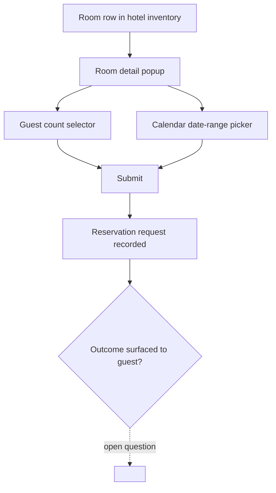

# Room Reservation

**Version:** 0.1.0
**Status:** Draft
**Layer:** concept

## Overview

The room inventory table on a hotel's page, the room-detail popup it opens, and
the date-range / guest-count selection mechanic that turns browsing into a
reservation request. Evidenced by frames `номера`, `поп ап номера` /
`поп ап номера моб`, `выбор колво людей`, and `календарь`.

## Related Specifications

- [l1-platform-foundation.md](l1-platform-foundation.md) - Hotel/room hierarchy invariant.
- [l1-hotel-profile.md](l1-hotel-profile.md) - Hosts the room inventory summary this spec details.

## 1. Motivation

Room selection is the point where a browsing guest commits to specifics (which
room, which dates, how many guests). It is specified separately from the hotel
profile because it has its own state machine (select room -> configure dates and
guests -> submit) that the profile page merely launches.

## 2. Constraints & Assumptions

- The room-detail popup's visible call to action is a "feedback / contact"
  button, not an explicit "pay now" button.
  <!-- TBD: this is the single most consequential open question in the domain.
       The inspected frames do not show a payment step, a booking confirmation
       screen, or an order/reservation history view. Two readings are equally
       supported by the evidence: (a) this is a lead-generation model where a
       "reservation" is really a contact request the hotel fulfills manually, or
       (b) a payment/confirmation step exists in the source file but was outside
       the frames inspected in this pass. This must be resolved before this
       spec can leave Draft — it changes whether payments, cancellation policy,
       and booking-status tracking belong in this domain at all. -->
- A guest-count selector and a calendar date-picker exist as reusable widgets
  (seen both near the home hero search and near the hotel page), implying one
  shared component rather than two independent ones.

## 3. Core Invariants (Layer 1 only)

- Each room row in a hotel's inventory shows: category/name, guest capacity,
  a summary of amenities, date availability, and a starting price.
- Opening a room shows its full detail: descriptive title, bed configuration,
  guest capacity, amenities grouped by area (room, bathroom, bedroom, general),
  a dedicated photo gallery, and feature tags (e.g. sauna, breakfast, beach
  access).
- A reservation attempt captures, at minimum: which room, a check-in/check-out
  date range, and a guest count.
- Date-range selection must respect the room's actual availability — a guest
  cannot request dates already reserved by another guest for the same room.
- The outcome of a submitted reservation request must be observable by the
  guest afterward. <!-- TBD: no such surface (confirmation screen, order
  history, email) was found in the inspected frames; must be designed once the
  payment-vs-inquiry question above is resolved. -->

## 5. Detailed Design

### 5.1 Reservation Flow

## 6. Implementation Notes

1. Do not begin payment/checkout design until the inquiry-vs-booking question is
   resolved — building either prematurely risks a full rework.
2. The shared guest-count / calendar widgets should be built once and reused
   between [l1-hotel-discovery.md](l1-hotel-discovery.md)'s hero search and this
   spec's room popup.

## 7. Drawbacks & Alternatives

Proceeding with an assumed model (e.g., defaulting to "inquiry-only") was
considered and rejected: per RULES.md/C25 the agent records genuine ambiguity as
TBD rather than silently deciding a product-defining question with no objective
tiebreaker in the source material.

## Canonical References

| Alias | Path | Purpose |
| --- | --- | --- |
| `[FIGMA-ROOMS]` | `https://www.figma.com/design/N2cVVIS5wvjHIviP27peuX/Booking?node-id=1101-1196` | Room inventory table frame. |
| `[FIGMA-ROOM-POPUP]` | `https://www.figma.com/design/N2cVVIS5wvjHIviP27peuX/Booking?node-id=85-558` | Room detail popup frame. |

## Document History

| Version | Date | Change |
| --- | --- | --- |
| 0.1.0 | 2026-07-30 | Initial draft; flagged inquiry-vs-booking as the primary open question. |
