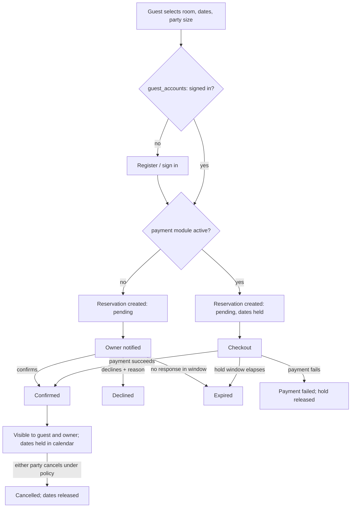
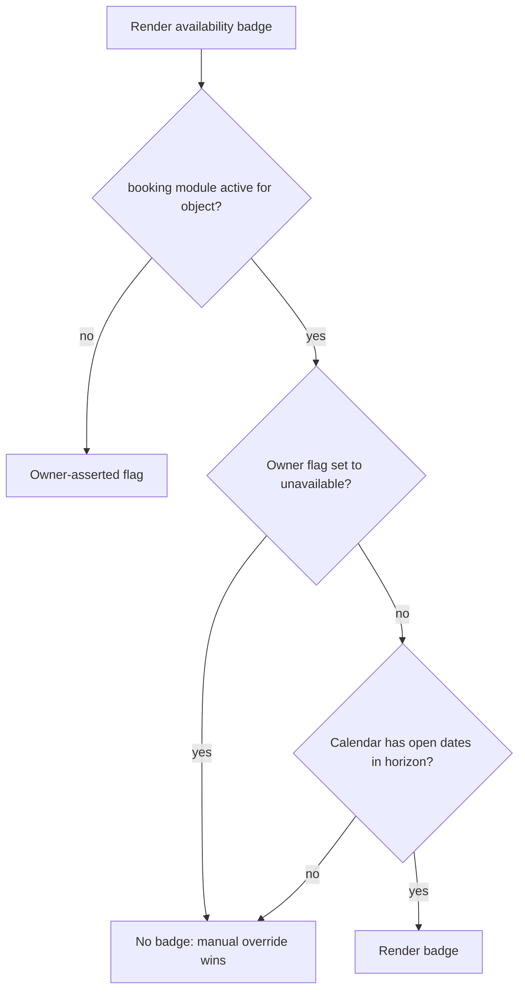

# Room Reservation (Optional Module)

**Version:** 1.0.0
**Status:** RFC
**Layer:** concept

## Overview

The **optional, disabled-by-default** booking capability: room-level availability
calendars, a dated reservation request, owner confirmation, and — when the separate
payment module is also active — a prepaid checkout. Governed by the module registry
in [l1-feature-modules.md](l1-feature-modules.md); absent from every surface when
off.

[MODIFIED — v1.0.0] This spec previously described the platform's mandatory
conversion path. The client technical specification removed booking from the product
("Портал не является системой онлайн-бронирования", `[TZ]` §Общая информация) while
simultaneously requiring that it remain reachable "как отдельный модуль, если
потребуется" (`[TZ]` §64). The spec is therefore **re-scoped, not deprecated**: it
now defines a module that ships dormant and that an administrator can activate, at
which point the portal becomes a booking portal with all the consequences catalogued
in §5.6.

## Related Specifications

- [l1-feature-modules.md](l1-feature-modules.md) - Owns the `booking` and `payment` module records, the scoping ladder, and the inertness guarantee this spec depends on.
- [l1-platform-foundation.md](l1-platform-foundation.md) - Object/room hierarchy invariant; the module-gated exception to its no-booking invariant.
- [l1-availability-status.md](l1-availability-status.md) - Its owner-asserted flag becomes calendar-derived when this module is active.
- [l1-object-profile.md](l1-object-profile.md) - Gains the booking panel alongside — never instead of — the contact rail.
- [l1-object-catalog.md](l1-object-catalog.md) - Gains date and party-size facets within the module's scope.
- [l1-object-onboarding.md](l1-object-onboarding.md) - Gains calendar, rate, and booking-request management in the owner cabinet.
- [l1-notifications.md](l1-notifications.md) - Delivers request, confirmation, and reminder messages.
- [l1-moderation-governance.md](l1-moderation-governance.md) - Journals confirmations, declines, and cancellations.
- [l2-third-party-integrations.md](l2-third-party-integrations.md) - Supplies the conditional payment provider.

## 1. Motivation

Two facts have to be held at once.

The portal's stated proposition is direct, commission-free contact between visitor
and owner, and its launch product deliberately has no booking. Making booking
mandatory would contradict `[TZ]` outright.

At the same time, a complete reservation capability already exists in this codebase —
schema, persistence, checkout, payment integration, and a passing test suite — built
before the technical specification arrived, and `[TZ]` §64 names online booking among
the capabilities the architecture must be able to grow into without a rewrite.
Discarding a tested implementation of a capability the client has explicitly
earmarked for the future is waste, not discipline.

The resolution is the module registry: the capability stays in the codebase, stays
tested, and stays inert until an administrator turns it on. This spec's job is to
define what "on" means precisely enough that activating it is a decision rather than
an experiment.

## 2. Constraints & Assumptions

- The module is **off by default** at portal scope
  ([l1-feature-modules.md](l1-feature-modules.md) §5.2). Nothing in this spec is
  active at launch.
- It depends on `guest_accounts`; a reservation must be attributable to an
  identifiable person (`[TZ]` §64 lists tourist cabinets as a companion future
  module).
- `payment` is a **separate** module. Booking without payment is a first-class
  supported state, not a degraded one — see
  [l1-feature-modules.md](l1-feature-modules.md) §5.4.
- Enabling this module does not remove, weaken, or intermediate the direct-contact
  path ([l1-object-profile.md](l1-object-profile.md) §3.1). Booking is additive.
- Only object types that declare room inventory can participate
  ([l1-object-catalog.md](l1-object-catalog.md) §5.5). A restaurant is never
  bookable through this module.
- <!-- TBD: whether an activated portal charges commission on bookings, and how that
     interacts with the placement-package revenue model in
     l1-placement-monetization.md, is a business decision with no technical
     tiebreaker. The data model below records a commission rate per reservation so
     the answer is representable either way, but no default is assumed. -->

## 3. Core Invariants (Layer 1 only)

### 3.1 Gating

- Every surface, route, action, job, and markup emission defined below exists only
  where the `booking` module resolves to enabled
  ([l1-feature-modules.md](l1-feature-modules.md) §5.3). Server-side rejection is
  required; hiding a control is not gating.
- An owner participates only by opting their object in. Portal-level or country-level
  activation makes the capability *available*; it does not enroll anyone's object
  automatically.
- Disabling the module preserves every reservation, calendar, and rate record intact
  and restorable ([l1-feature-modules.md](l1-feature-modules.md) §5.7).

### 3.2 Inventory & Availability

- A room belongs to exactly one object; the hierarchy invariant from
  [l1-platform-foundation.md](l1-platform-foundation.md) is unchanged by this module.
- When the module is active for an object, that object gains a per-room availability
  calendar: a date is bookable, blocked by the owner, or held by a reservation.
- **Availability is derived, and the owner's manual flag remains a kill switch.**
  The public badge becomes calendar-derived, but an owner who sets availability to
  `unavailable` overrides the calendar and suppresses the badge regardless of what
  the calendar says ([l1-availability-status.md](l1-availability-status.md) §3).
- No date range may be held by two confirmed reservations for the same room. This is
  a data-integrity constraint enforced atomically at write time, not a validation
  performed before the write.

### 3.3 Reservation Lifecycle

- A reservation captures, at minimum: room, check-in and check-out dates, party size,
  and the guest account it belongs to.
- With `payment` off, a reservation is a **request**: created as `pending`, then
  confirmed or declined by the owner within a configured response window, after which
  it expires.
- With `payment` on, a reservation is **prepaid**: created as `pending`, held for a
  bounded checkout window, and confirmed only by successful payment. An unpaid
  attempt never holds dates beyond that window.
- Every state a reservation reaches is visible to the guest in their account and to
  the owner in their cabinet, with the reason where one applies.
- Cancellation is possible for both parties under an administrator-configured policy,
  and every transition is journalled.

### 3.4 Boundaries

- The module does not replace the availability flag for objects it is not active for.
  A portal with booking enabled for one country still runs the owner-asserted flag
  everywhere else.
- The module introduces no obligation on non-participating owners: their pages,
  cabinets, and catalog behaviour are unchanged.

## 5. Detailed Design

### 5.1 Data Model

```plaintext
RoomAvailability                     Reservation
├── room        -> Room              ├── room          -> Room
├── date                             ├── guest         -> Account
├── state       open | blocked       ├── check-in / check-out
├── rate override (optional)         ├── party size
└── minimum stay (optional)          ├── status        -> §5.3
                                     ├── payment reference (nullable)
Uniqueness: (room, date)             ├── commission rate (nullable)
                                     ├── decline / cancel reason
                                     └── timestamps

BookingSettings (per object)
├── enabled by owner        (the opt-in from §3.1)
├── owner response window   (hours, for the request flow)
├── checkout hold window    (minutes, for the prepaid flow)
├── cancellation policy
└── advance booking horizon
```

`RoomAvailability` is a sparse table: absence of a row means the date follows the
room's default open state. Materializing every date for every room across a three-
country catalog would be the wrong cost for data that is overwhelmingly "open".

### 5.2 Guest Accounts

Activating this module activates guest accounts, which add: registration and sign-in
for visitors, a reservation history, and cancellation. Guest accounts do **not** gate
browsing, contact, or any other portal capability — the portal remains fully usable
anonymously ([l1-platform-foundation.md](l1-platform-foundation.md) §3.4). They gate
this module and nothing else.

### 5.3 Lifecycle



`pending`, `confirmed`, `declined`, `expired`, `payment_failed`, and `cancelled` are
the reachable states. Only `confirmed` holds dates against availability.

### 5.4 Owner Cabinet Additions

Active only for participating objects
([l1-object-onboarding.md](l1-object-onboarding.md) §5.1):

```plaintext
Calendar          per-room availability, blocking, minimum stay
Rates             date-scoped rate overrides above the base price
Booking requests  incoming requests, confirm / decline with reason
Booking settings  opt-in, response window, cancellation policy, horizon
```

### 5.5 Catalog & Profile Additions

- **Catalog**: date-range and party-size facets appear, and results may be filtered to
  objects with matching availability. Both facets are absent outside the module's
  scope — offering a date filter that nothing honours would be worse than offering
  none ([l1-object-catalog.md](l1-object-catalog.md) §5.1).
- **Profile**: a booking panel joins the page, positioned alongside the contact rail.
  Room rows gain a bookability indicator. The contact rail is unchanged and remains
  above the fold ([l1-object-profile.md](l1-object-profile.md) §5.1).

### 5.6 Consequences of Activation

Stated plainly, because activating this module changes what the portal legally and
operationally *is* — this is the list an administrator should read before toggling.

| Area | Consequence |
| --- | --- |
| Legal | The portal becomes a party to accommodation transactions; terms of service, cancellation policy, and consumer-protection obligations change per country. |
| Financial | With `payment` on, the portal handles funds and needs merchant onboarding, payouts, refunds, and reconciliation ([l2-third-party-integrations.md](l2-third-party-integrations.md) §5.4). |
| Support | Booking disputes, no-shows, and refund requests become inbound operational load with no equivalent in the information-portal model. |
| Data | Guest personal data broadens from anonymous analytics to identified reservation records, changing retention and protection obligations (`[TZ]` §89). |
| SEO | Object pages emit `Offer` availability; incorrect availability data becomes a search-engine trust liability ([l1-seo.md](l1-seo.md)). |
| Owner expectations | Participating owners must maintain calendars. A stale calendar under booking is materially worse than a stale availability flag — it sells a room that does not exist. |
| Revenue model | Booking commission and placement packages are two revenue models operating on the same catalog; their interaction needs a decision (§2 TBD). |

### 5.7 Relationship to the Availability Flag



The manual override is retained deliberately. An owner who is closed for renovation
should be able to say so in one tap without editing a calendar, exactly as they can
today ([l1-availability-status.md](l1-availability-status.md) §3).

## 6. Implementation Notes

1. The existing implementation — `reservation` schema, `src/lib/reservation/`, and the
   account reservation routes — is the seed of this module, not legacy to remove. Bring
   it under the module gate rather than rewriting it; its state machine already covers
   the prepaid path, and the request path (`confirmed` / `declined` / `expired` by
   owner action) is the extension needed for the `payment: off` row of
   [l1-feature-modules.md](l1-feature-modules.md) §5.4.
2. Enforce the no-double-booking constraint atomically in the write itself, as the
   existing implementation already does for the paid transition. A read-then-write
   check cannot hold under concurrency.
3. Keep the module's tests running in both states. A dormant capability that is never
   exercised enabled will not work when someone finally enables it — which would make
   this entire spec a fiction ([l1-feature-modules.md](l1-feature-modules.md) §6.3).
4. Do not let calendar logic leak into the availability-badge path for non-participating
   objects. The two must stay separable, since the overwhelming majority of objects will
   never enable this module.

## 7. Drawbacks & Alternatives

**Deprecating this spec and deleting the implementation.** The reading the technical
specification most directly invites, and rejected on the client's own §64: booking is
named as a future module, so the architecture must accommodate it. Deleting working,
tested code to rebuild it later is a cost with no offsetting benefit — the maintenance
burden of dormant code is answered by §6.3, not by deletion.

**Making booking mandatory once implemented.** Contradicts `[TZ]` outright and would
destroy the portal's differentiator: direct, commission-free contact. Not viable.

**One combined booking-and-payment flag.** Simpler registry and it discards the
genuinely useful middle state — dated requests with owner confirmation, which needs no
payment provider, no merchant onboarding, and no per-country payment licensing across
three markets. That state is likely the first one an operator would actually want.

**A per-object flag with no portal-level gate.** Would let individual owners enable
booking unilaterally, committing the portal to the §5.6 legal and operational
consequences without an operator decision. The ladder exists precisely so that
decision sits at the top.

## Canonical References

| Alias | Path | Purpose |
| --- | --- | --- |
| `[TZ]` | `.drafts/booking.md` | §Общая информация, §64, §76 — booking excluded from launch, named as a future module. |
| `[MODULES]` | `.design/main/specifications/l1-feature-modules.md` | Registry, scoping, and inertness contract. |
| `[FIGMA-ROOMS]` | `https://www.figma.com/design/N2cVVIS5wvjHIviP27peuX/Booking?node-id=1101-1196` | Room inventory layout. |
| `[FIGMA-ROOM-POPUP]` | `https://www.figma.com/design/N2cVVIS5wvjHIviP27peuX/Booking?node-id=85-558` | Room detail popup layout. |

## Document History

| Version | Date | Change |
| --- | --- | --- |
| 0.1.0 | 2026-07-30 | Initial draft; flagged inquiry-vs-booking as the primary open question. |
| 0.2.0 | 2026-07-30 | Resolved: reservations are paid bookings; require guest auth. |
| 1.0.0 | 2026-08-05 | Major: re-scoped from a mandatory conversion path to an optional, disabled-by-default module governed by l1-feature-modules.md, per the client specification's exclusion of booking at launch and its §64 requirement that booking remain reachable as a future module. Added the request-without-payment flow, calendar model, activation-consequence ledger, and the availability-flag override contract. Not deprecated — the existing implementation is retained under the module gate. |
