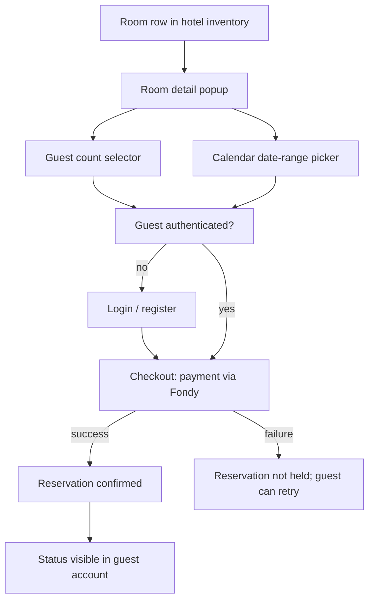

# Room Reservation

**Version:** 0.2.0
**Status:** Stable
**Layer:** concept

## Overview

The room inventory table on a hotel's page, the room-detail popup it opens, and
the date-range / guest-count selection mechanic that turns browsing into a
reservation request. Evidenced by frames `номера`, `поп ап номера` /
`поп ап номера моб`, `выбор колво людей`, and `календарь`.

## Related Specifications

- [l1-platform-foundation.md](l1-platform-foundation.md) - Hotel/room hierarchy invariant.
- [l1-hotel-profile.md](l1-hotel-profile.md) - Hosts the room inventory summary this spec details.
- [l2-third-party-integrations.md](l2-third-party-integrations.md) - Payment provider that implements the reservation's paid-booking step.

## 1. Motivation

Room selection is the point where a browsing guest commits to specifics (which
room, which dates, how many guests). It is specified separately from the hotel
profile because it has its own state machine (select room -> configure dates and
guests -> submit) that the profile page merely launches.

## 2. Constraints & Assumptions

- [MODIFIED] **Resolved**: the room-detail popup's "feedback / contact" action,
  as drawn in Figma, is superseded by a payment step. A reservation is a paid
  booking, not a lead-generation inquiry — see
  [l2-third-party-integrations.md](l2-third-party-integrations.md) §5.2 for the
  payment provider. The original design ambiguity (no payment/confirmation
  frame was inspected) is resolved by explicit product direction rather than
  by evidence found in the file; a UI update to replace "feedback" with a
  payment call-to-action is now in scope for L2 implementation work.
  <!-- TBD: whether payment is full prepayment or a partial deposit at
       reservation time, with the remainder due at the hotel, is not yet
       decided — a business-policy detail, not a technical one. -->
- A guest-count selector and a calendar date-picker exist as reusable widgets
  (seen both near the home hero search and near the hotel page), implying one
  shared component rather than two independent ones.

## 3. Core Invariants (Layer 1 only)

- Each room row in a hotel's inventory shows: category/name, guest capacity,
  a summary of amenities, date availability, and a starting price.
- Opening a room shows its full detail: descriptive title, bed configuration,
  guest capacity, amenities grouped by area (room, bathroom, bedroom, general),
  a dedicated photo gallery, and feature tags (e.g. sauna, breakfast, beach
  access).
- A reservation attempt captures, at minimum: which room, a check-in/check-out
  date range, and a guest count.
- Date-range selection must respect the room's actual availability — a guest
  cannot request dates already reserved by another guest for the same room.
- [MODIFIED] A reservation only becomes confirmed once payment succeeds; an
  unpaid reservation attempt does not hold the dates against availability
  beyond a short checkout window. The guest must be authenticated (see
  [l2-third-party-integrations.md](l2-third-party-integrations.md) §5.1) to
  make a reservation, since payment and post-booking status both need an
  attributable account.
- [MODIFIED] **Resolved**: the outcome of a reservation (paid/confirmed,
  payment failed, or cancelled) must be surfaced to the guest — at minimum
  a confirmation state reachable from their account. Exact surface (dedicated
  order-history page vs. confirmation screen + email) is left to L2 design,
  not re-opened as a domain question.

## 5. Detailed Design

### 5.1 Reservation Flow

## 6. Implementation Notes

1. Checkout/payment design can now proceed against
   [l2-third-party-integrations.md](l2-third-party-integrations.md) §5.2;
   sequence auth ([l2-third-party-integrations.md](l2-third-party-integrations.md)
   §5.1) before payment, since checkout requires an authenticated guest.
2. The shared guest-count / calendar widgets should be built once and reused
   between [l1-hotel-discovery.md](l1-hotel-discovery.md)'s hero search and this
   spec's room popup.

## 7. Drawbacks & Alternatives

The prior draft deliberately left inquiry-vs-booking as a TBD rather than
guessing from the Figma evidence alone (per RULES.md/C25 — no silent decisions
on product-defining questions with no objective tiebreaker in the source
material). This revision resolves it via explicit user direction (request to
integrate a payment provider), not by re-reading the same frames — the TBD
mechanism worked as intended: it surfaced the question instead of hiding an
assumption, and got answered once real product input arrived.

## Canonical References

| Alias | Path | Purpose |
| --- | --- | --- |
| `[FIGMA-ROOMS]` | `https://www.figma.com/design/N2cVVIS5wvjHIviP27peuX/Booking?node-id=1101-1196` | Room inventory table frame. |
| `[FIGMA-ROOM-POPUP]` | `https://www.figma.com/design/N2cVVIS5wvjHIviP27peuX/Booking?node-id=85-558` | Room detail popup frame. |

## Document History

| Version | Date | Change |
| --- | --- | --- |
| 0.1.0 | 2026-07-30 | Initial draft; flagged inquiry-vs-booking as the primary open question. |
| 0.2.0 | 2026-07-30 | Resolved: reservations are paid bookings via l2-third-party-integrations.md; require guest auth. |
