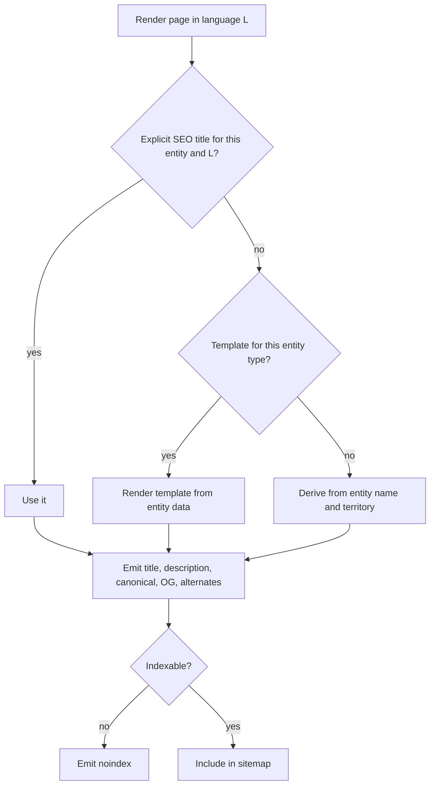

# SEO

**Version:** 0.1.2
**Status:** RFC
**Layer:** concept

## Overview

How the portal is found: the URL grammar across the active languages and three countries,
per-entity metadata, cross-language alternates, structured data, sitemaps, redirects,
indexation policy for filtered views, and the administrator-facing warnings that keep
it healthy. Derived from `[TZ]` §13, §92, §126.

## Related Specifications

- [l1-platform-foundation.md](l1-platform-foundation.md) - Public-discoverability invariant this spec implements.
- [l1-localization.md](l1-localization.md) - Supplies the language dimension and per-language slugs.
- [l1-geography.md](l1-geography.md) - Territory pages are the portal's primary organic-search surface.
- [l1-object-catalog.md](l1-object-catalog.md) - Its filter state determines what is indexable.
- [l1-object-profile.md](l1-object-profile.md) - The deepest indexable page type.
- [l1-content-publishing.md](l1-content-publishing.md) - Articles, news, and promotions are indexable surfaces.
- [l1-back-office.md](l1-back-office.md) - Hosts SEO administration and warnings.
- [l1-room-reservation.md](l1-room-reservation.md) - When active, changes an object page's structured data.

## 1. Motivation

Organic search is the portal's acquisition channel. It has no booking funnel to
retarget, no transactional email list, and no app; a visitor arrives from a query —
typed in their own language, such as "hotels Bukovel" or "cazare Chișinău" — and
either finds a territory page or does not. `[TZ]` §13 and §126 reflect that weight by
treating SEO as a module with its own administration screen and its own specialist
role, not as a set of meta tags.

The problem is also harder here than on a typical site, because three dimensions
multiply. Every page exists in every active language — two at launch, five
eventually ([l1-localization.md](l1-localization.md) §5.6); every object sits in a
territory hierarchy several levels deep; and catalog views can be filtered along a
dozen axes.
Left ungoverned, that produces enormous volumes of near-duplicate URLs — the single
most common way a catalog site damages its own search performance. Most of §3 exists
to prevent that.

## 2. Constraints & Assumptions

- Three countries, one domain, and two active languages at launch — English and
  Russian, growing to five ([l1-localization.md](l1-localization.md) §5.6, §7).
  Sitemaps, alternate links, and slug uniqueness are all built per active language,
  so the growth adds volume without changing any rule in this spec.
- SEO fields are per entity **and** per language (`[TZ]` §92).
- Entities requiring SEO data: countries, regions, districts, cities, resorts,
  categories, objects, news, promotions, articles (`[TZ]` §92).
- Territory and object volumes are large enough that sitemaps must be indexed and
  paginated rather than monolithic.
- <!-- TBD: whether country-specific domains replace the single-domain launch model
     is deferred in l1-localization.md §7. The URL grammar in §5.1 is chosen to keep
     that migration mechanical, but the decision affects hreflang and canonical
     strategy and should be settled before large-scale indexing begins. -->

## 3. Core Invariants (Layer 1 only)

### 3.1 Addressing

- **Every indexable page has exactly one canonical URL per language.** Alternate
  paths to the same content declare that canonical rather than competing with it.
- **Language is expressed in the URL**, consistently across every page type
  ([l1-localization.md](l1-localization.md) §3).
- **Slugs are per language and stable.** Changing a slug creates a permanent redirect
  from the old one; slugs are never silently reused (`[TZ]` §126 "redirects").
- **URLs are readable and hierarchical**, mirroring the territory tree so that a URL
  communicates position (`[TZ]` §13).

### 3.2 Indexation Policy

- **Filtered catalog views are not indexable by default.** A filter combination
  becomes indexable only by explicit administrator decision (`[TZ]` §126
  "filter indexation"). This is the portal's principal defence against
  near-duplicate proliferation.
- **Paginated views declare their canonical relationship** so page 2 does not compete
  with page 1.
- **Non-public content is excluded**: pending, rejected, archived, and hidden objects,
  and the entire owner cabinet and back office, are never indexable.
- Indexability is an editable per-page attribute (`[TZ]` §92 "index or do not
  index").

### 3.3 Metadata

- Every indexable page carries, per language: title, meta description, canonical URL,
  indexation directive, Open Graph title, description, and image, and a search-engine
  text block (`[TZ]` §92).
- **Templates fill the gaps.** Where an entity has no explicit title or description,
  an administrator-defined template generates one from the entity's data
  (`[TZ]` §126 "SEO title templates"). Empty metadata is never shipped.
- Every page declares its alternates in all active languages, plus a default
  ([l1-localization.md](l1-localization.md) §3).

### 3.4 Structured Data & Navigation

- Object, territory, article, and promotion pages emit structured data appropriate to
  their type (`[TZ]` §13 "Schema.org", "structured markup").
- **Structured data must not overstate.** Where the booking module is inactive, an
  object page must not emit offer availability it cannot honour
  ([l1-room-reservation.md](l1-room-reservation.md) §5.6).
- Breadcrumbs are present and marked up on every page below the home page
  (`[TZ]` §13).
- Sitemaps cover every indexable page in every language, are indexed and paginated,
  and are regenerated on content change (`[TZ]` §13).
- A robots directive and custom error pages are administrator-manageable
  (`[TZ]` §13, §126).

## 5. Detailed Design

### 5.1 URL Grammar

```plaintext
/{lang}                                              Home
/{lang}/{country}                                    Country landing
/{lang}/{country}/{region}                           Region landing
/{lang}/{country}/{region}/{district}                District landing
/{lang}/{country}/…/{settlement}                     City / resort landing
/{lang}/{country}/…/{settlement}/{type}              Typed catalog within a territory
/{lang}/o/{object-slug}                              Object profile
/{lang}/news/{slug}                                  News item
/{lang}/promotions/{slug}                            Promotion
/{lang}/blog/{slug}                                  Article
/{lang}/about | /contacts | /privacy-policy | /terms Static pages
```

Two decisions are load-bearing. Territory paths mirror the hierarchy, so a URL is
self-describing and a region page is a natural parent of its cities. Object profiles
sit on a **flat** path rather than under their full territory chain, because an object
may be recategorized or reassigned to a neighbouring resort — and under a hierarchical
object URL, every such move would break a well-ranked page and force a redirect.

Segments are per-language slugs, so the same territory reads naturally in each
language ([l1-localization.md](l1-localization.md) §5.2).

### 5.2 Metadata Resolution



### 5.3 Indexation Matrix

| Surface | Default | Notes |
| --- | --- | --- |
| Home, country, region, district, city, resort | Indexable | Primary organic surface |
| Typed catalog within a territory | Indexable | e.g. hotels in Bukovel |
| Catalog with one filter | Not indexable | Promotable per combination by an administrator |
| Catalog with several filters | Not indexable | Never promoted |
| Catalog pagination beyond page 1 | Indexable, canonical to itself | Not to page 1 — content differs |
| Object profile (published) | Indexable | Deepest surface |
| Object profile (pending, rejected, archived, hidden) | Not indexable | Also excluded from sitemaps |
| News, promotion, article | Indexable | Expired promotions redirect to the archive |
| Owner cabinet, back office | Not indexable | Also disallowed in robots |

### 5.4 Structured Data by Type

| Page | Emits |
| --- | --- |
| Object (accommodation) | Lodging entity with address, coordinates, rating, price range, amenities; offer availability **only** when the booking module is active for it |
| Object (dining) | Food-establishment entity with cuisine, price range, opening hours |
| Object (attraction) | Place entity with address and coordinates |
| Territory | Place entity plus an item list of contained objects |
| Article, news | Article entity with author, dates, and image |
| Promotion | Offer entity with validity window |
| Every page below home | Breadcrumb list |

### 5.5 Sitemaps & Redirects

A sitemap index references per-language, per-entity-type sitemaps, each paginated
within the format's limits. Regeneration is a scheduled job triggered by content
change, not a per-request computation
([l1-notifications.md](l1-notifications.md) §5.4).

A redirect table, administrator-editable (`[TZ]` §126), holds permanent redirects
from slug changes, territory reparenting, merged duplicate objects
([l1-back-office.md](l1-back-office.md) §5.7), and archived content.

### 5.6 Administration & Warnings

Per `[TZ]` §126 an SEO specialist manages titles, descriptions, page addresses,
canonicals, robots directives, Open Graph data, territory page copy, filter
indexation, title templates, the sitemap, redirects, error pages, language links, and
structured data.

The panel surfaces warnings: missing title, missing description, duplicate address,
missing translation, over-length title, and page excluded from indexing
(`[TZ]` §126). These are the health checks that make a catalog of this size
maintainable — at portal scale nobody discovers a duplicate slug by browsing.

## 6. Implementation Notes

1. Resolve slugs through an indexed lookup on `(language, entity type, slug)`, with
   the redirect table consulted on miss. Every incoming request from search hits this
   path ([l1-localization.md](l1-localization.md) §6.2).
2. Generate sitemaps as a job writing static artefacts. Computing them per request at
   this entity count is not viable, and search engines fetch them repeatedly.
3. Make indexability a property the rendering layer reads from data, never a
   hard-coded per-route decision — §3.2 requires an administrator to change it.
4. Gate structured-data emission on module state
   ([l1-feature-modules.md](l1-feature-modules.md) §5.5). Emitting availability the
   portal cannot honour is a durable trust penalty, not a cosmetic error.
5. Create the redirect entry in the same operation as the slug change. A redirect
   added later is added after the traffic has already been lost.

## 7. Drawbacks & Alternatives

**Indexing all filter combinations to maximize coverage.** The intuitive growth play
and the standard way catalog sites damage themselves: thousands of near-identical
pages dilute crawl budget and trigger duplicate-content handling. §3.2's
allowlist inverts the default deliberately — coverage is added where it is earned.

**Hierarchical object URLs** (`/ua/ivano-frankivsk/bukovel/hotel-name`). More
descriptive and fragile: `[TZ]` §50 explicitly lets an administrator move an object
between cities and resorts, which would break every such URL. The flat object path in
§5.1 accepts slightly weaker keyword signal in exchange for stability under a
first-class product operation.

**Language subdomains or country domains instead of path prefixes.** Stronger local
signal and heavier operationally — three certificates, three deployments, three
back-office contexts. Deferred with the migration path kept open
([l1-localization.md](l1-localization.md) §7).

**Deferring SEO to after launch.** The most expensive option available. URL grammar,
slug stability, and indexation policy are all decisions that become permanent the
moment pages are indexed; retrofitting them means mass redirects and a ranking reset.

## Canonical References

| Alias | Path | Purpose |
| --- | --- | --- |
| `[TZ]` | `.drafts/booking.md` | §13, §92, §126 — source requirements. |
| `[L1]` | `.design/main/specifications/l1-platform-foundation.md` | Public-discoverability invariant. |

## Document History

| Version | Date | Change |
| --- | --- | --- |
| 0.1.0 | 2026-08-05 | Initial draft derived from the client technical specification. |
| 0.1.1 | 2026-08-05 | Clarification only: restated language references as "active languages" (two at launch, five eventually) following l1-localization.md v0.2.0; no rule changed. |
| 0.1.2 | 2026-08-05 | Patch: translated quoted `[TZ]` excerpts and the §1 sample search query from Russian to English per the project's language policy; no rule changed. |
