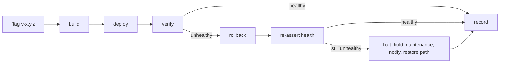

# Release Pipeline

**Version:** 0.4.0
**Status:** Stable
**Layer:** implementation
**Implements:** l1-release-operations.md

## Overview

How [l1-release-operations.md](l1-release-operations.md) is realized on this stack:
Git Flow branch names, GitHub Actions workflows, a container image as the release
artefact, a pull-and-restart deployment onto the self-hosted Docker Compose topology,
GitHub Releases as the release record, and the documentation tree that carries the
operator procedures in both launch languages plus an agent-addressed rendering.

Roughly half of this already exists and works. The quality gate
(`.github/workflows/quality.yml`) runs on every push and pull request against a real
PostGIS service container, and a versioned commit hook catches formatting before a
push. What follows is written as a **delta against that verified state**, not as a
greenfield design — §5.1 says exactly what is present today, so every later section can
be read as "what changes".

## Related Specifications

- [l1-release-operations.md](l1-release-operations.md) - The concept this implements; every invariant is mapped in §4.
- [l2-tech-stack.md](l2-tech-stack.md) - Owns the quality gate this pipeline invokes (§5.9), the production runtime topology it deploys into (§5.10), and the environment split it honours (§5.11).
- [l2-third-party-integrations.md](l2-third-party-integrations.md) - External services whose credentials this pipeline supplies to the running system without ever holding them in the repository.
- [l2-data-model.md](l2-data-model.md) - Migration set whose reversibility determines which of §5.6's two reversal paths a release qualifies for.
- [l1-localization.md](l1-localization.md) - Launch language pair the documentation tree in §5.9 is generated against.
- [l1-back-office.md](l1-back-office.md) - Administrator restore surface, which the pipeline invokes rather than reimplements.

## 1. Motivation

The implementation is finished and the portal has never been released. Nothing in the
repository states which branch is authoritative, what a release is, how one is
performed, or how one is undone — the two branches that exist (`master`, `develop`)
carry a topology by convention with no contract behind it, and the six technical
runbooks under `docs/` document the *system* thoroughly while documenting the *act of
deploying it* not at all.

That is the whole gap. This specification closes it with as little new machinery as the
invariants permit: one additional workflow, one additional artefact, one additional
documentation subtree. Where an existing mechanism already satisfies an invariant —
GitHub Releases for release records, Keep a Changelog for change sets, the built-in
health route for the health assertion — it is adopted rather than rebuilt.

## 2. Constraints & Assumptions

- **GitHub is the host.** The repository, the runner, the container registry, the
  release record, and the approval gate are all GitHub features. This is a real coupling
  and §7 states what changing it would cost.
- **The production host runs Docker Compose** ([l2-tech-stack.md](l2-tech-stack.md)
  §5.10) and can reach the container registry outbound. No inbound access from the
  runner into the host network is assumed; the host pulls.
- **Five services share one application image** — `app`, `worker`, `scheduler`,
  `pulse`, and the `nginx` that fronts them read the same build. A release is therefore
  a single image tag, never a per-service matrix.
- **PHP and Composer do not exist on the production host** outside the containers, the
  same constraint that already holds for development. Every deployment step runs either
  in the runner or inside a container.
- **One production environment.** Reversal is a redeploy of the previous image, per
  [l1-release-operations.md](l1-release-operations.md) §2.
- **The design-time tooling is absent from every job.** No workflow step, composer
  script, or documented procedure invokes it — see §4's row for invariant 3.10.

## 4. Invariant Compliance

| L1 Invariant | Implementation |
| --- | --- |
| **3.1 Gate Parity** | The gate is one command — `composer quality` — declared in `composer.json` and invoked identically by the developer and by the workflow's final step. The workflow's earlier steps provision an environment (PostGIS service container, test database, extensions, built assets); they add no assertions. The JS half (`pnpm run quality`) follows the same rule. |
| **3.2 Single Path to Production** | Deployment credentials exist only as GitHub environment secrets bound to the `production` environment, which only the release workflow can request. No developer holds a shell credential for the production host as part of normal operation; obtaining one is an incident-response act that is recorded as such. |
| **3.3 One Production Line** | `master` is the production line, protected: no direct pushes, linear history, required status checks. `develop` is integration. `feature/*` are work lines, `release/x.y.z` are release lines, `hotfix/x.y.z` is the urgent-fix path. The merge-back obligation is enforced by a workflow check, not by memory — §5.2. |
| **3.4 Reversibility** | The artefact is an immutable image digest (§5.4); rollback re-pins the previous digest and restarts (§5.6). Irreversibility is detected mechanically: a workflow step scans the release's migration set for destructive operations and fails the release unless the tag carries an explicit irreversible declaration (§5.6). |
| **3.5 Recorded Releases** | A GitHub Release per tag, its body generated from the root `CHANGELOG.md` section for that version, annotated by the deploy job with the deployed image digest, the actor, and the outcome. Rollbacks create their own release record referencing the reverted version. |
| **3.6 Secrets Never Travel With Code** | Secrets live in GitHub environment secrets and in the host's own `.env`, which is never committed ([l2-third-party-integrations.md](l2-third-party-integrations.md) §2). The image is built without any production value baked in; the one client-visible value the stack legitimately needs (the map tile credential, [l2-tech-stack.md](l2-tech-stack.md) §5.11) is supplied at asset-build time from a build secret scoped to that step. |
| **3.7 Operable Without Its Author** | `docs/operations/` (§5.9) — one file per procedure, per language, written for a reader with no technical background. Each procedure carries an explicit "you are done when" statement, because a step with no observable success condition cannot be followed by someone who has never seen it succeed. |
| **3.8 Documentation Parity** | The three renderings are checked, not trusted: an architecture-style test asserts that the English, Russian, and agent trees hold the same procedure set, and a workflow step fails a pull request that modifies an English procedure without touching its counterparts (§5.9). |
| **3.9 Automation Is Accountable** | Automation acts as a GitHub App installation with an explicit, minimal permission set — never a personal access token, never a shared account. The app is deliberately **not** an approver on the `production` environment, so the human acceptance gate cannot be satisfied by the automation that would benefit from satisfying it (§5.10). |
| **5.5.2 Standing Autonomous Operation** | The grant's sensitive-zone exemption is enforced by `.github/CODEOWNERS` (the single source of ownership patterns), an architecture test that derives its candidates by walking the real tree per zone rather than from a path list, and the `require_code_owner_reviews` protection setting that makes both branches consult it. The grant proper — an ordinary change merging unattended — is the `required_approving_review_count: 0` half of the same configuration (§5.11). |
| **3.10 The Pipeline Owns No Design Artefacts** | No workflow, composer script, package manifest, or documented procedure references the design or planning directories, and no toolchain is present for their sake — the Node runtime in CI exists for Vite and Biome, which the product needs regardless. Deleting those directories leaves every job in this specification runnable unchanged. |

## 5. Detailed Design

### 5.1 Current State

Verified against the repository, so the delta below is checkable rather than assumed.

| Present | Detail |
| --- | --- |
| `.github/workflows/quality.yml` | Single `quality` job on `push` and `pull_request`, unfiltered by branch. Provisions PHP 8.5 with the full extension set, a `postgis/postgis:18-3.6-alpine` service container matching the local stack's image tag, the dedicated test database and its three extensions, pnpm and Node 24. Runs the JS gate, a pull-request-scoped changed-file audit, the Vite build, `migrate:fresh --seed` from empty, and finally `composer quality`. |
| `.githooks/pre-commit` | Versioned, activated per clone by pointing `core.hooksPath` at it. Checks staged PHP with Pint and staged JS/CSS with Biome, inside the running container. |
| Branches | `master` (default) and `develop` on the remote. No protection rules specified anywhere. |
| `docs/` | Six technical runbooks plus an index, English, developer audience: schema, backups, restore rehearsal, production provisioning, mail and error tracking, queues and observability. |
| Tags | One historical tag, `v0.1.34`, marking the superseded implementation. |
| `CHANGELOG.md` | Keep a Changelog format, semantic versioning declared, `[Unreleased]` section maintained. |

Absent: any deployment, any release definition, any branch contract, any protection
rule, any rollback path, and any operator-audience or Russian-language documentation.

### 5.2 Branch Topology

| Line | Branch | Rules |
| --- | --- | --- |
| Work | `feature/{short-slug}` | Branched from `develop`. Merged by pull request only. Deleted on merge. |
| Integration | `develop` | Protected: pull requests only, quality gate required, code-owner review required, no approving-review count of its own (§5.11). |
| Release | `release/{x.y.z}` | Branched from `develop` at freeze. Accepts only stabilization commits. Merged to `master` **and** back to `develop`. |
| Production | `master` | Protected: pull requests only, quality gate required, code-owner review required, linear history, no force push, no deletion. Tagged on every merge. Configured identically to `develop` on both review settings (§5.11) — the standing grant reaches this line too, so a boundary weaker here than on integration would be no boundary at all. |
| Urgent fix | `hotfix/{x.y.z}` | Branched from `master`. Merged to `master` **and** back to `develop`. The merge-back is a required check, not a convention. |

The merge-back obligation ([l1-release-operations.md](l1-release-operations.md) §3.3)
is the rule most often honoured in the first month and forgotten in the sixth, so it is
mechanical: a scheduled workflow fails when `master` holds a commit that is not an
ancestor of `develop`, naming the commit and the branch that should have carried it
back. This is a **detector, not a gate** — it cannot block a production fix, and
blocking one to enforce bookkeeping would be the wrong trade during an incident.

### 5.3 Workflow Inventory

Two workflows, deliberately. The project owner asked for as much CI/CD as is necessary
and no more, and each additional workflow is a thing that can silently stop running.

**`quality.yml` — the gate.** Exists. Two changes:

1. Scope its triggers to pull requests targeting `develop` or `master`, and to pushes
   on those two branches. Today it runs on every push to every branch, which spends
   runner minutes proving that an in-progress work line is in progress.
2. Add the documentation parity check (§5.9) and the destructive-migration scan (§5.6)
   as steps, so both fail at review time rather than at release time.

**`release.yml` — the release.** New. Triggered by pushing a `v{x.y.z}` tag on
`master`. Three jobs in sequence:



- **build** — builds the application image, tags it with the version and with the
  commit, pushes it to the registry, and emits the immutable digest as its output. The
  Vite build happens here, inside the image, so shipped assets and shipped code cannot
  disagree.
- **deploy** — gated by the `production` GitHub environment, whose required reviewers
  are the human acceptance point of
  [l1-release-operations.md](l1-release-operations.md) §5.2. Pins the digest, puts the
  application into maintenance mode, runs migrations, restarts the five services on the
  new image, leaves maintenance mode.
- **verify** — polls the built-in health route until healthy or until the budget
  expires. Failure triggers **rollback** automatically, without waiting for a person.
- **record** — writes the release record either way (§5.7).

The workflow declares a **single concurrency group covering the whole production
environment**, not one per tag — that is what serializes releases per
[l1-release-operations.md](l1-release-operations.md) §5.6. Two tags pushed minutes
apart queue; they do not both reach `deploy`. Queued releases are not cancelled: a
cancelled release that had already migrated is exactly the half-applied state the
serialization exists to prevent, so a waiting release waits.

### 5.4 The Release Artefact

One image, five consumers. Built once in `build` and never rebuilt: `deploy` and any
later rollback address it by **digest**, not by tag, so a re-pushed tag cannot silently
change what "the previous release" means.

```plaintext
ghcr.io/{owner}/booking@sha256:{digest}
   ├── app         PHP-FPM, the application
   ├── worker      Horizon
   ├── scheduler   the scheduler process
   ├── pulse       the Pulse ingest worker
   └── (nginx serves the built assets from the same image layer)
```

Infrastructure services — PostgreSQL, Redis, object storage — are not part of the
artefact. They are provisioned once and outlive releases, which is exactly why a schema
change is the asymmetric part of §5.6.

### 5.5 Deployment

The host pulls; the runner never reaches into the host network. Sequence, and the reason
each step is where it is:

1. **Pin the new digest** in the host's compose configuration. Nothing has changed yet —
   this step is reversible by writing the old value back, which is what makes §5.6
   cheap.
2. **Enter maintenance mode** with a bypass secret, so an operator can verify the new
   release before visitors reach it.
3. **Run migrations** with the framework's forced, non-interactive flag. This is the
   only irreversible step, and §5.6 is entirely about knowing that in advance.
4. **Restart the five services** onto the new digest. `nginx` last, so the first request
   served by the new front end reaches an application that has already started.
5. **Warm the caches** the application expects in production — configuration, routes,
   events, views. A cold production cache is not a fault, but it makes the first
   requests after every release look like a performance regression in the very budgets
   [l2-tech-stack.md](l2-tech-stack.md) §5.9 sets.
6. **Leave maintenance mode.**

The scheduler and queue workers are restarted rather than reloaded: both hold resolved
application state from process start, and a worker running yesterday's code against
today's schema is a class of bug that produces no error message.

### 5.6 Reversal, and Knowing Which Kind

Two paths, chosen before the release rather than during the incident.

**Rollback** — re-pin the previous digest, restart, verify. No migration is run, no
data is touched. Automatic on a failed health assertion; available to an operator on
demand from a documented procedure. This is the path for every release that did not
change the schema destructively.

**Restore** — the administrator-initiated backup restore already specified by `[TZ]`
§97 and §131 and implemented behind its re-confirmation and elevated-authorization gate
([l1-back-office.md](l1-back-office.md)). Slower, gated, and able to lose data written
since the backup. This is the path for an irreversible release, and it is the reason
irreversibility must be known in advance.

The declaration is not left to judgement. A workflow step scans the migrations
introduced since the previous tag for destructive operations — dropping a table,
dropping a column, narrowing a type, removing a constraint that data depends on — and
fails the release unless the tag's own annotation explicitly declares it irreversible.
The scan is deliberately noisy in one direction: it would rather flag a reversible
change for a human to confirm than let an irreversible one deploy silently. A false
positive costs one sentence in a tag annotation; a false negative costs the restore
path during an outage.

**When the rollback is also unhealthy**, the pipeline stops. Health is re-asserted once
after a rollback — an assertion, not another deployment — and a second failure ends the
workflow **without attempting a second rollback**: the portal is left in maintenance
mode, the release record states that both the release
and its predecessor failed their health assertion, and the operators are notified with a
pointer to the restore procedure. This is
[l1-release-operations.md](l1-release-operations.md) §5.6's escalation obligation made
concrete, and its purpose is narrow — a second failed assertion means the fault is
almost certainly the host, the database, or an external dependency rather than the
image, and an automation that keeps redeploying is both useless against that and loud
enough to mask it.

### 5.7 Release Records and Versioning

Semantic versioning, tags shaped `v{x.y.z}`, continuing the existing sequence.

The record is a GitHub Release created by the `record` job, its body assembled from the
`CHANGELOG.md` section for that version — which the project already maintains in Keep a
Changelog format, so no second change log is introduced. The job appends what only it
knows: the deployed image digest, the actor or automation identity, the timestamp, the
irreversibility declaration, and the outcome.

A rollback creates its own release record — same shape, naming the version it reverted
to and the version it reverted from — because
[l1-release-operations.md](l1-release-operations.md) §3.4 makes a reversal a release,
and a reversal that leaves no trace is how a production state becomes unexplainable
three weeks later.

### 5.8 Secrets

Three tiers, and the boundary between them is what keeps §3.6 true:

| Tier | Holds | Reaches |
| --- | --- | --- |
| Repository secrets | Registry credentials, the automation app's key | The `build` job only |
| `production` environment secrets | Host access, deployment target, maintenance bypass | The `deploy` job only, after the environment's reviewers approve |
| The host's own `.env` | Every application runtime credential — database, Redis, storage, SMTP, error tracking, tile provider | The running containers only; never the runner, never the image |

The image is built with no production value inside it. The single exception is the
client-side map tile credential, which is public by construction once shipped
([l2-tech-stack.md](l2-tech-stack.md) §5.11) and is supplied to the asset build as a
scoped build argument — recorded here explicitly so that it is a decision rather than a
leak nobody noticed.

### 5.9 Documentation Layout

```plaintext
docs/
├── README.md                    # index (exists)
├── database-schema.md           # (exists)
├── backups.md                   # (exists)
├── restore-rehearsal.md         # (exists)
├── production-provisioning.md   # (exists)
├── mail-and-error-tracking.md   # (exists)
├── queues-and-observability.md  # (exists)
├── release/                     # developer audience, English
│   ├── branching.md             # the branch model and why it is shaped this way
│   └── pipeline.md              # the workflows, what each proves, how to change one
└── operations/                  # operator and agent audiences
    ├── en/
    │   ├── deploy.md
    │   ├── rollback.md
    │   ├── restore.md
    │   ├── rotate-credentials.md
    │   ├── run-scheduled-job.md
    │   └── read-a-failed-pipeline.md
    ├── ru/                      # same file names, same procedures
    └── agent/                   # same procedures, machine-addressed
        └── *.prompt.md
```

Three deliberate choices:

**Matching file names across `en/` and `ru/`.** Parity is then a set comparison rather
than a translation-mapping table, which is what makes the check in the next paragraph a
few lines instead of a subsystem.

**The agent tree is English-only.** Its reader is a model, not a person, and a second
translation of machine-addressed instructions doubles the parity surface while serving
nobody. Where an agent must produce text for an operator, it renders from the operator
tree in that operator's language.

**Parity is enforced, not requested.** An architecture-style test asserts the three
trees hold the same procedure set, and a workflow step fails a pull request that edits
an English procedure without touching its Russian and agent counterparts. Discipline
alone does not hold this at any team size, and a stale procedure is discovered by the
person who most needs it to be correct.

Each operator procedure follows one shape: what you need before starting, the numbered
steps, one observable result per step, "you are done when", and what to do when a step
does not produce its result. The last element is the one usually omitted and the one an
operator actually reaches for.

### 5.10 Automation Identity

A GitHub App installation, not a personal access token and not a shared account, so
that its actions are attributable to it rather than to whoever created its credential.

| Granted | Withheld, deliberately |
| --- | --- |
| Read repository contents | Repository administration — it cannot change its own permissions |
| Open, update, and merge pull requests into `develop` **and `master`**, for a change [l1-release-operations.md](l1-release-operations.md) §5.5.2 covers | Approving its own review on any change §5.5.2 does not cover — a sensitive-zone change or an undeclared irreversible migration always waits for a person's grant |
| Push tags **it did not request the merge of** — see below | Pushing the tag that starts a deploy; membership in the `production` environment's reviewer list |
| Comment, label, and report | Any credential in the `production` tier of §5.8 |

The withheld column is the point. Automation may advance a change that has passed its
gate, cut a candidate, and — since [l1-release-operations.md](l1-release-operations.md)
§5.5.2 — accept an ordinary one into `master` itself; trigger a rollback; and report on
all of it. It cannot grant the review that admits a sensitive-zone or irreversible
change, because an identity that can both request and grant its own promotion has no
gate at all — §5.5.2 excludes exactly that case rather than widening to cover it. And
it cannot push the tag that starts a deploy, ever, regardless of which line of the two
rows above authorized the change reaching `master`: reaching the production line is not
deploying it ([l1-release-operations.md](l1-release-operations.md) §5.2), and the
person who triggers a deploy is unconditional, not narrowed by anything this table
grants.

**Before this identity exists.** `T-8A01`'s branch protection and `T-8E02`'s
`production` environment can both be built before the GitHub App above is ever
installed — [l1-release-operations.md](l1-release-operations.md) §5.5.1's
development-phase exception covers exactly this ordering. The same is true of §5.5.2's
standing grant once it takes effect: every merge into `develop` or `master` it
authorizes still runs under whichever credential actually calls the GitHub API, which
is the owner's own authenticated session until this identity is installed — §3.9's
interim clause names this explicitly rather than leaving it implied. GitHub attributes
those API calls to whichever credential ran them; before the app exists, that is the
owner's own authenticated session, not a separate automation identity. This is a known,
accepted property of the pre-launch phase, not a gap in this section's own design —
this table governs what the automation identity itself may hold once installed, not
who was permitted to click the button before it existed.

### 5.11 Sensitive-Zone Enforcement

[l1-release-operations.md](l1-release-operations.md) §5.5.2 lets an ordinary change
merge without a person granting review, and exempts a declared set of sensitive zones
from that grant. This section is how the exemption is enforced on this stack. It has
two halves, and §5.5.2's own warning applies: neither may be inferred from the other.

**The ownership file is the single source.** `.github/CODEOWNERS` maps each zone §5.5.2
declares onto the paths that hold it, with the project owner as the named owner of every
entry. Patterns are globs rather than one line per file, so the next file in a zone is
covered on the day it is written rather than on the day somebody remembers the file
exists. Three entries deserve their own note:

- **Empty zones are still declared.** `app/Http/Middleware/Authenticate*` matches nothing
  today; it is listed so a published copy of that middleware arrives owned.
- **Money extends past the models and services** to every admin surface built over them,
  matched wherever nested — an exporter or a form schema under a financial resource
  writes the same records the service does.
- **The boundary owns itself.** Both the ownership file and the test below name the owner
  as their own code owner. A boundary that can rewrite or silence itself under the grant
  it enforces is not a boundary.

**The check derives its candidates from the tree, never from a list.** An architecture
test walks the real directories per zone and asserts that every file it finds matches
some pattern in the ownership file. The direction is the whole design: a test proving
that a hand-written list of paths is covered proves only that the list is covered, and
the list is the same human memory the mechanism exists to replace — so a policy or admin
surface added tomorrow is absent from both, and the suite stays green over a real hole.
Walking the tree instead means a new file in a declared zone fails the gate at the moment
it is written. A companion assertion fails when any zone stops discovering files at all,
which is how a renamed directory announces itself instead of silently emptying its own
rule. The committed dotenv files are derived from the ignore file's negation lines rather
than repeated, so committing a new one puts it under the check automatically.

**The protection settings are what make the check bite.** An ownership file forces
nothing on its own — it takes effect only where a branch's protection requires a code
owner's review. Both protected branches are therefore configured identically:

| Setting | Value | Why |
| --- | --- | --- |
| `require_code_owner_reviews` | `true` | The sensitive-zone exemption. Without it the ownership file is decorative. |
| `required_approving_review_count` | `0` | §5.5.2's grant proper: an ordinary change clears the quality gate and merges unattended. A non-zero count here would require a person for *every* change and the grant would not be operative on that branch at all. |
| Required status check | `composer quality` | §3.1's gate parity — the same command a developer runs. |
| `enforce_admins` | `true` | The owner's own account is not exempt either. Stronger than this section strictly requires, and deliberately so: an exemption that exists only for the person who configured the boundary is the exemption most likely to be used without thinking. |

If the named code owner is unavailable, a sensitive-zone change does not merge. That is
the intended failure direction — this boundary fails closed, and an urgent fix that
genuinely cannot wait takes §5.6's urgent-fix path under a person's judgement rather
than by weakening the setting.

**The order these two settings are changed in is a safety property, not a preference.**
Enabling the code-owner requirement is always the first step and lowering the approving
count always the second. Performed the other way round, the branch spends the interval
between them with no approving-review requirement *and* no code-owner requirement — a
window in which any change at all, sensitive or not, merges unattended. The window looks
like an improvement while it is open, which is precisely why the order is written down
here rather than left to whoever performs the change. Any future revision of these
settings inherits the same constraint: never remove a guarantee before its replacement
is in place and verified.

**What this does not do.** It does not gate the deploy — reaching `master` is not
deploying it ([l1-release-operations.md](l1-release-operations.md) §5.2), and the
`production` environment's own reviewer gate (§5.10) is independent of everything here.
It does not decide irreversibility. And it cannot be verified by reading the repository
alone: the protection settings live in GitHub's own configuration, not in a file, so
confirming this section holds means reading them back through the API and comparing them
against the table above. That read-back is the only evidence that both halves are
present — and it is worth repeating after any change to either, not only once.

## 6. Implementation Notes

Order matters here more than usual, because several steps are cheap now and expensive
after the first real release.

1. **Branch protection and the branch contract** — no artefact, no runner minutes, and
   it is what stops the topology from being retro-fitted onto history later.
2. **Scope the existing quality gate's triggers** — small, immediate, and independent of
   everything below.
3. **Build and publish the image** — end-to-end to the registry, with nothing deploying
   it yet. Proves the artefact before anything depends on it.
4. **The `production` environment and its reviewers** — before the deploy job exists, so
   the first deploy is gated rather than gated retroactively.
5. **Deploy, verify, rollback** — as one unit. A deploy path shipped without its
   rollback path is exactly the state
   [l1-release-operations.md](l1-release-operations.md) §3.4 forbids, and "we will add
   rollback next" is how it stays that way.
6. **The destructive-migration scan** — before the first release that changes the schema,
   which in practice means before the first release.
7. **The documentation tree and its parity check together.** The check is what makes the
   tree survive; a tree added without it is three trees that agree only on the day they
   were written.
8. **Rehearse the whole path on a disposable host** — a real release, a real rollback,
   performed by someone following the operator document rather than by its author. This
   is the acceptance criterion for the whole specification, and it mirrors the restore
   rehearsal the project already performed rather than trusted.

## 7. Drawbacks & Alternatives

**Everything is coupled to GitHub.** Runner, registry, release record, approval gate,
and automation identity are all one vendor's features. The coupling is real and the exit
cost is honest: the branch topology, the artefact model, and the documentation tree are
portable unchanged; the two workflows and the environment approval gate would be
rewritten. That is a day of work against a saving of building an approval mechanism, a
release record store, and an artefact registry that this project has no other reason to
own.

**Deploying by pulling on the host, rather than pushing from the runner**, was chosen
because it keeps the production host's inbound surface closed. The cost is that the host
needs registry credentials and outbound reach, and that a deploy failure is observed
indirectly through the health assertion rather than directly through a failing SSH
command. The health assertion has to exist regardless, so the second half of that cost
is not new.

**Building the image in the release job rather than on merge to `master`** trades a
slower release for a simpler invariant: exactly one build exists per version, and it is
the one that was accepted. Building earlier and promoting the artefact would be faster
and would introduce a second question — whether the promoted build is still the accepted
one — that this project does not need to answer.

**A migration-reversibility scan rather than requiring reversible migrations.** The
stricter rule — every migration must define its own reversal — was rejected because it is
routinely satisfied by writing a reversal that has never been executed, which is worse
than an honest declaration of irreversibility: it produces confidence in a path nobody
has tested. The scan asks for a statement of fact instead.

**One workflow instead of two**, folding release into the gate, was rejected: a
tag-triggered release and a pull-request-triggered gate have different triggers,
different permissions, and different secrets, and merging them means the gate runs with
deployment credentials in scope.

## Canonical References

| Alias | Path | Purpose |
| --- | --- | --- |
| `[L1]` | `.design/main/specifications/l1-release-operations.md` | The invariants §4 maps; read before changing anything here. |
| `[GATE]` | `composer.json` | The `quality` script — the single definition of what the gate checks, invoked identically locally and in CI. |
| `[CI]` | `.github/workflows/quality.yml` | The existing gate workflow this specification modifies rather than replaces. |
| `[COMPOSE]` | `docker-compose.yml` | The five services a release restarts and the infrastructure services it must not. |
| `[CHANGELOG]` | `CHANGELOG.md` | Source of each release record's body; already Keep a Changelog with semantic versioning declared. |
| `[DOCS]` | `docs/README.md` | The existing documentation index the new trees extend. |
| `[OWNERS]` | `.github/CODEOWNERS` | The single source of sensitive-zone ownership patterns (§5.11); the protection settings that make it bite live in GitHub's configuration, not in any file here. |

## Document History

| Version | Date | Change |
| --- | --- | --- |
| 0.1.0 | 2026-08-20 | Initial draft. Establishes the Git Flow branch contract over the existing `master`/`develop` pair, one new tag-triggered release workflow beside the existing quality gate, an immutable image digest as the release artefact, pull-based deployment with automatic health-assertion rollback, a mechanical destructive-migration scan gating the irreversibility declaration, GitHub Releases as the record, and a three-rendering documentation tree (English, Russian, agent) with enforced parity. Written as a delta against the repository's verified current state, recorded in §5.1. |
| 0.2.0 | 2026-08-21 | §5.10 gains a note on the development-phase ordering: branch protection and the `production` environment can exist before the automation identity does, per [l1-release-operations.md](l1-release-operations.md) §5.5.1 — this section's own withheld-permissions design still governs the identity once installed, unaffected. Companion to that spec's own 0.2.0. |
| 0.3.0 | 2026-08-21 | §5.10's granted/withheld table extends to `master`: the automation identity may merge an ordinary change (one carrying no sensitive-zone touch and no undeclared irreversible migration) into `master` itself, not only `develop` — matching [l1-release-operations.md](l1-release-operations.md) §5.5.2's new standing grant. Pushing the tag that starts a deploy stays withheld unconditionally, regardless of which line authorized the `master` change; reaching `master` is never deploying it. Companion to that spec's own 0.3.0. |
| 0.4.0 | 2026-08-21 | New §5.11 (Sensitive-Zone Enforcement) — the section the first re-review of 0.3.0 found missing entirely: `.github/CODEOWNERS` as the single source of ownership patterns, an architecture test deriving its candidates by walking the real tree per zone rather than from a hand-written path list, and the `require_code_owner_reviews` / `required_approving_review_count` protection settings that make the check actually block a merge. States the ordering constraint between those two settings as a safety property — enabling code-owner review always precedes lowering the approving count, since the reverse order opens a window with neither guarantee — and states what the mechanism deliberately does not gate. §5.2's branch topology table is corrected to match: both protected branches require code-owner review and carry no approving-review count of their own, where the table previously described `develop` as requiring one approving review and said nothing about code owners on either line. §4 gains a compliance row for [l1-release-operations.md](l1-release-operations.md) §5.5.2, which had none. |
