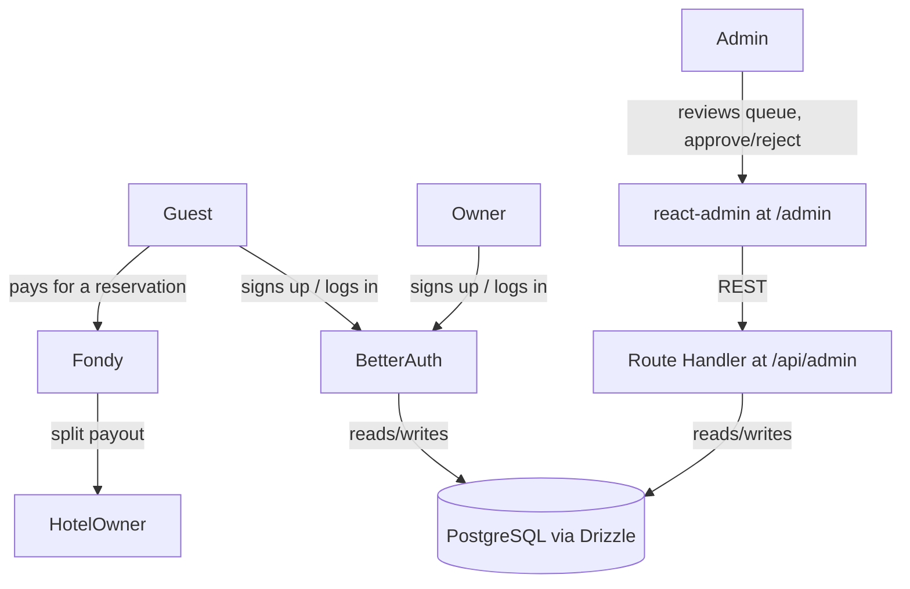

# Third-Party Integrations

**Version:** 0.2.0
**Status:** Stable
**Layer:** implementation
**Implements:** l1-platform-foundation.md

## Overview

Selection of ready-made, integrable solutions for authentication, payment
processing, and the internal admin/moderation panel — resolving the actor-role,
payment, and moderation-checkpoint questions left open across
[l1-platform-foundation.md](l1-platform-foundation.md),
[l1-room-reservation.md](l1-room-reservation.md), and
[l1-property-onboarding.md](l1-property-onboarding.md). Selection criterion, per
the request, is integration speed over building from scratch.

## Related Specifications

- [l1-platform-foundation.md](l1-platform-foundation.md) - Invariants this spec implements (actor roles, moderation checkpoint).
- [l1-room-reservation.md](l1-room-reservation.md) - Consumer of the payment integration; resolves its inquiry-vs-booking question.
- [l1-property-onboarding.md](l1-property-onboarding.md) - Consumer of the auth + admin/moderation integration.
- [l1-hotel-profile.md](l1-hotel-profile.md) - Consumer of the auth integration (review authorship).
- [l1-content-publishing.md](l1-content-publishing.md) - Consumer of the admin integration (article authorship).
- [l2-tech-stack.md](l2-tech-stack.md) - Sibling L2; this spec assumes its Next.js/TypeScript/PostgreSQL/Drizzle choices.

## 1. Motivation

Three of the platform's open product questions — who a user is, how a
reservation gets paid, and who approves owner-submitted content — all resolve
to the same underlying need: don't hand-build auth, payment processing, or a
back-office UI when mature, integrable solutions exist. This spec names those
solutions and the reasoning that ties them back to what the domain specs
actually require.

## 2. Constraints & Assumptions

- **Market signal from the design**: hotel prices in the Figma source are
  denominated in hryvnia ("грн"/UAH), not a currency Stripe settles for
  Ukraine-domiciled merchants. This is the deciding fact for the payment
  selection below.
  <!-- TBD: whether the operating legal entity is Ukraine-domiciled or
       registered abroad (e.g. US/EU) is unknown and changes whether Stripe
       becomes viable; assumed Ukraine-domiciled per the currency evidence
       until confirmed otherwise. -->
- Assumes the data layer from [l2-tech-stack.md](l2-tech-stack.md) (PostgreSQL +
  Drizzle ORM) as the integration point for all three solutions below.
- **Automated payout to hotel owners vs. manual reconciliation** is a business-
  process decision, not a technical one.
  <!-- TBD: the payment provider below supports automated marketplace split
       payments, but whether the business wants that at launch (vs. a simpler
       MVP where the platform collects payment and reconciles/pays hotel
       owners manually offline) is unresolved and affects onboarding/KYB scope
       for hotel owners. -->

## 3. Core Invariants (Layer 1 only)

N/A — this is an L2 spec; see [l1-platform-foundation.md](l1-platform-foundation.md) §3 for the invariants it implements.

## 4. Invariant Compliance

| L1 Invariant | Implementation |
| --- | --- |
| Actor roles (guest vs. property owner) | Better Auth's custom-fields/roles mechanism models a `role: guest \| owner \| admin` on the user record; both actor types authenticate through the same integration. |
| Content moderation checkpoint | [MODIFIED] A react-admin back office (§5.3) gives an operator a review queue with Approve/Reject actions over pending hotels, rooms, reviews, and articles; the checkpoint is enforced at the data layer (`status` field), not just in the UI. |
| Media resilience / hotel-room hierarchy | Unaffected by this spec — see [l2-tech-stack.md](l2-tech-stack.md). |

## 5. Detailed Design

### 5.1 Authentication — Better Auth

**Decision**: Better Auth (self-hosted, open-source, TypeScript-first).

**Reasoning**: it ships a first-party Drizzle adapter (auth tables live in our
own schema rather than a vendor's), supports OAuth + passkeys + MFA + custom
fields out of the box, and is free — matching the "integrate, don't build"
brief without introducing a recurring per-user vendor cost or handing user data
to a third party. Clerk is the noted alternative (see §7) if the team later
prioritizes a fully-hosted, zero-maintenance auth UI over data ownership; plain
Auth.js is not recommended — per current guidance it lacks built-in MFA/RBAC
that this project needs for the guest/owner/admin distinction.

Resolves: both the guest and property-owner flows now sit behind account
creation/login; property submission ([l1-property-onboarding.md](l1-property-onboarding.md))
requires an authenticated owner account, and reviews
([l1-hotel-profile.md](l1-hotel-profile.md)) are attributable to an
authenticated guest.

### 5.2 Payment — Fondy (primary), WayForPay (alternative)

**Decision**: Fondy, for its documented marketplace split-payment API.

**Reasoning**: the platform is a two-sided marketplace — a guest pays for a
reservation, but the money is ultimately owed to the hotel, minus platform
commission. Fondy's split-payment product handles exactly this (percentage or
fixed-amount splits, configurable payout schedule, per-recipient KYC/KYB) as a
ready-made integration rather than building payout reconciliation from scratch.
It also supports UAH natively plus card wallets (Apple Pay/Google Pay).
WayForPay (NBU + Czech National Bank licensed, flat 2.5% fee, supports
recurring payments and bank installments) is a valid simpler alternative if the
business chooses manual/offline payout reconciliation for MVP instead of
automated splits (see the open business-process question in §2) — it is not a
worse product, just a different-shaped one for a single-recipient flow. Stripe
is excluded for a Ukraine-domiciled entity per §2's evidence.

Resolves: [l1-room-reservation.md](l1-room-reservation.md)'s central open
question. A reservation is a paid booking, not a contact inquiry — the room
popup's "feedback" action is superseded by a payment step once dates/guests are
confirmed.

### 5.3 Admin / Moderation — react-admin via shadcn-admin-kit

**Decision** [MODIFIED]: **react-admin**'s headless core (`ra-core`) through
**shadcn-admin-kit**, mounted as a client-side admin surface at `app/admin/`,
reading and writing through a REST Route Handler at `app/api/admin/` that this
project implements over Drizzle.

**Reasoning**: this replaces the original AdminJS selection, which was found
during Phase 2 planning to be unimplementable on the stack this project has
already committed to (full evidence in §7). The replacement was chosen against
three constraints the original pick failed:

1. **It runs on the App Router.** react-admin documents Next.js App Router
   integration first-party: the admin app is a `"use client"` component, and its
   data provider talks to a catch-all Route Handler. It is a client-side React
   application, not server middleware, so it needs nothing from the server
   framework that the App Router withholds.
2. **It uses this project's existing design system.** `shadcn-admin-kit` is
   maintained by marmelab (the react-admin team), built on `ra-core`, and renders
   through shadcn/ui + Radix — the same layer [l2-tech-stack.md](l2-tech-stack.md)
   §5.3 already commits to. No second UI system enters the codebase, and the back
   office is on-brand by construction rather than by later theming work.
3. **It preserves the integrate-over-build criterion.** Its guessers scaffold
   working List / Show / Edit pages from a resource's shape, and custom actions
   ("Approve", "Reject" with a reason) attach per-resource — the same property
   that motivated the original AdminJS choice, which no other surviving candidate
   offered.

**What this project implements** (the deliberate, bounded cost): no react-admin
data provider exists for Drizzle — and none exists for Refine either, so this
cost is common to every remaining option rather than specific to this one. One
catch-all Route Handler implements the `ra-data-simple-rest` contract
(filter / sort / pagination via `Content-Range`) over the existing Drizzle client
from [l2-tech-stack.md](l2-tech-stack.md) §5.4. This is an adapter the project
owns, in place of a vendor adapter that does not exist.

**Authorization is a hard requirement of the REST surface, not of the UI.** This
follows directly from the architecture change: the previous selection was server
middleware that carried its own gate, whereas this admin surface is a client-side
application and therefore cannot be a security boundary. Every request to
`app/api/admin/` MUST be rejected unless it carries a session whose account has
`role = 'admin'` (§5.1), independently of what the client renders. Hiding or
omitting a control in the admin UI is a usability affordance and never an access
control — an ungated handler would leave the moderation checkpoint bypassable by
direct request, defeating the invariant this section exists to satisfy.

Scope stays as before: the four resources with a moderation need — hotels, rooms,
reviews, and articles. The checkpoint itself remains enforced at the data layer
(`status` column), not in this UI; the admin surface is an operator view onto it.

Resolves: the moderation-checkpoint mechanism referenced but undesigned in
[l1-property-onboarding.md](l1-property-onboarding.md) and the news-authorship
question in [l1-content-publishing.md](l1-content-publishing.md) — platform
admins author/approve hotel-scoped news through this panel; hotel owners do not
author news directly, keeping one authorship path instead of two.

### 5.4 Integration Points

## 6. Implementation Notes

1. Better Auth first — every other item in this spec (owner-gated submission,
   attributable reviews, admin-panel operator accounts) depends on it existing.
2. [MODIFIED] The admin surface (§5.3) second, scoped initially to the resources
   with a moderation need: hotels, rooms, reviews (plus blog articles per
   [l1-content-publishing.md](l1-content-publishing.md)). [MODIFIED] Build the
   REST Route Handler (§5.3) before the admin screens — the guessers scaffold
   from live resource responses, so the data surface has to exist first.
3. Fondy last, once the reservation data model
   ([l1-room-reservation.md](l1-room-reservation.md)) has a concrete "paid"
   state to transition into — do not integrate payment before that model is
   updated.

## 7. Drawbacks & Alternatives

- **Clerk instead of Better Auth**: faster initial setup, fully hosted, but
  recurring per-MAU cost and user data leaves the project's own database —
  rejected for v1 given the "own the stack" direction already set in
  [l2-tech-stack.md](l2-tech-stack.md) (Drizzle over a managed BaaS).
- **WayForPay instead of Fondy**: valid if the business decides against
  automated split payouts (see §2); revisit if that business question resolves
  toward "manual reconciliation is fine for MVP."
- **AdminJS** [MODIFIED] — the original §5.3 selection, **rejected on
  implementability**, not on merit. It cannot mount in this application:
  AdminJS ships framework plugins for Express, Fastify, NestJS, Koa, and Hapi,
  but none for Next.js; the only public integration is a third-party demo
  repository that states it "needs to be setup with the pages router because the
  App Router doesn't have an option to disable the body parser", while
  [l2-tech-stack.md](l2-tech-stack.md) §5.1 commits this project to the App
  Router. Separately, the `adminjs-drizzle` adapter its reasoning depended on is
  an unofficial community package (v0.1.2, roughly a year without a release);
  no `@adminjs/drizzle` exists. Both pillars of the original rationale —
  auto-generated CRUD from Drizzle, and mounting as a route inside this
  application — therefore fail against the committed stack.
- **Refine instead of react-admin** [MODIFIED] — rejected. Its UI kits are Ant
  Design, MUI, Chakra, and Mantine; there is no shadcn kit, so adopting it means
  either a second design system in the codebase (against
  [l2-tech-stack.md](l2-tech-stack.md) §5.3) or using it headless and building
  every admin screen by hand anyway. It has no Drizzle data provider either, so
  it carries the same adapter cost as §5.3's choice without the on-brand
  rendering that offsets it. The earlier claim in this section — that Refine
  would be the pick "if the back office needs to visually match the shadcn/ui
  brand" — was factually wrong and is corrected here.
- **A hand-built moderation queue** — viable and genuinely small (four
  resources, one `status` transition plus a reason), and it needs no new
  dependency. Rejected as the default because it abandons the integrate-over-build
  criterion this spec is written against, and because §5.3's choice delivers
  list/filter/sort/pagination, forms, and i18n that would otherwise be written
  by hand. It remains the documented fallback if react-admin's client-side
  bundle or its REST adapter proves disproportionate in practice.

## Canonical References

| Alias | Path | Purpose |
| --- | --- | --- |
| `[L1]` | `.design/main/specifications/l1-platform-foundation.md` | Invariants this spec implements. |
| `[L2-STACK]` | `.design/main/specifications/l2-tech-stack.md` | Base stack this spec integrates into. |

## Document History

| Version | Date | Change |
| --- | --- | --- |
| 0.1.0 | 2026-07-30 | Initial draft: Better Auth, Fondy (primary)/WayForPay (alternative), AdminJS. |
| 0.2.0 | 2026-07-30 | Replaced AdminJS in §5.3 with react-admin via shadcn-admin-kit — AdminJS cannot mount in a Next.js App Router application. Updated §4, §5.4, §6.2, and §7 accordingly; corrected §7's factually wrong claim that Refine offers shadcn brand matching. Added the admin REST surface's authorization requirement, which the previous server-mounted design carried implicitly. |
