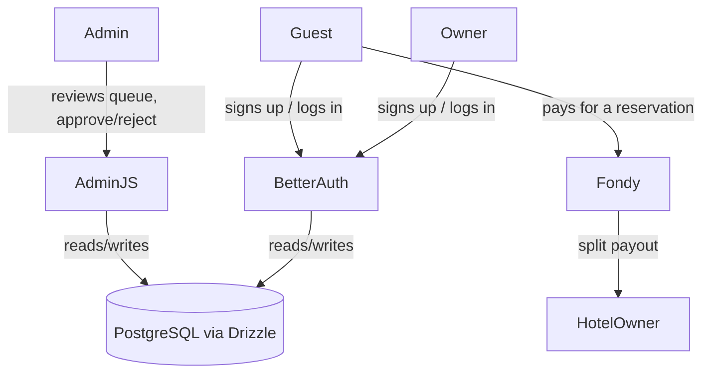

# Third-Party Integrations

**Version:** 0.1.0
**Status:** Draft
**Layer:** implementation
**Implements:** l1-platform-foundation.md

## Overview

Selection of ready-made, integrable solutions for authentication, payment
processing, and the internal admin/moderation panel — resolving the actor-role,
payment, and moderation-checkpoint questions left open across
[l1-platform-foundation.md](l1-platform-foundation.md),
[l1-room-reservation.md](l1-room-reservation.md), and
[l1-property-onboarding.md](l1-property-onboarding.md). Selection criterion, per
the request, is integration speed over building from scratch.

## Related Specifications

- [l1-platform-foundation.md](l1-platform-foundation.md) - Invariants this spec implements (actor roles, moderation checkpoint).
- [l1-room-reservation.md](l1-room-reservation.md) - Consumer of the payment integration; resolves its inquiry-vs-booking question.
- [l1-property-onboarding.md](l1-property-onboarding.md) - Consumer of the auth + admin/moderation integration.
- [l1-hotel-profile.md](l1-hotel-profile.md) - Consumer of the auth integration (review authorship).
- [l1-content-publishing.md](l1-content-publishing.md) - Consumer of the admin integration (article authorship).
- [l2-tech-stack.md](l2-tech-stack.md) - Sibling L2; this spec assumes its Next.js/TypeScript/PostgreSQL/Drizzle choices.

## 1. Motivation

Three of the platform's open product questions — who a user is, how a
reservation gets paid, and who approves owner-submitted content — all resolve
to the same underlying need: don't hand-build auth, payment processing, or a
back-office UI when mature, integrable solutions exist. This spec names those
solutions and the reasoning that ties them back to what the domain specs
actually require.

## 2. Constraints & Assumptions

- **Market signal from the design**: hotel prices in the Figma source are
  denominated in hryvnia ("грн"/UAH), not a currency Stripe settles for
  Ukraine-domiciled merchants. This is the deciding fact for the payment
  selection below.
  <!-- TBD: whether the operating legal entity is Ukraine-domiciled or
       registered abroad (e.g. US/EU) is unknown and changes whether Stripe
       becomes viable; assumed Ukraine-domiciled per the currency evidence
       until confirmed otherwise. -->
- Assumes the data layer from [l2-tech-stack.md](l2-tech-stack.md) (PostgreSQL +
  Drizzle ORM) as the integration point for all three solutions below.
- **Automated payout to hotel owners vs. manual reconciliation** is a business-
  process decision, not a technical one.
  <!-- TBD: the payment provider below supports automated marketplace split
       payments, but whether the business wants that at launch (vs. a simpler
       MVP where the platform collects payment and reconciles/pays hotel
       owners manually offline) is unresolved and affects onboarding/KYB scope
       for hotel owners. -->

## 3. Core Invariants (Layer 1 only)

N/A — this is an L2 spec; see [l1-platform-foundation.md](l1-platform-foundation.md) §3 for the invariants it implements.

## 4. Invariant Compliance

| L1 Invariant | Implementation |
| --- | --- |
| Actor roles (guest vs. property owner) | Better Auth's custom-fields/roles mechanism models a `role: guest \| owner \| admin` on the user record; both actor types authenticate through the same integration. |
| Content moderation checkpoint | AdminJS-based back office gives an operator a review queue with Approve/Reject actions over pending hotels, rooms, and reviews; the checkpoint is enforced at the data layer (`status` field), not just in the UI. |
| Media resilience / hotel-room hierarchy | Unaffected by this spec — see [l2-tech-stack.md](l2-tech-stack.md). |

## 5. Detailed Design

### 5.1 Authentication — Better Auth

**Decision**: Better Auth (self-hosted, open-source, TypeScript-first).

**Reasoning**: it ships a first-party Drizzle adapter (auth tables live in our
own schema rather than a vendor's), supports OAuth + passkeys + MFA + custom
fields out of the box, and is free — matching the "integrate, don't build"
brief without introducing a recurring per-user vendor cost or handing user data
to a third party. Clerk is the noted alternative (see §7) if the team later
prioritizes a fully-hosted, zero-maintenance auth UI over data ownership; plain
Auth.js is not recommended — per current guidance it lacks built-in MFA/RBAC
that this project needs for the guest/owner/admin distinction.

Resolves: both the guest and property-owner flows now sit behind account
creation/login; property submission ([l1-property-onboarding.md](l1-property-onboarding.md))
requires an authenticated owner account, and reviews
([l1-hotel-profile.md](l1-hotel-profile.md)) are attributable to an
authenticated guest.

### 5.2 Payment — Fondy (primary), WayForPay (alternative)

**Decision**: Fondy, for its documented marketplace split-payment API.

**Reasoning**: the platform is a two-sided marketplace — a guest pays for a
reservation, but the money is ultimately owed to the hotel, minus platform
commission. Fondy's split-payment product handles exactly this (percentage or
fixed-amount splits, configurable payout schedule, per-recipient KYC/KYB) as a
ready-made integration rather than building payout reconciliation from scratch.
It also supports UAH natively plus card wallets (Apple Pay/Google Pay).
WayForPay (NBU + Czech National Bank licensed, flat 2.5% fee, supports
recurring payments and bank installments) is a valid simpler alternative if the
business chooses manual/offline payout reconciliation for MVP instead of
automated splits (see the open business-process question in §2) — it is not a
worse product, just a different-shaped one for a single-recipient flow. Stripe
is excluded for a Ukraine-domiciled entity per §2's evidence.

Resolves: [l1-room-reservation.md](l1-room-reservation.md)'s central open
question. A reservation is a paid booking, not a contact inquiry — the room
popup's "feedback" action is superseded by a payment step once dates/guests are
confirmed.

### 5.3 Admin / Moderation — AdminJS

**Decision**: AdminJS, with the `adminjs-drizzle` adapter.

**Reasoning**: AdminJS auto-generates a CRUD back office directly from Drizzle
schema resources — no hand-built tables, forms, or filters for the operator
who moderates hotel/room submissions, reviews, and blog content. Custom
actions (e.g. "Approve", "Reject" with a reason field) attach per-resource
without leaving the framework. Refine is the noted alternative (see §7) if the
back office later needs to visually match the shadcn/ui brand or grows more
bespoke workflows than resource CRUD + actions.

Resolves: the moderation-checkpoint mechanism referenced but undesigned in
[l1-property-onboarding.md](l1-property-onboarding.md) and the news-authorship
question in [l1-content-publishing.md](l1-content-publishing.md) — platform
admins author/approve hotel-scoped news through this panel; hotel owners do not
author news directly, keeping one authorship path instead of two.

### 5.4 Integration Points

## 6. Implementation Notes

1. Better Auth first — every other item in this spec (owner-gated submission,
   attributable reviews, admin-panel operator accounts) depends on it existing.
2. AdminJS second, scoped initially to the three resources with a moderation
   need: hotels, rooms, reviews (plus blog articles per
   [l1-content-publishing.md](l1-content-publishing.md)).
3. Fondy last, once the reservation data model
   ([l1-room-reservation.md](l1-room-reservation.md)) has a concrete "paid"
   state to transition into — do not integrate payment before that model is
   updated.

## 7. Drawbacks & Alternatives

- **Clerk instead of Better Auth**: faster initial setup, fully hosted, but
  recurring per-MAU cost and user data leaves the project's own database —
  rejected for v1 given the "own the stack" direction already set in
  [l2-tech-stack.md](l2-tech-stack.md) (Drizzle over a managed BaaS).
- **WayForPay instead of Fondy**: valid if the business decides against
  automated split payouts (see §2); revisit if that business question resolves
  toward "manual reconciliation is fine for MVP."
- **Refine instead of AdminJS**: more work than AdminJS's auto-generated
  resources, but produces a more bespoke, on-brand back office; not justified
  for a v1 moderation queue of three-to-four resource types.

## Canonical References

| Alias | Path | Purpose |
| --- | --- | --- |
| `[L1]` | `.design/main/specifications/l1-platform-foundation.md` | Invariants this spec implements. |
| `[L2-STACK]` | `.design/main/specifications/l2-tech-stack.md` | Base stack this spec integrates into. |

## Document History

| Version | Date | Change |
| --- | --- | --- |
| 0.1.0 | 2026-07-30 | Initial draft: Better Auth, Fondy (primary)/WayForPay (alternative), AdminJS. |
