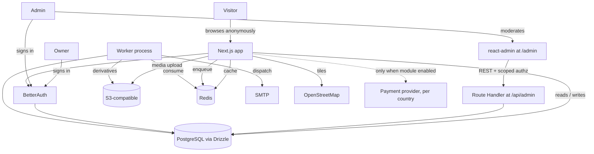

# Third-Party Integrations

**Version:** 1.0.0
**Status:** RFC
**Layer:** implementation
**Implements:** l1-platform-foundation.md

## Overview

Selection of integrable solutions for the capabilities the portal does not build
itself: authentication with scoped authorization, the back-office framework, object
storage, transactional mail, background job execution, maps, and — conditionally, only
where the booking module is activated — payment.

[MODIFIED — v1.0.0] Restructured against the client technical specification. Two
changes dominate: payment moves from a mandatory launch integration to a **dormant,
module-gated** one, and four integrations that the previous product did not need
(storage, mail, queue, maps) become launch requirements.

## Related Specifications

- [l1-platform-foundation.md](l1-platform-foundation.md) - Invariants this spec implements.
- [l2-tech-stack.md](l2-tech-stack.md) - Sibling L2; the base stack these integrations plug into, and the deployment fork three of them depend on.
- [l1-back-office.md](l1-back-office.md) - Drives the admin-framework and RBAC selections.
- [l1-feature-modules.md](l1-feature-modules.md) - Governs whether the payment integration is provisioned at all.
- [l1-room-reservation.md](l1-room-reservation.md) - The only consumer of payment; dormant by default.
- [l1-notifications.md](l1-notifications.md) - Consumer of the mail and queue integrations.
- [l1-object-catalog.md](l1-object-catalog.md) - Consumer of the map integration.
- [l1-object-profile.md](l1-object-profile.md) - Consumer of storage (media) and auth (reviews).
- [l1-object-onboarding.md](l1-object-onboarding.md) - Consumer of auth and storage.
- [l1-moderation-governance.md](l1-moderation-governance.md) - Consumer of the admin framework.

## 1. Motivation

The selection criterion is unchanged — integrate rather than build — but the set of
things worth integrating changed substantially with the product.

The previous version's central integration was payment, because a reservation was a
paid transaction. It no longer is: revenue is business-to-business, recorded as an
administrator-entered ledger rather than processed
([l1-placement-monetization.md](l1-placement-monetization.md) §5.5). Meanwhile the
portal acquired requirements it previously had none of — media storage at catalog
scale, transactional mail driving the renewal process, scheduled background work, and
maps across three countries.

The payment integration is not discarded. It is **provisioned on demand**, tied to a
module that ships disabled ([l1-feature-modules.md](l1-feature-modules.md) §5.2), so
the work already done against it remains usable the moment the module is switched on.

## 2. Constraints & Assumptions

- Launch markets are Moldova, Ukraine, and Georgia — three currencies, three
  regulatory regimes, and no single payment provider serving all three well. This is
  the deciding fact for §5.4.
- Three selections (storage, queue, mail transport) are bounded by the deployment fork
  in [l2-tech-stack.md](l2-tech-stack.md) §5.9.
- Assumes PostgreSQL + Drizzle as the integration point for anything persistent.
- Data ownership is preferred over managed convenience where the two conflict —
  the direction already set by choosing Drizzle over a managed backend.

## 3. Core Invariants (Layer 1 only)

N/A — this is an L2 spec; see [l1-platform-foundation.md](l1-platform-foundation.md)
§3 for the invariants it implements.

## 4. Invariant Compliance

| L1 Invariant | Implementation |
| --- | --- |
| Actor roles | Better Auth models the account and its role; **scoped** permissions (country / territory / category) are this project's own schema — see §5.2. |
| Configurable moderation checkpoint | Enforced at the data layer; the operator surface is the back office in §5.3. |
| Accountability | Audit journal is own-schema; Better Auth supplies the sign-in, IP, and device records `[TZ]` §100 requires. |
| Defense baseline | Better Auth `twoFactor`, built-in rate limiting, and `captcha` plugins (§5.2); transport encryption and backups are deployment concerns (§5.9). |
| Media resilience | Object storage (§5.5) plus `sharp`-generated derivatives ([l2-tech-stack.md](l2-tech-stack.md) §5.5). |
| Configuration over code | Every integration's operational parameters are settings, not build constants. |
| Capability modules toggleable | Payment (§5.4) is provisioned only where its module resolves enabled; its absence is the default state. |

## 5. Detailed Design

### 5.1 Selection Summary

| Capability | Selection | Status at launch |
| --- | --- | --- |
| Authentication | Better Auth (self-hosted) | Required |
| Scoped authorization | Own schema over Better Auth | Required |
| Back office | react-admin (`ra-core`) via shadcn-admin-kit | Required |
| Object storage | S3-compatible interface | Required |
| Transactional mail | SMTP via a provider-agnostic adapter | Required |
| Job queue | BullMQ on Redis | Required |
| Maps | Leaflet + OpenStreetMap + supercluster | Required |
| Payment | Deferred to module activation | **Dormant** |

### 5.2 Authentication & Authorization — Better Auth

**Decision**: Better Auth, retained.

**Reasoning**: it ships a first-party Drizzle adapter, so account tables live in this
project's own schema and authorization joins against domain data directly — which
matters more now than before, because `[TZ]` §121 requires permissions scoped to a
country, territory, or object category, and that resolution is a join against the
territory hierarchy. A vendor-hosted identity provider would put the account on one
side of a network boundary and the scope on the other.

Its plugin set also covers three `[TZ]` requirements without new vendors: `twoFactor`
for `[TZ]` §17 and §100, built-in rate limiting for §100's brute-force protection, and
`captcha` for §130.

**What this project builds**: the scoped permission model itself
([l1-back-office.md](l1-back-office.md) §5.2). Better Auth supplies roles and
permissions; it does not supply "this permission applies only within the Odesa
region". That resolution sits on the authorization path of every back-office request
and is this project's own code — the boundary is worth stating plainly rather than
discovering during implementation.

Clerk remains the noted alternative if the team later prioritizes hosted convenience
over data ownership; it is a worse fit here than before, for the scoping reason above.

### 5.3 Back Office — react-admin via shadcn-admin-kit

**Decision**: retained, and now substantially better justified.

**Reasoning**: the previous version chose this for four moderated resources, which was
a close call. `[TZ]` §102 specifies **twenty-four sections** and §134 makes sixteen
mandatory for release one ([l1-back-office.md](l1-back-office.md) §5.8), each needing
list, filter, sort, pagination, bulk actions, saved filters, forms, preview, and
export. The framework supplies all of it; hand-building it is a multi-month project
with a worse result.

Three properties carry the decision:

1. **It runs on the App Router.** The admin is a `"use client"` application whose data
   provider talks to a catch-all Route Handler — it needs nothing from the server
   framework that the App Router withholds.
2. **It renders through this project's design system.** `shadcn-admin-kit` is
   maintained by the react-admin team and built on shadcn/ui, so no second UI system
   enters the codebase ([l2-tech-stack.md](l2-tech-stack.md) §5.2).
3. **Its guessers scaffold from live resource shapes**, which is what makes twenty-four
   sections tractable at all.

**What this project builds**: one catch-all Route Handler implementing the
`ra-data-simple-rest` contract (filter, sort, pagination via `Content-Range`) over
Drizzle. No react-admin Drizzle provider exists — and none exists for any competing
framework either, so the cost is common to every option rather than specific to this
one.

**Authorization is a hard requirement of the REST surface, not of the UI.** The admin
is a client-side application and therefore cannot be a security boundary. Every
request to `app/api/admin/` must be rejected unless it carries a session whose account
holds the required permission **at the required scope** — hiding a control in the UI
is a usability affordance and never an access control. An ungated handler would leave
both the moderation checkpoint and `[TZ]` §121's scoping bypassable by direct request.

### 5.4 Payment — Dormant, Module-Gated

**Decision**: no payment provider is integrated at launch. The capability is
registered as a disabled module ([l1-feature-modules.md](l1-feature-modules.md) §5.2)
depending on the booking module.

**Reasoning**: the portal has no guest-facing payment
([l1-platform-foundation.md](l1-platform-foundation.md) §3.5). Owner payments for
placement are recorded by an administrator with a document number and a responsible
staff member (`[TZ]` §122), not processed — that is a ledger, and `[TZ]` §122 states a
full accounting system is out of scope. `[TZ]` §64 lists online payment as a future
module.

**When the module is activated**, the provider selection is a per-country decision,
not a single global one — which is why §5.1 records no provider name. The launch
markets differ materially:

| Market | Consideration |
| --- | --- |
| Ukraine | Fondy and WayForPay are both licensed and UAH-native; Fondy additionally offers marketplace split payments if commission-bearing bookings are wanted. |
| Moldova | Neither Ukrainian provider serves MDL settlement; a local acquirer or a pan-European provider is required. |
| Georgia | GEL settlement again requires a local or regional provider. |

The module registry scopes `payment` to portal and country levels precisely so this
resolves per market rather than forcing one provider across three
([l1-feature-modules.md](l1-feature-modules.md) §5.2).

**The prior Fondy work is preserved, not discarded.** It remains valid for the
Ukrainian market under an activated module, and the payment abstraction should be kept
provider-shaped rather than Fondy-shaped so a second market is an adapter rather than
a rewrite.

<!-- TBD: whether an activated booking module charges commission — and how that
     interacts with placement-package revenue — is unresolved
     (l1-room-reservation.md §2). It determines whether a split-payment provider is
     required or a single-recipient one suffices. -->

### 5.5 Object Storage — S3-Compatible

**Decision**: an S3-compatible interface, provider chosen by the deployment fork
([l2-tech-stack.md](l2-tech-stack.md) §5.9).

**Reasoning**: media is the portal's bulk data — photographs, video, panoramas, and
logos for every object (`[TZ]` §75) — and `[TZ]` §97 requires media backups separate
from the database, with retained generations. The current `@vercel/blob` (five call
sites) is serviceable but ties storage to one platform, which is a poor trade while
the deployment target is unresolved.

Cloudflare R2, MinIO, Backblaze B2, and managed platform buckets all speak the S3 API.
**Choosing the interface now costs nothing and makes the provider a configuration
change**, which is the only decision here that is both cheap today and expensive to
reverse later.

Derivative generation (thumbnails, size limits per `[TZ]` §33 and §130) is `sharp`,
in-process ([l2-tech-stack.md](l2-tech-stack.md) §5.5). CDN delivery (`[TZ]` §18) is a
deployment concern, satisfied by the storage provider's own edge or a fronting CDN.

### 5.6 Transactional Mail — Provider-Agnostic SMTP

**Decision**: an SMTP adapter behind the channel interface in
[l1-notifications.md](l1-notifications.md) §5.1, with the provider configurable.

**Reasoning**: mail volume is low and almost entirely transactional — expiry warnings,
moderation outcomes, password resets, administrator broadcasts. `[TZ]` §130 requires
administrator-editable templates, which live in this project's own notification model
rather than in a provider's template system.

Keeping the integration at SMTP means Resend, Postmark, Amazon SES, or a
self-hosted relay are all configuration rather than code — appropriate while the
deployment target is open, and appropriate afterwards too, since deliverability to
mixed consumer domains across three countries may well require changing provider on
evidence.

The channel adapter boundary is the same one Telegram and Viber will use
([l1-notifications.md](l1-notifications.md) §3), so mail is not a special case.

### 5.7 Job Queue — BullMQ on Redis

**Decision**: BullMQ, running in the worker process
([l2-tech-stack.md](l2-tech-stack.md) §5.6).

**Reasoning**: `[TZ]` §18 and §22 require Redis for caching regardless, so BullMQ
reuses infrastructure the portal must operate anyway. It provides the scheduling,
retry, and backoff semantics that [l1-notifications.md](l1-notifications.md) §5.4's
jobs need, and idempotency support for the dispatch guarantees in §6.1 there.

pg-boss is the noted alternative and is discussed in
[l2-tech-stack.md](l2-tech-stack.md) §7.

### 5.8 Maps — Leaflet + OpenStreetMap + supercluster

**Decision**: retain Leaflet with OpenStreetMap tiles; add `supercluster`.

**Reasoning**: `[TZ]` §15 leaves the choice open between Google Maps and
OpenStreetMap. OSM avoids per-request licensing across three countries and an
unpredictable cost curve on the portal's most-viewed pages, and Leaflet is already
integrated.

Clustering is **mandatory, not an enhancement** — three countries of objects at country
zoom cannot be rendered pin by pin
([l1-object-catalog.md](l1-object-catalog.md) §5.4).

**Escalation path**: if vector-tile rendering performance becomes the constraint at
full catalog scale, MapLibre GL JS provides native clustering and vector tiles and is
a contained swap, since the map is one component behind one contract. Recorded as a
measured escalation, not a pre-emptive choice.

Route building hands off to the visitor's own map application (`[TZ]` §11), so no
routing engine is required.

### 5.9 Integration Topology

The dotted edge is the whole of §5.4: present in the architecture, absent in the
default configuration.

## 6. Implementation Notes

1. **Better Auth first.** Every other integration presumes an authenticated, scoped
   actor. Build the scoped permission resolution alongside it, not after the first
   back-office screen.
2. **Settle the deployment fork** ([l2-tech-stack.md](l2-tech-stack.md) §5.9) before
   provisioning storage, Redis, or mail — all three resolve differently under each
   answer.
3. **Build the admin REST surface before the admin screens.** The guessers scaffold
   from live resource responses, so the data surface must exist first.
4. **Keep the payment abstraction provider-shaped.** Fondy is one adapter for one
   market, not the interface.
5. **Verify module gating at the integration boundary.** A payment client that
   initializes regardless of module state is a credential loaded and a code path live
   for a capability that is supposed to be inert
   ([l1-feature-modules.md](l1-feature-modules.md) §3).

## 7. Drawbacks & Alternatives

**A managed backend (Supabase, Firebase) instead of self-hosted auth plus Postgres.**
Faster to start and wrong against `[TZ]` §121's scoped permissions, §91's tamper-
resistant journal, and §97's backup and restore requirements — all of which want
direct control of the database. It would also invert the data-ownership direction the
stack has already committed to.

**Integrating a payment provider now, "since the code exists".** Superficially
efficient and it would commit the portal to merchant onboarding, per-country
compliance, and refund handling for a capability no one has asked to enable. The
module gate preserves the work at zero operational cost, which is the better trade.

**Google Maps instead of OpenStreetMap.** Better data quality in places, better
place-search, and a per-request bill on the portal's highest-traffic pages across
three countries. `[TZ]` §15 permits either; OSM is the lower-risk default and the
component boundary keeps the swap open.

**A hosted email platform with its own templates.** Convenient and it moves
administrator-editable templates (`[TZ]` §130) into a vendor UI, splitting notification
content across two systems. The SMTP-behind-an-adapter position keeps templates in the
portal where the specification puts them.

**A hand-built moderation queue instead of react-admin.** Viable for four resources and
not for twenty-four sections (§5.3). It remains the documented fallback if the
client-side bundle or the REST adapter proves disproportionate in practice.

## Canonical References

| Alias | Path | Purpose |
| --- | --- | --- |
| `[TZ]` | `.drafts/booking.md` | §15, §17–§18, §22, §64, §75, §97, §100, §102, §121–§122, §130, §134 — requirements driving these selections. |
| `[L1]` | `.design/main/specifications/l1-platform-foundation.md` | Invariants this spec implements. |
| `[L2-STACK]` | `.design/main/specifications/l2-tech-stack.md` | Base stack and the deployment fork three selections depend on. |

## Document History

| Version | Date | Change |
| --- | --- | --- |
| 0.1.0 | 2026-07-30 | Initial draft: Better Auth, Fondy (primary) / WayForPay (alternative), AdminJS. |
| 0.2.0 | 2026-07-30 | Replaced AdminJS with react-admin via shadcn-admin-kit; added the admin REST surface's authorization requirement. |
| 1.0.0 | 2026-08-05 | Major restructure against the client technical specification. Payment reclassified from a mandatory launch integration to a dormant, module-gated, per-country decision with the prior Fondy work preserved. Added object storage (S3-compatible), transactional mail, job queue, and map-clustering selections as launch requirements; strengthened the back-office justification against `[TZ]` §102/§134; recorded the scoped-authorization boundary Better Auth does not cover. |
