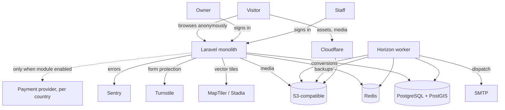

# Third-Party Integrations

**Version:** 2.0.0
**Status:** RFC
**Layer:** implementation
**Implements:** l1-platform-foundation.md

## Overview

External services and infrastructure the portal depends on: object storage,
transactional mail, map tiles, search, CAPTCHA, error tracking, and — conditionally,
only where the booking module is activated — payment.

[MODIFIED — v2.0.0] Rewritten for the Laravel stack. The previous version's central
concerns — an authentication library, an admin framework, and a REST adapter — are no
longer integrations at all: Laravel's own authentication and Filament cover them
natively ([l2-tech-stack.md](l2-tech-stack.md) §5.2, §5.5). What remains is genuinely
external: services that live outside the application and cost money or carry an SLA.

## Related Specifications

- [l1-platform-foundation.md](l1-platform-foundation.md) - Invariants this spec implements.
- [l2-tech-stack.md](l2-tech-stack.md) - Sibling L2; the stack these services attach to, and the package set that removed three former integrations.
- [l1-feature-modules.md](l1-feature-modules.md) - Governs whether payment is provisioned at all.
- [l1-room-reservation.md](l1-room-reservation.md) - The only consumer of payment; dormant by default.
- [l1-object-catalog.md](l1-object-catalog.md) - Consumer of the map and search services.
- [l1-object-profile.md](l1-object-profile.md) - Consumer of object storage.
- [l1-notifications.md](l1-notifications.md) - Consumer of the mail service.
- [l1-back-office.md](l1-back-office.md) - Hosts service configuration and credentials.
- [l1-public-api.md](l1-public-api.md) - Token issuance via Sanctum, not an external service.

## 1. Motivation

The selection criterion is unchanged — integrate rather than build — but the stack
change moved most of the boundary. Authentication, the admin panel, the owner cabinet,
role management, media conversions, the audit journal, translations, backups, sitemaps,
and API tokens are now framework or first-party package concerns, listed in
[l2-tech-stack.md](l2-tech-stack.md) §5.5.

What is left is a short list of genuinely external dependencies. Keeping that list
short is itself the goal: every entry is an account to hold, a credential to rotate, a
bill to pay, and an outage the portal can suffer without causing.

## 2. Constraints & Assumptions

- Self-hosted deployment ([l2-tech-stack.md](l2-tech-stack.md) §5.10). Every service
  below has a self-hostable option, and the local Docker Compose stack runs
  self-hosted equivalents so development needs no external accounts.
- Launch markets are Moldova, Ukraine, and Georgia — three currencies and three
  regulatory regimes. No single payment provider serves all three well, which shapes
  §5.6.
- Data ownership is preferred over managed convenience where the two conflict.
- Credentials live in the environment, never in the repository or the database.

## 3. Core Invariants (Layer 1 only)

N/A — this is an L2 spec; see [l1-platform-foundation.md](l1-platform-foundation.md)
§3 for the invariants it implements.

## 4. Invariant Compliance

| L1 Invariant | Implementation |
| --- | --- |
| Media resilience | S3-compatible storage (§5.1) with Media Library conversions; failures degrade to placeholders, never to a broken page. |
| Performance at scale | Cloudflare CDN in front of storage and the application (`[TZ]` §18). |
| Privacy-minimal measurement | No third-party analytics script is required for owner or advertiser figures — those are first-party ([l1-analytics.md](l1-analytics.md) §7). |
| Defense baseline | Turnstile for public forms (`[TZ]` §130); TLS terminated at the edge (`[TZ]` §17); backups to a destination separate from the application server (`[TZ]` §97). |
| Capability modules toggleable | Payment is provisioned only where its module resolves enabled; absence is the default. |

## 5. Detailed Design

### 5.1 Object Storage — S3-Compatible

**Decision**: an S3-compatible interface; **Cloudflare R2** recommended in production,
**MinIO** in local development.

**Reasoning**: media is the portal's bulk data — photographs, video, panoramas, and
logos for every object (`[TZ]` §75) — and `[TZ]` §97 requires media backups separate
from the database with retained generations. R2 charges no egress fee, which matters
for an image-heavy catalog fronted by a CDN. Backblaze B2 and self-hosted MinIO speak
the same API, so the provider is a configuration change.

Laravel's `s3` filesystem driver and `spatie/laravel-medialibrary` both target this
interface directly. Derivative generation (thumbnails, size limits per `[TZ]` §33 and
§130) happens in-process through Media Library's conversions, backed by Imagick or
libvips.

### 5.2 CDN — Cloudflare

**Decision**: Cloudflare in front of both the application and the media bucket.

**Reasoning**: `[TZ]` §18 requires a CDN. Cloudflare's free tier is sufficient at
launch, it pairs with R2 without egress cost, and it supplies TLS termination for
`[TZ]` §17 plus basic DDoS protection. It also hosts the CAPTCHA in §5.5.

### 5.3 Map Tiles — MapTiler or Stadia Maps

**Decision**: a commercial vector-tile provider, with self-hosted tiles as the fallback
if volume makes it economic.

**Reasoning, stated plainly because it is a correction**: the public
`tile.openstreetmap.org` servers are **prohibited for production use** by the OSMF Tile
Usage Policy. "OpenStreetMap is free" is true of the data and false of tile serving.
With a map on the home page, on every territory page, and in the catalog across three
countries, a compliant tile source is a required line item — on the order of $0–100 per
month at launch volumes.

MapLibre GL JS ([l2-tech-stack.md](l2-tech-stack.md) §5.1) consumes vector tiles from
any of MapTiler, Stadia, Protomaps, or a self-hosted tile server, so the provider stays
swappable. Clustering runs client-side in MapLibre with bbox filtering served by
PostGIS.

`[TZ]` §15 permits Google Maps instead. It removes the tile question and replaces it
with a per-request bill on the portal's most-visited pages — a worse shape for a
catalog whose traffic is the point.

### 5.4 Transactional Mail — SMTP

**Decision**: SMTP through Laravel's mailer, provider configured per environment;
**Mailpit** locally.

**Reasoning**: volume is low and entirely transactional — expiry warnings, moderation
outcomes, password resets, administrator broadcasts. `[TZ]` §130 requires
administrator-editable templates, which live in the portal's own notification model
([l1-notifications.md](l1-notifications.md) §5.1), not in a provider's template system.

Staying at SMTP means Postmark, Amazon SES, Resend, or a self-hosted relay are all
configuration. Deliverability to mixed consumer domains across three countries may well
require changing provider on evidence, and this keeps that cheap.

Telegram and Viber channels (`[TZ]` §62) attach at the same adapter boundary when
specified.

### 5.5 CAPTCHA — Cloudflare Turnstile

**Decision**: Turnstile on public write surfaces (registration, contact forms, reviews).

**Reasoning**: `[TZ]` §130 lists CAPTCHA as a portal setting. Turnstile is free,
privacy-preserving, requires no visual puzzle, and is already in the Cloudflare account
from §5.2. hCaptcha is the equivalent alternative.

### 5.6 Payment — Dormant, Module-Gated

**Decision**: no payment provider is integrated. The capability is registered as a
disabled module ([l1-feature-modules.md](l1-feature-modules.md) §5.2) depending on the
booking module.

**Reasoning**: the portal has no guest-facing payment
([l1-platform-foundation.md](l1-platform-foundation.md) §3.5). Owner payments for
placement are recorded by an administrator with a document number and a responsible
staff member (`[TZ]` §122) — that is a ledger, and `[TZ]` §122 states a full accounting
system is out of scope. `[TZ]` §64 lists online payment among future modules.

**When the module is activated**, provider selection is per country, not global:

| Market | Consideration |
| --- | --- |
| Ukraine | Fondy and WayForPay are licensed and UAH-native; Fondy additionally offers marketplace split payments if commission-bearing bookings are wanted. |
| Moldova | Neither serves MDL settlement; a local acquirer or a pan-European provider is required. |
| Georgia | GEL settlement requires a local or regional provider. |

The module registry scopes `payment` to portal and country level precisely so this
resolves per market. Laravel Cashier is not applicable — it targets subscription
billing through Stripe or Paddle, neither of which fits this shape.

<!-- TBD: whether an activated booking module charges commission — and how that
     interacts with placement-package revenue — is unresolved
     (l1-room-reservation.md §2). It determines whether a split-payment provider is
     required or a single-recipient one suffices. -->

### 5.7 Search — Deferred External Service

**Decision**: none at launch. PostgreSQL full-text search behind `laravel/scout`
([l2-tech-stack.md](l2-tech-stack.md) §5.7).

**Escalation**: Typesense, self-hostable, when p95 search latency exceeds 300 ms on the
real catalog or Georgian recall proves inadequate. Scout makes this a driver swap.

### 5.8 Error Tracking — Sentry or GlitchTip

**Decision**: Sentry, with self-hosted GlitchTip as the no-cost alternative.

**Reasoning**: `[TZ]` §131 requires the administrator to be notified when a backup
fails and to be able to download a technical report — that is one instance of a general
need for error visibility. Laravel has first-party Sentry integration, including queue
and scheduler failures, which is where the §5.4 notification jobs run.

### 5.9 Integration Topology

The dotted edge is the whole of §5.6: present in the architecture, absent in the
default configuration.

## 6. Implementation Notes

1. **Configure storage as `s3` from the first commit**, pointed at local MinIO. Writing
   to the local disk during development and switching later reliably produces
   path-handling bugs at exactly the wrong moment.
2. **Replace the tile URL before any public deploy.** The scaffold must not ship
   pointing at `tile.openstreetmap.org` — that is a policy violation, not a
   placeholder.
3. **Verify module gating at the integration boundary.** A payment client that
   initializes regardless of module state is a credential loaded and a code path live
   for a capability meant to be inert ([l1-feature-modules.md](l1-feature-modules.md)
   §3).
4. **Keep the payment abstraction provider-shaped**, not Fondy-shaped. Fondy is one
   adapter for one market.
5. **Route all outbound mail through the notification model**, never directly from a
   controller or Filament action — the record of what an owner was told is the
   notification, not the send ([l1-notifications.md](l1-notifications.md) §3).

## 7. Drawbacks & Alternatives

**A managed platform (Laravel Cloud, Forge + a cloud provider)** — less operational
burden and a poorer fit for `[TZ]` §97 and §131, which want direct control of backup
destinations and an administrator-triggered restore. Forge remains attractive as a
provisioning tool over self-managed servers without changing this spec.

**Google Maps instead of vector tiles** — permitted by `[TZ]` §15, removes the tile
provider question, and introduces a per-request bill on the highest-traffic pages.

**A hosted email platform with its own templates** — convenient, and it splits
notification content across two systems while `[TZ]` §130 puts template editing in the
portal.

**Third-party analytics (Google Analytics, Matomo) as the measurement source** —
rejected in [l1-analytics.md](l1-analytics.md) §7: it cannot serve per-object statistics
into an owner's cabinet, ad blockers remove it precisely where contact clicks happen,
and it exports visitor data against `[TZ]` §89. Viable only as a supplementary product-
analytics tool.

**Integrating a payment provider now, "since the market is known"** — commits the
portal to merchant onboarding, per-country compliance, and refund handling for a
capability nobody has asked to enable. The module gate preserves the option at zero
operational cost.

## Canonical References

| Alias | Path | Purpose |
| --- | --- | --- |
| `[TZ]` | `.drafts/booking.md` | §15, §17–§18, §22, §64, §75, §97, §122, §130–§131 — requirements driving these selections. |
| `[L1]` | `.design/main/specifications/l1-platform-foundation.md` | Invariants this spec implements. |
| `[L2-STACK]` | `.design/main/specifications/l2-tech-stack.md` | Stack and package set these services attach to. |

## Document History

| Version | Date | Change |
| --- | --- | --- |
| 0.1.0 | 2026-07-30 | Initial draft: Better Auth, Fondy/WayForPay, AdminJS. |
| 0.2.0 | 2026-07-30 | Replaced AdminJS with react-admin via shadcn-admin-kit. |
| 1.0.0 | 2026-08-05 | Major restructure against the client technical specification: payment reclassified as dormant and module-gated; storage, mail, queue, and map selections added. |
| 2.0.0 | 2026-08-05 | **Rewritten for the Laravel stack.** Authentication, the admin framework, and the REST adapter are no longer integrations — the framework and Filament cover them. Remaining scope narrowed to genuinely external services: S3-compatible storage, CDN, map tiles, SMTP, CAPTCHA, error tracking, and the dormant payment module. Records the OSM tile-policy correction as a required line item. |
