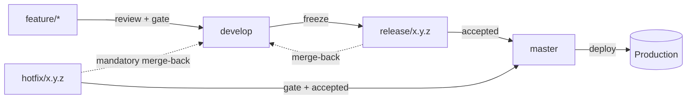

# Branch Model

Git Flow over a single self-hosted production line. Five kinds of branch, each with
its own rules, and one obligation — the urgent-fix merge-back — that is checked by a
workflow rather than trusted to memory.

## `feature/{short-slug}`

Work in progress. Branched from `develop`, merged only by reviewed pull request,
deleted on merge. No protection rule of its own — its obligations are enforced at the
merge target (`develop`'s required review and required `quality` check), not on the
branch itself. Short-lived by convention: a `feature/*` branch that outlives the unit
of work it names has usually absorbed a second, unrelated change.

## `develop`

Integration line. Every accepted change lands here first. Protected: pull requests
only, at least one approving review, and the `quality` check required before merge.
Never deployed directly — it is what the next release will contain, not a preview of
production.

## `release/{x.y.z}`

A frozen integration state, for stabilization only — a translation fix, a
configuration correction. Branched from `develop` at freeze, so the release's contents
are enumerable before acceptance rather than after. Not for new work: a feature landing
on a release branch has skipped the integration gate `develop` exists to enforce.
Merges to `master` **and** back to `develop`, so a stabilization commit made here is
never silently lost the next time `develop` is frozen.

## `master`

Production. The only line ever deployed. Protected: pull requests only, the `quality`
check required, linear history, no force pushes, no deletions. Tagged on every merge —
the tag is what triggers `release.yml` (see [pipeline.md](pipeline.md)).

## `hotfix/{x.y.z}`

Urgent production fix. Branched from `master`, merged to `master` **and** back to
`develop`. The one exception to "nothing reaches production without passing through
integration first" — permitted because an incident does not wait for `develop` to
catch up, and obliged to merge back immediately after, because an urgent fix that
never reaches `develop` is a defect scheduled to reappear the next time `develop` is
released.

## The Merge-Back Obligation, Made Mechanical

Both `release/*` and `hotfix/*` owe `develop` a merge-back, and it is exactly the kind
of bookkeeping that is honoured in the first month of a project and forgotten in the
sixth. Rather than trust it to memory, a scheduled workflow
(`.github/workflows/merge-back.yml`) checks the one fact that has to hold: `master`
never carries a commit that is not an ancestor of `develop`. When it does, the run
fails and names both the missing commit and the branch that should have carried it
back.

It is a **detector, not a gate** — it cannot block a production fix, and it never
blocks a pull request. Blocking one to enforce bookkeeping is the wrong trade during
an incident, which is precisely when a hotfix exists. A failing merge-back run is a
signal to open a pull request from `master` into `develop`, not an obstacle to work
around.

## Why No Protection on the Short-Lived Lines

`feature/*`, `release/x.y.z`, and `hotfix/x.y.z` carry no branch protection rule of
their own. Their obligations are already enforced where they merge — `develop` and
`master` both require the `quality` check and a review before accepting anything, so a
rule duplicated on the source branch would check nothing a reviewer or the gate does
not already check, while adding a second place for the rule to drift out of sync with
the first.
