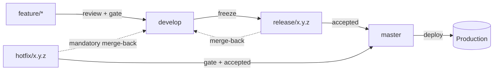

# Branch Model

> **Paused as of 2026-08-22.** A single developer, working across several machines,
> pre-production — the branch-hop-and-wait ceremony below cost more than it returned
> at this size. Everything currently happens directly on `master`; the topology below
> is the target this project returns to before client handoff, or sooner if a second
> developer joins. The exact working state — branch protection, the merge-back
> detector, this file's own live scope — is preserved at git tag
> `gitflow-archive-2026-08-22`. Current policy: `CLAUDE.md` § Release & Deployment.

Git Flow over a single self-hosted production line. Five kinds of branch, each with
its own rules, and one obligation — the urgent-fix merge-back — that is checked by a
workflow rather than trusted to memory.



## `feature/{short-slug}`

Work in progress. Branched from `develop`, merged by pull request once the `quality`
check passes, deleted on merge. No protection rule of its own — its obligations are
enforced at the merge target (`develop`), not on the branch itself. Short-lived by
convention: a `feature/*` branch that outlives the unit of work it names has usually
absorbed a second, unrelated change.

## `develop`

Integration line. Every accepted change lands here first. Protected: pull requests
only, the `quality` check required before merge, and a human review required
*conditionally* — see [Ordinary Changes vs. Reviewed Changes](#ordinary-changes-vs-reviewed-changes)
below. Never deployed directly — it is what the next release will contain, not a
preview of production.

## `release/{x.y.z}`

A frozen integration state, for stabilization only — a translation fix, a
configuration correction. Branched from `develop` at freeze, so the release's contents
are enumerable before acceptance rather than after. Not for new work: a feature landing
on a release branch has skipped the integration gate `develop` exists to enforce.
Merges to `master` **and** back to `develop`, so a stabilization commit made here is
never silently lost the next time `develop` is frozen.

## `master`

Production. The only line ever deployed. Protected: pull requests only, the `quality`
check required, linear history, no force pushes, no deletions, and the same
conditional review requirement `develop` carries. Tagged on every merge — the tag is
what triggers `release.yml` (see [pipeline.md](pipeline.md)); reaching `master` is not
itself a deploy, and pushing that tag is always a deliberate, separate act.

## `hotfix/{x.y.z}`

Urgent production fix. Branched from `master`, merged to `master` **and** back to
`develop`. The one exception to "nothing reaches production without passing through
integration first" — permitted because an incident does not wait for `develop` to
catch up, and obliged to merge back immediately after, because an urgent fix that
never reaches `develop` is a defect scheduled to reappear the next time `develop` is
released.

## The Merge-Back Obligation, Made Mechanical

Both `release/*` and `hotfix/*` owe `develop` a merge-back, and it is exactly the kind
of bookkeeping that is honoured in the first month of a project and forgotten in the
sixth. Rather than trust it to memory, a scheduled workflow
(`.github/workflows/merge-back.yml`) checks the one fact that has to hold: `master`
never carries a commit that is not an ancestor of `develop`. When it does, the run
fails and names both the missing commit and the branch that should have carried it
back.

It is a **detector, not a gate** — it cannot block a production fix, and it never
blocks a pull request. Blocking one to enforce bookkeeping is the wrong trade during
an incident, which is precisely when a hotfix exists. A failing merge-back run is a
signal to open a pull request from `master` into `develop`, not an obstacle to work
around.

## Ordinary Changes vs. Reviewed Changes

Not every pull request into `develop` or `master` needs a human's approval to merge —
the `quality` check passing is the gate for an ordinary change. What still always needs
a person's review is enforced mechanically through `.github/CODEOWNERS`, not left to
whoever is merging to remember: a pull request touching authentication, authorization
(policies, the permission/role registry), financial records, or secrets and CI
credential wiring always requests the project owner as a reviewer, and GitHub will not
let that pull request merge without it — regardless of how small the rest of the
change looks. Every path this covers is asserted against `.github/CODEOWNERS` by
`tests/Architecture/SensitiveZoneCodeownersTest.php`, so the two cannot silently drift
apart.

A change carrying a database migration that a plain rollback could not undo is a
separate case entirely, and is never merged on the strength of a passing gate alone,
CODEOWNERS match or not — see [pipeline.md](pipeline.md) for the destructive-migration
scan that catches it.

**A CODEOWNERS-matched pull request authored by the owner's own account blocks on
itself.** Until a separate automation identity exists, both a developer and an agent
push under the same GitHub account, so a pull request touching a sensitive path
requests a review from the account that opened it — and GitHub will not let an author
approve their own pull request, so it sits blocked with no way to satisfy it normally.
The fix is a one-time, scoped bypass, not a standing setting: temporarily disable
`enforce_admins` on the target branch, merge as the repository administrator, then
re-enable it immediately.

```bash
gh api -X DELETE repos/teratron/booking/branches/develop/protection/enforce_admins
# merge the pull request
gh api -X POST repos/teratron/booking/branches/develop/protection/enforce_admins
```

This is unrelated to the ordinary-change flow above — it only comes up for a
CODEOWNERS-matched change the owner authored personally, and it stops coming up once
a separate automation identity exists to author the ordinary ones instead.

## Landing a Small Change Without Waiting on It

An ordinary change still goes through a pull request — `develop` accepts no direct
push — but nothing about that requires sitting and watching `quality` run. The
repository has `allow_auto_merge` enabled specifically so this sequence needs no
babysitting, by a developer or an agent alike:

```bash
git checkout -b fix/short-slug develop
# make the change, commit it
git push -u origin fix/short-slug
gh pr create --fill
gh pr merge --auto --merge --delete-branch
```

The last command queues the merge and returns immediately; GitHub merges the pull
request itself the moment `quality` passes (and, for a change `.github/CODEOWNERS`
covers, once the owner's review is in) and deletes the branch. There is nothing to
poll and nothing further to run — the same command works unattended.

**`--merge`, not `--squash`, into `develop`** — a real merge commit (`--no-ff` in
spirit: `develop`'s own history keeps the branch's commits and the point they joined,
matching classic Git Flow) rather than flattening them into one. Squashing works
too and was used for a few early pull requests, but it orphans the original commits
the moment the branch is deleted — harmless (`git fetch --prune` clears the dangling
remote-tracking refs a local clone is left holding), just a messier local graph than
necessary when a plain merge commit costs nothing extra. `master` is the one place
this flips: its branch protection requires linear history, which a merge commit
cannot satisfy, so the eventual `release/{x.y.z}` → `master` pull request needs
`--squash` or `--rebase` instead — GitHub enforces this itself and refuses the other
choice there.

A few small, unrelated edits are better landed as one pull request than as several —
each one is a full `quality` run, and a translation fix and a stray-file removal do
not need separate CI minutes to prove they are both fine. Batch them when they are
not urgent; open a pull request immediately when one of them is.

## Why No Protection on the Short-Lived Lines

`feature/*`, `release/x.y.z`, and `hotfix/x.y.z` carry no branch protection rule of
their own. Their obligations are already enforced where they merge — `develop` and
`master` both require the `quality` check and a review before accepting anything, so a
rule duplicated on the source branch would check nothing a reviewer or the gate does
not already check, while adding a second place for the rule to drift out of sync with
the first.
