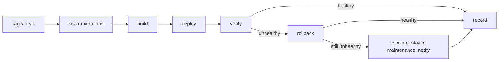

# The Release Pipeline

Two GitHub Actions workflows carry every change from a pull request to the live
portal: `quality.yml` (the gate every change passes before it merges) and
`release.yml` (the path a tag takes to production). This document is the
developer-audience account of both — what each job proves, how to change one
without breaking what it proves, and what silently stops being checked if a step
is skipped. For the branch model both workflows assume, see
[branching.md](branching.md); for the six procedures an operator or an agent
follows to actually run a release, see `docs/operations/`.

## `quality.yml` — the Gate

Triggers on `push` and `pull_request`, both scoped to `develop` and `master`
only — a `feature/*` push runs nothing here; the gate exists on the two lines
that matter, and every `feature/*` branch reaches one of them by pull request.

One job, `quality`, against a real `postgis/postgis` service container — the
same image tag `docker-compose.yml` uses locally, so a schema change that
passes here behaves identically on a developer's own machine.

| Step | What it proves | If skipped |
| --- | --- | --- |
| Checkout (`fetch-depth: 0`, `fetch-tags: true`) | — | `fallow`'s PR-diff commands and the destructive-migration scan below both need full history and tags to walk; a shallow clone silently degrades both to "nothing to compare against". |
| Setup PHP, cache Composer, install dependencies | — | Nothing to run the gate with. |
| Prepare application key | — | Every step after this one needs a real `APP_KEY` to boot the framework at all. |
| Scan for destructive migrations (`--advisory`) | The PR's own migration set contains nothing that would need an irreversibility declaration when it eventually ships — reported, not blocking, since no tag exists yet to carry that declaration. | A destructive migration first becomes visible at release time instead of review time — still caught (`release.yml` blocks on it), just later, and after a reviewer has already approved the PR without seeing the warning. |
| Check operator-documentation parity (pull request only) | A PR touching one rendering of an operator procedure (`docs/operations/{en,ru,agent}/`) also touches its other two renderings in the same change. | A translation silently goes stale — discovered by whoever most needs it correct, during an incident. |
| Prepare test database | — | Every Postgres-specific migration and query in the suite fails outright; the service container's own init only creates the default database, not the dedicated test one with its extensions. |
| Setup pnpm/Node, install Node dependencies | — | The JS gate and the asset build below have nothing to run. |
| Run the JS quality gate (`pnpm run quality`) | Biome formatting/linting and Fallow static analysis pass across the whole JS/CSS tree. | Formatting drift and JS-side type/dependency issues reach `develop`/`master` unchecked. |
| Audit changed files (pull request only, `pnpm run audit`) | The files this PR actually changed introduce no new Fallow findings, distinguished from pre-existing debt on the base branch. | Meaningless on a plain push (no base to diff against) — correctly skipped there, not a gap. |
| Build assets (`pnpm build`) | The Vite build succeeds and produces `public/build/manifest.json`. | The Pest suite's own permanent manifest-existence check fails immediately after — this step exists so that failure happens here, with a clear name, rather than surfacing as a confusing PHP test failure. |
| Verify `migrate:fresh --seed` from empty | The full migration set applies cleanly to a genuinely empty database, and the seeders run without error — proven fresh on every push, not trusted from a developer's already-migrated local database. | A migration that only works because a developer's local database already has some prior state reaches `develop` unnoticed, and breaks the next `migrate:fresh` anyone runs from empty — including `release.yml`'s own `deploy` job. |
| Run the PHP quality gate (`composer quality`) | Pint formatting, Larastan (PHPStan level 8), the full Pest suite (unit, feature, architecture), the coverage floor, `composer audit`, and `composer unused` — the same command, run the same way, a developer runs locally. One command deliberately: two separate invocations of the same gate is how "passes in CI, fails locally" divergence starts. | Everything that command checks reaches `develop`/`master` unchecked — this is the gate; skipping this step is skipping the gate. |

**Required status check**: the job is literally named `quality` — branch
protection on `develop` and `master` (`docs/release/branching.md`) requires a
check by that exact name. Renaming the job without updating both branches'
protection rules makes every pull request wait forever for a check that no
longer runs.

**Changing this workflow**: add a step, and update this table's own row for it
in the same change — an undocumented step is one nobody remembers the purpose
of the next time it looks safe to remove. Adding a step that touches the
database or the built assets almost certainly needs to run *before* "Run the
PHP quality gate", not after — that step is the one whose failure is supposed
to mean something is actually broken, not "the environment was not ready yet".

## `release.yml` — the Release

Triggers on any tag matching `v*` pushed anywhere in the repository. Branch
filters do not apply to tag-push events at all, so the restriction to `master`
(`docs/release/branching.md`) is enforced inside the `build` job instead of
the trigger — see that job's own row below.

A single `concurrency` group (`production`, `cancel-in-progress: false`) covers
the whole workflow: two tags pushed minutes apart queue rather than interleave,
and a queued run is never cancelled — a cancelled run that had already migrated
is exactly the half-applied state this exists to prevent.

### `scan-migrations`

Gates everything else — a release whose migration set cannot be reversed by a
plain rollback must say so before an image is even built. Reads the pushed
tag's own annotation (`git tag -l --format='%(contents)'`) as the
irreversibility declaration and runs
`php artisan release:scan-destructive-migrations` against it, blocking (unlike
`quality.yml`'s advisory run) — a tag exists now, so there is no "not ready to
declare yet" case left.

**If skipped**: an irreversible schema change can reach `deploy` with nobody
having stated that in advance — discovered only once a rollback is attempted
and turns out not to be enough, which is exactly the failure this scan exists
to prevent by catching it before the release ever ships.

### `build`

Verifies the tag's own commit is reachable from `master` (the branch-filter
substitute mentioned above), then builds `docker/app/Dockerfile`'s
`production` target and pushes it to `ghcr.io/teratron/booking`, tagged with
both the version and `latest`. Emits the resulting digest as a job output
(`steps.push.outputs.digest`) — every job after this one addresses the
artefact by that digest, never by tag, so a re-pushed tag can never silently
change what "this release" means.

**If skipped**: there is no artefact for `deploy` to pin, so nothing after
this job can run — this is not a step that can be individually skipped
without skipping the whole release.

### `deploy`

Gated by the `production` GitHub environment's required-reviewers rule —
this is the one job in the whole pipeline a person must explicitly approve
before it runs. Runs on a **self-hosted runner installed on the production
host itself** (`runs-on: [self-hosted, production]`), which is how "the host
pulls, no inbound access to it is ever required" is actually achieved: the
runner polls GitHub outbound for work, so there is no separate runner-to-host
network path to secure. `docker/deploy/deploy.sh` performs the six-step
sequence: pin the digest, enter maintenance mode, run migrations, restart
`app`/`worker`/`scheduler`/`pulse` then `nginx` last, warm the
config/route/event/view caches, leave maintenance mode.

**If skipped**: nothing changes on the production host — this is the
job that actually ships the release. There is no partial-deploy failure mode
to worry about skipping around; the job either runs or nothing happens.

### `verify`

Runs immediately after `deploy`, without waiting for a person — a
measurement, not a judgement. `docker/deploy/verify-health.sh` polls the
application's own built-in health route (`http://localhost/up` on the runner
itself, not the public domain — unaffected by DNS/CDN/firewall configuration
that has nothing to do with whether the release is actually healthy) on a
10-attempt, 5-second budget by default. Success records this release's digest
as "last known-good" (`docker/deploy/last-good-digest.sh`) for a future
rollback to target; failure re-enters maintenance mode and lets the job fail,
which is what triggers `rollback` below.

**If skipped**: an unhealthy release keeps serving traffic indefinitely, with
nobody and nothing watching for it — this is the job that makes automatic
rollback possible at all.

### `rollback`

Runs only `if: needs.verify.result == 'failure'` — automatic and unattended by
design, since triggering a rollback never grants the release the approval it
already failed to earn; it only returns to a state a person already approved
once. Reads the last known-good
digest (passed as `verify`'s own recorded state, read via
`docker/deploy/last-good-digest.sh`) and redeploys it via
`docker/deploy/rollback.sh` — restart only, deliberately **no migration
step**: `scan-migrations` already refused any release whose migrations were
not safely reversible before it was ever built, so every digest this job is
ever asked to redeploy is safe to redeploy without touching the database.
Re-asserts health **exactly once** (a 5-second grace period, then a single
check — an assertion, not another deployment) and leaves maintenance mode
only if that single check passes.

**If that second check also fails**: the workflow does not attempt a second
rollback. A second failed assertion means the fault is almost certainly the
host, the database, or an external dependency rather than the image, and an
automation that keeps redeploying is both useless against that and loud
enough to mask it. The application stays in maintenance mode, and `record`
(next) writes the escalation into the release record.

**If this job is skipped entirely** (because `verify` passed): correct,
expected behaviour — there is nothing to roll back.

### `record`

Runs `if: always() && needs.build.result != 'skipped'` — a release
`scan-migrations` refused outright never became a production candidate, so it
gets no release record; every other outcome, including a failed `build`, does.
Runs on an ordinary hosted runner, not the self-hosted one — it never touches
the production host, only the GitHub API and this repository's own
`CHANGELOG.md`. `docker/deploy/record-release.sh` assembles the release body
from the `CHANGELOG.md` section matching this version (heading shape
`## [x.y.z]`), annotated with the deployed digest, the actor, the timestamp,
the irreversibility declaration, and one of four outcomes: deployed and
healthy, rolled back, escalated, or deploy itself failed. When a rollback
happened, it also annotates the *prior* release as reinstated — the
reverted-to digest arrives as a job output from `rollback`, never a
host-side file read, since this job may run on a runner sharing no
filesystem with the one `deploy`/`verify`/`rollback` used.

**If skipped**: the release happened (or failed) and left no trace. A rollback
with no record is how a production state becomes unexplainable three weeks
later — nobody can say what is actually running, or why, without it.

## Secrets This Workflow Reads

Three tiers, and each job reads only its own:

| Tier | Reaches | Holds |
| --- | --- | --- |
| Repository secrets | `build` only | Registry credentials (currently the built-in `GITHUB_TOKEN` — no separate secret needed for `ghcr.io`), `MAP_TILE_KEY` |
| `production` environment secrets | `deploy`, `verify`, `rollback` (sharing one approval per workflow run, not one each — GitHub re-prompts per environment per run, not per job) | `MAINTENANCE_BYPASS_SECRET` |
| The host's own `.env` | The running containers only, via `env_file:` in `docker-compose.production.yml` | Every application runtime credential — never read by this workflow at all |

## Changing Either Workflow

- **Adding a step to `quality.yml`**: add its row to the table above in the
  same change. If the step should also gate a release (not only a pull
  request), it belongs in `scan-migrations` or a new job in `release.yml`
  too — `quality.yml` alone never runs at release time.
- **Adding a job to `release.yml`**: give it a place in the Mermaid diagram
  above and state, in its own row, what happens if it is skipped — the same
  discipline this document applies to every job that already exists.
- **Changing the health-check budget, retry count, or maintenance-mode
  behaviour**: these live in `docker/deploy/*.sh`, not inline in the
  workflow YAML, specifically so they can be tested directly (as they were
  built) without dispatching a real workflow run.
- **Never** hand-edit `docker-compose.production.yml`'s `image:` lines on the
  production host directly, even temporarily to test something — a production
  state that did not arrive through this pipeline is an incident to record
  and reverse, not a shortcut. Every image reference changes only through
  `deploy.sh`/`rollback.sh`, driven by a digest this pipeline itself
  produced.
